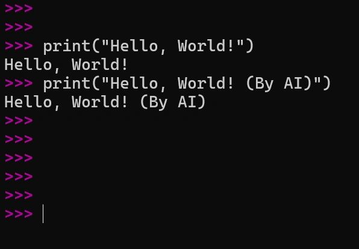

# Rethinking the Human–AI Division of Labor:

Original URL: https://epinova.org/articles/f/rethinking-the-human%E2%80%93ai-division-of-labor

Publication date: 2025-11-20

Archive note: This is a locally preserved Markdown copy of an EPINOVA article originally generated through the GoDaddy blog system.

---

[All Posts](<https://epinova.org/articles?blog=y>)

### Rethinking the Human–AI Division of Labor:

November 20, 2025|AI & Society

#### **From Irreplaceable Work to Meta-Functional Governance and Coevolution**

  

  

  

**Author:** Dr. Shaoyuan Wu 

**ORCID:**<https://orcid.org/0009-0008-0660-8232>

**Affiliation:** Global AI Governance and Policy Research Center, EPINOVA

**Date:** November 20, 2025 

  

#### **Forward**

  

 _**“What’s the difference between a human-typed “Hello, World!” and an AI-generated one?”**_

  

Artificial intelligence (AI) is reassembling the logic of social division of labor. In previous technological revolutions, machines replaced physical strength and extended industrial scale; later, information systems automated workflows and management. Today, AI replicates cognitive labor at near-zero marginal cost. This makes tasks like searching, drafting, coding, translating, diagnosing, scheduling, and optimizing not just faster, but infinitely reproducible.

The consequence is structural rather than episodic: AI will inevitably replace certain human positions, not only entire jobs, but also functional segments within jobs. The question, therefore, is no longer whether humans will be displaced in some areas, but **“How can humans anchor the meta-functions AI cannot hold, keeping human–AI collaboration complementary instead of zero-sum?”**

  

#### **1\. Current Trend**

**1.1 Replacement Happens at the Level of Functions, Not Occupations**

AI does not simply eliminate whole occupations. Instead, it decomposes jobs into functions and automates those functions piece by piece. A typical knowledge-intensive role can be decomposed into at least seven segments:

  * Retrieval
  * Generation
  * Reasoning
  * Evaluation
  * Decision
  * Authorization (sign-off)
  * Communication

AI already dominates retrieval and generation, is rapidly improving at reasoning and evaluation, and is moving steadily closer to decision support. In many fields, this means that “jobs” continue to exist, but only as new bundles of functions built around a shrinking human core.

Thus, the core transformation is no longer about “which jobs remain,” but which functions humans retain and which machines take over.

  

**1.2 Irreplaceable Human Work Is Not Only What AI Cannot Do, but What AI Should Not Do Alone**

The common intuition “humans are irreplaceable where AI is weak” is temporary and misleading. Many tasks that AI can perform extremely well still require human leadership because of how legitimacy, meaning, and responsibility are structured in human societies.

Therefore, irreplaceability is not a fixed list of jobs, but a civilizational boundary condition. Even when AI is technically capable, societies often insist that a human must: 

  1. set the goal,
  2. interpret and explain the meaning, and
  3. bear accountability for the outcome.

This is not about preserving human pride or sentiment. It is a structural requirement of governance and trust within our current societal framework.

  

**1.3 The Three Core Meta-Domains of Human Irreplaceability**

Human irreplaceability rests on three meta-domains, or _meta-functions_ , that underpin the legitimacy of collective life:

  1. **The Value Domain: Value-Setting:** Humans decide what is worth pursuing, what tradeoffs are acceptable, and where red lines are drawn. AI can optimize within goals but cannot legitimately define goals by itself. This domain includes lawmaking, strategic planning, policy choice, ethical adjudication, and the prioritization of scarce resources.
  2. **The Meaning Domain: Interpretation and Narrative:** Humans embed actions in culture, history, emotion, and collective identity. AI can generate words and symbols, but the authority to interpret meaning rests with human communities, because meaning is bound to lived experience and social recognition. This domain includes education, art, ideology, public communication, collective rituals, and the construction of social cohesion.
  3. **The Responsibility Domain: Accountability and Authorization:** Humans act as the final bearers of responsibility. In high-risk and high-power contexts, someone must be accountable in ways that can be traced, judged, punished, or forgiven. This domain includes medical sign-off, judicial rulings, military decisions, financial risk authorization, and any governance that requires a human liability chain.

All these domains are meta-functional: they define, constrain, and legitimize the object-level tasks that AI may perform.

To make this framework usable in practice, any task can be screened with three simple questions as follows:

  1. **Does this task involve value conflict or questions of public legitimacy?**  
If yes, it falls under the **Value Domain** and requires human leadership.
  2. **Does this task require collective understanding, acceptance, or internalization?**  
If yes, it falls under the **Meaning Domain** and requires human leadership.
  3. **Does this task carry high-risk consequences that demand traceable accountability?**  
If yes, it falls under the **Responsibility Domain** and requires human sign-off.

If a task triggers _any_ of these conditions, AI can support the work but **cannot** be the sole actor.

  

**1.4 The “Hello World!” Question**

Return to the question raised at the beginning. A programmer hand-types:

**** print ("Hello, World!")

, while an AI system generates the same line instantly. Functionally, the two outputs are identical. The fact that one is human-written does not, by itself, create additional social or economic value.

This example illustrates a crucial point: 

  * **In the AI era, object-level repetitive work rapidly loses value, while Meta-level creativity, including creating new goals, paradigms, or value frameworks, gains value precisely because AI enlarges the space of what is possible.**

Thus, to remain structurally central in the division of labor, humans must move upward from object functions to meta functions, namely from writing “hello world” to deciding _why_ , _for whom_ , and _to what end_ anything should be built at all.

  

**1.5 A Third Variable Beyond Human vs AI: Institutions and Organizations**

The division of labor is not determined by technical capability alone. It is shaped by institutions and organizational design. Whether AI is allowed to take over or remains constrained depends on factors such as:

  * legal and regulatory rules,
  * chains of accountability,
  * organizational incentives,
  * auditing and oversight mechanisms, and
  * public legitimacy frameworks.

Collaboration is not automatic. It is engineered through institutional embedding via authorization procedures, review and appeal systems, liability allocation, and governance routines. Without such embedding, AI can drift into the three meta-domains of value, meaning, and responsibility, creating systemic crises of legitimacy and trust.

  

#### **2\. The Most Valuable Human Work in the Future: “The Stronger AI Becomes, the More Important Humans Become”**

At first glance, the rise of increasingly powerful AI systems seems to erode the relevance of human work. If machines can perform more tasks faster, cheaper, and with fewer errors, it is tempting to assume that human roles will steadily shrink. Yet, under a collaborative division of labor, the opposite is true at the meta level: the most valuable human work in the future will be the work whose importance grows as AI becomes stronger.

This point depends on a clear distinction between two layers of activity. At the object level, where tasks are well-defined and outcomes can be measured in terms of efficiency or accuracy, AI does indeed replace humans as its capabilities expand. Automation progresses function by function, and the human share of direct execution declines. At the meta level, however, where societies define goals, interpret meaning, and allocate responsibility, AI’s growing power does not reduce the need for humans. Instead, it amplifies it. The stronger AI becomes, the more it generates new possibilities, and with them, new demands for human judgment.

As AI advances, it produces exponentially larger sets of feasible options, more intricate networks of downstream consequences, richer and more uncertain risk landscapes, and sharper value conflicts. What changes is not merely the quantity of choices but the quality of the dilemmas they pose. In such an environment, the primary bottleneck is no longer the ability to generate or simulate options, but the capacity to choose among them in a way that is legitimate, intelligible, and accountable. In other words, the constraint shifts from computation to governance.

This is precisely where the three meta-domains, value, meaning, and responsibility, become central. Evaluating tradeoffs, setting priorities, and drawing red lines requires value legitimacy; explaining decisions and embedding them in a shared narrative requires meaning; owning the consequences and bearing liability requires responsibility. AI can assist with analysis and prediction, but it cannot, on its own, resolve what should count as a good or acceptable outcome for a human community.

For this reason, the highest-value human roles in a mature human–AI system will concentrate in areas such as state and corporate strategy and policy design, cross-disciplinary paradigm building, high-risk decision authorization in medicine, law, security, finance, and warfare, as well as cultural and meaning production through education, art, and public narrative. They will also be crucial in complex negotiation, conflict resolution, and the governance of trust across fragmented societies. What unites these roles is a simple structural feature: AI provides capability leverage by expanding what is technically and practically possible, while humans provide legitimacy leverage by deciding which paths to pursue, under what conditions, and with whose consent.

Seen from this perspective, the central challenge for humans in an age of powerful AI is not to cling to object-level tasks that machines can perform more cheaply, but to move deliberately into roles where their distinctive contribution is to steer, justify, and take responsibility for how AI is used.

  

#### **3\. The Future Division of Labor**

**3.1 The Structural Pairing**

The core structure of human–AI collaboration can be stated quite simply. AI functions as a feasibility expander; humans function as a legitimacy and usability expander.

On the AI side, feasibility expansion means that AI systems:

  * push the boundaries of knowledge, computation, simulation, and generation;
  * produce vast sets of potential solutions;
  * estimate local consequences in probabilistic terms; and
  * turn what was previously “unthinkable” or “unworkable” into a concrete option space that can be acted upon.

On the human side, legitimacy and usability expansion means that humans:

  * define the goals to be pursued and the red lines that must not be crossed;
  * interpret candidate solutions within a shared meaning system, like cultural, ethical, political;
  * sign off on decisions as responsibility-bearing agents; and
  * organize trust so that societies are willing to accept and implement those decisions.

Taken together, this produces a hierarchical control structure: at the object layer, AI leads on execution and optimization; at the meta layer, humans lead on goal-setting, explanation, and accountability.

  

**3.2 The Real-World “Hard Constraints Triangle”**

Why are societies pushed toward this human–AI division of labor? Because three hard constraints leave them little choice:

  * **Risk constraint** : when consequences are severe, someone must be traceably accountable.
  * **Trust constraint** : communities must be able to recognize legitimate authority and fair process.
  * **Power constraint** : the use of coercion and the allocation of resources require human authorization.

As long as civilization upholds these three constraints, humans will structurally retain leadership in the meta-domains of value, meaning, and responsibility, regardless of how capable AI becomes.

  

**3.3 Transition Frictions and Social Costs**

The long-term division of labor sketched here will not emerge without pain. The transition brings significant social turbulence, including:

  * Short-term displacement and redistribution shocks as object-level tasks are automated and workers are pushed out of existing roles.
  * Skill polarization between a relatively small group of meta-level decision-makers and a larger group confined to residual, lower-value tasks.
  * Platform dependence and new forms of lock-in, where even those in meta roles become structurally dependent on a few dominant AI and data infrastructures.
  * Crises of trust and meaning, as manipulation, deepfakes, and automated persuasion scale far beyond past capacities.

For these reasons, human–AI collaboration cannot be left to passive market drift. It demands deliberate institutional engineering to manage the frictions and distribute the gains in a politically and socially sustainable way, through regulation, incentives, education, and governance design.

  

**3.4 A Compact Rule Model: Meta–Object Division Model**

To formalize the framework, the Meta–Object Division Model can help capture this distinction.

Let **To** ​ be the set of object-layer tasks: optimized for efficiency and scale, and therefore AI-led.

Let **Tm** ​ be the set of meta-layer tasks: tasks that require human leadership by design.

We can define **Tm** ​ as:

**Tm​={t∣V(t)=1 or M(t)=1 or R(t)=1}**

where for any task **t** :

  * **V(t):** value conflict / public legitimacy requirement
  * **M(t):** meaning interpretation / social acceptance requirement
  * **R(t):** responsibility traceability / high-risk consequence requirement

If **any** of these conditions is met for a task **t** , AI may support, but **cannot** replace, human leadership for that task.

  

#### **4\. Beyond Division of Labor: Toward Human–AI Coevolution**

Once a meta–object division of labor stabilizes, the system enters a different phase. AI is no longer an external “tool” applied sporadically to problems but becomes endogenous to social systems—embedded in institutions, everyday routines, and structures of power. In this setting, humans are not merely users of AI; they act as direction-setters of its evolution. The relationship shifts from straightforward collaboration to genuine coevolution.

  

**4.1 Mechanism 1: Feedback Coevolution**

In a coevolving system, humans and AI continuously reshape each other through feedback. 

Humans reshape AI by setting goals, constraints, and incentives through law, markets, culture, and governance. Regulation defines what is permissible; investment patterns determine which models get built; public norms influence what is seen as acceptable AI behavior. 

On the other side, AI reshapes humans by altering how decisions are made, how information is processed, and how organizations are structured. As AI tools permeate administration, business, and daily life, they change people’s expectations, habits of thinking, and even institutional designs.

Over time, both sides evolve by repeatedly reacting to each other: human systems adapt to AI’s presence, and AI systems adapt to human responses.

  

**4.2 Mechanism 2: Selection Coevolution**

Coevolution also operates through selection. AI continually expands the possibility set, surfacing strategies, designs, narratives, and policies that might never have been considered before. Humans then choose among these possibilities, deciding which options to implement, which to regulate, and which to reject. Those implemented choices, in turn, generate new realities: they produce fresh data, new behavioral patterns, emerging conflicts, and shifting norms—material that flows back into the training regimes and design requirements of the next generation of AI systems. In this way, human value choices function as the steering wheel of AI evolution. What societies decide to adopt or forbid does not only shape outcomes today; it shapes what kinds of AI will be developed and deployed tomorrow.

  

**4.3 Mechanism 3: Institutional Coevolution**

Finally, coevolution is institutional. As AI becomes embedded in key domains, governance systems reconfigure around the three meta-domains:

  * **In the value domain** , AI may assist in modeling tradeoffs or anticipating impacts, but humans still bear political and ethical responsibility for which goals are pursued.
  * **In the** **meaning domain** , AI may help produce cultural content, recommend media, or generate narratives, but humans retain interpretive authority over what these outputs mean in moral, historical, or identity terms.
  * **In the** **responsibility domain** , AI can provide audit trails, logs, and probabilistic assessments, but humans keep the power and burden of sign-off, liability, and sanction.

The deeper AI penetrates into the infrastructure of society, the more civilization must develop sophisticated meta-governance to keep human–AI collaboration stable and legitimate. Coevolution, in this sense, is not just technical progress; it is an ongoing renegotiation of how human authority, machine capability, and institutional order fit together.

  

#### **5\. Conclusion:**

Since the moment AI could generate a “Hello, World!” as well as a human, the key question has no longer been who types the code, but who sets the purpose, explains the meaning, and takes responsibility for the outcome. In this sense, irreplaceable human work shifts from object-level execution to meta-level governance in the domains of value, meaning, and responsibility. AI will expand what is technically possible; humans must decide what is acceptable, for whom, and under what conditions. If we anchor ourselves in these meta-functions, human–AI collaboration can evolve into coevolution rather than mere substitution.

  

**Recommended** **Citation:**

**Wu, S.-Y. (2025)**. _Rethinking the Human–AI Division of Labor: From “Irreplaceable Work” to Meta-Functional Governance and Coevolution_. EIPINOVA. <https://epinova.org/publications/f/rethinking-the-human%E2%80%93ai-division-of-labor>. 

Share this post:
