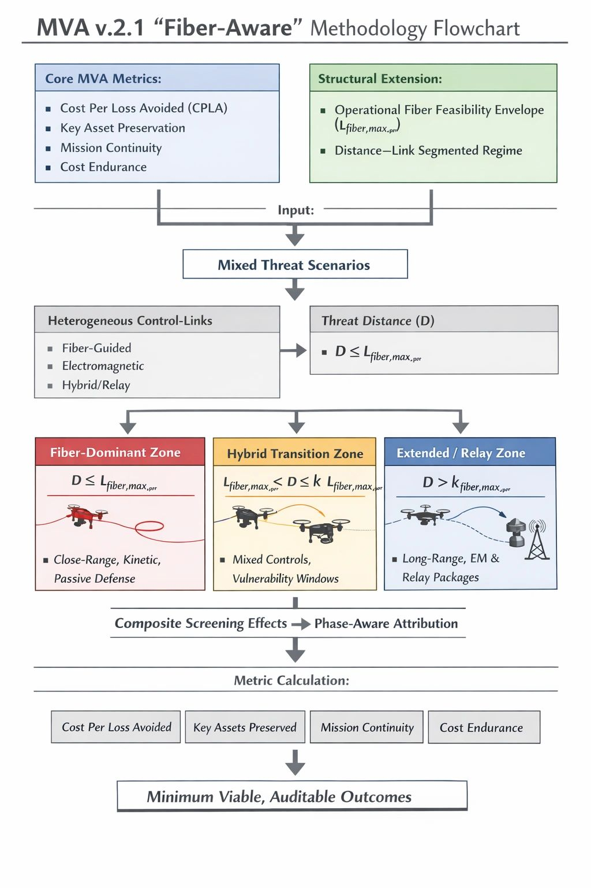

# A Fiber-Aware MVA Framework for Counter-UAS Assessment

Original URL: https://epinova.org/articles/f/a-fiber-aware-mva-framework-for-counter-uas-assessment

Publication date: 2025-12-23

Archive note: This is a locally preserved Markdown copy of an EPINOVA article originally generated through the GoDaddy blog system.

---

[All Posts](<https://epinova.org/articles?blog=y>)

### A Fiber-Aware MVA Framework for Counter-UAS Assessment

December 23, 2025|AI & Emerging Tech

**Author:** Dr. Shaoyuan Wu 

**ORCID:**<https://orcid.org/0009-0008-0660-8232>

**Affiliation:** Global AI Governance and Policy Research Center, EPINOVA

**Date:** December 23, 2025 

  

**Abstract**

The Minimum Viable, Auditable (MVA) framework was developed to evaluate counter–unmanned aerial system (C-UAS) effectiveness under conditions of cost asymmetry, saturation, and mission-level endurance, with a primary analytical focus on electromagnetic (EM) countermeasures. The operational deployment of fiber-guided unmanned aerial systems (UAS), however, exposes a structural limitation in this assumption. Fiber guidance does not merely reduce the effectiveness of EM countermeasures; it bypasses their applicability altogether within bounded operational envelopes.

This paper introduces a minimal, auditable extension to the MVA framework that accounts for fiber-guided and hybrid-link UAS without invalidating the original model. The extension formalizes a link-typed, distance-segmented, and phase-aware threat regime, replacing fixed range assumptions with an operational fiber feasibility envelope. Three distance–link scenarios—fiber-dominant, hybrid transition, and extended or relay-based—are defined, each associated with distinct defensive leverage points and cost dynamics.

By repositioning EM measures from universal termination tools to stage-specific filtering layers, the proposed patch preserves MVA’s core outcome metrics, such as cost per loss avoided, key asset preservation, mission continuity, and cost endurance, while restoring analytical validity under mixed fiber–EM threat conditions. The resulting framework remains minimal, auditable, and extensible as control-link technologies evolve.

  

#### **1\. Introduction**

The MVA framework was originally developed to address a persistent gap in C-UAS evaluation: the tendency to emphasize interception rates while neglecting cost sustainability, mission endurance, and the preservation of critical functions under saturation. By prioritizing outcome-oriented indicators, such as cost per loss avoided, key asset preservation, and mission continuity, the framework sought to realign counter-drone assessment with operational realities rather than tactical performance metrics alone.

These analytical concerns were previously observed in empirical assessments of sustained counter-drone operations, where defensive effectiveness degraded not through interception failure but through unfavorable cost-exchange dynamics and cumulative resource exhaustion (Wu, _From Detection to Depletion: Cost-Exchange Limits in the Russia–Ukraine Drone War_ , EPINOVA–2025–01–RR, [PB and Report](<https://epinova.org/pb-and-report>)).

Implicit in this framework, however, is a foundational assumption shared by much of the C-UAS literature: that unmanned aerial systems remain electromagnetically addressable targets during their critical control phases. Under this assumption, EM countermeasures—navigation denial, data-link jamming, spoofing, and electronic deception—retain a definable interaction point with the attacking platform. Even when imperfect, such measures remain analytically meaningful because their effects can be parameterized and audited.

The rapid operational adoption of fiber-guided unmanned aerial systems challenges this assumption at a structural level. Fiber guidance does not degrade EM countermeasures; it removes their applicability altogether within certain operational envelopes. Operational values may be derived from field testing, expert elicitation, or after-action assessments. The resulting problem is not declining performance, but assumption failure. Metrics derived from EM-centric interaction cease to describe the threat–defense relationship they were designed to capture.

Treating fiber-guided drones as a marginal escalation within an EM contest risks producing analytically precise but operationally irrelevant conclusions. The challenge posed by fiber guidance is therefore structural rather than incremental. It does not invalidate the MVA framework or its outcome metrics, but it exposes the need for a minimal extension at the level of threat definition and engagement staging.

This paper introduces a fiber-aware, phased-link patch to the MVA framework. The objective is not to displace EM countermeasures, but to reposition them accurately within a segmented threat regime in which their relevance varies by distance, phase, and system configuration.

  

#### **2\. Scope and Analytical Boundaries**

To maintain methodological clarity and auditability, this extension deliberately constrains its analytical scope.

First, the framework is limited to small- and medium-sized unmanned aerial systems, including FPV attack drones, modified commercial multirotor, and lightweight fixed-wing or loitering platforms employed in tactical or operational contexts. Large MALE/HALE systems and strategic endurance platforms are excluded.

Second, the extension explicitly accounts for heterogeneous and hybrid control-link configurations, including fiber-guided, EM, and mixed-mode systems. It does not presume technological dominance or permanence for any single control mode.

Third, the patch does not redefine MVA’s core outcome metrics. Cost per loss avoided, key asset preservation, mission continuity, and cost endurance remain unchanged in definition and intent. The extension operates upstream of these metrics, clarifying where and when defensive measures can meaningfully contribute to them.

Finally, the framework avoids treating any single distance value as a fixed threshold. Usable fiber control length is treated as an operationally bounded variable contingent on platform characteristics, terrain, maneuver demands, and environmental conditions. This bounded approach preserves extensibility as technology evolves.

  

#### **3\. Fiber Guidance as a Bounded Operational Advantage**

Fiber guidance replaces an EM control channel with a physical tether, eliminating susceptibility to jamming, spoofing, and data-link disruption within its usable envelope. This substitution fundamentally alters the interaction between attacker and defender, but it does not constitute unconditional immunity.

The advantage conferred by fiber guidance is bounded by physical and operational constraints. Spool length, mass, and tension management impose penalties on endurance and maneuverability. Terrain complexity—particularly in urban or cluttered low-altitude environments—introduces risks of snagging and abrasion that sharply reduce effective range. Maneuver demands further constrain feasibility, as high-curvature trajectories and aggressive vertical profiles increase tether stress. Environmental factors such as wind and precipitation amplify these effects.

To represent this bounded advantage in an auditable manner, the extension introduces an operational fiber feasibility envelope, denoted **L_fiber,max^oper** ​. This variable represents the maximum distance over which fiber-based control remains tactically viable for a given platform and mission configuration. It is a scenario-dependent upper bound rather than a fixed range parameter.

As mission distance approaches or exceeds this envelope, operators must transition to alternative modes, including EM control, semi-autonomous navigation, preprogrammed routes, or terminal execution without external control. These transition points often define the most analytically salient vulnerabilities in the engagement sequence.

Modeling fiber guidance as a bounded, context-dependent regime establishes the foundation for distance- and phase-aware evaluation without reverting to static thresholds.

  

#### **4\. A Distance–Link Segmented Threat Regime**

Let DDD denote the mission distance between the point of launch or control origin and the defended asset, and let **L_fiber,max^oper** represent the operational fiber feasibility envelope. Their relationship defines three analytically distinct regimes.

  

**4.1 Fiber-Dominant Zone**

The fiber-dominant zone is defined by**D≤L_fiber,max^oper** Within this regime, fiber guidance can be maintained throughout the critical control phases. EM countermeasures possess little to no direct leverage over the primary control loop.

Defensive effectiveness therefore shifts toward corridor control, close-in kinetic engagement, passive protection, decoys, and architectural resilience. EM measures may retain indirect value—screening non-fiber platforms or shaping the broader environment—but they do not constitute a viable termination mechanism against the primary threat.

For scenarios in this zone, EM-centric effectiveness metrics are structurally inapplicable.

  

**4.2 Hybrid Transition Zone**

The hybrid transition zone is defined by **L_fiber,max^oper <D≤k⋅L_fiber,max^oper**​, where k reflects the feasible extent of mixed or transitional control.

In this regime, fiber guidance cannot be sustained across the full mission profile. Operators must execute a transition in control link or navigation mode. These transition points create temporally constrained but decisive vulnerability windows.

EM countermeasures regain localized relevance when synchronized with transition phases. Their effectiveness is windowed rather than continuous, requiring phase-aware attribution within evaluation models.

  

**4.3 Extended and Relay-Based Zone**

The extended zone is defined by **D >k⋅L_fiber,max^oper**. At these distances, force projection typically requires EM control, autonomy, or relay-based mission packages. Fiber guidance, if present, is usually confined to terminal phases deployed from forward positions.

The unit of analysis shifts from individual platforms to mission packages composed of interdependent elements. Defensive leverage is maximized by targeting relay nodes, coordination links, or synchronization mechanisms rather than terminal attackers alone.

  

#### **5\. Repositioning EM Countermeasures within the MVA Framework**

Fiber-guided systems necessitate a more precise accounting of when and where EM countermeasures exert operational leverage. They do not render EM measures obsolete; they render them non-universal.

Under the segmented regime, EM measures function as phase-specific filtering layers rather than universal termination tools. In fiber-dominant zones, their contribution is indirect and upstream. In hybrid transition zones, they may exert disproportionate impact when synchronized with control or mode switching. In extended and relay-based zones, they often regain relevance at the system level by disrupting coordination or relay functions.

This reframing preserves the conceptual integrity of the MVA framework. EM countermeasures are evaluated by their contribution to reducing downstream burden and shaping threat flows, not by their ability to guarantee interception.

  

#### **6\. Implications for MVA Outcome Metrics**

The fiber-aware extension does not require modification to the mathematical definitions of existing MVA metrics. What changes is the pathway through which defensive actions contribute to those metrics.

Avoided losses are typically the cumulative result of partial reductions across phases rather than terminal interception alone. Cost per loss avoided must therefore be grounded in phase-aware attribution. Key asset preservation and mission continuity are best evaluated through functional degradation over time, emphasizing early-stage filtering and burden reduction. Cost endurance depends on where costs are incurred and where savings are realized along the engagement sequence.

By relocating control-link heterogeneity upstream of metric calculation, the framework preserves comparability across scenarios while restoring validity under mixed fiber–EM conditions.

  

#### **7\. Conclusion**

The operationalization of fiber-guided unmanned aerial systems exposes the limits of implicit EM assumptions in counter-UAS evaluation. The response need not be a wholesale replacement of existing frameworks, but a disciplined clarification of where their assumptions apply.

The extension presented here is deliberately minimal. It preserves MVA’s core outcome metrics while introducing a bounded conception of fiber feasibility and a distance–link segmented threat regime. EM countermeasures are neither privileged nor dismissed; they are repositioned where they matter.

Failure to explicitly account for fiber-guided control regimes carries consequences that extend beyond analytical incompleteness. When evaluation frameworks continue to assume electromagnetic addressability where none exists, they risk systematically overstating defensive effectiveness, misallocating resources, and drawing false inferences about cost sustainability. In operational terms,**this does not result in isolated misjudgments, but in persistent bias across planning, procurement, and doctrine development.**

More broadly, this patch demonstrates the evolutionary resilience of the MVA framework. A model that can accommodate new threat modalities through explicit assumption disclosure and phase-aware structuring is one that can adapt to technological change without sacrificing analytical continuity. As control-link technologies continue to evolve, the logic introduced here provides a template for future extensions without redefining evaluative foundations.

  

**Recommended** **Citation:**

**Wu, S.-Y. (2025)**. _A Fiber-Aware Extension to the Minimum Viable, Auditable (MVA) Framework for Counter-UAS Assessment._ EIPINOVA. <https://epinova.org/publications/f/a-fiber-aware-mva-framework-for-counter-uas-assessment>.

Share this post:
