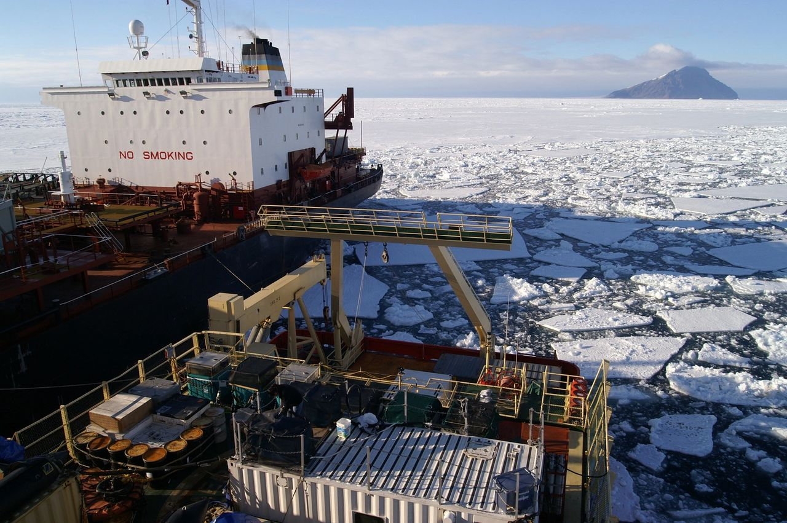
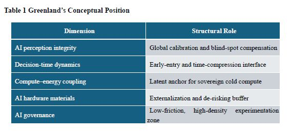

# Greenland as a Structural AI Strategic Node:

Original URL: https://epinova.org/articles/f/greenland-as-a-structural-ai-strategic-node

Publication date: 2026-01-15

Archive note: This is a locally preserved Markdown copy of an EPINOVA article originally generated through the GoDaddy blog system.

---

[All Posts](<https://epinova.org/articles?blog=y>)

### Greenland as a Structural AI Strategic Node: 

January 15, 2026|Global AI Governance & Policy

#### **Perception Integrity, Temporal Dominance, and the Arctic Reconfiguration of Algorithmic Power**

  

  

**Author: Shaoyuan Wu**

**ORCID:**[**https://orcid.org/0009-0008-0660-8232**](<https://orcid.org/0009-0008-0660-8232>)

**Affiliation: Global AI Governance and Policy Research Center, EPINOVA LLC**

**Date: January 15, 2026**

  

#### Abstract

Greenland is conventionally understood as a peripheral Arctic territory whose strategic relevance derives from geographic position, military basing, and natural resource endowments. This paper argues that such a framing is increasingly insufficient. From an artificial intelligence (AI) strategic perspective, Greenland should be reconceptualized as a structural AI strategic node embedded within global systems of sensing, early warning, algorithmic decision-making, infrastructure optimization, and governance experimentation.

As AI systems increasingly mediate security assessments, climate prediction, supply-chain coordination, and geopolitical risk modeling, strategic value shifts away from territorial control toward perception integrity, temporal advantage, infrastructural coupling, and institutional embedding. This paper develops a five-dimensional analytical framework to explain why Greenland’s strategic significance is rising despite its minimal population and limited political autonomy. It concludes that Greenland constitutes an S-class (structural) AI strategic node whose integration does not yield immediate tactical payoff, but whose presence—or absence—can durably reshape the long-term strategic option space of competing powers in the AI era.

  

#### **Keywords:**

Artificial Intelligence Strategy, Infrastructural Power, Arctic Geopolitics, Algorithmic Governance, Strategic Nodes, Early Warning Systems, Greenland.

  

#### 1\. Introduction: From Geographic Determinism to Structural AI Power

Greenland has long occupied an ambiguous position in geopolitical analysis. Classical strategic thought has treated it primarily as a function of geography: a vast Arctic landmass situated between North America and Europe, proximate to transpolar routes and historically significant for missile early-warning and forward basing. Within this framework, Greenland’s relevance has been understood through familiar lenses—territorial control, military presence, and access to natural resources.

While these factors remain empirically valid, they no longer provide a sufficient explanation for Greenland’s contemporary strategic salience.

The emergence of artificial intelligence as a core mediator of security decision-making, environmental governance, and economic coordination has begun to reconfigure the foundations of strategic power (Horowitz, 2018; Allen & Chan, 2017). In AI-mediated systems, advantage is increasingly generated not through physical occupation or force projection, but through integration into algorithmic infrastructures that govern perception, prediction, and response at machine speed. Early warning is algorithmic rather than observational, situational awareness is sensor-driven rather than episodic, and strategic stability is shaped by automated or semi-automated decision loops whose parameters are set long before crises occur (Lindsay & Gartzke, 2018; Scharre, 2018).

This transformation weakens the explanatory power of purely geographic or territorial accounts. Strategic relevance can no longer be assessed solely by asking where a territory is located, but must instead consider how it is embedded within computational systems that translate physical signals into actionable intelligence. Under these conditions, territories acquire value not because they can be occupied or defended, but because they function as structural nodes within global AI architectures.

Greenland exemplifies this shift with unusual clarity. Its strategic importance increasingly derives from its role in maintaining the integrity of global sensing networks, compressing decision time in AI-enabled security systems, enabling future compute–energy coupling under extreme conditions, externalizing critical AI material dependencies, and providing an institutional environment conducive to governance experimentation. None of these functions are adequately captured by traditional geopolitical metrics.

This paper therefore advances a reframing of Greenland from a peripheral Arctic territory to a structural AI strategic node. The central claim is not that AI has rendered geography irrelevant, but that geography now matters primarily insofar as it enables or constrains algorithmic systems. Greenland’s value lies in the fact that it occupies a position where physical space, data generation, and algorithmic decision-making intersect in ways that are difficult to substitute elsewhere.

The analysis proceeds as follows. Section 2 develops a five-dimensional framework for understanding Greenland’s role within AI strategic systems, focusing on perception integrity, temporal dominance, compute–energy coupling, material security, and governance experimentation. Section 3 situates Greenland within an AI-Strategic Node Index (AI-SNI) logic to clarify its system-level classification without introducing quantitative scoring. Section 4 examines the abstract implications of this reframing for major power competition, emphasizing integration and alignment rather than territorial control. The conclusion reflects on Greenland as an early indicator of how AI is reshaping the geography of power in the twenty-first century.

Throughout this paper, the term “structural AI strategic node” is used to denote locations whose strategic relevance derives from their system-level role in AI-mediated architectures rather than from territorial control or discrete asset ownership.

  

#### 2\. Greenland as an AI Strategic Node

To move beyond abstract claims about AI-era geopolitics, it is necessary to specify the concrete mechanisms through which artificial intelligence reconstitutes strategic relevance. Rather than treating Greenland as a unitary object of analysis, this section disaggregates its AI significance into a set of distinct but interrelated functional dimensions. Each dimension captures a different way in which Greenland is embedded within AI-mediated systems of perception, decision-making, infrastructure, and governance. The purpose is not to catalog assets or capabilities, but to identify structural functions whose strategic value emerges only when viewed at the system level. Taken together, these dimensions establish the analytical basis for understanding Greenland as an AI strategic node rather than a conventional geopolitical territory.

  

#### 2.1 Perception Integrity: The Polar Blind-Spot Compensation Node

The first and most fundamental requirement of AI-enabled warfare and governance is not computational power, but perception integrity. Artificial intelligence systems do not reason over reality itself; they reason over structured representations of reality derived from sensor inputs. Where sensing is incomplete, biased, or discontinuous, AI systems inherit these deficiencies and may amplify them through automated inference and prediction (Floridi et al., 2018; Raji et al., 2020).

At the planetary scale, a persistent vulnerability in global sensing architectures lies in space-domain monitoring at high latitudes (Weeden & Samson, 2019). Orbital mechanics, atmospheric conditions, and sparse terrestrial infrastructure combine to produce structural blind spots in radar coverage, satellite tracking, and communication relay. These blind spots are not marginal errors; they represent systemic gaps that can propagate uncertainty across downstream AI models used for early warning, threat classification, and escalation forecasting.

Greenland occupies a unique position within this context. Situated at the intersection of North American, European, and Arctic domains, it lies directly beneath critical ballistic missile trajectories, transpolar aviation corridors, and polar-orbit satellite paths. As a result, multiple global sensing systems—missile early-warning radars, space situational awareness networks, satellite ground stations, and high-latitude communication relays—either already depend on, or are structurally oriented toward, Greenland-based coverage.

From an AI strategic perspective, this positioning gives Greenland a role that is qualitatively distinct from that of a forward military base. It functions instead as a calibration node within the global perception architecture. Data collected at high latitudes performs a dual function: it expands raw coverage and, more importantly, anchors model calibration by constraining uncertainty in regions where prediction error would otherwise be highest.

The consequences of degraded polar sensing illustrate this point. In AI-mediated early-warning systems, missing or delayed polar data does not merely reduce confidence locally; it introduces systematic bias into global models. Trajectory estimation, anomaly detection, and threat classification algorithms trained on incomplete polar data sets tend to over- or under-estimate risk, skewing decision thresholds elsewhere in the system. Because these models are often integrated into automated or semi-automated decision loops, such biases can cascade rapidly.

Greenland therefore operates as a polar blind-spot compensation node: a location whose primary strategic value lies in preserving the epistemic completeness of AI perception systems. Its importance is measured not by the quantity of force deployed there, but by the degree to which its sensing contributions stabilize the global data environment upon which AI systems depend.

This reframing carries two implications. First, Greenland’s strategic relevance increases as AI systems become more central to security and governance, regardless of changes in traditional force posture. Second, the loss, degradation, or external capture of Greenland-based sensing functions would impose non-linear costson AI-enabled systems far beyond the Arctic, degrading perception integrity at the global level.

In this sense, Greenland should be understood not as a peripheral observation post, but as an epistemic keystone within AI-mediated strategic systems—one whose value derives from its ability to compensate for structural blind spots that no amount of downstream computation can fully correct.

  

#### 2.2 Temporal Dominance: Greenland as an AI Decision-Time Compressor

If perception integrity determines whether an AI system can _see_ the strategic environment, temporal dominance determines whether it can _act_ within that environment on favorable terms. In AI-mediated security systems, time is not a linear resource (Scharre, 2018; Horowitz, Scharre, & Ma, 2018). Small temporal advantages at the point of initial detection can be algorithmically amplified as information propagates through automated decision pipelines.

In classical military analysis, early warning is valued because it provides decision-makers with additional reaction time. In AI-enabled systems, however, the relationship between time and advantage is discontinuous. Decision processes increasingly operate through machine-speed loops in which classification, prediction, and response are partially automated and governed by pre-specified thresholds. Under such conditions, the strategic value of time lies not in human deliberation, but in whether an event enters the system early enough to be processed _before_ escalation pathways are structurally constrained.

Greenland occupies a pivotal position within this temporal architecture. Its geographic location enables monitoring of the shortest transpolar trajectories for ballistic missiles, hypersonic vehicles, and space-domain objects. Data collected from this region allows AI systems to register potential threats at the earliest feasible moment, when uncertainty is highest but decision flexibility is greatest.

This early entry point matters because AI systems do not merely record events; they shape the decision space by assigning probabilities, forecasting trajectories, and triggering conditional responses. An additional thirty seconds of detection time does not simply extend the reaction window. It can determine whether an event is processed as an anomaly requiring human review, or as a classified threat that activates pre-authorized response mechanisms. In this sense, early detection is structurally transformative. This temporal illustration is offered as a conceptual argument about decision architecture, not as an empirical claim regarding precise response intervals.

From an AI strategic perspective, Greenland functions as a decision-time compressor. By enabling earlier data ingestion, it compresses the effective time available to adversarial systems while expanding the internal decision horizon of the integrating power. This asymmetry is particularly pronounced in automated or semi-automated environments, where downstream actions—such as sensor cueing, force readiness adjustments, or escalation signaling—are executed faster than human oversight can intervene.

The strategic significance of this temporal compression lies in its cumulative effects. AI systems trained and calibrated on early, high-confidence polar data develop path-dependent advantages: improved prediction accuracy, lower false-positive rates, and tighter coupling between perception and response. Over time, these advantages translate into more stable deterrence postures for the integrating actor and greater uncertainty for competitors whose systems operate with delayed or incomplete inputs.

Importantly, this advantage is structural rather than situational. It does not depend on the outbreak of conflict or the visible deployment of forces. Instead, it is embedded in the architecture of AI-enabled command, control, and early-warning systems. Greenland’s contribution to temporal dominance therefore persists across peacetime monitoring, crisis management, and conflict escalation scenarios.

In summary, Greenland’s strategic value at the temporal level does not derive from its capacity to host weapons or forces, but from its ability to shift AI systems from reactive processing to structural first-move positioning. In AI-mediated strategic environments, such positioning can determine escalation dynamics long before political intent is formally expressed.

  

#### 2.3 Compute–Energy Coupling: Greenland as a Latent Cold-Compute Anchor

As artificial intelligence systems scale, their strategic constraints increasingly shift from algorithmic design to physical feasibility. Compute-intensive models impose rising demands on energy supply, cooling capacity, and infrastructure resilience (Jones, 2018; Patterson et al., 2021). In this context, AI capability is no longer determined solely by access to advanced chips or software talent, but by the ability to sustain large-scale computation under stable, secure, and cost-effective physical conditions.

Greenland presents an unusually favorable—yet largely latent—configuration within this emerging compute–energy landscape. Its extreme climate offers naturally low ambient temperatures, substantially reducing the energy overhead required for cooling large compute facilities. As cooling costs become a dominant component of data center operations, such environmental advantages translate directly into long-term efficiency gains, particularly for sovereign or security-sensitive AI systems that cannot rely on geographically dispersed commercial cloud infrastructure.

Beyond climate, Greenland’s energy profile reinforces this potential. The territory possesses significant hydropower capacity relative to its population size, and its geographic isolation makes it a plausible candidate for future deployments of advanced nuclear or hybrid energy systems designed to support critical infrastructure. Importantly, these energy characteristics align with the needs of high-reliability, high-uptime AI installations, where fluctuations in power supply can degrade model performance, data integrity, or system availability.

From an AI strategic perspective, Greenland’s relevance lies not in the immediate presence of data centers, but in its status as a cold-compute anchor whose value is inherently forward-looking. The strategic question is not whether large-scale AI infrastructure is currently deployed there, but who shapes the institutional and legal conditions under which such deployment could occur. Regulatory regimes governing land use, energy rights, data sovereignty, and security access create path dependencies that determine whether Greenland can serve as a viable site for future sovereign AI infrastructure.

This introduces a distinct form of strategic leverage. Early institutional positioning—through governance frameworks, infrastructure agreements, or security arrangements—can lock in advantages that persist even if physical deployment is delayed by decades. Conversely, failure to establish such frameworks can render otherwise optimal physical conditions strategically inaccessible. In this sense, compute–energy coupling is as much a governance problem as a technological one.

The strategic implications extend beyond efficiency. Sovereign-grade AI systems increasingly require geographic concentration to ensure security, controllability, and resilience against cyber or kinetic disruption. Greenland’s low population density and limited civilian infrastructure reduce the risks associated with collateral disruption, while its remoteness complicates adversarial interference. These features enhance its suitability as a secure compute node in scenarios where dispersion or outsourcing is strategically undesirable.

Crucially, this form of advantage is only substitutable at high cost and low fidelity in the short term. While energy and cooling solutions can be engineered elsewhere, replicating Greenland’s combination of climate, energy potential, and governance flexibility would require substantial investment and long time horizons. As AI systems continue to scale, such latent advantages become increasingly salient.

In summary, Greenland’s role in compute–energy coupling illustrates how AI strategic value can reside in potentiality**rather than presence**. It is not a current hub of AI computation, but a structurally privileged location whose future integration into sovereign AI infrastructures could reshape long-term capability balances. Its significance thus lies in its capacity to anchor cold compute under conditions of institutional foresight, rather than in any immediate technological deployment.

  

#### **2.4 Material Security: Greenland as an AI Hardware Externalization Node**

Advanced artificial intelligence systems are often described as immaterial or purely digital. This characterization is analytically misleading. Contemporary AI capabilities are grounded in a dense material substrate composed of rare earth elements, specialty metals, high-purity silicon, and high-reliability sensor components. As AI systems scale and diffuse into military, industrial, and critical-infrastructure domains, material security becomes a structural determinant of AI power.

Greenland occupies a distinctive position within this material dimension. Its confirmed and potential deposits of rare earth elements, uranium, lithium, nickel, and associated strategic minerals are frequently analyzed through the lens of classical resource geopolitics. An AI-centered perspective, however, reframes their significance in three interrelated ways.

First, AI hardware supply chains are increasingly characterized by concentration risk. High-performance computing, advanced sensing, and energy-storage systems depend on materials whose extraction and processing are geographically clustered and politically sensitive. In this context, Greenland represents a potential externalization node—a source of critical materials located outside major conflict zones, high-intensity industrial regions, and existing geopolitical chokepoints. Its value lies less in volume than in risk distribution, offering an alternative anchor within AI hardware ecosystems.

Second, resource extraction itself is being transformed by AI. Geological surveying, exploration targeting, extraction planning, and logistics optimization are increasingly governed by machine-learning models and autonomous systems. Control over these digital layers—software platforms, data standards, and optimization algorithms—can yield influence disproportionate to formal ownership of physical assets. In Greenland, the strategic question is therefore not only who extracts resources, but who defines the algorithmic infrastructure through which extraction is planned and governed.

This introduces a recursive dynamic: AI systems depend on critical materials, while access to those materials increasingly depends on AI systems. Greenland sits at this intersection, making its resource base inseparable from broader questions of AI governance and technological dependency.

Third, AI hardware security increasingly favors jurisdictional environments that are politically stable yet strategically peripheral. Greenland’s institutional setting reduces exposure to regulatory volatility, civil conflict, or industrial disruption that can afflict more densely populated extraction zones. For AI systems deployed in security-sensitive or sovereign contexts, such stability enhances the reliability of long-term material provisioning.

Importantly, this does not imply that Greenland will or should become a dominant mining hub in the near term. Rather, its strategic relevance lies in its function as a latent material reserve whose integration into AI hardware supply chains can be selectively activated under conditions of heightened risk elsewhere. This optionality itself constitutes strategic value.

From an AI strategic perspective, Greenland’s material significance therefore differs fundamentally from classical extractive logic. It is not merely a site of resources to be exploited, but a structural buffer within AI hardware ecosystems—one that enables de-risking, diversification, and algorithmically mediated control over the physical foundations of AI capability.

  

#### 2.5 Governance Experimentation: Greenland as an Institutional Buffer Zone

Beyond perception, time, computation, and materials, AI strategic value increasingly depends on governance capacity—the ability to define rules, standards, and oversight mechanisms for systems whose behavior may be opaque, autonomous, and globally consequential. In this domain, Greenland’s strategic relevance derives not from institutional strength in absolute terms, but from institutional configuration.

Greenland combines three features that are rarely co-located: a high degree of internal autonomy, a very small population and administrative footprint, and intense external strategic attention. This configuration creates an environment in which governance decisions can be implemented with low social friction, while their effects carry high strategic density. For AI systems—particularly those deployed in security, environmental monitoring, and critical infrastructure—this combination is unusually conducive to experimentation.

From an AI governance perspective, Greenland functions as an institutional buffer zone. It offers a setting in which new forms of AI-enabled sensing, decision-support, or autonomous operation can be tested under controlled conditions, without the political and social constraints that accompany deployment in densely populated or highly polarized societies. This is especially relevant for high-risk or high-uncertainty applications, where governance frameworks often lag behind technical capability (OECD, 2019; NIST, 2023).

Such experimentation is not limited to military systems. Greenland provides a plausible environment for piloting data governance regimes, cross-border information-sharing protocols, and AI oversight mechanisms tailored to extreme environments. Because outcomes in the Arctic often have global spillover effects—whether in climate modeling, navigation safety, or strategic early warning—governance practices tested in Greenland can be scaled or adapted elsewhere.

At the same time, this configuration introduces asymmetry and vulnerability. Greenland’s limited institutional capacity constrains its ability to independently shape the rules governing AI infrastructures deployed on its territory. This raises the risk that governance frameworks are imported wholesale from external actors, embedding long-term dependencies in data access, system control, and epistemic authority. In AI systems, such dependencies are often subtle and durable, persisting even when formal agreements change.

This duality is central to Greenland’s role as an AI strategic node. Its institutional environment lowers the cost of governance innovation while simultaneously heightening the stakes of governance capture. As a result, strategic competition over Greenland increasingly manifests not through overt territorial claims, but through standards-setting, regulatory alignment, and infrastructural governance choices that determine how AI systems operate in and through the Arctic.

In this sense, Greenland’s governance significance is neither accidental nor temporary. It reflects a broader pattern in the AI era, in which politically peripheral spaces become testing grounds for rule-making precisely because they sit at the intersection of high strategic value and low domestic resistance. Greenland thus completes the five-dimensional picture of AI strategic relevance by illustrating how institutional context itself becomes a form of strategic infrastructure.

  

#### 3\. System-Level Positioning: Greenland within an AI-Strategic Node Logic

This section consolidates the five analytical dimensions developed in Section 2 into a **system-level interpretation**. The objective is not to rank or score, but to clarify _node function_ —that is, how a territory operates within AI-mediated strategic architectures once perception, time, infrastructure, materials, and governance are treated as an integrated system.

  

#### 3.1 From Assets to Nodes: A Structural Distinction

Traditional strategic analysis evaluates territories as assets: locations that host forces, resources, or infrastructure and generate value through possession or denial. AI-mediated systems require a different ontology. Here, strategic value increasingly derives from nodes—positions whose significance lies in how they connect, stabilize, or accelerate system-wide functions (Farrell & Newman, 2019).

A _structural AI strategic node_ exhibits three properties:

**(a)** **Functional embeddedness** : its value derives from integration into multiple AI system layers rather than from a single capability.

**(b)** **Non-linear leverage** : marginal degradation at the node produces disproportionate downstream effects.

**(c)** **Path dependence** : early institutional or infrastructural alignment constrains future strategic options for multiple actors.

Under this definition, Greenland is not best understood as a discrete asset, but as a **structural node** whose relevance emerges from cross-layer coupling.

  

#### 3.2 Cross-Dimensional Coupling and Reinforcement

The five dimensions identified earlier do not operate independently. Their strategic significance lies in mutual reinforcement:

**(a)** **Perception integrity** (Section 2.1) stabilizes AI inputs at the global edge, reducing epistemic uncertainty.

**(b)** **Temporal dominance** (Section 2.2) converts early perception into decision advantage within machine-speed loops.

**(c)** **Compute–energy coupling** (Section 2.3) ensures that decision systems can be scaled and secured under physical constraints.

**(d)** **Material security** (Section 2.4) anchors the hardware substrate upon which these systems depend.

**(e)** **Governance experimentation** (Section 2.5) determines who sets the rules under which all other layers operate.

When co-located, these functions create a **systemic choke point**. Disruption or capture of one layer degrades the others, while integration across layers yields compounding advantage. This explains why Greenland’s strategic relevance grows even in the absence of visible escalation or large-scale deployment.

  

## **3.3 Conceptual Positioning within an AI-Strategic Node Index (AI-SNI)**

The AI-SNI reference here is introduced solely as a conceptual mapping device rather than as a precursor to formal measurement. The AI-SNI framework is invoked here solely as an analytical vocabulary for structural positioning, not as an operational or comparative ranking instrument.

Although this paper does not operationalize a quantitative index, its analysis aligns with an AI-Strategic Node Index (AI-SNI) logic that classifies nodes by _structural role_ rather than by aggregate capability. Within such a framework, Greenland occupies the highest functional tier because it simultaneously performs multiple system-critical roles shown in Table 1.

This configuration supports a **structural (S-class) classification** : Greenland is a node whose loss would not trigger immediate system failure, but whose absence would progressively erode perception accuracy, temporal advantage, infrastructure resilience, and governance autonomy across AI-mediated strategic systems.

  

#### **3.4 Strategic Asymmetry and Option-Space Shaping**

A defining feature of S-class nodes is that they shape option space rather than outcomes. Control or integration does not guarantee dominance, but it expands the range of viable strategies while constraining those available to competitors.

In Greenland’s case, integration into one actor’s AI ecosystem:

  * reduces uncertainty in early-warning and prediction models,
  * increases confidence in automated decision thresholds,
  * lowers long-term infrastructure and supply-chain risk, and
  * embeds governance norms that are costly to reverse.

Conversely, exclusion or misalignment does not immediately disable adversarial systems, but it introduces persistent friction—higher latency, greater uncertainty, and deeper dependence on external standards.

  

#### 3.5 Structural, Not Situational, Strategic Value

The system-level insight of this paper is that Greenland’s AI relevance is structural rather than situational. It does not depend on crisis conditions, overt militarization, or short-term economic exploitation. Instead, it accrues through long-term embedding in AI infrastructures whose effects compound quietly over time.

This characteristic distinguishes Greenland from classical flashpoints. Its strategic value is most visible _before_ conflict, in the design and calibration of systems that determine how future conflicts—or climate and economic shocks—are perceived and managed.

Having established Greenland’s position as a structural AI strategic node, the next section examines the implications of this positioning for major power competition. Rather than assessing intent or policy, Section 4 abstracts how integration, exclusion, and alignment around Greenland reshape strategic interaction under AI-mediated conditions.

  

#### 4\. Implications for Major Power Competition: Integration without Annexation

Reframing Greenland as a structural AI strategic node alters how major power competition should be understood in the Arctic. The relevant axis of competition is no longer territorial acquisition or force deployment, but system integration—that is, how Greenland is embedded within AI-mediated architectures of sensing, decision-making, infrastructure, materials, and governance.

This section abstracts from specific policy choices to examine how Greenland’s node characteristics shape **strategic asymmetries** among major actors.

  

#### 4.1 The United States: Preserving AI System Completeness

For the United States, Greenland’s relevance is best understood as a problem of **system integrity rather than expansion**. U.S. AI-enabled security architectures, particularly in early warning, missile defense, and space-domain awareness, depend on perception completeness and minimal latency at high latitudes. Greenland functions as a stabilizing component within these architectures.

From this perspective, U.S. engagement with Greenland is primarily defensive and preservative. The strategic objective is not to extract incremental advantage, but to **prevent structural degradation** in AI-mediated systems that underpin deterrence and crisis stability. Integration ensures that perception, timing, and governance standards remain aligned with existing architectures, minimizing epistemic and operational discontinuities.

This logic explains why U.S. interest in Greenland persists even in the absence of immediate threats. In AI-mediated environments, **system completeness is itself a strategic asset** , and Greenland contributes directly to maintaining that completeness.

  

#### 4.2 The China: Structural Access Constraints

For China, Greenland represents a qualitatively different challenge. Its AI strategic value cannot be readily accessed through commercial investment, resource acquisition, or isolated technological cooperation. The core functions that make Greenland an S-class node—perception calibration, temporal compression, and governance embedding—are tightly coupled to security and institutional frameworks that are not easily penetrated.

As a result, Greenland constitutes a **structural access gap** within China’s AI strategic landscape. This gap does not imply immediate disadvantage, but it constrains China’s ability to achieve parity in high-latitude sensing, early-warning calibration, and Arctic governance norm-setting. These constraints are durable precisely because they are embedded at the infrastructural and institutional level.

From a competitive standpoint, this illustrates a broader pattern in AI geopolitics: **capability accumulation does not automatically translate into systemic access**. Greenland underscores the limits of scale-based AI strategies when critical nodes are institutionally insulated.

  

#### **4.3 The European Union: Asymmetries in AI Infrastructural Sovereignty**

Greenland also exposes a distinctive challenge for the European Union. Although Greenland is geographically and politically linked to Europe through Denmark, its AI strategic significance highlights a broader **asymmetry between capability development and infrastructural sovereignty** within the EU.

European AI strategies have historically emphasized regulation, ethics, and market governance. Greenland illustrates how AI power can accumulate outside these domains—through perception infrastructure, temporal positioning, and material buffers—where EU-level coordination has been comparatively limited. The territory thus functions as a mirror, reflecting the gap between Europe’s normative leadership in AI governance and its weaker position in AI infrastructure strategy.

In this sense, Greenland is less a European asset than a **European wake-up call** , revealing how AI-era strategic relevance can accrue in peripheral spaces that escape traditional policy focus.

  

#### **4.4 The Russia: Constraint rather than Leverage**

For Russia, Greenland does not offer a pathway to dominance in Arctic AI competition. Instead, it acts as an **asymmetrical constraint**. Greenland’s integration into adversarial AI architectures stabilizes perception and early warning at high latitudes, reducing opportunities for ambiguity, surprise, or escalation manipulation.

This does not eliminate Russia’s Arctic capabilities, but it narrows the strategic maneuvering space by **lowering uncertainty** in areas where opacity has historically provided leverage. In AI-mediated strategic environments, reduced uncertainty can be as consequential as reduced force projection.

  

#### 4.5 Integration as the New Mode of Competition

Across these cases, a common pattern emerges: competition over Greenland is fundamentally about **who integrates it into which AI systems, under what rules, and with what dependencies**. Annexation, occupation, or overt control would be strategically inefficient and politically costly. Integration, by contrast, operates quietly through infrastructure financing, standards-setting, data governance, and institutional alignment.

This mode of competition favors actors capable of long-term planning and institutional coordination. Its effects are cumulative and difficult to reverse, as governance and infrastructure choices create path dependencies that persist across political cycles.

  

#### 5\. Conclusion: Greenland and the Quiet Reconfiguration of AI-Era Strategic Power

This working paper has argued that Greenland’s strategic relevance can no longer be adequately explained through the conventional lenses of geography, military basing, or resource endowment. While these factors remain part of the empirical background, they fail to capture the **mechanism** through which strategic value is generated in an AI-mediated international system.

From an artificial intelligence strategic perspective, Greenland should be understood as a structural AI strategic node: a location whose importance derives from its role within global algorithmic architectures rather than from direct territorial control. Its value lies in how it stabilizes perception, compresses decision time, anchors future compute–energy coupling, externalizes material risk in AI hardware supply chains, and enables governance experimentation under conditions of low social friction and high strategic density. **This analysis focuses on structural mechanisms rather than near-term policy prescriptions or empirical forecasting.**

Three broader conclusions follow.

First, **AI redistributes strategic value toward infrastructural interfaces rather than territorial mass**. Greenland demonstrates how power increasingly accrues to places that sit at the junction of sensing, data transmission, and model calibration. In such systems, losing control over a critical interface may not produce immediate failure, but it degrades system performance over time by increasing uncertainty, latency, and dependency.

Second, **strategic competition in the AI era operates primarily through integration rather than annexation**. The central question is no longer who controls territory, but who defines the rules, standards, and dependencies through which that territory is embedded in AI systems. Greenland illustrates how this mode of competition unfolds quietly, through governance choices, infrastructure alignment, and institutional path dependence, rather than through overt coercion.

Third, **structural AI nodes shape option space rather than outcomes**. Greenland’s integration does not guarantee dominance for any actor, nor does exclusion imply immediate vulnerability. Instead, it alters the long-term configuration of strategic possibilities by expanding or constraining the range of viable futures available to different powers. This makes its strategic value inherently forward-looking and difficult to reverse once institutionalized.

Taken together, these conclusions suggest that Greenland is best interpreted not as an anomaly of Arctic geopolitics, but as a “prototype” of AI-era power dynamics. It reveals how artificial intelligence reconfigures the geography of strategy by privileging calibration points, time-compression interfaces, and governance buffers over traditional markers of strength.

What Greenland illustrates, therefore, is not an Arctic exception but a general mechanism of AI-mediated strategy: strategic value concentrates at infrastructural interfaces where sensing, transmission, calibration, and governance are jointly stabilized. The implications extend beyond the Arctic. As AI systems become more deeply embedded in security, climate governance, and economic coordination, similar nodes are likely to emerge elsewhere—often in politically peripheral or sparsely populated regions whose infrastructural role far exceeds their formal power. Greenland thus offers an early, unusually clear case of how strategic relevance is being redefined in the twenty-first century. **In the AI era, Greenland is not a territory to be seized, but a system to be integrated.** This insight, rather than any specific policy prescription, constitutes the core contribution of this working paper.

  

#### References

Allen, G. C., & Chan, T. (2017). _Artificial intelligence and national security._ Belfer Center for Science and International Affairs, Harvard Kennedy School. <https://www.belfercenter.org/publication/artificial-intelligence-and-national-security>

Farrell, H., & Newman, A. L. (2019). Weaponized interdependence: How global economic networks shape state coercion. _International Security, 44_(1), 42–79. <https://doi.org/10.1162/isec_a_00351>

Floridi, L., Cowls, J., Beltrametti, M., Chatila, R., Chazerand, P., Dignum, V., … Luetge, C. (2018). AI4People—An ethical framework for a good AI society: Opportunities, risks, principles, and recommendations. _Minds and Machines, 28_ , 689–707. <https://doi.org/10.1007/s11023-018-9482-5>

Horowitz, M. C. (2018). Artificial intelligence, international competition, and the balance of power. _Texas National Security Review, 1_(3). <https://tnsr.org/2018/05/artificial-intelligence-international-competition-and-the-balance-of-power/>

Horowitz, M. C., Scharre, P., & Ma, A. (2018). _Strategic competition in an era of artificial intelligence._ Center for a New American Security. <https://files.cnas.org.s3.amazonaws.com/documents/CNAS-Strategic-Competition-in-an-Era-of-AI-July-2018_v2.pdf>

Jones, N. (2018). How to stop data centres from gobbling up the world’s electricity. _Nature, 561_(7722), 163–166. <https://doi.org/10.1038/d41586-018-06610-y >

Lindsay, J. R., & Gartzke, E. (2018). Coercion through cyberspace: The stability–instability paradox revisited. In K. M. Greenhill & P. Krause (Eds.), _Coercion: The power to hurt in international politics_ (pp. 179–203). Oxford University Press. 

NIST. (2023). _Artificial Intelligence Risk Management Framework (AI RMF 1.0)_ (NIST AI 100-1). National Institute of Standards and Technology. <https://nvlpubs.nist.gov/nistpubs/ai/nist.ai.100-1.pdf>

OECD. (2019). _Artificial intelligence in society._ OECD Publishing. <https://doi.org/10.1787/eedfee77-en>

Patterson, D., Gonzalez, J., Le, Q., Liang, C., Munguia, L.-M., Rothchild, D., So, D., Texier, M., & Dean, J. (2021). Carbon emissions and large neural network training. _arXiv preprint arXiv:2104.10350._

Raji, I. D., Smart, A., White, R. N., Hutchinson, B., Theron, D., Gebru, T., … Mitchell, M. (2020). Closing the AI accountability gap: Defining an end-to-end framework for internal algorithmic auditing. In _Proceedings of the 2020 Conference on Fairness, Accountability, and Transparency (FAccT ’20)_. ACM. <https://doi.org/10.1145/3351095.3372873>

Scharre, P. (2018). _Army of none: Autonomous weapons and the future of war._ W. W. Norton & Company.

Weeden, B., & Samson, V. (2019). _Global counterspace capabilities: An open source assessment._ Secure World Foundation. 

Share this post:
