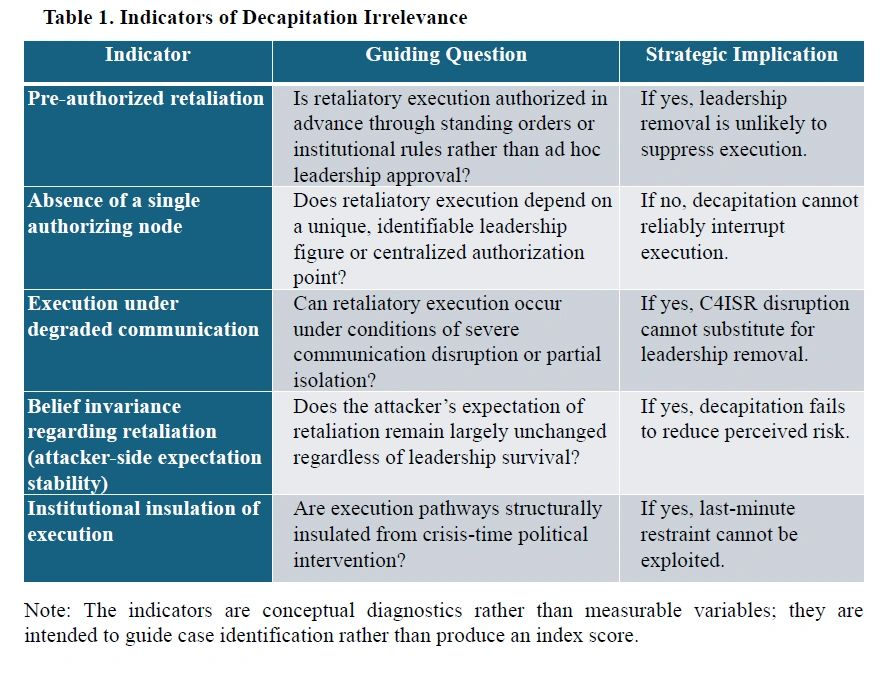

# When Decapitation No Longer Matters:

Original URL: https://epinova.org/articles/f/when-decapitation-no-longer-matters

Publication date: 2026-01-15

Archive note: This is a locally preserved Markdown copy of an EPINOVA article originally generated through the GoDaddy blog system.

---

#### **AI-Delegated Execution and the Potential Failure of Preemptive Strike Logic**

  

  

  

  

  

  

**Author:** Dr. Shaoyuan Wu 

**ORCID:**<https://orcid.org/0009-0008-0660-8232>

**Affiliation:** Global AI Governance and Policy Research Center, EPINOVA LLC

**Date:** January 15, 2026 

  

#### Abstract

Preemptive and preventive strike doctrines in international relations are commonly understood as strategies of risk reduction, premised on the belief that striking first can suppress or prevent future retaliation. This logic presumes that diverse target sets—military forces, leadership nodes, and critical infrastructure—are strategically substitutable within a unified framework of early violence.

This article argues that such substitutability rests on an underexamined structural condition: the existence of a disruptable human decision bottleneck whose removal can meaningfully alter retaliatory execution. Decapitation functions as a necessary enabling condition within preemptive strike logic even when it is not the sole objective. When leadership disruption no longer affects the probability, scale, or certainty of retaliation, preemption forfeits its defining function as risk reduction and collapses into reciprocal destruction.

This condition is increasingly undermined by AI-enabled delegated execution. When retaliatory execution is pre-authorized and institutionally insulated from real-time human intervention, killing leaders no longer alters strategic outcomes—a condition this article terms _decapitation irrelevance_. Contrary to prevailing concerns in AI governance scholarship, this transformation does not entail automated decision-making, but a reconfiguration of commitment structures. The article concludes that deterrence stability in AI-integrated environments depends less on crisis-time restraint than on institutional architectures of pre-commitment established before conflict begins.

  

#### 1\. Introduction: Preemptive Strike Beyond Decapitation

#### 1.1 Scope Conditions and Analytical Boundaries

The argument developed in this article is structural rather than empirical. It identifies a necessary enabling condition for the risk-reduction logic of preemptive strike and examines how AI-enabled delegated execution can undermine that condition. To avoid overgeneralization, four scope conditions and analytical boundaries should be made explicit.

First, the argument presumes an adversary that possesses **strategic-level retaliatory capability** —that is, a credible capacity to impose costs that matter for the attacker’s initial decision calculus (Snyder, 1961; Powell, 1990). Where the opponent lacks meaningful retaliatory potential, decapitation is unlikely to be decisive, but neither is preemptive strike analytically central as a risk-reduction strategy. The framework is therefore intended for deterrence environments in which retaliation remains a salient possibility rather than a negligible contingency.

Second, the analysis applies to settings in which retaliatory execution can be **institutionally pre-committed**. The article does not assume a particular regime type, but it does assume that authorization rules, standing procedures, and execution pathways can be designed to function without requiring real-time discretionary approval by a single leadership node. Where retaliatory execution remains tightly coupled to crisis-time personal authorization—and where command structures cannot be insulated from leadership removal—decapitation may retain strategic relevance.

Third, the argument assumes that attackers face persistent constraints of **incomplete information and non-verifiability** regarding “complete neutralization” (Fearon, 1995; Jervis, 1978). Preemptive strike becomes rational only if the attacker can reasonably believe that retaliation has been prevented or reduced. If an attacker can achieve and verify near-perfect elimination and blockade of all relevant retaliatory capabilities, including the elimination of surviving execution pathways under degraded communications, then any deterrence structure, leader-centric or otherwise, may be defeated. The claim advanced here is that such perfect neutralization is not a stable foundation for preemptive strike as a generally rational strategy under realistic uncertainty (Sagan, 1993; Blair, 1993).

Fourth, the object of analysis is the **risk-reduction logic of preemptive and preventive strike** , not the broader permissibility, desirability, or feasibility of war. This article does not argue that conflict becomes unthinkable under delegated execution, nor does it propose specific operational designs. Instead, it asks a narrower theoretical question: under what conditions does striking first cease to reduce expected retaliatory risk and instead become destruction without leverage?

These scope conditions define what the article claims and what it does not. Within these boundaries, the central argument follows: when retaliatory execution is sufficiently pre-authorized and institutionally insulated such that leadership removal no longer alters retaliatory outcomes, decapitation loses its enabling role and the multi-target logic of preemptive strike collapses as a risk-reduction strategy.

  

#### 1.2 Preemptive and Preventive Strike: Temporal Logic and Risk Reduction

Preemptive and preventive strike doctrines occupy a central position in international relations and security studies. From classical deterrence theory to contemporary debates on escalation control, preemption has been understood as a rational strategy aimed at reducing future risk by striking first. Whether framed in terms of disabling adversary capabilities, decapitating leadership, or degrading critical infrastructure, the underlying logic remains consistent: **early violence is justified insofar as it prevents greater violence later**.

Although this article refers to both preemptive and preventive strike doctrines, it is important to distinguish their analytical logics and temporal assumptions. In the international relations literature, **preemptive strike** is typically associated with an imminent or rapidly approaching threat (Betts, 2003), characterized by severe time compression and the expectation that a first strike can disable or disrupt the opponent’s ability to retaliate in the immediate term. Its defining rationale is risk reduction through the removal of near-term retaliatory capacity or authorization.

**Preventive war** , by contrast, operates on a longer time horizon. It is justified not by imminence, but by the anticipation of unfavorable future shifts in the balance of power (Levy, 2008; Fearon, 1995). Preventive strategies rely more heavily on political mobilization, legitimacy construction, and long-term cost–benefit calculations, and they allow greater scope for deliberation, coalition-building, and domestic justification.

The distinction matters for the argument advanced here. The mechanisms analyzed in this article—decision bottlenecks, executional pre-commitment, and the disruption of retaliatory authorization—are most clearly operative in **preemptive strike scenarios** , where strategic outcomes hinge on the ability to suppress or delay retaliation within a narrow temporal window. It is under these conditions that decapitation historically functioned as an enabling condition for risk reduction.

At the same time, the underlying logic examined here is not exclusive to preemptive strike. Preventive war, despite its longer time horizon, ultimately seeks to reduce expected future costs by eliminating or constraining an opponent’s capacity for retaliation. Where delegated execution renders retaliation belief-invariant to leadership survival, the strategic appeal of prevention is likewise weakened. However, because preventive war tolerates greater uncertainty and political maneuvering, the effects identified in this article are **most pronounced—and most analytically tractable—in preemptive contexts**.

Accordingly, this article treats preemptive strike as the primary analytical focus, while recognizing that the erosion of decapitation’s strategic function has implications for preventive logic as well. The argument is therefore strongest where time compression, authorization disruption, and immediate risk reduction are central to strategic calculation.

  

#### 1.3 AI, Automation, and the Misdiagnosis of Crisis Instability

Recent discussions surrounding artificial intelligence and automation in military systems have renewed concerns about crisis instability, inadvertent escalation, and the erosion of human control (Horowitz, 2018; Payne, 2021; Scharre, 2018). Much of this literature assumes that the introduction of AI into strategic systems amplifies preemptive incentives by accelerating decision-making and compressing response time. From this perspective, automation appears to lower thresholds for conflict by weakening human restraint.

This article advances a different diagnosis. It argues that the strategic viability of preemptive strike does not hinge primarily on speed, autonomy, or technical sophistication, but on a more fundamental structural condition: **the existence of a human decision bottleneck whose disruption can meaningfully alter retaliatory outcomes**(Sagan, 1993; Payne, 2021). Preemption has historically been rational not because damage could be inflicted efficiently, but because leadership survival, authorization, and discretion mattered at the moment retaliation would otherwise occur (Chiozza & Goemans, 2011; Horowitz et al., 2015).

  

#### 1.4 Decapitation as an Enabling Condition of Risk Reduction

Crucially, preemptive strike has never relied on a single target category. Military forces, leadership nodes, energy systems, communication networks, and transportation infrastructure are routinely integrated into composite strike plans. This article does not dispute that multi-target logic. Instead, it asks a prior question: _under what conditions do attacks across diverse target sets translate into strategic risk reduction rather than reciprocal destruction?_

The core argument advanced here is that **decapitation functions as a necessary enabling condition within preemptive strike logic** , even when it is not the sole or primary objective. Leadership disruption provides the mechanism through which damage to other targets is expected to suppress, delay, or prevent retaliation. When that mechanism fails, the strategic coherence of preemptive strike collapses across the entire target set.

The emergence of AI-enabled delegated execution fundamentally alters this condition. When retaliatory execution is pre-authorized, institutionally embedded, and insulated from real-time human intervention, leadership removal no longer affects the probability, scale, or certainty of response. In such contexts, killing leaders, degrading forces, or disrupting infrastructure does not reduce risk; it merely guarantees escalation.

This article introduces the concept of **decapitation irrelevance** to describe this structural transformation. Decapitation irrelevance denotes a deterrence condition in which the removal of human leadership ceases to influence retaliatory execution. Under these conditions, preemptive strike forfeits its defining characteristic as a strategy of risk reduction and degenerates into destruction without leverage (Schelling, 1966; Snyder, 1961).

Importantly, this argument does not claim that automation eliminates war, nor does it suggest that AI systems “decide” to fight. The delegation examined here concerns **execution, not decision**. Sovereign choice is exercised upstream, through institutional design, threshold definition, and authorization rules established prior to crisis onset. AI functions as an executional medium within these commitments, not as an autonomous strategic actor.

By reframing the problem in this way, the article challenges two dominant assumptions in existing scholarship. First, it questions the leader-centric orientation of deterrence theory, which locates stability in crisis-time rationality and discretion. Second, it complicates prevailing AI governance narratives that treat automation primarily as a destabilizing accelerant rather than as a reconfiguration of commitment structures.

  

#### 1.5 Argument Overview

The argument proceeds in seven sections. Section 2 demonstrates why decapitation operates as a necessary condition within preemptive strike logic, even in multi-target strategies. Section 3 shows how delegated execution eliminates the decision bottleneck that gives decapitation its strategic function. Section 4 explains why other target sets cannot substitute for leadership disruption once execution is pre-committed. Section 5 analyzes how this transformation shifts preemption from capability assessment to irreversible cost acceptance, with implications for crisis stability. Section 6 reframes responsibility and control as institutional rather than episodic phenomena. Section 7 examines the broader implications for international relations theory. The conclusion reflects on deterrence after the head—when striking first no longer changes the outcome.

While the argument builds on classic deterrence and leadership-centered scholarship, it intervenes in a rapidly evolving literature on automation, pre-commitment, and strategic stability that has intensified since the late 2010s.

  

#### 2\. Decapitation as a Necessary Condition in Preemptive Strike Theory

Having clarified the scope conditions and the article’s focus on preemption as risk reduction, this section reconstructs why decapitation has historically served as the enabling hinge through which diverse target sets are expected to translate destruction into strategic restraint.

  

#### 2.1 Preemptive Strike as Risk Reduction, Not Destruction

Preemptive and preventive strike doctrines in international relations are often discussed in terms of target sets—military forces, leadership nodes, economic infrastructure, communication systems, and logistical networks (Snyder, 1961; Schelling, 1966). However, the strategic logic that unifies these heterogeneous targets is not physical destruction per se, but **risk reduction**. A preemptive strike is rational only insofar as it reduces the probability, scale, or certainty of retaliation.

This distinction is critical. Destruction without risk reduction constitutes reciprocal violence rather than strategic advantage (Jervis, 1978; Fearon, 1995). Accordingly, the success of preemptive strike has never depended solely on the quantity of damage inflicted, but on whether such damage alters the opponent’s capacity or willingness to retaliate in a meaningful way. The analytical question, therefore, is not _what_ is destroyed, but _how destruction is expected to translate into strategic restraint_.

  

#### 2.2 Why Target Sets Require Decision Disruption

Across different target categories, a common enabling assumption can be identified: **physical damage produces strategic benefit only if it disrupts retaliatory decision-making**(Schelling, 1966; Powell, 1990).

**(1)** Attacks on military forces aim not merely to degrade capabilities, but to convince decision-makers that retaliation is futile or prohibitively costly.

**(2)** Strikes against energy and economic infrastructure seek to generate domestic pressure capable of constraining political authority.

**(3)** Communication and C4ISR attacks are intended to sever command and control, thereby preventing coordinated response.

**(4)** Transportation and logistical disruptions target the sustainability of prolonged conflict, indirectly shaping leadership calculations (Blair, 1993; Feaver, 1992).

Despite their diversity, these targets share a single functional expectation: **they are effective only insofar as they influence a decision-making bottleneck**. Without such a bottleneck, damage remains damage, incapable of producing strategic restraint within the critical time window of preemptive action.

  

#### 2.3 Decapitation as the Logical Pivot of Preemptive Strike

This article does not claim that decapitation constitutes the entirety of preemptive strike doctrine. Rather, it argues that **decapitation functions as a necessary enabling condition** through which attacks on other target sets are expected to translate into risk reduction.

Leadership removal occupies a unique position within preemptive logic for three reasons.

First, leadership nodes concentrate authority over retaliation authorization. Unlike dispersed military assets or civilian infrastructure, decision authority is intentionally centralized to prevent unauthorized escalation (Feaver, 1992; Blair, 1993). This centralization renders leadership an analytically privileged target.

Second, decapitation provides a mechanism for integrating otherwise heterogeneous forms of destruction into a coherent strategic outcome (Chiozza & Goemans, 2011; Schelling, 1966). Military, economic, and infrastructural damage gain strategic meaning only when interpreted and acted upon by political authority. Removing that authority severs the interpretive and authorizing link between damage and response.

Third, decapitation introduces the possibility of _asymmetric payoff_. If leadership elimination prevents or delays retaliation, the attacker may avoid the reciprocal costs typically associated with large-scale destruction (Schelling, 1966; Powell, 1990). This asymmetry is what distinguishes preemptive strike from mutual attrition.

Once decapitation ceases to affect retaliatory execution, this integrative mechanism collapses. Attacks on military forces no longer reduce retaliation certainty; economic and societal pressure lose coercive leverage; communication disruption fails to prevent execution rather than coordination. In such conditions, preemptive strike forfeits its defining characteristic as a risk-reducing strategy and degenerates into high-cost provocation.

  

#### 2.4 Necessary Condition Collapse

The argument advanced here is therefore structural rather than empirical (Jervis, 1978). **Decapitation is not a sufficient condition for successful preemption, but it is a necessary one**. Its effectiveness underwrites the strategic coherence of the entire target set. When leadership removal no longer alters the probability or certainty of retaliation, no combination of physical targets can substitute for its function within the relevant time horizon.

This necessary condition collapse has profound implications. It suggests that the viability of preemptive strike does not hinge on technological superiority across multiple domains, but on the continued existence of a decision bottleneck susceptible to disruption (Schelling, 1966; Snyder, 1961). The following section demonstrates how AI-enabled delegated execution eliminates this bottleneck by decoupling retaliatory execution from real-time human authorization.

  

#### 3\. Delegated Execution and the Elimination of the Decision Bottleneck

If decapitation matters because it disrupts authorization at the moment of retaliation, the next question is what happens when authorization is no longer a crisis-time bottleneck—this section shows how delegated execution relocates control upstream and renders leadership survival strategically non-decisive.

  

#### 3.1 Execution Is Not Decision: A Structural Distinction

A central source of confusion in both international relations and AI governance literature lies in the conflation of _execution_ with _decision_. Concerns surrounding “AI decision-making” in strategic contexts often presume that delegating execution authority necessarily entails the delegation of sovereign judgment. This assumption is analytically flawed.

Decision-making in deterrence operates ex ante. Political authorities define thresholds, rules, and authorization conditions prior to any crisis. Execution, by contrast, occurs ex post, once those predefined conditions are met. The delegation discussed in this article concerns **execution under pre-authorized institutional rules** , not autonomous preference formation or discretionary judgment.

This distinction is not novel. Cold War deterrence architectures already relied extensively on pre-commitment mechanisms, standing orders, and automated response protocols designed to function under conditions of extreme time compression and communication degradation. AI-enabled systems do not introduce delegation as such; they **formalize and stabilize an already existing separation between decision design and execution performance**(Blair, 1993; Sagan, 1993).

Recognizing this distinction is essential. Once execution is analytically decoupled from decision-making, the question shifts from whether machines “decide” to whether **the strategic relevance of disrupting human decision-makers persists at all**.

  

#### 3.2 From Leader-Centric Authority to Institutional Pre-Commitment

Traditional deterrence theory presumes the existence of a decision bottleneck: a narrow set of human actors whose authorization is necessary for retaliation. This bottleneck underwrites the strategic logic of decapitation. Removing or incapacitating leadership is expected to delay, distort, or prevent retaliatory action.

Delegated execution architectures systematically erode this bottleneck. When retaliatory execution is pre-committed within institutional frameworks—distributed across resilient systems, authorized in advance, and insulated from real-time political intervention—the removal of leadership no longer alters execution outcomes.

This transformation represents a shift in the locus of sovereignty (Schelling, 1966; Powell, 1990). Sovereign authority no longer resides primarily in crisis-time discretion, but in **institutional design choices made prior to crisis onset**. Leadership retains political responsibility for system architecture, rule-setting, and authorization boundaries, but loses its role as an indispensable execution gatekeeper (Chiozza & Goemans, 2011).

As a result, decapitation ceases to function as a mechanism of strategic leverage. Leadership removal may carry symbolic or domestic political consequences, but it no longer produces operational uncertainty regarding retaliation. The strategic payoff that once justified the risks of preemptive strike evaporates.

  

#### 3.3 Decapitation Irrelevance

This article defines decapitation irrelevance as a deterrence condition in which the removal of human leadership does not **meaningfully** affect the probability, scale, or certainty of strategic retaliation.

Decapitation irrelevance does not require perfect automation, nor does it assume error-free systems (Sagan, 1993). It requires only that retaliatory execution be sufficiently pre-authorized and institutionally insulated such that leadership elimination fails to introduce meaningful uncertainty into the adversary’s payoff structure (Powell, 1990; Fearon, 1997).

Under conditions of decapitation irrelevance, the expected benefits of preemptive strike collapse across the entire target set. Military degradation no longer suppresses retaliation; economic and infrastructural damage cannot coerce political restraint; communication disruption fails to interrupt execution rather than coordination. The attacker faces a strategic environment in which **damage does not translate into risk reduction** , regardless of target selection.

Importantly, decapitation irrelevance does not imply escalation automatism. It implies **strategic determinism at the level of retaliation credibility** , not indiscriminate response. By removing discretionary intervention at the execution stage, institutional pre-commitment clarifies consequences rather than accelerates conflict.

While decapitation irrelevance is introduced as a structural condition rather than an empirical variable, its analytical value depends on whether it can be conceptually identified across cases. The claim advanced in this article does not require precise measurement of retaliation outcomes, nor does it presume absolute invariance in practice. Instead, it rests on whether leadership removal **fails to produce a strategically meaningful change in expected retaliatory outcomes** from the attacker’s perspective.

Accordingly, decapitation irrelevance should be understood as a **threshold condition** , not an absolute state. The relevant question is not whether leadership removal has _any_ effect, but whether it alters the probability, scale, or certainty of retaliation sufficiently to reintroduce preemptive strike as a rational strategy of risk reduction.

To clarify this distinction, Table 1 outlines a set of **conceptual indicators** that, taken together, signal the presence of decapitation irrelevance.  

These indicators are not intended as binary or exhaustive criteria. Rather, they function as diagnostic signals that help determine whether leadership disruption continues to play an enabling role in preemptive strike logic. A case need not satisfy all indicators perfectly to exhibit decapitation irrelevance. What matters is whether, in aggregate, leadership removal fails to reintroduce uncertainty into the attacker’s risk calculation.

Importantly, the claim that decapitation “does not affect probability, scale, or certainty” should be read as a strategic-level judgment, not a literal assertion of zero marginal effect. Minor variations in timing, signaling, or implementation do not restore the rationality of preemption if the attacker continues to expect retaliation with high confidence. In such environments, leadership removal loses its function as a mechanism of risk reduction, even if it retains symbolic, domestic, or moral significance.

By articulating these conceptual identification criteria, the article does not convert decapitation irrelevance into an empirical index. Instead, it provides a structured way to assess whether preemptive strike remains analytically coherent once execution authority is institutionally pre-committed and decoupled from leadership survival.

  

#### 3.4 Irreversibility and Strategic Clarity

A common critique of delegated execution architectures is that they eliminate human “insurance” against error or miscalculation. This critique presumes that crisis stability depends primarily on last-minute discretion. However, deterrence theory has long recognized that excessive flexibility can be destabilizing when it invites misperception, coercion, or brinkmanship (Schelling, 1966; Jervis, 1978).

Pre-commitment introduces irreversibility, but irreversibility also produces clarity. When consequences are predictable and independent of leadership survival, incentives for preemptive action diminish. Strategic interaction shifts away from exploiting decision bottlenecks toward avoiding threshold activation altogether.

In this sense, delegated execution does not weaken deterrence; it **redefines the temporal locus of control**. Stability no longer depends on crisis-time restraint, but on pre-crisis institutional design. The strategic contest moves upstream, away from escalation dynamics and toward rule formation, signaling credibility, and threshold governance.

Recent work on automation and nuclear stability has increasingly emphasized the stabilizing effects of pre-commitment and reduced discretion under conditions of extreme uncertainty (e.g., Acton, 2020; Scharre, 2023; Johnson, 2024).

  

#### 3.5 Eliminating the Head Without Automating War

It is crucial to emphasize that decapitation irrelevance does not entail automated warfare (Scharre, 2018; Horowitz, 2018). The delegation described here operates within bounded, predefined conditions established through human political processes. AI functions as an executional medium, not an autonomous strategic actor.

The elimination of the “head” refers not to the absence of governance, but to the absence of a **single point of discretionary interruption**. War is not decided by machines; it is rendered strategically unavoidable—or avoidable—by institutional commitments made long before violence occurs.

This structural shift undermines leader-centric models of deterrence that dominate international relations theory. It suggests that future stability will be determined less by the psychology or rationality of individual leaders than by the architecture of pre-commitment embedded within strategic institutions.

For analytical clarity, it is important to note that delegated execution does not denote a single institutional design, nor does it imply an automatic or unconditional retaliation mechanism. Rather, executional delegation exists along a **continuum of pre-commitment** , differentiated by the degree and timing of human intervention.

At one end of this spectrum are systems in which **human authorities retain continuous veto power** , with execution contingent on real-time confirmation under virtually all conditions. At the other end are highly automated architectures in which execution proceeds once predefined thresholds are met, regardless of leadership survival or crisis-time intervention. Between these poles lie a wide range of hybrid arrangements, including systems that activate delegated execution **only under extreme or specified conditions** , such as verified decapitation, catastrophic communication loss, or confirmed strategic attack.

The argument advanced in this article does not depend on the adoption of any particular point along this spectrum. Its analytical focus is narrower: **whether retaliatory execution remains contingent on the survival or availability of a human decision bottleneck at the moment of crisis**. Once that contingency is sufficiently weakened, the strategic function of decapitation erodes, regardless of whether execution is minimally delegated or highly automated, shifting preemptive strike from a problem of capability assessment to one of irreversible cost acceptance.

  

#### 4\. Why Other Target Sets Cannot Substitute for Decapitation

Preemptive strike doctrines rarely rely on a single category of targets. Military forces, energy infrastructure, communication networks, and transportation systems are typically treated as interchangeable components within a broader strategy of risk reduction. This section demonstrates why such substitutability collapses under conditions of delegated execution. Once decapitation ceases to affect retaliatory execution, no alternative target set can fulfill its strategic function within the relevant time horizon.

  

#### 4.1 Military Assets: From Disarming to Reciprocal Destruction

Attacks on military assets are commonly justified as efforts to disarm the opponent or reduce retaliatory capacity (Powell, 1990). However, disarmament alone does not constitute strategic success unless it alters the likelihood or scale of retaliation.

Under delegated execution, military degradation no longer suppresses retaliatory authorization. Surviving forces—however limited—retain the capacity to execute pre-authorized responses. As a result, military strikes become acts of reciprocal destruction rather than instruments of risk reduction. The attacker cannot convert force degradation into strategic advantage, only into symmetrical escalation.

Without decision disruption, military targeting loses its asymmetry. What remains is attrition without leverage.

  

#### 4.2 Energy and Economic Infrastructure: The Loss of Coercive Transmission

Energy and economic infrastructure attacks aim to generate societal pressure capable of constraining political authority (Schelling, 1966). Their effectiveness depends on the assumption that domestic suffering translates into leadership restraint or policy reversal.

Delegated execution severs this transmission mechanism. Retaliatory action is no longer contingent on political deliberation, public opinion, or economic resilience. Societal pressure cannot influence execution processes that have already been authorized and insulated from real-time intervention.

Consequently, infrastructure attacks increase humanitarian and material costs without altering strategic outcomes. They impose damage but fail to produce restraint, rendering them strategically inefficient within preemptive strike logic.

  

#### 4.3 Communication and C4ISR: Execution Without Coordination

Communication and command-and-control attacks occupy a privileged place in preemptive strike planning, premised on the belief that disrupting information flows prevents coordinated response (Blair, 1993; Feaver, 1992).

This assumption does not hold under delegated execution architectures. By definition, such architectures are designed to function under conditions of communication degradation. Execution authority does not depend on continuous coordination, real-time confirmation, or centralized signaling.

Communication disruption may impair situational awareness or post-strike management, but it does not prevent execution itself. In this context, C4ISR attacks degrade coordination without interrupting retaliation, eliminating their strategic substitutability for decapitation.

  

#### 4.4 Transportation and Logistics: Temporal Mismatch

Transportation and logistical targets affect the sustainability of prolonged conflict (Betts, 2003; Levy, 2008). Their strategic relevance lies in shaping long-term war-fighting capacity rather than immediate retaliatory action.

Preemptive strike, however, operates within a compressed temporal window. The critical question is whether retaliation can be prevented or delayed at the moment of initial attack. Logistical degradation unfolds too slowly to influence execution processes that are activated rapidly and autonomously once thresholds are crossed.

As such, transportation and logistics cannot function as substitutes for decision disruption. Their effects occur downstream of the retaliatory window that defines preemptive strategy.

  

#### 4.5 Structural Non-Substitutability

Taken together, these target categories share a common limitation: **they cannot independently generate strategic restraint once decision disruption is removed from the system**. Physical destruction, regardless of scope or sophistication, fails to translate into reduced retaliatory certainty.

This non-substitutability is structural rather than contingent. It does not depend on perfect automation, absolute resilience, or technological superiority. It follows from the relocation of authority from crisis-time human discretion to pre-committed institutional execution.

Once decapitation becomes irrelevant to retaliation, preemptive strike loses its integrative mechanism. The target set fragments into isolated acts of damage incapable of producing the strategic effect that defines preemption. What remains is destruction without leverage.

  

#### **4.6 Objection and Reply: What If the Execution System Itself Is the Target?**

A strong objection to the argument advanced in this article holds that preemptive strike need not rely on decapitation at all. From this perspective, the core objective of preemption is not the removal of political leadership, but the physical destruction of the opponent’s execution system itself. If retaliatory capabilities—delivery platforms, command-and-control infrastructure, data links, power supply, and enabling hardware—can be sufficiently degraded or eliminated through counterforce and counter–C2 operations, then delegated execution offers no special protection. AI-enabled systems, after all, remain embedded in material infrastructures that can be targeted, disrupted, or destroyed. Under this view, decapitation irrelevance does not imply the collapse of preemptive logic; it merely shifts the target set from leaders to systems.

This objection is analytically correct as a theoretical possibility. If an attacker could achieve near-complete and verifiable elimination of an adversary’s retaliatory execution system, then any deterrence arrangement—leader-centric or institutionally delegated—could, in principle, be defeated. The argument advanced here does not deny this possibility. Rather, it questions whether such system-level neutralization constitutes a stable or generalizable foundation for preemptive strike as a rational strategy of risk reduction.

Preemptive logic depends not on the abstract possibility of total neutralization, but on the attacker’s ability to **believe** that retaliation has been sufficiently suppressed. In practice, this belief is formed under conditions of incomplete information, operational uncertainty, and non-verifiability (Fearon, 1995; Jervis, 1978). Execution systems are not unitary objects but distributed, redundant, and adaptive architectures (Sagan, 1993; Blair, 1993). Even extensive degradation does not reliably translate into confidence that retaliation has been prevented, particularly when execution authority is pre-authorized and capable of operating under degraded communications or partial system failure.

Decapitation historically functioned as a substitute for this uncertainty. Leadership removal provided a focal point through which attackers could plausibly expect delay, hesitation, or restraint, even when material capabilities were not fully eliminated. Once execution is institutionally insulated from leadership survival, that substitute disappears. System-level targeting must then bear the full burden of risk reduction, requiring levels of completeness and certainty that are difficult to achieve and even harder to confirm.

The implication is not that preemptive strike becomes physically impossible, but that it loses its defining strategic appeal. When neither leadership disruption nor system degradation can be relied upon to suppress retaliation with high confidence, striking first no longer reduces expected risk; it merely determines the sequence of destruction. Under such conditions, preemption ceases to function as a rational strategy of risk management and instead becomes an acceptance of reciprocal harm without leverage.

This response does not deny the relevance of counterforce or counter–C2 strategies. It clarifies their limits as foundations for preemptive rationality. Decapitation irrelevance does not claim invulnerability; it claims that once execution is sufficiently pre-committed and distributed, the informational and belief-based conditions that historically made preemption attractive are no longer present.

  

#### 5\. Cost Transformation and Crisis Stability

If preemption can no longer reliably reduce retaliatory risk through target selection, its strategic calculus changes from capability optimization to cost acceptance—this section traces how delegated execution reshapes incentives for first use and reconfigures crisis stability.

  

#### 5.1 From Capability Assessment to Irreversible Cost Acceptance

Traditional analyses of preemptive strike focus on relative capabilities: whether the attacker can sufficiently degrade the opponent’s forces, infrastructure, or leadership to reduce retaliatory risk. This capability-centered framework presumes uncertainty regarding post-strike outcomes. Preemption is attractive precisely because it appears to convert uncertainty into advantage (Powell, 1990; Snyder, 1961).

Delegated execution transforms this logic. Once retaliation is institutionally pre-committed and decoupled from crisis-time authorization, the attacker no longer faces a probabilistic outcome space. Instead, preemptive action confronts a **deterministic cost structure**. The question is no longer whether retaliation can be avoided, but whether its consequences are acceptable.

This shift is fundamental. Strategic interaction moves away from optimizing damage efficiency toward accepting—or rejecting—irreversible outcomes. Preemption ceases to be a calculation of relative strength and becomes a decision about tolerating guaranteed loss.

  

#### 5.2 High Thresholds and Low Event Frequency

A common concern in both IR and AI governance literature is that automated or semi-automated execution lowers the threshold for conflict by accelerating response. This concern conflates **execution speed** with **activation probability**.

Delegated execution architectures typically raise activation thresholds rather than lower them (Schelling, 1966; Jervis, 1978). Because execution is difficult to interrupt once triggered, institutional designers have strong incentives to define narrow, explicit, and conservative activation conditions. Ambiguous signals, reversible provocations, and marginal incidents are more likely to be excluded from triggering criteria, not included.

As a result, while consequences become more severe once thresholds are crossed, the probability of crossing those thresholds declines. Crisis stability improves not through flexibility, but through **clarity and restraint embedded at the design stage**.

This dynamic mirrors classical deterrence logic: the severity of punishment reduces the likelihood of transgression. Delegated execution does not escape this logic; it intensifies it by removing last-minute bargaining illusions.

  

#### 5.3 The Displacement of Brinkmanship

Leader-centric deterrence models permit brinkmanship precisely because decision-makers retain discretionary control during crises (Schelling, 1966). Ambiguity regarding resolve, tolerance, and authorization creates opportunities for coercive signaling, incremental escalation, and miscalculation.

Under conditions of decapitation irrelevance, brinkmanship loses strategic utility. If leadership survival and crisis-time persuasion no longer affect execution outcomes, attempts to exploit ambiguity become self-defeating. Actors cannot rely on intimidation, surprise, or psychological pressure to extract concessions once retaliatory consequences are fixed.

Strategic interaction is therefore displaced from crisis moments to **pre-crisis institutional bargaining**. Stability depends less on nerve and judgment under pressure, and more on the credibility, transparency, and mutual recognition of threshold structures.

  

#### 5.4 Gray-Zone Activity and Structural Containment

An important corollary of this transformation is the likely expansion of gray-zone activity (Jervis, 1978). When high-end conflict thresholds become more rigid and costly to cross, actors may seek advantage through sub-threshold actions: economic pressure, cyber interference, legal contestation, and narrative competition.

This shift does not indicate destabilization. On the contrary, it reflects **structural containment**. Competition persists, but catastrophic escalation becomes increasingly irrational. The system channels rivalry into domains where reversibility remains possible.

Delegated execution does not eliminate conflict; it **reorders its distribution across intensity levels**.

  

#### 5.5 Crisis Stability Without Last-Minute Control

Perhaps the most counterintuitive implication of delegated execution is that crisis stability no longer depends on human intervention at the moment of maximum tension. Instead, stability emerges from the absence of exploitable decision bottlenecks.

This does not imply trust in machines. It implies distrust in improvisation under existential pressure (Sagan, 1993). By relocating control upstream, delegated execution reduces the likelihood that misperception, panic, or coercion will determine outcomes.

Crisis stability, in this framework, is not the product of restraint exercised in extremis, but of **commitments honored because they cannot be selectively undone**.

  

#### 6\. Responsibility, Control, and the Political Function of the Human-in-the-Loop

These incentive shifts also expose a deeper issue often treated as normative but in fact structurally political: where control and responsibility are located once crisis-time discretion ceases to be the decisive point of intervention.

  

#### 6.1 The Myth of Crisis-Time Human Control

A dominant assumption in contemporary debates on AI and warfare is that meaningful control resides in crisis-time human intervention. The “human-in-the-loop” is frequently presented as a safeguard against catastrophic error, miscalculation, or moral failure. This assumption warrants closer scrutiny.

In existential deterrence scenarios, decision environments are characterized by extreme time compression, incomplete information, and overwhelming structural pressure. Under such conditions, human discretion is rarely exercised in a deliberative or morally reflective manner. Instead, actions tend to follow pre-established protocols, standing orders, and institutional expectations. What appears as discretionary judgment is often the execution of previously committed choices.

From this perspective, crisis-time human control functions less as a genuine safety mechanism and more as a **symbolic reassurance** —a narrative device that sustains the belief that outcomes remain subject to conscious choice even when structural constraints render such choice largely illusory.

  

#### 6.2 Responsibility as Political Attribution, Not Operational Control

Responsibility in deterrence has always operated at two distinct levels: operational control and political attribution. These levels are frequently conflated.

Operational control concerns whether an actor can meaningfully alter outcomes at the moment of execution. Political attribution concerns whether responsibility for outcomes can be assigned to identifiable agents for purposes of legitimacy, accountability, and narrative coherence.

Human-in-the-loop arrangements primarily serve the latter function. They preserve a locus for blame, justification, and post hoc explanation, even when operational influence is minimal. The presence of a human decision-maker allows states to maintain familiar frameworks of responsibility, legality, and moral evaluation.

Delegated execution architectures do not eliminate responsibility; they **reveal its structural relocation**. Responsibility shifts from momentary authorization to **institutional design** , from individual choice to collective pre-commitment. This shift is politically uncomfortable but analytically unavoidable.

  

#### 6.3 The Insurance Fallacy

A common critique of delegated execution systems is that they eliminate the “insurance” provided by human judgment in cases of error or ambiguity (Sagan, 1993; Blair, 1993). This critique assumes that human intervention reliably functions as a corrective mechanism.

In practice, such insurance has always been contingent, inconsistent, and unevenly distributed. Historical deterrence systems have long incorporated automatic or semi-automatic response mechanisms precisely because reliance on human intervention under existential threat was considered unreliable.

Moreover, the availability of discretionary interruption can itself be destabilizing. When adversaries believe that outcomes remain negotiable or interruptible at the last moment, incentives for brinkmanship, coercive signaling, and escalation increase. The supposed insurance mechanism thus becomes a source of strategic manipulation.

Delegated execution removes this ambiguity. It replaces fragile, situational insurance with **structural clarity** , trading reversible discretion for predictable consequence.

  

#### 6.4 Responsibility Under Conditions of Irreversibility

Delegated execution architectures introduce irreversibility, a feature often portrayed as ethically problematic. However, irreversibility is not foreign to deterrence. Nuclear strategy has long rested on the premise that certain thresholds, once crossed, cannot be meaningfully undone.

Under such conditions, responsibility does not disappear; it **loses its corrective function**. Assigning blame after an irreversible outcome does not alter the outcome itself. Responsibility becomes symbolic, historical, or archival rather than instrumental.

This does not represent a moral failure of AI-enabled systems, but a structural characteristic of existential deterrence. The expectation that responsibility should function as a real-time control mechanism misunderstands the nature of the strategic environment.

Delegated execution merely makes explicit what was previously implicit: that responsibility in such regimes is exercised primarily at the design stage, not at the point of execution.

  

#### 6.5 The Human-in-the-Loop as Political Technology

Rather than viewing the human-in-the-loop as a technical safeguard, it is more accurate to understand it as a political technology (Scharre, 2018; Horowitz, 2018). Its primary functions include:

(1) Preserving narratives of sovereign agency

(2) Enabling legal and moral attribution

(3) Sustaining domestic and international legitimacy

These functions are not trivial. However, they should not be mistaken for operational guarantees of restraint or correction. In systems where execution has already been pre-authorized, human presence serves interpretive and justificatory roles rather than causal ones.

Recognizing this distinction allows for a more honest assessment of control. It shifts the analytical focus from performative intervention to **institutional responsibility** , from symbolic agency to structural commitment.

  

#### 6.6 Control Reconsidered: From Intervention to Design

Delegated execution does not abolish control; it relocates it temporally. Control is exercised upstream, through the design of activation thresholds, authorization conditions, redundancy structures, and insulation mechanisms.

This relocation has significant implications for governance. It suggests that ethical and political evaluation should focus less on whether humans remain “in the loop” during execution, and more on **who designs the loop, under what constraints, and with what degree of transparency and review**.

Control, in this framework, is not the capacity to stop a process once it has begun, but the capacity to prevent its activation through credible, conservative, and mutually recognized institutional commitments.

  

#### 6.7 Responsibility Without Consolation

Finally, delegated execution challenges a comforting illusion: that catastrophic outcomes can always be traced to individual failure or moral weakness. By dispersing agency across institutional structures, it denies the consolations of personalization.

This denial is unsettling, but it is also clarifying. It forces political communities to confront the reality that strategic outcomes are produced by systems they collectively design, authorize, and sustain.

In doing so, delegated execution does not erode responsibility; it **demands a more demanding form of it** —one that cannot be deferred to the psychology of leaders or the contingencies of crisis, but must be borne by institutional choice itself.

  

#### 7\. Implications for International Relations Theory

The preceding sections imply not merely an update to AI risk debates but a reallocation of the core explanatory variables in deterrence theory—this section draws out how leader-centric rationality, institutional constraint, and normative influence must be reconsidered under decapitation irrelevance.

  

#### 7.1 Rethinking Leader-Centric Rationality

A foundational assumption across multiple strands of international relations theory is that strategic outcomes hinge on the rationality, preferences, and psychology of political leaders (Chiozza & Goemans, 2011; Horowitz et al., 2015). From classical deterrence models to contemporary analyses of crisis management, leaders are treated as the ultimate arbiters of escalation and restraint.

The argument advanced in this article challenges this assumption. Under conditions of delegated execution and decapitation irrelevance, leader rationality no longer functions as a decisive variable in determining retaliation. Leadership survival, persuasion, or restraint does not alter execution outcomes once institutional thresholds are crossed.

This does not imply that leaders become irrelevant to international politics. Rather, it implies that their relevance shifts temporally and functionally—from crisis-time decision-makers to **pre-crisis architects of commitment**. International relations theory must therefore reconsider models that locate strategic stability primarily in the psychology of leaders under pressure.

  

#### 7.2 Institutions as Commitment Devices, Not Merely Constraints

Institutionalist approaches traditionally conceptualize institutions as mechanisms that constrain behavior, reduce uncertainty, and facilitate cooperation (Schelling, 1966; Powell, 1990). In deterrence contexts, institutions are often treated as stabilizing frameworks that moderate escalation.

Delegated execution architectures complicate this view. Here, institutions do not merely constrain action; they **enable and enforce pre-commitment**. They function as trigger mechanisms that translate predefined conditions into irreversible outcomes.

This shift suggests that institutions in high-stakes deterrence environments should be analyzed less as arenas of bargaining and more as **commitment devices**. Their primary strategic function is not flexibility or mediation, but credibility through irreversibility. Institutional design thus becomes a central site of power, with consequences comparable to those traditionally attributed to military capabilities.

  

#### 7.3 Norms, Meaning, and the Limits of Social Construction

Constructivist scholarship emphasizes the role of norms, identities, and shared meanings in shaping state behavior (Finnemore & Sikkink, 1998). Deterrence, from this perspective, is sustained through mutual understandings of acceptable conduct and restraint.

Decapitation irrelevance introduces a structural limit to normative influence. When retaliatory execution is insulated from crisis-time interpretation, persuasion and signaling lose their capacity to reshape outcomes once thresholds are crossed. Norms may still shape threshold design and long-term institutional evolution, but they cannot intervene at the moment of execution.

This does not invalidate constructivist insights, but it confines their domain of efficacy. Normative influence migrates upstream, affecting **how systems are designed** , rather than downstream, affecting how crises are resolved. International relations theory must therefore distinguish more sharply between norm-driven governance and norm-constrained execution.

  

#### 7.4 Reframing Agency and Responsibility

Delegated execution disperses agency across institutional structures, challenging IR’s tendency to locate responsibility in identifiable actors. Traditional models of agency struggle to accommodate outcomes produced by pre-committed systems rather than discretionary choice.

This article suggests that agency in deterrence should be reconceptualized as **architectural rather than episodic**. Responsibility lies not in the moment of execution, but in the prior establishment of rules, thresholds, and commitments.

Such a reframing has implications for how IR scholars approach accountability, legitimacy, and ethical evaluation. Rather than focusing on who “decides” in crisis, analysis must attend to who designs the conditions under which decision ceases to be possible.

  

#### 7.5 Revisiting Crisis Stability

Much of the IR literature treats crisis stability as a function of communication, signaling, and escalation control during periods of heightened tension (Jervis, 1978; Schelling, 1966). This view presumes that outcomes remain negotiable until the final moment.

The framework developed here suggests an alternative conception. Crisis stability emerges not from last-minute restraint, but from the **absence of exploitable discretion**. When leadership survival and persuasion do not affect execution, incentives for brinkmanship diminish.

Crisis stability, in this sense, becomes a property of institutional architecture rather than interpersonal interaction. This shift calls for a reevaluation of theories that privilege crisis management over pre-crisis commitment design.

  

#### 7.6 Implications for AI and Security Scholarship

Finally, this analysis challenges prevailing approaches in AI and security studies that frame automation primarily as a source of risk escalation (Horowitz, 2018; Payne, 2021). By focusing narrowly on execution speed or autonomy, such accounts overlook the structural role of pre-commitment.

Delegated execution does not inherently destabilize deterrence. Instead, it **exposes the degree to which stability has always depended on institutional design rather than human improvisation**. The critical analytical task is therefore not to ask whether AI should be excluded from strategic systems, but how its integration reshapes the location and nature of political control.

  

#### 8\. Conclusion: Deterrence After the Head

This article has argued that the strategic logic of preemptive strike rests on a fragile but often unexamined assumption: the existence of a disruptable human decision bottleneck. Decapitation has mattered not because leadership embodies sovereignty in a metaphysical sense, but because retaliatory execution has historically depended on crisis-time human authorization. Once this dependency is removed through delegated execution and institutional pre-commitment, the strategic utility of decapitation collapses.

The argument advanced here is not that preemptive strike disappears as a military option, but that it ceases to function as a rational strategy of risk reduction. When leadership removal no longer alters the probability, scale, or certainty of retaliation, attacks on military forces, infrastructure, or communication systems lose their integrative effect. Preemption degenerates into destruction without leverage, transforming from a calculated strategy into a gamble with deterministic costs.

This transformation does not herald automated war, nor does it imply the abdication of political responsibility. Rather, it reveals a shift in where control, agency, and responsibility are exercised. Deterrence stability no longer hinges on leader psychology, crisis management, or last-minute restraint. It is produced upstream, through institutional design choices that define thresholds, authorize execution, and render certain outcomes non-negotiable.

For international relations theory, this shift carries a clear implication. Models that locate strategic stability in leader-centric rationality, discretionary control, or crisis-time bargaining capture an increasingly limited domain of relevance. As execution becomes structurally insulated from human interruption, the decisive arena of power moves away from the moment of decision and toward the architecture of commitment itself.

The future of deterrence, therefore, will not be determined by who survives long enough to decide, nor by who strikes first, but by whether striking first still changes anything at all. When killing the head no longer alters the outcome, the logic of preemptive war loses its foundation—not because conflict becomes unthinkable, but because its strategic payoff disappears.

This shift aligns with emerging analyses of machine-mediated deterrence and automated strategic stability, which locate stability not in faster decision-making, but in institutionalized commitment structures and executional insulation from crisis-time discretion (e.g., Horowitz & Scharre, 2021; Acton, 2020; Depp & Scharre, 2024).

  

#### References

Acton, J. M. (2020, April 9). _Is it a nuke? Pre-launch ambiguity and inadvertent escalation_. Carnegie Endowment for International Peace. <https://carnegieendowment.org/2020/04/09/is-it-a-nuke-pre-launch-ambiguity-and-inadvertent-escalation-pub-81446>

Betts, R. K. (2003). Striking first: A history of thankfully lost opportunities. _Ethics & International Affairs, 17_(1), 17–24.

Blair, B. G. (1993). _The logic of accidental nuclear war_. Brookings Institution.

Chiozza, G., & Goemans, H. E. (2011). _Leaders and international conflict_. Cambridge University Press.

Depp, M., & Scharre, P. (2024, January 16). _Artificial intelligence and nuclear stability_. _War on the Rocks_. [https://warontherocks.com/2024/01/artificial-intelligence-and-nuclear-stability/](<https://warontherocks.com/2024/01/artificial-intelligence-and-nuclear-stability/?utm_source=chatgpt.com>)

Fearon, J. D. (1995). Rationalist explanations for war. _International Organization, 49_(3), 379–414.

Fearon, J. D. (1997). Signaling foreign policy interests: Tying hands versus sinking costs. _Journal of Conflict Resolution, 41_(1), 68–90.

Feaver, P. D. (1992). Command and control in emerging nuclear nations. _International Security, 17_(3), 160–187.

Finnemore, M., & Sikkink, K. (1998). International norm dynamics and political change. _International Organization, 52_(4), 887–917.

Horowitz, M. C. (2018). _Artificial intelligence, international competition, and the balance of power_. _Texas National Security Review, 1_(3). [https://tnsr.org/2018/05/artificial-intelligence-international-competition-and-the-balance-of-power/](<https://tnsr.org/2018/05/artificial-intelligence-international-competition-and-the-balance-of-power/?utm_source=chatgpt.com>)

Horowitz, M. C., Stam, A. C., & Ellis, C. D. (2015). _Why leaders fight_. Cambridge University Press.

Horowitz, M. C., & Scharre, P. (2021, January 12). _AI and international stability: Risks and confidence-building measures_. Center for a New American Security. <https://www.cnas.org/publications/commentary/ai-and-international-stability-risks-and-confidence-building-measures>

Jervis, R. (1978). Cooperation under the security dilemma. _World Politics, 30_(2), 167–214.

Johnson, J. (2024). Revisiting the ‘stability–instability paradox’ in AI-enabled warfare: A modern-day Promethean tragedy under the nuclear shadow? _Review of International Studies_. <https://doi.org/10.1017/S0260210524000767>

Levy, J. S. (2008). Preventive war and democratic politics. _International Studies Quarterly, 52_(1), 1–24.

Payne, K. (2021). Artificial intelligence: A revolution in strategic affairs? _Survival, 63_(2), 7–32.

Powell, R. (1990). _Nuclear deterrence theory: The search for credibility_. Cambridge University Press.

Sagan, S. D. (1993). _The limits of safety: Organizations, accidents, and nuclear weapons_. Princeton University Press.

Scharre, P. (2018). _Army of none: Autonomous weapons and the future of war_. W. W. Norton & Company.

Scharre, P. (2023). _Four battlegrounds: Power in the age of artificial intelligence_. W. W. Norton & Company.

Schelling, T. C. (1966). _Arms and influence_. Yale University Press.

Snyder, G. H. (1961). _Deterrence and defense: Toward a theory of national security_. Princeton University Press.
