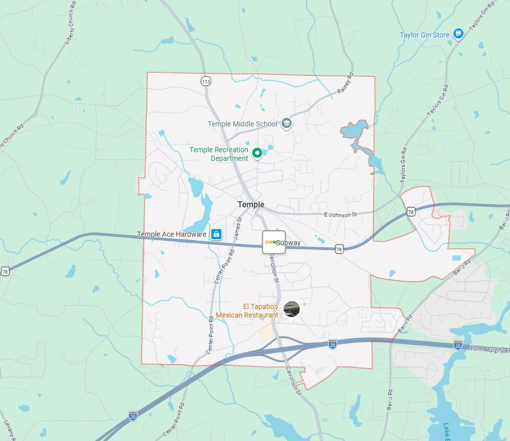
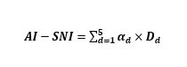
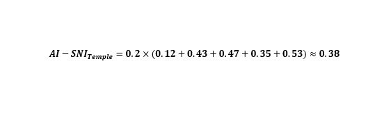

# When AI Infrastructure Is Optional but Governance Lock-In Is Not

Original URL: https://epinova.org/articles/f/when-ai-infrastructure-is-optional-but-governance-lock-in-is-not

Publication date: 2026-02-02

Archive note: This is a locally preserved Markdown copy of an EPINOVA article originally generated through the GoDaddy blog system.

---

[All Posts](<https://epinova.org/articles?blog=y>)

### When AI Infrastructure Is Optional but Governance Lock-In Is Not

February 2, 2026|Global AI Governance & Policy

#### **An AI-SNI Local Governance Diagnostic of the Temple (GA) Data Center Proposal**

  

  

  

  

  

  

**Author:** Shaoyuan Wu

**ORCID:**<https://orcid.org/0009-0008-0660-8232>

**Affiliation:** Global AI Governance and Policy Research Center, EPINOVA LLC

**Date:** February 02, 2026

  

  

#### **Abstract**

As artificial intelligence (AI) infrastructure rapidly expands at sub-national levels, local governments are increasingly asked to approve large-scale data centers under claims of strategic necessity, digital competitiveness, or AI leadership. However, existing evaluation frameworks rarely distinguish between commercially viable infrastructure and structurally necessary AI system nodes. This article applies the AI-Strategic Node Index (AI-SNI), a governance-oriented diagnostic framework originally developed for macro-strategic analysis, to a local infrastructure controversy: the proposed data center campus (“Project Bus”) in Temple, Georgia.

The analysis demonstrates that while the proposed facility may hold commercial or optional future value, it does not constitute a demonstrably structurally necessary AI node under current evidentiary conditions. Instead, the project exhibits high governance friction and long-term path-dependency risks disproportionate to its demonstrated system indispensability.

####   

#### **Keywords**

AI governance; data centers; infrastructure lock-in; local governance; AI-SNI; structural necessity

  

#### **1\. Introduction**

Large-scale data centers have become emblematic of AI-era development strategies. Local governments are frequently presented with proposals framed as essential to attracting innovation, enabling AI capabilities, or securing future economic relevance. Yet such claims often conflate capacity expansion with system necessity, obscuring governance risks related to land use, energy allocation, regulatory complexity, and long-term irreversibility (Organisation for Economic Co-operation and Development, 2019; UNESCO, 2021).

This article addresses a central governance question: **Under what conditions does AI-enabling infrastructure constitute a structurally necessary node within AI-mediated systems, rather than a merely optional or substitutable asset?**

To answer this question, the study applies the AI-Strategic Node Index (AI-SNI) to a local case in the United States. Rather than ranking performance or competitiveness, AI-SNI evaluates structural positioning, non-substitutability, and governance alignment within AI-mediated systems (Wu, 2026). The Temple, Georgia case offers a representative example of how AI narratives intersect with local governance constraints.

  

#### **2\. Analytical Framework: AI-Strategic Node Index (AI-SNI)**

AI-SNI is a governance-oriented diagnostic framework designed to identify structural exposure regimes within AI-mediated architectures (Wu, 2026). It explicitly rejects ordinal ranking and competitive interpretation, focusing instead on system dependency, non-substitutability, and failure propagation across interconnected AI-enabled systems.

  

#### **2.1 Core Dimensions**

AI-SNI evaluates nodes across five interdependent dimensions, each capturing a distinct structural function within AI-mediated architectures:

  * **D1 – Sensing and Monitoring Centrality;**
  * **D2 – Predictive and Modeling Dependency;**
  * **D3 – Decision Pipeline Criticality;**
  * **D4 – Governance and Control Alignment;**
  * **D5 – Future Coupling and Path Dependency.**

Composite scores are used strictly for diagnostic screening and are subject to confidence override when evidentiary coverage is incomplete or indeterminate (Wu, 2026).

  

#### **2.2 Downward Application to Local Infrastructure**

When applied at sub-national or commercial levels, AI-SNI requires:

  * **Interpretive authority downgrading** , such that no strategic, competitive, or normative claims are attached to analytical outputs;
  * **Semantic rebinding of indicators** to local governance and institutional contexts; and
  * **De-strategization of outputs** to prevent misuse for investment signaling, prestige claims, or development endorsement.

Under these constraints, AI-SNI functions as a structural necessity test, rather than a development endorsement tool (Wu, 2026).

Section 2.2 specifies the procedural conditions for downward application, while Section 2.3 delineates the interpretive constraints and misuse safeguards that govern such application.

  

#### 2.3 Interpretive Downgrading and Safeguards 

AI-SNI was originally formulated as a macro-structural diagnostic framework for identifying strategic exposure, system dependency, and governance asymmetry in AI-mediated global architectures. Its downward application to sectoral, local, or commercial infrastructure therefore requires explicit interpretive downgrading in order to prevent methodological misuse.

Without such safeguards, analytical instruments designed for structural diagnosis risk being reappropriated as tools for competitive ranking, investment signaling, or political legitimation—uses that directly contradict the epistemic intent and governance orientation of AI-SNI (Wu, 2026; OECD, 2019).

  

#### **2.3.1 Interpretive Authority Downgrading**

When applied below the national or system-constitutive level, AI-SNI outputs **do not carry strategic, competitive, or normative authority**. Specifically:

  * Composite scores **must not** be interpreted as indicators of economic performance, technological leadership, or investment attractiveness;
  * Tier classifications **must not** be treated as ordinal rankings, priority lists, or signals of comparative advantage; and
  * Structural exposure regimes **do not imply** desirability, success probability, or policy endorsement.

At sub-national levels, AI-SNI functions exclusively as a **structural exposure diagnostic** , identifying patterns of dependency, substitutability, governance friction, and potential failure propagation.

  

#### **2.3.2 Semantic Rebinding of Core Dimensions**

Downward application also requires **semantic rebinding** of AI-SNI’s five dimensions. While the dimensional architecture remains unchanged, their interpretive scope shifts from sovereign or geopolitical contexts to **institutional and infrastructural settings**.

For example:

  * Governance alignment (D4) refers not to sovereignty or geopolitical control, but to **institutional coherence among local governments, regulators, communities, utilities, and platform operators** ;
  * Future coupling (D5) captures **path dependency and lock-in risk** , rather than strategic expansion or growth potential; and
  * Decision pipeline criticality (D3) is interpreted as **organizational or infrastructural non-bypassability** , rather than command authority.

This rebinding preserves methodological consistency while preventing category errors.

  

#### **2.3.3 De-Strategization Clause**

To further constrain misuse, sub-national AI-SNI assessments must include an explicit de-strategization clause, stating that:

_**AI-SNI results at local or commercial levels do not indicate strategic importance, competitive advantage, or national interest, and must not be used to justify infrastructure projects on grounds of AI leadership, digital sovereignty, or technological indispensability.**_

This clause is essential to prevent the inflation of optional infrastructure into claims of inevitability.

  

#### **2.3.4 Confidence Override and Non-Escalation Principle**

Finally, AI-SNI’s confidence override mechanism applies with heightened force at sub-national scales. Where evidentiary coverage is incomplete—particularly regarding governance control, system embedding, or non-substitutability—composite scores and tier labels must not be escalated, compared, or used as a basis for approval prioritization.

In such cases, the analytical value of AI-SNI lies not in numerical outputs, but in revealing the absence of demonstrated necessity.

  

#### **3\. Case Background: The Temple, Georgia Data Center Proposal**

The City of Temple, Georgia, received a proposal for a large data center campus (“Project Bus”) encompassing approximately 350 acres, multiple data hall buildings, and on-site electrical substations. Project approval would require rezoning, annexation, and coordination across municipal and county jurisdictions.

The proposal triggered sustained community opposition and raised concerns related to land use, energy consumption, water access, and long-term governance obligations. Importantly, publicly available materials do not demonstrate that the proposed facility would serve a non-substitutable AI function or constitute a binding node within critical AI-mediated decision or forecasting systems (Georgia Department of Community Affairs, 2026).

  

#### **4\. Methodology and Computation**

#### **4.1 Scoring Assumptions**

The AI-SNI assessment is conducted under the following assumptions:

  * Equal weighting across dimensions (α₁–α₅ = 0.2);
  * Normalized diagnostic scores bounded within [0,1];
  * Evidence-bounded scoring with explicit uncertainty recognition; and
  * Use of the reference composite score only (no alternative aggregation formulations).

  

#### **4.2 Composite Formula**

The composite AI-SNI score is calculated as:

where αd​ denotes the weight assigned to each dimension and Dd​ represents the corresponding normalized diagnostic score.

  

#### **4.3 Dimension Scores (Temple Case)**

Table 1. AI-SNI Dimension-Level Scores for the Temple (GA) Data Center Proposal

  

The resulting composite score is:

  

Using evidence-bounded recalibration, the composite AI-SNI score for the Temple data center proposal is **0.38** , placing the node firmly within a **Tier-4 exposure regime**. Minor numerical adjustments relative to preliminary estimates do not alter the diagnostic conclusion, which remains robust under confidence override conditions.

  

#### **4.4 Dimension-Level Diagnostic Assessments**

#### **4.4.1 D1: Sensing & Monitoring Centrality**

**Assessment:** Low

  * No exclusive geographic, environmental, or system-level sensing function is associated with the proposed site.
  * No irreplaceable data acquisition capability is tied to the Temple location.

**Interpretation:** The AI system does not acquire uniquely situated perceptual or monitoring inputs as a result of the Temple node.

  

#### **4.4.2 D2: Predictive & Modeling Dependency**

**Assessment** : Indeterminate → Effectively Low

  * No demonstrated binding exists between the proposed facility and specific predictive models or domain-critical forecasting systems.
  * Under current evidence, compute location remains functionally fungible.

**Interpretation:** AI forecasting and modeling capacities do not structurally depend on the Temple node.

  

#### **4.4.3 D3: Decision Pipeline Criticality**

**Assessment:** Low–Moderate

  * The facility may function as a general-purpose compute supply node.
  * It does not operate as a non-bypassable execution, authorization, or decision-trigger junction.

**Interpretation:** AI-mediated decision processes do not require passage through the Temple node.

  

#### **4.4.4 D4: Governance & Control Alignment**

**Assessment:** Weak alignment / High friction

**Key signals include:**

  * Rezoning and annexation requirements;
  * Multi-jurisdictional governance interfaces;
  * Sustained community opposition; and
  * Emerging state-level scrutiny of large-scale data center expansion.

**Interpretation:** A node lacking demonstrated structural necessity is generating disproportionate governance complexity and coordination burden.

  

#### **4.4.5 D5: Future Coupling & Path Dependency**

**Assessment:** High optionality × High uncertainty

  * Physical scale and energy characteristics allow for potential future expansion. 
  * Platform binding, regulatory durability, and exit costs remain insufficiently specified.

**Interpretation:** The node creates future options while simultaneously introducing elevated risks of premature infrastructural lock-in.

  

#### **4.5 Composite Structural Assessment**

**AI-SNI Tier:** Tier 4 (Low–Moderate Exposure Regime)

**Confidence Status:** Bounded / Non-escalatable

Based on the aggregated dimension-level diagnostic assessments, the Temple data center proposal does not satisfy AI-SNI criteria for structural necessity or non-substitutability within AI-mediated systems.

Tier placement indicates the absence of system-level indispensability, rather than the absence of commercial viability or potential economic value (Wu, 2026).

  

#### **5\. Findings**

#### **5.1 Core Diagnostic Conclusion**

Building on the dimension-level diagnostic assessments presented in Section 4, the analysis yields the following core findings.

The proposed Temple data center does not constitute a structurally necessary AI node. Its establishment does not fill an identifiable dependency within AI-mediated sensing, prediction, decision, or governance architectures.

Instead, the primary structural effects of the project are concentrated in:

  * Long-term and potentially irreversible infrastructure commitment;
  * Amplification of governance load and coordination requirements; and
  * Exposure to future path dependency without demonstrated system-level necessity.

  

#### **5.2 Absence of Structural Necessity**

Across dimensions D1–D3, the Temple data center proposal does not demonstrate non-substitutable structural roles within AI-mediated sensing, prediction, or decision pipelines. Rather than functioning as a system bottleneck or mandatory junction, the facility operates as a fungible compute supply node whose services can be replicated or rerouted without inducing systemic disruption.

  

#### **5.3 Governance Friction as Primary Risk**

Dimension D4 reveals a pronounced **misalignment between infrastructure scale and local governance capacity**. Rezoning requirements, annexation procedures, multi-jurisdictional coordination, and sustained social contestation collectively **amplify governance load** without a corresponding increase in demonstrated system necessity.

As a result, governance friction rather than technical insufficiency or capacity shortage emerges as the **primary structural risk** associated with the proposed facility.

  

#### **5.4 Optionality Without Convertibility**

Dimension D5 indicates the presence of future coupling potential, but under conditions of high uncertainty and elevated lock-in risk. While the proposed facility creates optional capacity, such optionality does not convert into justified structural necessity, particularly in the absence of demonstrated platform binding, regulatory durability, or credible exit pathways.

  

#### **6\. Discussion: Why Necessity Matters in AI Infrastructure Governance**

The Temple case illustrates a broader governance failure mode: the tendency to treat **optional AI-enabling infrastructure as inevitable**. When necessity is presumed rather than demonstrated, local governments risk committing scarce land, energy, and governance capacity to projects whose system relevance remains unproven.

AI-SNI reframes the governance decision from asking whether a proposal qualifies as an “AI project” to asking whether the AI system in question **demonstrably requires the node to function**. Applied to the Temple case, this necessity-based lens yields a clear result: **the AI system does not require the proposed node to operate**.

  

#### **7\. Policy Implications**

From an AI-SNI governance perspective, the Temple case illustrates a recurring pattern in AI infrastructure decision-making: optional capacity is frequently presented as implicit necessity (OECD, 2019; NIST, 2023). This conflation obscures the distinction between infrastructure that can be built and infrastructure that must be built to preserve system integrity.

AI-SNI explicitly separates these two logics. In the Temple case, system integrity does not depend on the proposed node, while governance costs—associated with land use, regulatory coordination, and public contestation—are real and immediate. Once committed, such large-scale infrastructure also exhibits low reversibility, amplifying the consequences of premature approval.

These findings suggest several governance implications for local authorities. First, approval processes should require explicit demonstrations of structural necessity, rather than relying on aspirational narratives of AI leadership or competitiveness. Second, the scale and irreversibility of AI infrastructure projects should be evaluated in proportion to verified system dependency, not projected future optionality. Finally, high-impact and difficult-to-reverse projects warrant governance-first evaluation frameworks capable of distinguishing structural necessity from commercially attractive but substitutable capacity.

In this respect, AI-SNI offers a replicable diagnostic method for local infrastructure governance, enabling necessity-based assessment without collapsing into economic ranking, investment advocacy, or technology promotion.

  

#### **8\. Conclusion**

The Temple, Georgia data center proposal illustrates how AI-enabling infrastructure can generate substantial governance burden and path-dependency effects without constituting a structurally necessary AI node. By applying AI-SNI as a local governance diagnostic, this study demonstrates how necessity-based evaluation can help prevent premature infrastructural lock-in and support more disciplined, proportionate AI infrastructure decision-making.

More broadly, the case shows how necessity-based diagnostics can complement conventional economic and planning evaluations by clarifying when AI-related infrastructure claims exceed demonstrable system dependency, thereby strengthening governance capacity in contexts where reversibility is limited and institutional costs are high (Wu, 2026).

  

#### **References**

Wu, S.-Y. (2026). _AI-Strategic Node Framework (AI-SNF): Conceptual and methodological white book_ (Version 0.1; EPINOVA-IWB-2026-01). Global AI Governance and Policy Research Center, EPINOVA LLC. <https://doi.org/10.5281/zenodo.18452803>

Georgia Department of Community Affairs. (2026). _Development of regional impact (DRI) application summary: Project Bus (DRI #4606)_. State of Georgia. <https://apps.dca.ga.gov/DRI/>

Organisation for Economic Co-operation and Development. (2019). _Artificial intelligence in society_. OECD Publishing. <https://doi.org/10.1787/eedfee77-en>

National Institute of Standards and Technology. (2023). _Artificial intelligence risk management framework (AI RMF 1.0)_ (NIST AI 100-1). U.S. Department of Commerce. <https://doi.org/10.6028/NIST.AI.100-1>

UNESCO. (2021). _Recommendation on the ethics of artificial intelligence_. United Nations Educational, Scientific and Cultural Organization. <https://unesdoc.unesco.org/ark:/48223/pf0000381137>

Share this post:
