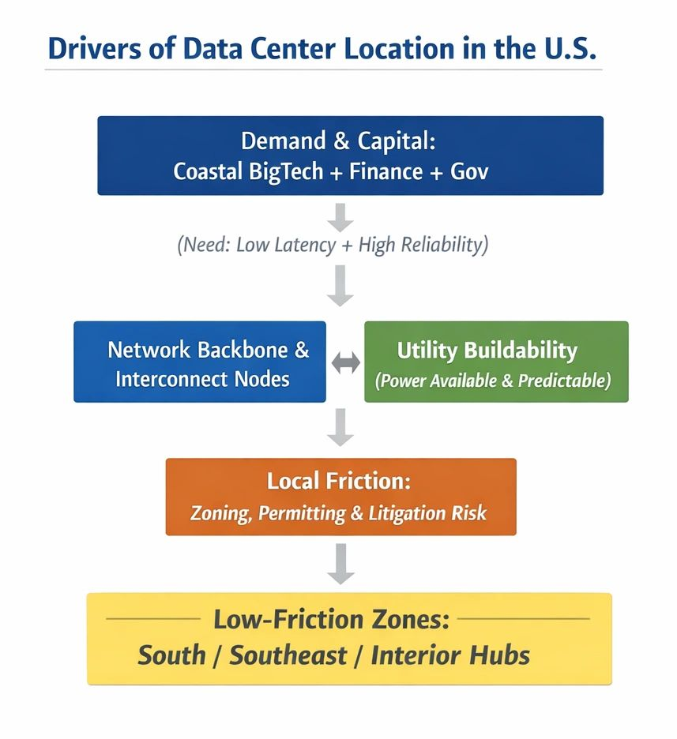

# Why the South?

Original URL: https://epinova.org/articles/f/why-the-south

Publication date: 2026-02-09

Archive note: This is a locally preserved Markdown copy of an EPINOVA article originally generated through the GoDaddy blog system.

---

[All Posts](<https://epinova.org/articles?blog=y>)

### Why the South?

February 9, 2026|Global AI Governance & Policy

#### **Institutional Friction and the Spatial Logic of Compute Infrastructure in the United States**

  

**Author:** Shaoyuan Wu

**ORCID:** [_https://orcid.org/0009-0008-0660-8232_](<https://orcid.org/0009-0008-0660-8232>)

**Affiliation:** Global AI Governance and Policy Research Center, EPINOVA LLC

**Date:** February 9, 2026

  

#### **1\. Background**

For the past decade, the spatial distribution of large-scale data centers in the United States has been explained primarily through technical and market-based factors. Proximity to internet exchange points, access to low-cost electricity, favorable climate conditions, and fiscal incentives have traditionally dominated both industry narratives and academic accounts.

As artificial intelligence (AI) and hyperscale computing become central drivers of infrastructure expansion, however, this explanatory framework has begun to show clear limitations. Rather than a discrete relocation or completed transition, recent development patterns reveal a persistent concentration of new hyperscale projects in the American South and selected interior regions, while many coastal and historically dominant hubs exhibit slower expansion, higher contestation, or rising procedural resistance.

Importantly, this pattern should not be interpreted as a singular “shift” driven by cost arbitrage or technological superiority. Instead, it reflects a deeper structural logic: data centers are increasingly built where institutional conditions allow them to be built at scale and speed. In this sense, contemporary data center siting is better understood not as geographic migration, but as institutional site selection.

#### **2\. The Infrastructure Friction Boundary**

To analyze this spatial organization, this study introduces the concept of the Infrastructure Friction Boundary (IFB). The IFB is not a fixed geographic, political, or cultural line. Rather, it represents a composite feasibility threshold separating jurisdictions capable of accommodating hyperscale data center development with relatively low resistance from those constrained by structural friction.

The IFB framework integrates three analytically distinct yet interrelated dimensions:

**(1) Institutional Friction**

This dimension captures land-use regulation, zoning rigidity, permitting timelines, public hearing requirements, litigation exposure, and the density of local veto points. Jurisdictions with fragmented authority structures or high procedural contestability exhibit higher institutional friction.

**(2) Utility and Energy Feasibility**

Hyperscale data centers depend on rapid access to large and stable power loads. Grid redundancy, substation approval processes, water dependency, and utility coordination capacity are therefore decisive in determining whether projects can proceed without delay.

**(3) Network and Infrastructure Embeddedness**

Existing fiber backbones, peering access, and established data center clusters create path dependence. However, such advantages translate into expansion capacity only when institutional conditions permit timely scaling.

By projecting these dimensions onto geographic space, the IFB captures how institutional gradients manifest spatially, producing an apparent north–south pattern that is structural rather than geographic in origin.

#### **3\. The South Is Not “Better,” but “More Feasible”**

The analysis yields a counterintuitive but robust finding: regions absorbing a disproportionate share of new data center capacity are not necessarily superior across technical or economic metrics, but they are consistently lower in institutional friction.

Several recurring characteristics distinguish these lower-friction jurisdictions:

  * Compressed approval timelines enabled by centralized or streamlined decision authority;
  * Greater administrative familiarity with large-scale energy and infrastructure projects;
  * Reduced procedural contestation, including fewer opportunities for prolonged public or judicial delay.

By contrast, regions with advanced digital ecosystems, dense talent pools, and mature networks frequently face escalating governance resistance. In such contexts, data center projects become institutionally constrained, even when they remain commercially viable.

Accordingly, the IFB’s southward projection does not indicate a migration of technology or capital. It reflects a systematic allocation of new infrastructure toward jurisdictions where governance structures allow rapid, low-resistance build-out.

#### **4\. Governance Implications: Infrastructure as a Lock-In Mechanism**

Data centers are not neutral installations. They are high-capital, long-lived, and path-dependent infrastructures that reshape local governance landscapes long after construction is complete.

Once operational, large data centers can:

  * Lock in specific energy generation and transmission pathways;
  * Create fiscal dependence on a narrow set of corporate actors;
  * Constrain future land-use, environmental, and regulatory flexibility.

The analysis highlights a critical asymmetry: jurisdictions exhibiting the lowest institutional friction often possess weaker long-term governance safeguards. This does not imply governance failure, but rather a structural trade-off between short-term feasibility and long-term adaptability.

In practice, data center expansion leverages differences in institutional friction, producing a form of infrastructure–governance asymmetry, in which decisions taken to accelerate deployment today may significantly narrow governance options tomorrow.

#### **5\. Conclusion**

The central contribution of this analysis is not the assertion that U.S. data centers are “moving south,” but the identification of institutional friction as a primary determinant of where large-scale compute infrastructure gets built.

The Infrastructure Friction Boundary should be understood as a diagnostic instrument rather than a deterministic boundary. It enables analysts and policymakers to identify where high-lock-in AI and compute infrastructure is being deployed primarily because it faces the least resistance, rather than because it is strategically, socially, or environmentally optimal.

As AI infrastructure becomes increasingly embedded in economic, security, and governance systems, the critical question is no longer whether such infrastructure is necessary. Instead, it is whether governance capacity is being structurally constrained before long-term societal choices can be fully evaluated.

In this context, mapping institutional friction is not merely an academic exercise. It is essential for anticipating the governance consequences of the next phase of AI-driven infrastructure development.

Share this post:
