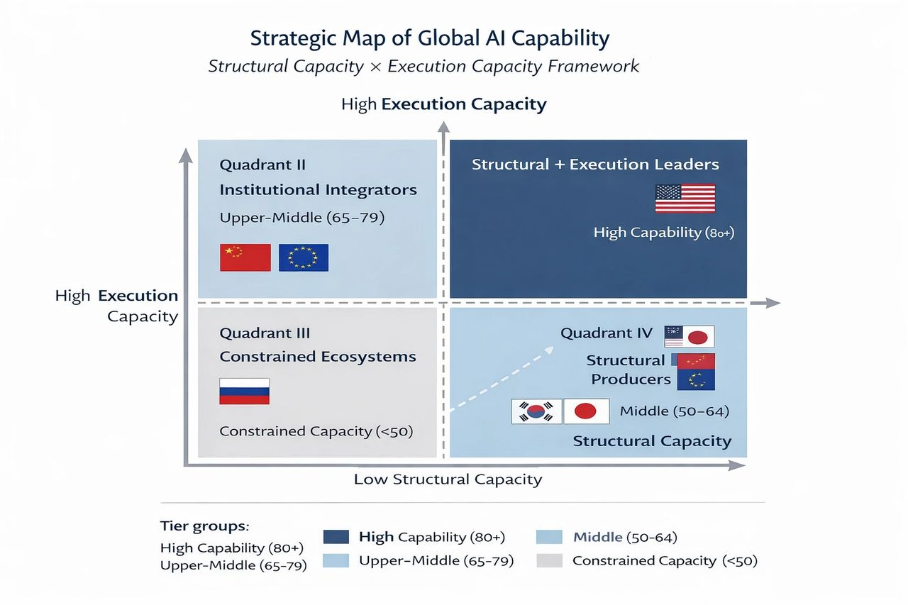

# Beyond Rankings: What Really Defines AI National Power?

Original URL: https://epinova.org/articles/f/beyond-rankings-what-really-defines-ai-national-power

Publication date: 2026-02-27

Archive note: This is a locally preserved Markdown copy of an EPINOVA article originally generated through the GoDaddy blog system.

---

[All Posts](<https://epinova.org/articles?blog=y>)

### Beyond Rankings: What Really Defines AI National Power?

February 27, 2026|AI & Society

**Author:** Shaoyuan Wu

**ORCID:** [_https://orcid.org/0009-0008-0660-8232_](<https://orcid.org/0009-0008-0660-8232>)

**Affiliation:** Global AI Governance and Policy Research Center, EPINOVA LLC

**Date:** February 27, 2026

  

Artificial intelligence (AI) is no longer merely a research frontier or an industrial growth sector. It is gradually becoming a national execution infrastructure. As AI systems embed themselves into regulatory systems, industrial workflows, administrative processes, and cross-border information environments, the meaning of “AI competitiveness” is shifting. The question is no longer only who can build the largest models or aggregate the most compute. It is increasingly about who can translate AI capacity into institutional performance.

For years, cross-national comparisons have focused on structural indicators: compute power, frontier model production, data scale, semiconductor capability, industry investment, and military integration. These metrics remain essential because they measure a country’s ability to produce and scale advanced systems. Yet structural production capacity does not automatically convert into operational effectiveness. A country may possess frontier models, but if those systems cannot operate reliably within domestic legal frameworks, procurement processes, healthcare systems, or tax infrastructures, then structural scale remains partially latent.

This is why execution capability must enter the conversation. AI systems now function inside real institutional environments. Their performance depends not only on model sophistication but on structured data access, regulatory alignment, workflow integration, and error tolerance within complex bureaucratic systems. The ability to execute tasks domestically—what we term Domestic Task Competence—reflects how deeply AI is embedded within national governance and industrial ecosystems. Equally important is Foreign Task Competence, which captures whether AI systems can operate effectively across languages, legal regimes, and cultural contexts in cross-border settings.

When structural capacity and execution capacity are considered together, global AI competition no longer appears as a simple ranking table. Instead, it forms a two-dimensional strategic landscape. Some countries combine frontier production strength with high institutional integration. Others demonstrate strong domestic embedding but more moderate structural scale. Still others possess advanced semiconductor ecosystems yet struggle to translate that advantage into frontier model leadership or cross-border operational capability. A few remain constrained by structural bottlenecks that limit both production and execution depth.

Viewed through this broader lens, several asymmetries become clearer. Structural leadership remains concentrated, particularly in compute and frontier model production. Yet domestic integration can materially improve a country’s relative positioning. Multilingual governance systems and regulatory interoperability can strengthen cross-border operational capacity even when frontier model output is comparatively moderate. Conversely, semiconductor strength alone does not guarantee model dominance, and military integration does not automatically imply civilian ecosystem maturity. The interaction between structure and execution, rather than scale alone, shapes durable competitiveness.

Semiconductor sovereignty emerges as a stabilizing variable across all cases. Access to advanced fabrication, packaging, and AI-specific chip ecosystems underpins both training capacity and long-term deployment reliability. Without this layer of resilience, even strong institutional integration may face scaling constraints. At the same time, chip autonomy by itself does not generate execution capability; it merely enables it.

The strategic implication is that AI power is becoming tiered and stratified rather than evenly distributed. Movement between tiers depends less on incremental increases in model size and more on coordinated advancement across structural infrastructure, economic diffusion, and institutional embedding. Countries that invest exclusively in frontier scale without integrating AI into governance and industry risk underutilizing their structural advantages. Countries that focus on integration without strengthening semiconductor and compute resilience may encounter long-term capacity ceilings.

Global AI competition is therefore entering a new phase. The decisive variable is not simply who builds the most advanced system, but who can embed AI into domestic institutions, operate across foreign regulatory systems, and sustain technological autonomy under supply chain stress. In this emerging landscape, execution depth is becoming as strategically significant as production scale.

Understanding AI power through this dual lens—structure and execution—offers a more realistic picture of how national capability translates into geopolitical and economic influence. Rankings may attract attention, but strategic positioning determines durability.

Share this post:
