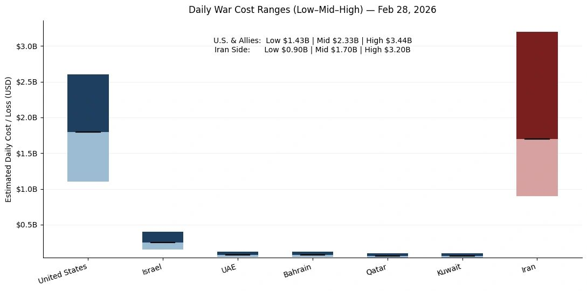

# 2026 Middle East Conflict Cost Monitor (MCCM)

Original URL: https://epinova.org/articles/f/2026-middle-east-conflict-cost-monitor-mccm

Publication date: 2026-02-28

Archive note: This is a locally preserved Markdown copy of an EPINOVA article originally generated through the GoDaddy blog system.

---

[All Posts](<https://epinova.org/articles?blog=y>)

### 2026 Middle East Conflict Cost Monitor (MCCM)

February 28, 2026|Global AI Governance & Policy

### An Event-Driven, Daily Expenditure and Loss Scenarios Assessment Series

  

**Powered by AIPAMS**

  

**Introduction**

The 2026 Middle East Conflict Cost Monitor (MCCM) provides an event-driven, scenario-based assessment of daily war-related expenditures and losses across major actors involved in the conflict. Using a structured low–mid–high estimation framework, the series aggregates publicly available operational indicators, force posture changes, strike intensity proxies, and reported material damage to produce comparable daily cost ranges.

MCCM is designed as a rolling monitoring instrument rather than a definitive accounting ledger. All estimates are expressed in current U.S. dollars (USD) and reflect scenario-based approximations intended for comparative analysis and policy discussion.

  

**Note:**  
Bars represent estimated daily war-related cost ranges under low, mid, and high scenarios. The lower (lighter) segment indicates the Low–Mid range, the upper (darker) segment indicates the Mid–High range, and the black horizontal marker denotes the midpoint (Mid) estimate. Columns are displayed as floating range bars beginning at the low estimate rather than zero to emphasize scenario variability. Bloc-level totals (U.S. & Allies; Iran side) reflect the sum of national estimates and are intended for comparative scenario analysis rather than precise accounting. All values are expressed in current U.S. dollars (USD). 

  

**Selected References:**

Al Jazeera. (2026, February 28). _Multiple Arab states that host US assets targeted in Iran retaliation_. Retrieved February 28, 2026, from [https://www.aljazeera.com/news/2026/2/28/multiple-gulf-arab-states-that-host-us-assets-targeted-in-iran-retaliation](<https://www.aljazeera.com/news/2026/2/28/multiple-gulf-arab-states-that-host-us-assets-targeted-in-iran-retaliation?utm_source=chatgpt.com>)

Anadolu Agency. (2026, February 28). _Kuwait summons Iranian ambassador over missile, drone attacks_. Retrieved February 28, 2026, from [https://www.aa.com.tr/en/middle-east/kuwait-summons-iranian-ambassador-over-missile-drone-attacks/3844209](<https://www.aa.com.tr/en/middle-east/kuwait-summons-iranian-ambassador-over-missile-drone-attacks/3844209?utm_source=chatgpt.com>)

Associated Press. (2026, February 28). _Israeli officials say Iran’s Supreme Leader Khamenei has been killed; no word from US or Iran_. Retrieved February 28, 2026, from [https://apnews.com/article/c2f11247d8a66e36929266f2c557a54c](<https://apnews.com/article/c2f11247d8a66e36929266f2c557a54c?utm_source=chatgpt.com>)

Bahrain National Communication Centre. (2026, February 28). _Statement on missile interceptions over Bahraini airspace_. Government of Bahrain. Retrieved February 28, 2026, from (official page unavailable in provided corpus; cite the official release page when archived/linked)

Belasco, A. (2011). _The cost of Iraq, Afghanistan, and other Global War on Terror operations since 9/11_ (CRS Report No. RL33110). Congressional Research Service. Retrieved February 28, 2026, from [https://www.everycrsreport.com/files/20110329_RL33110_be1a00c99d668bee3b4ec4f6fc82e914f62c39f0.pdf](<https://www.everycrsreport.com/files/20110329_RL33110_be1a00c99d668bee3b4ec4f6fc82e914f62c39f0.pdf?utm_source=chatgpt.com>)

Central Military Commission (CCTV.cn). (2026, February 28). _伊朗伊斯兰革命卫队宣布启动“诚实承诺4号”大规模军事行动_ [IRGC announces launch of “True Promise 4” large-scale operation]. 央视网. Retrieved February 28, 2026, from <https://news.cctv.cn/2026/02/28/ARTI9k5Qbo3NDBaBvwmqfSRY260228.shtml>

China National Radio. (2026, March 1). _伊朗军方称过去数小时内击落12架敌方作战和侦查无人机_ [Iran reports downing 12 enemy combat and reconnaissance drones in recent hours]. 央广网. Retrieved February 28, 2026, from <https://news.cnr.cn/sq/20260301/t20260301_527539248.shtml>

Congressional Budget Office. (2019). _The cost of supporting military bases_. Retrieved February 28, 2026, from [https://www.cbo.gov/system/files/2019-11/55849-CBO-BOS-costs.pdf](<https://www.cbo.gov/system/files/2019-11/55849-CBO-BOS-costs.pdf?utm_source=chatgpt.com>)

Congressional Budget Office. (2025, January 3). _An analysis of the Navy’s 2025 shipbuilding plan_. Retrieved February 28, 2026, from [https://www.cbo.gov/system/files/2025-01/60732-shipbuilding.pdf](<https://www.cbo.gov/system/files/2025-01/60732-shipbuilding.pdf?utm_source=chatgpt.com>)

Congressional Budget Office. (2025). _CBO’s interactive force structure tool_. Retrieved February 28, 2026, from [https://www.cbo.gov/force-structure-tool](<https://www.cbo.gov/force-structure-tool?utm_source=chatgpt.com>)

Council on Foreign Relations. (2025). _U.S. military presence in the Middle East_. Retrieved February 28, 2026, from [https://www.cfr.org](<https://www.cfr.org/>)

Defense Acquisition University. (2025, February 5). _Operating and support cost-estimating guide_. Retrieved February 28, 2026, from [https://www.dau.edu/sites/default/files/2025-02/2025%20OS%20Cost%20Estimating%20Guide.pdf](<https://www.dau.edu/sites/default/files/2025-02/2025%20OS%20Cost%20Estimating%20Guide.pdf?utm_source=chatgpt.com>)

Defense Intelligence Agency. (2018). _Iran military power: Ensuring regime survival and securing regional dominance_. U.S. Department of Defense. Retrieved February 28, 2026, from [https://www.dia.mil/portals/110/images/news/military_powers_publications/iran_military_power_lr.pdf](<https://www.dia.mil/portals/110/images/news/military_powers_publications/iran_military_power_lr.pdf?utm_source=chatgpt.com>)

Defense Intelligence Agency. (2024). _Military power publications_. Retrieved February 28, 2026, from [https://www.dia.mil/Military-Power-Publications/](<https://www.dia.mil/Military-Power-Publications/?utm_source=chatgpt.com>)

Defense Intelligence Agency. (n.d.). _Iran: Enabling Houthi attacks across the Middle East_ (Functional Threat Report). Retrieved February 28, 2026, from [https://www.dia.mil/Portals/110/Documents/News/Military_Power_Publications/Iran_Houthi_Final2.pdf](<https://www.dia.mil/Portals/110/Documents/News/Military_Power_Publications/Iran_Houthi_Final2.pdf?utm_source=chatgpt.com>)

Government Accountability Office. (1998). _Navy aircraft carriers: Cost-effectiveness and related issues_ (Report No. NSIAD-98-1). Retrieved February 28, 2026, from [https://www.gao.gov/assets/nsiad-98-1.pdf](<https://www.gao.gov/assets/nsiad-98-1.pdf?utm_source=chatgpt.com>)

Government Accountability Office. (2023). _Weapon system sustainment: Navy ship usage has decreased while operating and support costs have increased_ (Report No. GAO-23-106440). Retrieved February 28, 2026, from [https://www.gao.gov/assets/gao-23-106440.pdf](<https://www.gao.gov/assets/gao-23-106440.pdf?utm_source=chatgpt.com>)

Government Accountability Office. (2024). _DOD identified operating and support cost growth but needs to improve how it uses that information_ (Report No. GAO-24-866936). Retrieved February 28, 2026, from [https://www.gao.gov/assets/870/866936.pdf](<https://www.gao.gov/assets/870/866936.pdf?utm_source=chatgpt.com>)

International Institute for Strategic Studies. (2025). _The Military Balance 2025_. Retrieved February 28, 2026, from [https://www.iiss.org/publications/the-military-balance/2025/the-military-balance-2025/](<https://www.iiss.org/publications/the-military-balance/2025/the-military-balance-2025/?utm_source=chatgpt.com>)

International Institute for Strategic Studies. (2026, February). _Global defence spending continues to grow amid geopolitical uncertainty_. Retrieved February 28, 2026, from [https://www.iiss.org/online-analysis/military-balance/2026/02/global-defence-spending-continues-to-grow-amid-geopolitical-uncertainty/](<https://www.iiss.org/online-analysis/military-balance/2026/02/global-defence-spending-continues-to-grow-amid-geopolitical-uncertainty/?utm_source=chatgpt.com>)

Missile Defense Advocacy Alliance. (n.d.). _Missile interceptors by cost_. Retrieved February 28, 2026, from [https://www.missiledefenseadvocacy.org/missile-defense-systems-2/missile-defense-systems/missile-interceptors-by-cost/](<https://www.missiledefenseadvocacy.org/missile-defense-systems-2/missile-defense-systems/missile-interceptors-by-cost/?utm_source=chatgpt.com>)

OECD. (2025). _Implementation toolkit for the OECD recommendation on public policy evaluation_. OECD Publishing. Retrieved February 28, 2026, from [https://www.oecd.org/content/dam/oecd/en/publications/reports/2025/02/implementation-toolkit-for-the-oecd-recommendation-on-public-policy-evaluation_f24516be/77faa4fe-en.pdf](<https://www.oecd.org/content/dam/oecd/en/publications/reports/2025/02/implementation-toolkit-for-the-oecd-recommendation-on-public-policy-evaluation_f24516be/77faa4fe-en.pdf?utm_source=chatgpt.com>)

OECD. (2020). _Improving governance with policy evaluation_. OECD Publishing. Retrieved February 28, 2026, from [https://www.oecd.org/content/dam/oecd/en/publications/reports/2020/06/improving-governance-with-policy-evaluation_040f9225/89b1577d-en.pdf](<https://www.oecd.org/content/dam/oecd/en/publications/reports/2020/06/improving-governance-with-policy-evaluation_040f9225/89b1577d-en.pdf?utm_source=chatgpt.com>)

Office of the Under Secretary of Defense (Comptroller). (2024). _DoD financial management regulation (FMR), Volume 11A, Chapter 6: Annual reimbursable rates_. U.S. Department of Defense. Retrieved February 28, 2026, from [https://comptroller.war.gov/portals/45/documents/fmr/current/11a/11a_06.pdf](<https://comptroller.war.gov/portals/45/documents/fmr/current/11a/11a_06.pdf?utm_source=chatgpt.com>)

Office of the Under Secretary of Defense (Comptroller). (2024). _FY 2025 reimbursable rates: Fixed wing and helicopter aircraft hourly rates_ (PDF). U.S. Department of Defense. Retrieved February 28, 2026, from [https://comptroller.war.gov/Portals/45/documents/rates/fy2025/2025_b_c.pdf](<https://comptroller.war.gov/Portals/45/documents/rates/fy2025/2025_b_c.pdf?utm_source=chatgpt.com>)

Office of the Under Secretary of Defense (Comptroller). (2025). _FY 2026 weapons_ (PDF). U.S. Department of Defense. Retrieved February 28, 2026, from [https://comptroller.war.gov/Portals/45/Documents/defbudget/FY2026/FY2026_Weapons.pdf](<https://comptroller.war.gov/Portals/45/Documents/defbudget/FY2026/FY2026_Weapons.pdf?utm_source=chatgpt.com>)

Reuters. (2025, September 3). _Lockheed Martin wins $9.8 billion Patriot missile contract_. Retrieved February 28, 2026, from [https://www.reuters.com/business/aerospace-defense/lockheed-martin-wins-98-billion-patriot-missile-contract-2025-09-03/](<https://www.reuters.com/business/aerospace-defense/lockheed-martin-wins-98-billion-patriot-missile-contract-2025-09-03/?utm_source=chatgpt.com>)

Reuters. (2025, December 23). _RTX unit Raytheon lands $1.7 billion deal to supply Patriot systems to Spain_. Retrieved February 28, 2026, from [https://www.reuters.com/business/aerospace-defense/rtx-unit-raytheon-lands-17-billion-deal-supply-patriot-systems-spain-2025-12-23/](<https://www.reuters.com/business/aerospace-defense/rtx-unit-raytheon-lands-17-billion-deal-supply-patriot-systems-spain-2025-12-23/?utm_source=chatgpt.com>)

Reuters. (2025, April 27). _World military spending hits $2.7 trillion in record 2024 surge_. Retrieved February 28, 2026, from [https://www.reuters.com/business/aerospace-defense/world-military-spending-hits-27-trillion-record-2024-surge-2025-04-27/](<https://www.reuters.com/business/aerospace-defense/world-military-spending-hits-27-trillion-record-2024-surge-2025-04-27/?utm_source=chatgpt.com>)

RAND Corporation. (2023). _Assessing the value of overseas military campaigning in strategic competition_ (Report No. RRA1798-1). Retrieved February 28, 2026, from [https://www.rand.org/content/dam/rand/pubs/research_reports/RRA1700/RRA1798-1/RAND_RRA1798-1.pdf](<https://www.rand.org/content/dam/rand/pubs/research_reports/RRA1700/RRA1798-1/RAND_RRA1798-1.pdf?utm_source=chatgpt.com>)

Stockholm International Peace Research Institute. (n.d.). _SIPRI military expenditure database_. Retrieved February 28, 2026, from [https://www.sipri.org/databases/milex](<https://www.sipri.org/databases/milex?utm_source=chatgpt.com>)

Stockholm International Peace Research Institute. (n.d.). _SIPRI military expenditure database (portal)_. Retrieved February 28, 2026, from [https://milex.sipri.org/](<https://milex.sipri.org/?utm_source=chatgpt.com>)

Stockholm International Peace Research Institute. (n.d.). _Sources and methods: SIPRI military expenditure database_. Retrieved February 28, 2026, from [https://www.sipri.org/databases/milex/sources-and-methods](<https://www.sipri.org/databases/milex/sources-and-methods?utm_source=chatgpt.com>)

Taleb, N. N. (2007). _The black swan: The impact of the highly improbable_. Random House. (New York, NY)

U.S. Naval Institute News. (2022, May 25). _Raytheon awarded $217M Tomahawk missiles contract for Navy, Marines, Army_. Retrieved February 28, 2026, from [https://news.usni.org/2022/05/25/raytheon-awarded-217m-tomahawk-missiles-contract-for-navy-marines-army](<https://news.usni.org/2022/05/25/raytheon-awarded-217m-tomahawk-missiles-contract-for-navy-marines-army?utm_source=chatgpt.com>)

U.S. Transportation Command. (2025). _FY 2025 AMC SAAM JETP exercise and contingency rates and guidance_ (PDF). Retrieved February 28, 2026, from [https://www.ustranscom.mil/dbw/docs/FY25%20AMC%20SAAMs%20JETP%20Exercises%20and%20Contingencies%20Rates%20and%20Guidance.pdf](<https://www.ustranscom.mil/dbw/docs/FY25%20AMC%20SAAMs%20JETP%20Exercises%20and%20Contingencies%20Rates%20and%20Guidance.pdf?utm_source=chatgpt.com>)

U.S. Central Command. (2025). _Area of responsibility overview_. Retrieved February 28, 2026, from [https://www.centcom.mil](<https://www.centcom.mil/>)

VAMOSC (Naval Center for Cost Analysis). (n.d.). _About VAMOSC_. U.S. Navy. Retrieved February 28, 2026, from [https://www.vamosc.navy.mil/webpages/general/about.cfm](<https://www.vamosc.navy.mil/webpages/general/about.cfm?utm_source=chatgpt.com>)

Washington Post. (2026, February 28). _Israel strikes Iran live updates; Centcom targeted Iran’s missile sites, airfields, IRGC_ (live updates). Retrieved February 28, 2026, from [https://www.washingtonpost.com/world/2026/02/28/israel-strikes-iran-live-updates/](<https://www.washingtonpost.com/world/2026/02/28/israel-strikes-iran-live-updates/?utm_source=chatgpt.com>)

The Guardian. (2026, February 28). _Explosions rock Bahrain, Dubai, Jordan and Kuwait as war spreads across Middle East_. Retrieved February 28, 2026, from [https://www.theguardian.com/world/2026/feb/28/dubais-famous-fairmont-hotel-in-flames-after-iranian-air-strike](<https://www.theguardian.com/world/2026/feb/28/dubais-famous-fairmont-hotel-in-flames-after-iranian-air-strike?utm_source=chatgpt.com>)

**Note:** All news references reflect publicly reported statements as of February 28, 2026. Estimates derived from these reports are scenario-based approximations and do not constitute official fiscal accounting. 

Share this post:
