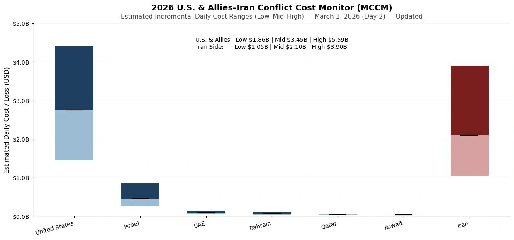
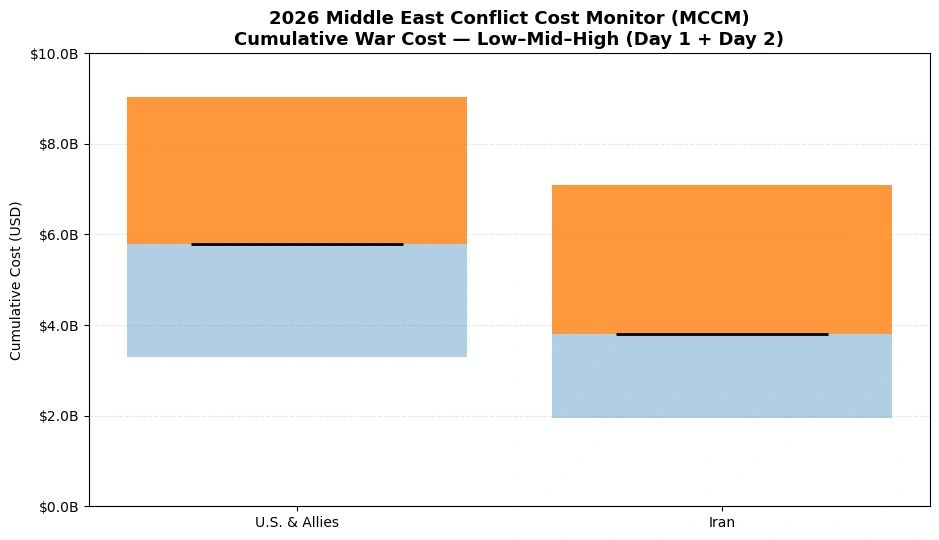

# 2026 U.S. & Allies–Iran Conflict Cost Monitor (MCCM): March 1

Original URL: https://epinova.org/articles/f/2026-us-allies%E2%80%93iran-conflict-cost-monitor-mccm-march-1

Publication date: 2026-03-01

Archive note: This is a locally preserved Markdown copy of an EPINOVA article originally generated through the GoDaddy blog system.

---

[All Posts](<https://epinova.org/articles?blog=y>)

### 2026 U.S. & Allies–Iran Conflict Cost Monitor (MCCM): March 1

March 1, 2026|Global AI Governance & Policy

**Powered by AIPAMS**

  

**Introduction**

The 2026 Middle East Conflict Cost Monitor (MCCM) provides an event-driven, scenario-based assessment of daily war-related expenditures and losses across major actors involved in the conflict. Using a structured low–mid–high estimation framework, the series aggregates publicly available operational indicators, force posture changes, strike intensity proxies, and reported material damage to produce comparable daily cost ranges.

MCCM is designed as a rolling monitoring instrument rather than a definitive accounting ledger. All estimates are expressed in current U.S. dollars (USD) and reflect scenario-based approximations intended for comparative analysis and policy discussion.

  

**Note:**  
Bars represent estimated daily war-related cost ranges under low, mid, and high scenarios. The lower (lighter) segment indicates the Low–Mid range, the upper (darker) segment indicates the Mid–High range, and the black horizontal marker denotes the midpoint (Mid) estimate. Columns are displayed as floating range bars beginning at the low estimate rather than zero to emphasize scenario variability. Bloc-level totals (U.S. & Allies; Iran side) reflect the sum of national estimates and are intended for comparative scenario analysis rather than precise accounting. All values are expressed in current U.S. dollars (USD). 

  

  

**Selected References:**

Anadolu Agency. (2026, March 1). _Regional missile interceptions reported across Gulf states amid escalation._ Retrieved from [https://www.aa.com.tr](<https://www.aa.com.tr/>)

Bahrain National Communication Centre. (2026, February 28). _Statement on missile interceptions over Bahraini airspace._ Manama: Government of Bahrain. Retrieved from [https://www.bna.bh](<https://www.bna.bh/>)

Belasco, A. (2014). _The cost of Iraq, Afghanistan, and other global war on terror operations since 9/11._ Washington, DC: Congressional Research Service. Retrieved from <https://crsreports.congress.gov/product/pdf/RL/RL33110>

Congressional Budget Office. (2023). _The cost of U.S. military deployments to the Middle East._ Washington, DC: U.S. Government Publishing Office. Retrieved from <https://www.cbo.gov/publication/59030>

Council on Foreign Relations. (2025). _U.S. military presence in the Middle East._ New York, NY: CFR. Retrieved from <https://www.cfr.org/backgrounder/us-military-presence-middle-east>

Defense Intelligence Agency. (2019). _Iran military power: Ensuring regime survival and securing regional dominance._ Washington, DC: U.S. Department of Defense. Retrieved from <https://www.dia.mil/Portals/110/Documents/News/Military_Power_Publications/Iran_Military_Power_FINAL.pdf>

International Institute for Strategic Studies. (2025). _The military balance 2025._ London: IISS. Retrieved from <https://www.iiss.org/publications/the-military-balance>

International Institute for Strategic Studies. (2025). _Iran military capability assessment._ London: IISS. Retrieved from <https://www.iiss.org/publications/strategic-dossiers/iran>

International Monetary Fund. (2024). _Oil price volatility and geopolitical risk._ Washington, DC: IMF. Retrieved from <https://www.imf.org/en/Publications/WP/Issues/2024/02/01/Oil-Price-Volatility-and-Geopolitical-Risk-533987>

Jerusalem Post. (2026, March 1). _Missile strikes reported near Jerusalem suburbs; casualties confirmed._ Retrieved from [https://www.jpost.com](<https://www.jpost.com/>)

Kuwait News Agency. (2026, February 28). _Drone strike reported near Kuwait International Airport; minor injuries confirmed._ Kuwait City: Government of Kuwait. Retrieved from [https://www.kuna.net.kw](<https://www.kuna.net.kw/>)

Organisation for Economic Co-operation and Development. (2022). _Public governance and crisis cost accounting frameworks._ Paris: OECD Publishing. Retrieved from <https://www.oecd.org/governance/public-governance-and-crisis-management>

Organisation for Economic Co-operation and Development. (2023). _Guidelines for scenario-based policy cost estimation._ Paris: OECD Publishing. Retrieved from <https://www.oecd.org/gov/budgeting/scenario-based-policy-cost-estimation>

Office of the Under Secretary of Defense (Comptroller). (2024). _Department of Defense budget justification materials, FY2025._ Washington, DC: U.S. Department of Defense. Retrieved from <https://comptroller.defense.gov/Budget-Materials>

Qatar Ministry of Defense. (2026, February 28). _Official statement on missile interceptions._ Doha: Government of Qatar. Retrieved from <https://www.mod.gov.qa>

RAND Corporation. (2019). _Costs of sustaining U.S. overseas military presence._ Santa Monica, CA: RAND Corporation. Retrieved from <https://www.rand.org/pubs/research_reports/RR200.html>

Reuters. (2026, March 1). _U.S. says it sinks Iranian warship amid regional escalation._ [https://www.reuters.com/world/middle-east/us-says-it-sinks-iranian-warship-2026-03-01/](<https://www.reuters.com/world/middle-east/us-says-it-sinks-iranian-warship-2026-03-01/?utm_source=chatgpt.com>)

Reuters. (2026, March 1). _Three tankers damaged in Gulf as U.S.-Iran conflict escalates._ [https://www.reuters.com/business/energy/three-tankers-damaged-gulf-us-iran-conflict-escalates-2026-03-01/](<https://www.reuters.com/business/energy/three-tankers-damaged-gulf-us-iran-conflict-escalates-2026-03-01/?utm_source=chatgpt.com>)

SIPRI. (2025). _SIPRI military expenditure database._ Stockholm: Stockholm International Peace Research Institute. Retrieved from [https://www.sipri.org/databases/milex](<https://www.sipri.org/databases/milex?utm_source=chatgpt.com>)

Stockholm International Peace Research Institute. (2025). _Iran military expenditure data._ Stockholm: SIPRI. Retrieved from [https://www.sipri.org/databases/milex](<https://www.sipri.org/databases/milex?utm_source=chatgpt.com>)

Taleb, N. N. (2007). _The black swan: The impact of the highly improbable._ New York, NY: Random House.

Tasnim News Agency. (2026, March 1). _IRGC air defense announces downing of U.S. MQ-9 drone in southern Iran._ Retrieved from [https://www.tasnimnews.com](<https://www.tasnimnews.com/>)

The Times of Israel. (2026, March 1). _Israeli Air Force confirms over 1,200 munitions used in first-day strikes._ Retrieved from [https://www.timesofisrael.com](<https://www.timesofisrael.com/>)

Tribune Pakistan. (2026, February 28). _Iran claims it destroyed U.S. missile-tracking radar in Qatar._ [https://tribune.com.pk/story/2595066/iran-claims-it-destroyed-us-missile-tracking-radar-in-qatar](<https://tribune.com.pk/story/2595066/iran-claims-it-destroyed-us-missile-tracking-radar-in-qatar?utm_source=chatgpt.com>)

U.S. Central Command. (2025). _Area of responsibility overview._ Tampa, FL: U.S. Department of Defense. Retrieved from <https://www.centcom.mil/ABOUT-US>

U.S. Department of Defense. (2024). _Reimbursable rates for DoD flying hours and support services._ Washington, DC: DoD Financial Management Regulation. Retrieved from <https://comptroller.defense.gov/Financial-Management-Regulation>

U.S. Department of Defense. (2026). _Operational updates in the U.S. Central Command area of responsibility._ Washington, DC: U.S. Department of Defense. Retrieved from <https://www.defense.gov/News>

United Arab Emirates Ministry of Defense. (2026, February 28). _Official statement regarding ballistic missile interception over Abu Dhabi._ Abu Dhabi: Government of the UAE. Retrieved from <https://www.mod.gov.ae>

Washington Post. (2026, March 1). _Escalation spreads across Gulf bases following coordinated strikes._ Retrieved from [https://www.washingtonpost.com](<https://www.washingtonpost.com/>)

World Bank. (2023). _Conflict damage and loss assessment methodologies._ Washington, DC: World Bank. Retrieved from <https://www.worldbank.org/en/topic/fragilityconflictviolence>

World Bank. (2024). _Macroeconomic consequences of regional conflict escalation._ Washington, DC: World Bank. Retrieved from [https://www.worldbank.org](<https://www.worldbank.org/>)

Share this post:
