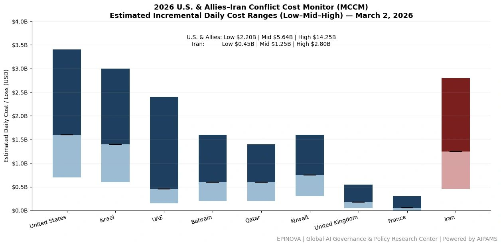
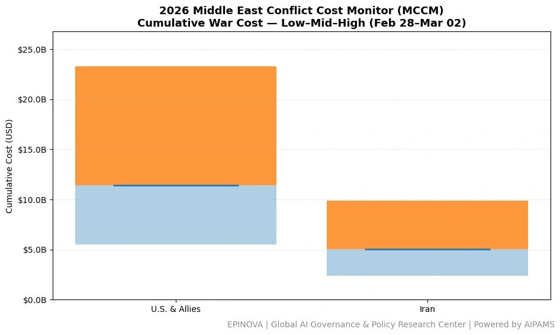
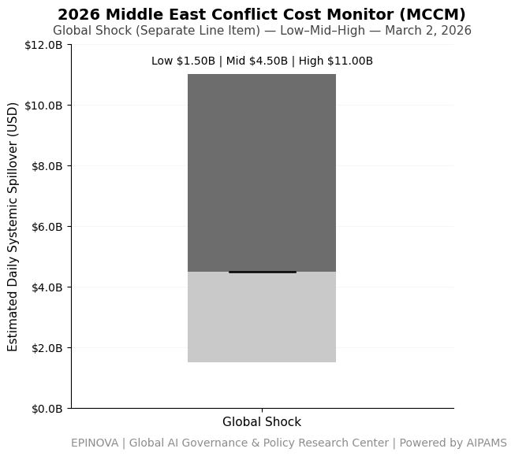

# 2026 U.S. & Allies–Iran Conflict Cost Monitor (MCCM): March 2

Original URL: https://epinova.org/articles/f/2026-us-allies%E2%80%93iran-conflict-cost-monitor-mccm-march-2

Publication date: 2026-03-02

Archive note: This is a locally preserved Markdown copy of an EPINOVA article originally generated through the GoDaddy blog system.

---

[All Posts](<https://epinova.org/articles?blog=y>)

### 2026 U.S. & Allies–Iran Conflict Cost Monitor (MCCM): March 2

March 2, 2026|Global AI Governance & Policy

**Powered by AIPAMS**

  

**Introduction**

The 2026 Middle East Conflict Cost Monitor (MCCM) provides an event-driven, scenario-based assessment of daily conflict-related expenditures and losses across major state actors involved in the crisis. Using a structured low–mid–high estimation framework, the series aggregates publicly available operational indicators, force posture changes, strike intensity proxies, reported material damage, and infrastructure disruptions to produce comparable daily cost ranges.

The framework distinguishes between (1) direct military expenditures and asset losses, (2) infrastructure and energy-sector disruption costs, and (3) systemic market spillovers (“Global Shock”), which are reported separately from war-specific accounts.

MCCM is designed as a rolling monitoring instrument rather than a definitive accounting ledger. All estimates are expressed in current U.S. dollars (USD) and reflect bounded scenario approximations intended for comparative analysis and policy discussion. High-range estimates may incorporate upper-bound scenario adjustments where reported high-value asset losses remain under verification. Estimates are updated as verification improves and may be revised retroactively. 

  

  

**Note:**  
Ranges reflect scenario-bounded estimates. Low = minimum confirmed observable losses. Mid = most probable range based on publicly available reporting and operational cost parameters. High = upper-bound scenario including reported but not independently verified high-value asset losses. Figures exclude Global Shock (systemic market spillovers). All values are incremental (24-hour estimate). 

  

**Note:**

Cumulative totals represent aggregated daily scenario ranges. High range includes scenario-based upper-bound adjustments (e.g., reported strategic asset losses). Figures exclude Global Shock. Values rounded; subject to revision as verification improves. 

  

**Note:**

Global Shock captures systemic market spillovers including energy price volatility, shipping rerouting, insurance risk premia, and airspace disruption. This line item is not included in direct military cost totals. 

  

**Selected References:**

AP News. (2026, March 2). _Gulf carriers resume some flights even as US-Israel strikes and Iran retaliation fuel travel chaos._ Retrieved from [https://apnews.com/article/iran-israel-us-travel-airlines-mideast-flights-93f2559eb57f05989fb1de8fda7f21ec](<https://apnews.com/article/iran-israel-us-travel-airlines-mideast-flights-93f2559eb57f05989fb1de8fda7f21ec?utm_source=chatgpt.com>)   

AP News. (2026, March 2). _Where things stand after the US and Israeli strikes on Iran._ Retrieved from [https://apnews.com/article/iran-trump-israel-war-where-things-stand-e3c003aef4479cd179967a63bb1236f4](<https://apnews.com/article/iran-trump-israel-war-where-things-stand-e3c003aef4479cd179967a63bb1236f4?utm_source=chatgpt.com>)   

Al Jazeera English. (2026, March 2). _What we know on day three of US-Israeli attacks on Iran._ Retrieved from [https://www.aljazeera.com/news/2026/3/2/what-we-know-on-day-three-of-us-israeli-attacks-on-iran](<https://www.aljazeera.com/news/2026/3/2/what-we-know-on-day-three-of-us-israeli-attacks-on-iran?utm_source=chatgpt.com>)   

PBS NewsHour. (2026, March 2). _Live updates: U.S.-Israel conflict with Iran widens._ Retrieved from [https://www.pbs.org/newshour/world/live-updates-u-s-israel-conflict-with-iran-widens](<https://www.pbs.org/newshour/world/live-updates-u-s-israel-conflict-with-iran-widens?utm_source=chatgpt.com>)   

Reuters. (2026, March 2). _Iran war live: Trump says military campaign can last longer than four weeks._ Retrieved from [https://www.reuters.com/world/iran-live-israel-strikes-hezbollah-uk-base-hit-cyprus-conflict-widens-2026-03-02/](<https://www.reuters.com/world/iran-live-israel-strikes-hezbollah-uk-base-hit-cyprus-conflict-widens-2026-03-02/?utm_source=chatgpt.com>)   

CBS News. (2026, March 2). _Trump says Iran operation could take “four weeks or less”; 3 U.S. troops killed._ Retrieved from [https://www.cbsnews.com/live-updates/iran-us-war-day-3-american-deaths-israel-gulf-allies-hit-missile-strikes/](<https://www.cbsnews.com/live-updates/iran-us-war-day-3-american-deaths-israel-gulf-allies-hit-missile-strikes/?utm_source=chatgpt.com>)   

Times of India. (2026, March 2). _Middle East tensions surge: Saudi Arabia summons Iran envoy in escalating Gulf crisis._ Retrieved from [https://timesofindia.indiatimes.com/world/middle-east/middle-east-tensions-surge-saudi-arabia-summons-iran-envoy-in-escalating-gulf-crisis-amid-us-israel-attacks/articleshow/128932382.cms](<https://timesofindia.indiatimes.com/world/middle-east/middle-east-tensions-surge-saudi-arabia-summons-iran-envoy-in-escalating-gulf-crisis-amid-us-israel-attacks/articleshow/128932382.cms?utm_source=chatgpt.com>)   

DW (China.Table reporting). (2026, March 2). _美以袭击伊朗 中国失去中东关键盟友？_ Retrieved from [https://amp.dw.com/zh/%E7%BE%8E%E4%BB%A5%E8%A2%AD%E5%87%BB%E4%BC%8A%E6%9C%97-%E4%B8%AD%E5%9B%BD%E5%A4%B1%E5%8E%BB%E4%B8%AD%E4%B8%9C%E5%85%B3%E9%94%AE%E7%9B%9F%E5%8F%8B/a-76180909](<https://amp.dw.com/zh/%E7%BE%8E%E4%BB%A5%E8%A2%AD%E5%87%BB%E4%BC%8A%E6%9C%97-%E4%B8%AD%E5%9B%BD%E5%A4%B1%E5%8E%BB%E4%B8%AD%E4%B8%9C%E5%85%B3%E9%94%AE%E7%9B%9F%E5%8F%8B/a-76180909?utm_source=chatgpt.com>)   

PRC Ministry of Foreign Affairs. (2026, March 2). _Spokesperson Mao Ning holds regular press conference._ Retrieved from [https://www.mfa.gov.cn/fyrbt_673021/202603/t20260302_11867140.shtml](<https://www.mfa.gov.cn/fyrbt_673021/202603/t20260302_11867140.shtml?utm_source=chatgpt.com>)

Share this post:
