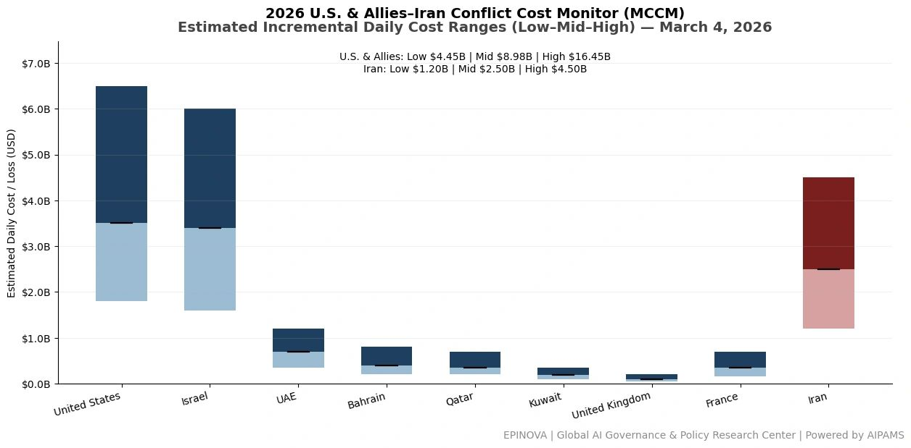
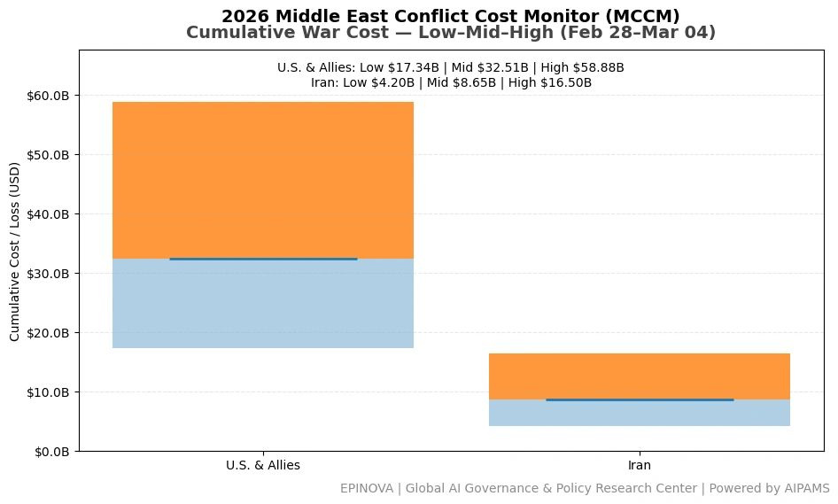
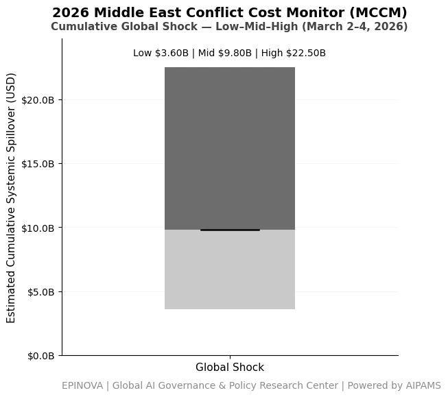

# 2026 U.S. & Allies–Iran Conflict Cost Monitor (MCCM): March 4

Original URL: https://epinova.org/articles/f/2026-us-allies%E2%80%93iran-conflict-cost-monitor-mccm-march-4

Publication date: 2026-03-04

Archive note: This is a locally preserved Markdown copy of an EPINOVA article originally generated through the GoDaddy blog system.

---

[All Posts](<https://epinova.org/articles?blog=y>)

### 2026 U.S. & Allies–Iran Conflict Cost Monitor (MCCM): March 4

March 4, 2026|Global AI Governance & Policy

**Powered by AIPAMS**

  

**Introduction**

The 2026 Middle East Conflict Cost Monitor (MCCM) provides an event-driven, scenario-based assessment of daily conflict-related expenditures and losses across major state actors involved in the crisis. Using a structured low–mid–high estimation framework, the series aggregates publicly available operational indicators, force posture changes, strike intensity proxies, reported material damage, and infrastructure disruptions to produce comparable daily cost ranges.

The framework distinguishes between (1) direct military expenditures and asset losses, (2) infrastructure and energy-sector disruption costs, and (3) systemic market spillovers (“Global Shock”), which are reported separately from war-specific accounts.

MCCM is designed as a rolling monitoring instrument rather than a definitive accounting ledger. All estimates are expressed in current U.S. dollars (USD) and reflect bounded scenario approximations intended for comparative analysis and policy discussion. High-range estimates may incorporate upper-bound scenario adjustments where reported high-value asset losses remain under verification. Estimates are updated as verification improves and may be revised retroactively. 

  

**Note:**  
Ranges reflect scenario-bounded estimates. Low = minimum confirmed observable losses. Mid = most probable range based on publicly available reporting and operational cost parameters. High = upper-bound scenario including reported but not independently verified high-value asset losses. Figures exclude Global Shock (systemic market spillovers). All values are incremental (24-hour estimate). 

  

**Note:**

Cumulative totals represent aggregated daily scenario ranges. High range includes scenario-based upper-bound adjustments (e.g., reported strategic asset losses). Figures exclude Global Shock. Values rounded; subject to revision as verification improves. 

  

**Note:**

Global Shock reflects cumulative systemic spillovers (energy, shipping, insurance, airspace) during the reporting period and is excluded from direct military cost totals. 

  

**Selected References:**

Islamic Revolutionary Guard Corps. (2026, March 4). _Operation True Promise-4 communiqué No. 19._ [https://www.sepahnews.com](<https://www.sepahnews.com/>)

Reuters. (2026, March 4). _Iran says it struck U.S. naval vessels in the Indian Ocean as regional conflict escalates._ <https://www.reuters.com/world/middle-east/iran-says-struck-us-naval-vessels-indian-ocean-2026-03-04>

Associated Press. (2026, March 4). _Iran claims missile strikes on U.S. ships as Israel conflict widens._ <https://apnews.com/article/iran-us-warships-strike-2026>

Al Jazeera. (2026, March 4). _Iran launches new missile waves in Operation True Promise-4 targeting Israeli and U.S. positions._ <https://www.aljazeera.com/news/2026/3/4/iran-launches-new-missile-waves-operation-true-promise-4>

CNN. (2026, March 4). _U.S. forces intercept multiple Iranian missiles as conflict spreads across Middle East._ <https://www.cnn.com/2026/03/04/middleeast/iran-missile-attacks-us-forces-intl>

BBC News. (2026, March 4). _Middle East conflict escalates as Iran launches additional missile barrages._ <https://www.bbc.com/news/world-middle-east-2026>

U.S. Department of Defense. (2026, March 3). _Pentagon statement on force posture adjustments in the Middle East._ <https://www.defense.gov/News/Releases/Release/Article/>

U.S. Central Command. (2026, March 4). _CENTCOM update on ongoing Iranian missile and drone activity in the region._ <https://www.centcom.mil/MEDIA/PRESS-RELEASES>

The New York Times. (2026, March 4). _U.S. deploys additional bombers and naval assets as Iran-Israel conflict widens._ <https://www.nytimes.com/2026/03/04/world/middleeast/us-bombers-middle-east.html>

The Washington Post. (2026, March 4). _Pentagon moves B-2 and B-52 bombers closer to Middle East amid Iran escalation._ <https://www.washingtonpost.com/national-security/2026/03/04/b2-b52-middle-east>

Financial Times. (2026, March 4). _Oil markets surge as Iran-Israel conflict threatens Gulf shipping routes._ <https://www.ft.com/content/middle-east-oil-market-2026>

Bloomberg. (2026, March 4). _Shipping insurers raise risk premiums as Middle East conflict spreads._ <https://www.bloomberg.com/news/articles/2026-03-04/shipping-insurance-premiums-rise-middle-east-war>

U.S. Missile Defense Agency. (2024). _Terminal High Altitude Area Defense (THAAD) system overview._ <https://www.mda.mil/system/thaad.html>

Congressional Budget Office. (2021). _Costs of missile defense systems including THAAD._ <https://www.cbo.gov/publication/57055>

CSIS Missile Defense Project. (2024). _THAAD (Terminal High Altitude Area Defense)._ [https://missilethreat.csis.org/system/thaad/](<https://missilethreat.csis.org/system/thaad/?utm_source=chatgpt.com>)

International Institute for Strategic Studies. (2025). _The Military Balance 2025._ <https://www.iiss.org/publications/the-military-balance>

U.S. Navy. (2024). _Arleigh Burke–class guided missile destroyer fact file._ <https://www.navy.mil/Resources/Fact-Files/Display-FactFiles/Article/2169795/arleigh-burke-class-destroyers>

U.S. Air Force. (2024). _B-2 Spirit bomber fact sheet._ <https://www.af.mil/About-Us/Fact-Sheets/Display/Article/104482/b-2-spirit>

U.S. Air Force. (2024). _B-52 Stratofortress fact sheet._ <https://www.af.mil/About-Us/Fact-Sheets/Display/Article/104465/b-52-stratofortress>

Share this post:
