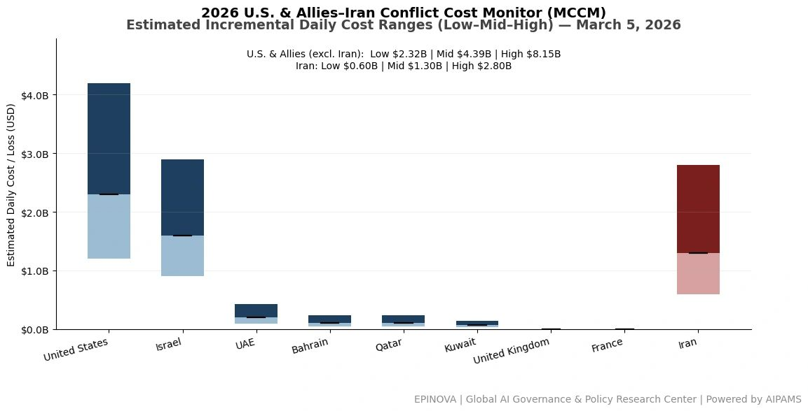
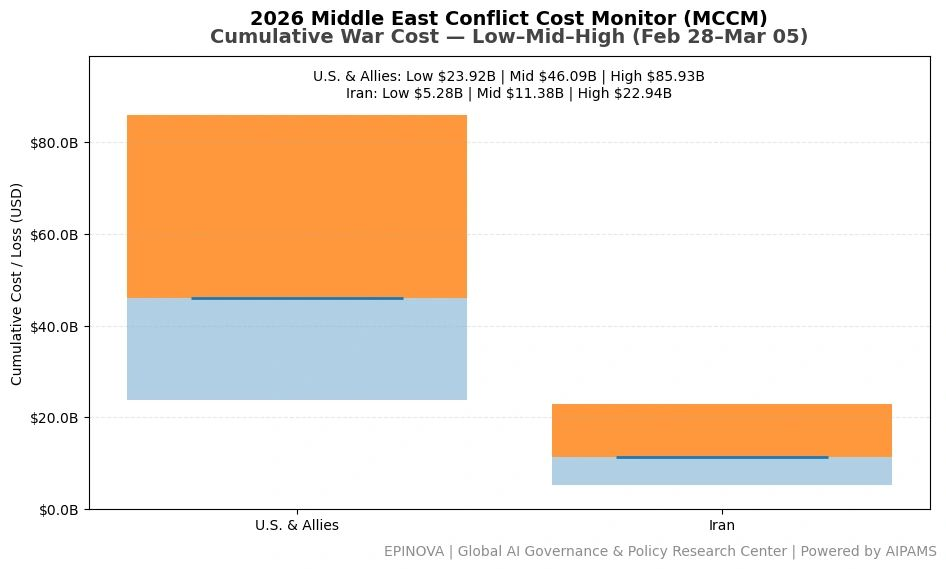
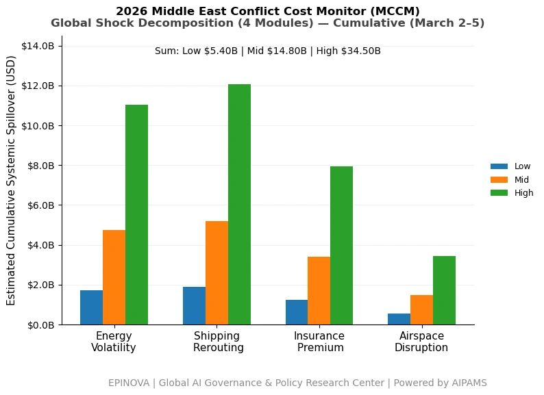

# 2026 U.S. & Allies–Iran Conflict Cost Monitor (MCCM): March 5

Original URL: https://epinova.org/articles/f/2026-us-allies%E2%80%93iran-conflict-cost-monitor-mccm-march-5

Publication date: 2026-03-05

Archive note: This is a locally preserved Markdown copy of an EPINOVA article originally generated through the GoDaddy blog system.

---

[All Posts](<https://epinova.org/articles?blog=y>)

### 2026 U.S. & Allies–Iran Conflict Cost Monitor (MCCM): March 5

March 5, 2026|Global AI Governance & Policy

**Powered by AIPAMS**

  

**Introduction**

The 2026 Middle East Conflict Cost Monitor (MCCM) provides an event-driven, scenario-based assessment of daily conflict-related expenditures and losses across major state actors involved in the crisis. Using a structured low–mid–high estimation framework, the series aggregates publicly available operational indicators, force posture changes, strike intensity proxies, reported material damage, and infrastructure disruptions to produce comparable daily cost ranges.

The framework distinguishes between (1) direct military expenditures and asset losses, (2) infrastructure and energy-sector disruption costs, and (3) systemic market spillovers (“Global Shock”), which are reported separately from war-specific accounts.

MCCM is designed as a rolling monitoring instrument rather than a definitive accounting ledger. All estimates are expressed in current U.S. dollars (USD) and reflect bounded scenario approximations intended for comparative analysis and policy discussion. High-range estimates may incorporate upper-bound scenario adjustments where reported high-value asset losses remain under verification. Estimates are updated as verification improves and may be revised retroactively. 

  

**Note:**  
Ranges reflect scenario-bounded estimates. Low = minimum confirmed observable losses. Mid = most probable range based on publicly available reporting and operational cost parameters. High = upper-bound scenario including reported but not independently verified high-value asset losses. Figures exclude Global Shock (systemic market spillovers). All values are incremental (24-hour estimate). 

  

**Note:**

Cumulative totals represent aggregated daily scenario ranges. High range includes scenario-based upper-bound adjustments (e.g., reported strategic asset losses). Figures exclude Global Shock. Values rounded; subject to revision as verification improves. 

  

**Note:**

Global Shock represents cumulative systemic spillovers during the reporting period and is decomposed into four modules: Energy Volatility, Shipping Rerouting, War-Risk Insurance Premiums, and Airspace Disruption. These modules capture major economic and logistical externalities associated with regional conflict escalation. Global Shock is reported separately and is not included in direct military cost estimates. 

  

**Selected References:**

Al Jazeera. (2026, March 5). _Iran warns it could target Israel’s Dimona nuclear facility if attacks escalate._ <https://www.aljazeera.com/news/2026/3/5/iran-warns-it-could-target-israels-dimona-nuclear-facility-if-attacks-escalate> Accessed March 5, 2026.

Associated Press. (2026, March 5). _Iran claims new missile wave against Israel as regional tensions escalate._ <https://apnews.com/article/iran-israel-missile-strikes-regional-escalation-2026> Accessed March 5, 2026.

BBC News. (2026, March 5). _Explosions reported in Tehran as Israel launches new air strikes._ <https://www.bbc.com/news/world-middle-east-68678102> Accessed March 5, 2026.

CNN. (2026, March 5). _US Navy carrier strike group operates in Mediterranean amid escalating Iran–Israel conflict._ <https://www.cnn.com/2026/03/05/middleeast/us-carrier-strike-group-mediterranean-iran-israel-conflict> Accessed March 5, 2026.

Reuters. (2026, March 5). _Iran says it launched new wave of missiles at Israel as conflict intensifies._ <https://www.reuters.com/world/middle-east/iran-says-it-launched-new-wave-missiles-israel-2026-03-05/> Accessed March 5, 2026.

Reuters. (2026, March 5). _Russia warns attacks on Iran could accelerate nuclear development._ <https://www.reuters.com/world/russia-warns-strikes-iran-could-accelerate-nuclear-development-2026-03-05/> Accessed March 5, 2026.

Reuters. (2026, March 5). _US Navy destroyer fire reported in Arabian Sea during regional tensions._ <https://www.reuters.com/world/middle-east/us-destroyer-fire-arabian-sea-amid-regional-tensions-2026-03-05/> Accessed March 5, 2026.

Tasnim News Agency. (2026, March 5). _IRGC announces new missile operations against Israeli targets._ <https://www.tasnimnews.com/en/news/2026/03/05/irgc-announces-new-missile-operations-against-israel> Accessed March 5, 2026.

Tehran Times. (2026, March 5). _Explosions reported across Tehran amid Israeli air strikes._ <https://www.tehrantimes.com/news/iran-explosions-tehran-israeli-airstrikes> Accessed March 5, 2026.

U.S. Central Command. (2026, March 5). _Carrier strike group operations in support of regional security missions._ <https://www.centcom.mil/MEDIA/PRESS-RELEASES/Press-Release-View/Article/2026/carrier-strike-group-operations-mediterranean/> Accessed March 5, 2026.

U.S. Energy Information Administration. (2026). _Petroleum and other liquids: Spot prices._ <https://www.eia.gov/dnav/pet/pet_pri_spt_s1_d.htm> Accessed March 5, 2026.

Intercontinental Exchange. (2026). _ICE Brent crude futures prices._ <https://www.theice.com/products/219/Brent-Crude-Futures> Accessed March 5, 2026.

Bloomberg. (2026). _Oil market data and energy price indicators._ <https://www.bloomberg.com/energy> Accessed March 5, 2026.

Lloyd’s List. (2026, March 5). _Shipping risk rises in Middle East as conflict intensifies._ <https://lloydslist.maritimeintelligence.informa.com> Accessed March 5, 2026.

Clarksons Research. (2026). _Shipping market intelligence and freight rate indicators._ [https://www.clarksons.net](<https://www.clarksons.net/>) Accessed March 5, 2026.

Baltic Exchange. (2026). _Baltic Dry Index and global freight indicators._ [https://www.balticexchange.com](<https://www.balticexchange.com/>) Accessed March 5, 2026.

中国中央电视台新闻频道. (2026年3月5日). _中东局势持续升级：伊朗称发动新一轮导弹打击，以色列空袭德黑兰目标._ [https://news.cctv.com](<https://news.cctv.com/>) Accessed March 5, 2026.

新华社. (2026年3月5日). _伊朗称对以色列发动新一轮导弹袭击，中东局势持续紧张._ <https://www.xinhuanet.com/world> Accessed March 5, 2026.

环球时报. (2026年3月5日). _伊朗与以色列冲突升级，多地传出爆炸声._ [https://world.huanqiu.com](<https://world.huanqiu.com/>) Accessed March 5, 2026.

极目新闻. (2026年3月5日). _伊朗公布战事进展称对地区目标实施打击._ [https://www.ctdsb.net](<https://www.ctdsb.net/>) Accessed March 5, 2026.

Share this post:
