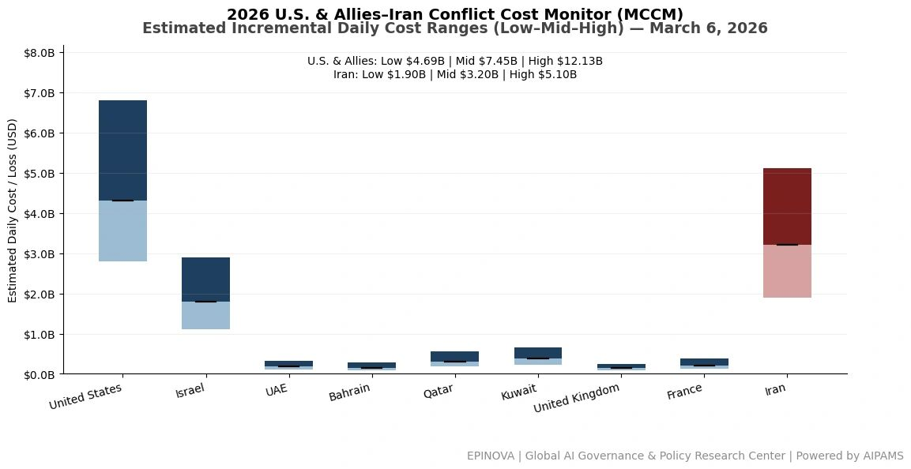
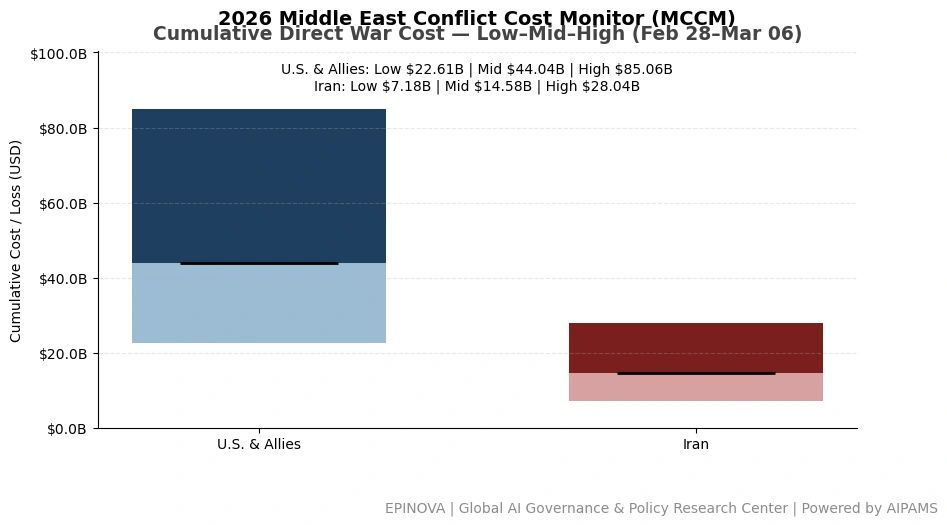
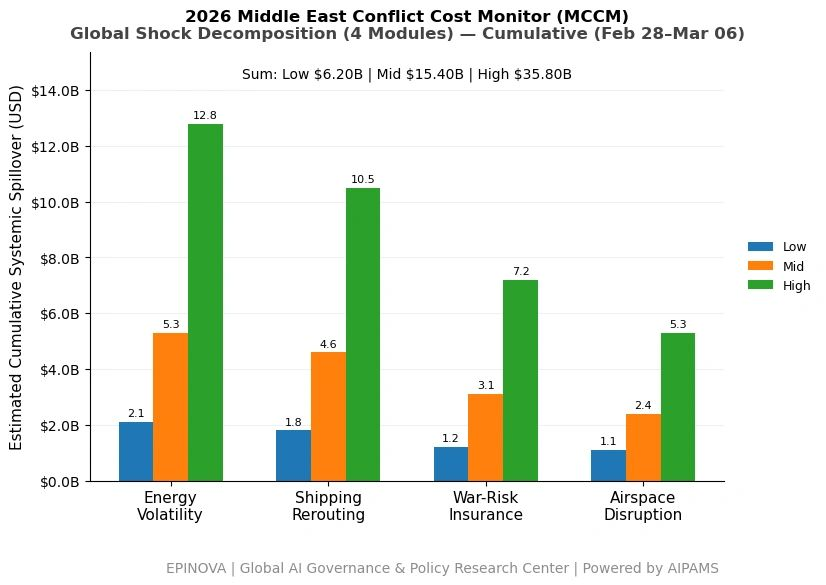

# 2026 U.S. & Allies–Iran Conflict Cost Monitor (MCCM): March 6

Original URL: https://epinova.org/articles/f/2026-us-allies%E2%80%93iran-conflict-cost-monitor-mccm-march-6

Publication date: 2026-03-06

Archive note: This is a locally preserved Markdown copy of an EPINOVA article originally generated through the GoDaddy blog system.

---

[All Posts](<https://epinova.org/articles?blog=y>)

### 2026 U.S. & Allies–Iran Conflict Cost Monitor (MCCM): March 6

March 6, 2026|Global AI Governance & Policy

**Powered by AIPAMS**

  

**Introduction**

The 2026 Middle East Conflict Cost Monitor (MCCM) provides an event-driven, scenario-based assessment of daily conflict-related expenditures and losses across major state actors involved in the crisis. Using a structured low–mid–high estimation framework, the series aggregates publicly available operational indicators, force posture changes, strike intensity proxies, reported material damage, and infrastructure disruptions to produce comparable daily cost ranges.

The framework distinguishes between (1) direct military expenditures and asset losses, (2) infrastructure and energy-sector disruption costs, and (3) systemic market spillovers (“Global Shock”), which are reported separately from war-specific accounts.

MCCM is designed as a rolling monitoring instrument rather than a definitive accounting ledger. All estimates are expressed in current U.S. dollars (USD) and reflect bounded scenario approximations intended for comparative analysis and policy discussion. High-range estimates may incorporate upper-bound scenario adjustments where reported high-value asset losses remain under verification. Estimates are updated as verification improves and may be revised retroactively. 

**Note:**  
Ranges reflect scenario-bounded estimates. Low = minimum confirmed observable losses. Mid = most probable range based on publicly available reporting and operational cost parameters. High = upper-bound scenario including reported but not independently verified high-value asset losses. Figures exclude Global Shock (systemic market spillovers). All values are incremental (24-hour estimate). 

**Note:**

Cumulative totals represent aggregated daily scenario ranges. High range includes scenario-based upper-bound adjustments (e.g., reported strategic asset losses). Figures exclude Global Shock. Values rounded; subject to revision as verification improves. 

**Note:**

Global Shock represents cumulative systemic spillovers during the reporting period and is decomposed into four modules: Energy Volatility, Shipping Rerouting, War-Risk Insurance Premiums, and Airspace Disruption. These modules capture major economic and logistical externalities associated with regional conflict escalation. Global Shock is reported separately and is not included in direct military cost estimates. 

**Selected References:**

Al Jazeera. (2026, March 6). _Iran-Israel war live updates: Regional tensions escalate._ <https://www.aljazeera.com/> Accessed March 6, 2026.

Associated Press. (2026, March 6). _Israel intensifies strikes on Iran-linked targets across the region._ <https://apnews.com/> Accessed March 6, 2026.

BBC News. (2026, March 6). _Iran-Israel conflict: Regional fallout grows._ <https://www.bbc.com/news> Accessed March 6, 2026.

Bloomberg. (2026, March 6). _Oil volatility rises as Iran conflict threatens Strait of Hormuz shipping._ <https://www.bloomberg.com/> Accessed March 6, 2026.

Cankao Xiaoxi. (2026, March 5). _Mei yi yi zhan shi jin ru di liu tian, zui xin dong tai_ [美以伊战事进入第六天，最新动态]. <https://www.cankaoxiaoxi.com/> Accessed March 6, 2026.

Financial Times. (2026, March 6). _Shipping insurers raise war-risk premiums as Gulf conflict widens._ <https://www.ft.com/> Accessed March 6, 2026.

Jimu Xinwen. (2026, March 2). _Yilang: Meiguo zhui zhu Yilake Aierbile lingguan bei cuhui_ [伊朗：美国驻伊拉克埃尔比勒总领馆被摧毁]. <https://www.ctdsb.net/> Accessed March 6, 2026.

International Air Transport Association. (2026). _Airspace disruptions in the Gulf region._ <https://www.iata.org/> Accessed March 6, 2026.

International Energy Agency. (2026). _Oil market volatility and Middle East risk update._ <https://www.iea.org/> Accessed March 6, 2026.

Lloyd’s List. (2026). _War-risk insurance costs rise for vessels transiting the Gulf._ <https://lloydslist.com/> Accessed March 6, 2026.

MarineTraffic. (2026). _Shipping movements and rerouting trends in the Persian Gulf._ <https://www.marinetraffic.com/> Accessed March 6, 2026.

Reuters. (2026, March 2). _Amazon cloud unit flags issues in Bahrain, UAE data centers amid Iran strikes._ [https://www.reuters.com/world/middle-east/amazon-cloud-unit-flags-issues-bahrain-uae-data-centers-amid-iran-strikes-2026-03-02/](<https://www.reuters.com/world/middle-east/amazon-cloud-unit-flags-issues-bahrain-uae-data-centers-amid-iran-strikes-2026-03-02/?utm_source=chatgpt.com>) Accessed March 6, 2026.

Reuters. (2026, March 3). _France sending aircraft carrier to Mediterranean, Macron says._ [https://www.reuters.com/world/france-sending-aircraft-carrier-mediterranean-macron-says-2026-03-03/](<https://www.reuters.com/world/france-sending-aircraft-carrier-mediterranean-macron-says-2026-03-03/?utm_source=chatgpt.com>) Accessed March 6, 2026.

Reuters. (2026, March 4). _Sri Lanka rescues people aboard distressed Iranian ship after reported attack._ [https://www.reuters.com/world/asia-pacific/sri-lanka-rescues-30-people-board-distressed-iranian-ship-foreign-minister-says-2026-03-04/](<https://www.reuters.com/world/asia-pacific/sri-lanka-rescues-30-people-board-distressed-iranian-ship-foreign-minister-says-2026-03-04/?utm_source=chatgpt.com>) Accessed March 6, 2026.

Reuters. (2026, March 6). _Gulf carriers resume limited flights as missile fire fuels uncertainty._ [https://www.reuters.com/world/middle-east/gulf-carriers-resume-limited-flights-missile-fire-fuels-uncertainty-2026-03-06/](<https://www.reuters.com/world/middle-east/gulf-carriers-resume-limited-flights-missile-fire-fuels-uncertainty-2026-03-06/?utm_source=chatgpt.com>) Accessed March 6, 2026.

Reuters. (2026, March 6). _Iran’s Guards challenge Trump to have U.S. Navy escort oil tankers through Strait of Hormuz._ [https://www.reuters.com/world/middle-east/irans-guards-challenges-trump-have-us-navy-escort-oil-tankers-strait-hormuz-2026-03-06/](<https://www.reuters.com/world/middle-east/irans-guards-challenges-trump-have-us-navy-escort-oil-tankers-strait-hormuz-2026-03-06/?utm_source=chatgpt.com>) Accessed March 6, 2026.

Reuters. (2026, March 6). _Israel’s Hezbollah attacks likely to continue beyond Iran war, source says._ [https://www.reuters.com/world/middle-east/israels-hezbollah-attacks-are-likely-continue-beyond-iran-war-source-says-2026-03-06/](<https://www.reuters.com/world/middle-east/israels-hezbollah-attacks-are-likely-continue-beyond-iran-war-source-says-2026-03-06/?utm_source=chatgpt.com>) Accessed March 6, 2026.

Reuters. (2026, March 6). _South Korea, U.S. militaries discuss moving Patriot missiles to Iran war, Seoul says._ [https://www.reuters.com/world/asia-pacific/south-korea-us-militaries-discuss-moving-patriot-missiles-iran-war-seoul-says-2026-03-06/](<https://www.reuters.com/world/asia-pacific/south-korea-us-militaries-discuss-moving-patriot-missiles-iran-war-seoul-says-2026-03-06/?utm_source=chatgpt.com>) Accessed March 6, 2026.

Reuters. (2026, March 6). _Trump says there will be no deal with Iran except unconditional surrender._ [https://www.reuters.com/world/us/trump-says-there-will-be-no-deal-with-iran-except-unconditional-surrender-2026-03-06/](<https://www.reuters.com/world/us/trump-says-there-will-be-no-deal-with-iran-except-unconditional-surrender-2026-03-06/?utm_source=chatgpt.com>) Accessed March 6, 2026.

U.S. Department of Defense. (2026). _Press briefing on U.S. operations in the Middle East._ <https://www.defense.gov/> Accessed March 6, 2026.

Xinhua News Agency. (2026, March 6). _Yilang yu Yiselie chongtu jixu shengji_ [伊朗与以色列冲突继续升级]. <https://www.xinhuanet.com/> Accessed March 6, 2026.

Share this post:
