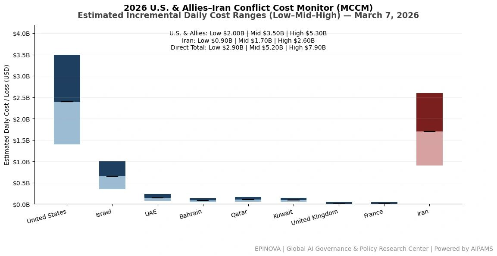
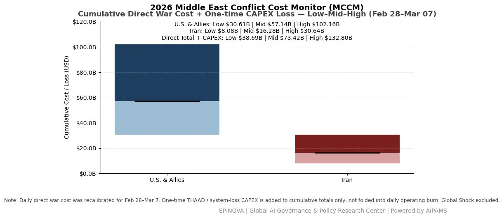
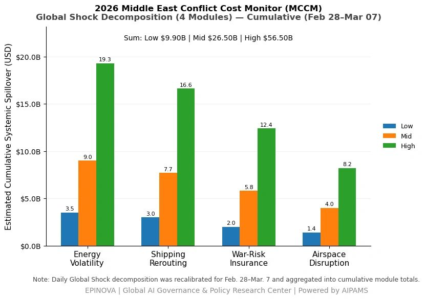

# 2026 U.S. & Allies–Iran Conflict Cost Monitor (MCCM): March 7

Original URL: https://epinova.org/articles/f/2026-us-allies%E2%80%93iran-conflict-cost-monitor-mccm-march-7

Publication date: 2026-03-07

Archive note: This is a locally preserved Markdown copy of an EPINOVA article originally generated through the GoDaddy blog system.

---

[All Posts](<https://epinova.org/articles?blog=y>)

### 2026 U.S. & Allies–Iran Conflict Cost Monitor (MCCM): March 7

March 7, 2026|Global AI Governance & Policy

**Powered by AIPAMS**

  

**Introduction**

The 2026 Middle East Conflict Cost Monitor (MCCM) provides an event-driven, scenario-based assessment of daily conflict-related expenditures and losses across major state actors involved in the crisis. Using a structured low–mid–high estimation framework, the series aggregates publicly available operational indicators, force posture changes, strike intensity proxies, reported material damage, and infrastructure disruptions to produce comparable daily cost ranges.

The framework distinguishes between (1) direct military expenditures and asset losses, (2) infrastructure and energy-sector disruption costs, and (3) systemic market spillovers (“Global Shock”), which are reported separately from war-specific accounts.

MCCM is designed as a rolling monitoring instrument rather than a definitive accounting ledger. All estimates are expressed in current U.S. dollars (USD) and reflect bounded scenario approximations intended for comparative analysis and policy discussion. High-range estimates may incorporate upper-bound scenario adjustments where reported high-value asset losses remain under verification. Estimates are updated as verification improves and may be revised retroactively. 

**Note:**  
Ranges reflect scenario-bounded estimates. Low = minimum confirmed observable losses. Mid = most probable range based on publicly available reporting and operational cost parameters. High = upper-bound scenario including reported but not independently verified high-value asset losses. Figures exclude Global Shock (systemic market spillovers). All values are incremental (24-hour estimate). 

  

**Note:**

Cumulative totals represent aggregated daily scenario ranges. High range includes scenario-based upper-bound adjustments (e.g., reported strategic asset losses). Figures exclude Global Shock. Values rounded; subject to revision as verification improves. 

  

**Note:**

Global Shock represents cumulative systemic spillovers during the reporting period and is decomposed into four modules: Energy Volatility, Shipping Rerouting, War-Risk Insurance Premiums, and Airspace Disruption. These modules capture major economic and logistical externalities associated with regional conflict escalation. Global Shock is reported separately and is not included in direct military cost estimates. 

  

**Selected References:**

Al Jazeera. (2026, March 6). _Iran-Israel war live updates: Regional tensions escalate._ [_https://www.aljazeera.com/_](<https://www.aljazeera.com/>) Accessed March 6, 2026.

Associated Press. (2026, March 6). _Israel intensifies strikes on Iran-linked targets across the region._ [_https://apnews.com/_](<https://apnews.com/>) Accessed March 6, 2026.

BBC News. (2026, March 6). _Iran-Israel conflict: Regional fallout grows._ [_https://www.bbc.com/news_](<https://www.bbc.com/news>) Accessed March 6, 2026.

Bloomberg. (2026, March 6). _Oil volatility rises as Iran conflict threatens Strait of Hormuz shipping._ [_https://www.bloomberg.com/_](<https://www.bloomberg.com/>) Accessed March 6, 2026.

Cankao Xiaoxi. (2026, March 5). _Mei yi yi zhan shi jin ru di liu tian, zui xin dong tai_ [美以伊战事进入第六天，最新动态]. [_https://www.cankaoxiaoxi.com/_](<https://www.cankaoxiaoxi.com/>) Accessed March 6, 2026.

Financial Times. (2026, March 6). _Shipping insurers raise war-risk premiums as Gulf conflict widens._ [_https://www.ft.com/_](<https://www.ft.com/>) Accessed March 6, 2026.

Jimu Xinwen. (2026, March 2). _Yilang: Meiguo zhui zhu Yilake Aierbile lingguan bei cuhui_ [伊朗：美国驻伊拉克埃尔比勒总领馆被摧毁]. [_https://www.ctdsb.net/_](<https://www.ctdsb.net/>) Accessed March 6, 2026.

International Air Transport Association. (2026). _Airspace disruptions in the Gulf region._ [_https://www.iata.org/_](<https://www.iata.org/>) Accessed March 6, 2026.

International Energy Agency. (2026). _Oil market volatility and Middle East risk update._ [_https://www.iea.org/_](<https://www.iea.org/>) Accessed March 6, 2026.

Lloyd’s List. (2026). _War-risk insurance costs rise for vessels transiting the Gulf._ [_https://lloydslist.com/_](<https://lloydslist.com/>) Accessed March 6, 2026.

MarineTraffic. (2026). _Shipping movements and rerouting trends in the Persian Gulf._ [_https://www.marinetraffic.com/_](<https://www.marinetraffic.com/>) Accessed March 6, 2026.

Reuters. (2026, March 2). _Amazon cloud unit flags issues in Bahrain, UAE data centers amid Iran strikes._ [_https://www.reuters.com/world/middle-east/amazon-cloud-unit-flags-issues-bahrain-uae-data-centers-amid-iran-strikes-2026-03-02/_](<https://www.reuters.com/world/middle-east/amazon-cloud-unit-flags-issues-bahrain-uae-data-centers-amid-iran-strikes-2026-03-02/?utm_source=chatgpt.com>) Accessed March 6, 2026.

Reuters. (2026, March 3). _France sending aircraft carrier to Mediterranean, Macron says._ [_https://www.reuters.com/world/france-sending-aircraft-carrier-mediterranean-macron-says-2026-03-03/_](<https://www.reuters.com/world/france-sending-aircraft-carrier-mediterranean-macron-says-2026-03-03/?utm_source=chatgpt.com>) Accessed March 6, 2026.

Reuters. (2026, March 4). _Sri Lanka rescues people aboard distressed Iranian ship after reported attack._ [_https://www.reuters.com/world/asia-pacific/sri-lanka-rescues-30-people-board-distressed-iranian-ship-foreign-minister-says-2026-03-04/_](<https://www.reuters.com/world/asia-pacific/sri-lanka-rescues-30-people-board-distressed-iranian-ship-foreign-minister-says-2026-03-04/?utm_source=chatgpt.com>) Accessed March 6, 2026.

Reuters. (2026, March 6). _Gulf carriers resume limited flights as missile fire fuels uncertainty._ [_https://www.reuters.com/world/middle-east/gulf-carriers-resume-limited-flights-missile-fire-fuels-uncertainty-2026-03-06/_](<https://www.reuters.com/world/middle-east/gulf-carriers-resume-limited-flights-missile-fire-fuels-uncertainty-2026-03-06/?utm_source=chatgpt.com>) Accessed March 6, 2026.

Reuters. (2026, March 6). _Iran’s Guards challenge Trump to have U.S. Navy escort oil tankers through Strait of Hormuz._ [_https://www.reuters.com/world/middle-east/irans-guards-challenges-trump-have-us-navy-escort-oil-tankers-strait-hormuz-2026-03-06/_](<https://www.reuters.com/world/middle-east/irans-guards-challenges-trump-have-us-navy-escort-oil-tankers-strait-hormuz-2026-03-06/?utm_source=chatgpt.com>) Accessed March 6, 2026.

Reuters. (2026, March 6). _Israel’s Hezbollah attacks likely to continue beyond Iran war, source says._ [_https://www.reuters.com/world/middle-east/israels-hezbollah-attacks-are-likely-continue-beyond-iran-war-source-says-2026-03-06/_](<https://www.reuters.com/world/middle-east/israels-hezbollah-attacks-are-likely-continue-beyond-iran-war-source-says-2026-03-06/?utm_source=chatgpt.com>) Accessed March 6, 2026.

Reuters. (2026, March 6). _South Korea, U.S. militaries discuss moving Patriot missiles to Iran war, Seoul says._ [_https://www.reuters.com/world/asia-pacific/south-korea-us-militaries-discuss-moving-patriot-missiles-iran-war-seoul-says-2026-03-06/_](<https://www.reuters.com/world/asia-pacific/south-korea-us-militaries-discuss-moving-patriot-missiles-iran-war-seoul-says-2026-03-06/?utm_source=chatgpt.com>) Accessed March 6, 2026.

Reuters. (2026, March 6). _Trump says there will be no deal with Iran except unconditional surrender._ [_https://www.reuters.com/world/us/trump-says-there-will-be-no-deal-with-iran-except-unconditional-surrender-2026-03-06/_](<https://www.reuters.com/world/us/trump-says-there-will-be-no-deal-with-iran-except-unconditional-surrender-2026-03-06/?utm_source=chatgpt.com>) Accessed March 6, 2026.

U.S. Department of Defense. (2026). _Press briefing on U.S. operations in the Middle East._ [_https://www.defense.gov/_](<https://www.defense.gov/>) Accessed March 6, 2026.

Xinhua News Agency. (2026, March 6). _Yilang yu Yiselie chongtu jixu shengji_ [伊朗与以色列冲突继续升级]. [_https://www.xinhuanet.com/_](<https://www.xinhuanet.com/>) Accessed March 6, 2026. 

Reuters. (2026, March 6). _Iran war: See how tanker traffic collapsed in the Strait of Hormuz_. [https://www.reuters.com/world/middle-east/iran-war-see-how-tanker-traffic-collapsed-strait-hormuz-2026-03-06/](<https://www.reuters.com/world/middle-east/iran-war-see-how-tanker-traffic-collapsed-strait-hormuz-2026-03-06/?utm_source=chatgpt.com>)

Reuters. (2026, March 5). _Shipping insurers raise war-risk premiums as Middle East conflict intensifies_. <https://www.reuters.com/world/middle-east/shipping-insurers-raise-war-risk-premiums-middle-east-conflict-2026-03-05/>

Reuters. (2026, March 4). _Oil prices surge as Middle East conflict escalates and Hormuz shipping disrupted_. <https://www.reuters.com/markets/commodities/oil-prices-surge-middle-east-conflict-hormuz-2026-03-04/>

Reuters. (2026, March 7). _Kuwait declares force majeure at some oil facilities amid regional conflict_. <https://www.reuters.com/world/middle-east/kuwait-declares-force-majeure-oil-facilities-2026-03-07/>

Reuters. (2026, March 2). _Airlines cancel flights as Middle East airspace closes during Iran-Israel escalation_. <https://www.reuters.com/world/middle-east/airlines-cancel-flights-middle-east-airspace-2026-03-02/>

Reuters. (2026, March 3). _Global shipping reroutes as conflict threatens Strait of Hormuz transit_. <https://www.reuters.com/world/middle-east/global-shipping-reroutes-hormuz-conflict-2026-03-03/>

Associated Press. (2026, March 5). _U.S. launches additional strikes as Iran conflict expands across the Gulf_. <https://apnews.com/article/us-iran-war-middle-east-strikes-2026>

Associated Press. (2026, March 7). _Airlines and shipping companies struggle with disruptions across Gulf region_. <https://apnews.com/article/gulf-conflict-shipping-airlines-disruption-2026>

Bloomberg. (2026, March 6). _Oil jumps and tanker rates soar as Middle East war spreads_. <https://www.bloomberg.com/news/articles/2026-03-06/oil-jumps-and-tanker-rates-soar-middle-east-war>

Bloomberg. (2026, March 4). _War-risk insurance premiums surge for ships transiting the Gulf_. <https://www.bloomberg.com/news/articles/2026-03-04/war-risk-premiums-surge-ships-gulf>

Financial Times. (2026, March 6). _Middle East war disrupts global shipping routes and energy markets_. <https://www.ft.com/content/middle-east-war-shipping-energy-markets-2026>

Financial Times. (2026, March 5). _Airspace closures ripple across international aviation networks_. <https://www.ft.com/content/airspace-closures-aviation-middle-east-2026>

International Maritime Organization. (2026, March 6). _Maritime security advisory following attacks in the Strait of Hormuz_. <https://www.imo.org/en/MediaCentre/HotTopics/Pages/Strait-of-Hormuz-security.aspx>

Lloyd’s List. (2026, March 5). _War-risk premiums surge for ships entering the Persian Gulf_. <https://lloydslist.maritimeintelligence.informa.com/>

Clarksons Research. (2026). _Shipping market update: Impact of Middle East conflict on tanker and container markets_. <https://www.clarksons.net/>

International Energy Agency. (2026). _Oil market report: Supply risks amid Middle East conflict_. <https://www.iea.org/reports/oil-market-report>

U.S. Department of Defense. (2026). _Statements and briefings on U.S. operations in the Middle East_. <https://www.defense.gov/News/>

U.S. Central Command. (2026). _Operational updates on regional security and maritime activity_. <https://www.centcom.mil/Media/>

White House. (2026). _Statements and releases related to Operation Epic Fury and Middle East security developments_. <https://www.whitehouse.gov/>

Al Jazeera. (2026, March 7). _Iran claims new wave of strikes against Israeli and U.S. targets_. <https://www.aljazeera.com/news/2026/03/07/iran-new-wave-strikes>

BBC News. (2026, March 6). _Gulf conflict disrupts oil shipping and global markets_. <https://www.bbc.com/news/world-middle-east-2026>

CNN. (2026, March 7). _Trump warns Iran of further strikes as Middle East war escalates_. <https://www.cnn.com/2026/03/07/politics/trump-iran-warning>

The Washington Post. (2026, March 7). _U.S. Army cancels Fort Bragg exercise as Middle East tensions rise_. <https://www.washingtonpost.com/national-security/2026/03/07/us-army-exercise-cancelled-middle-east/>

The Guardian. (2026, March 7). _UK carrier HMS Prince of Wales prepares for potential Middle East deployment_. <https://www.theguardian.com/world/2026/mar/07/uk-carrier-prince-of-wales-middle-east-deployment>

Share this post:
