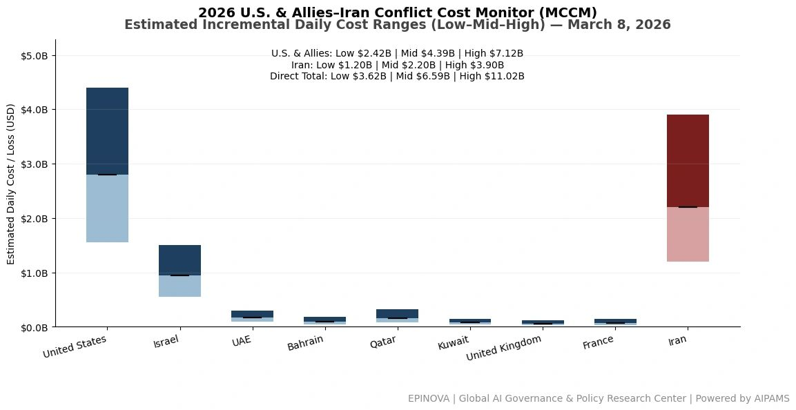
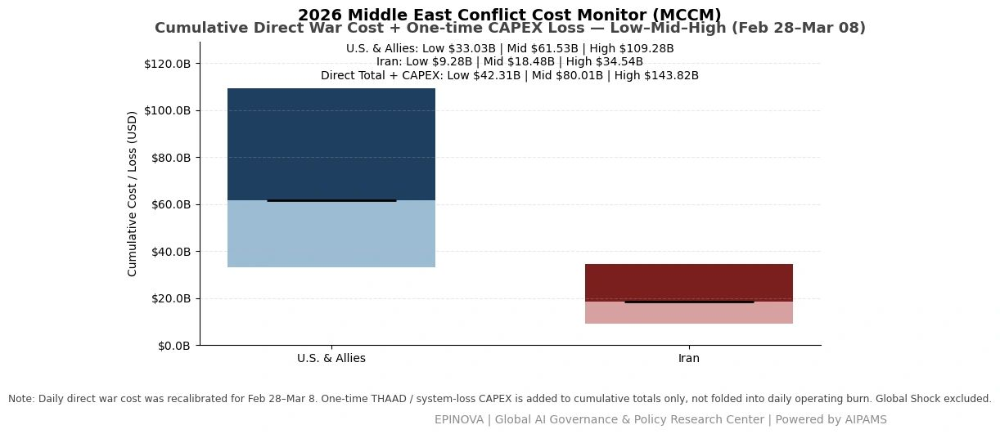
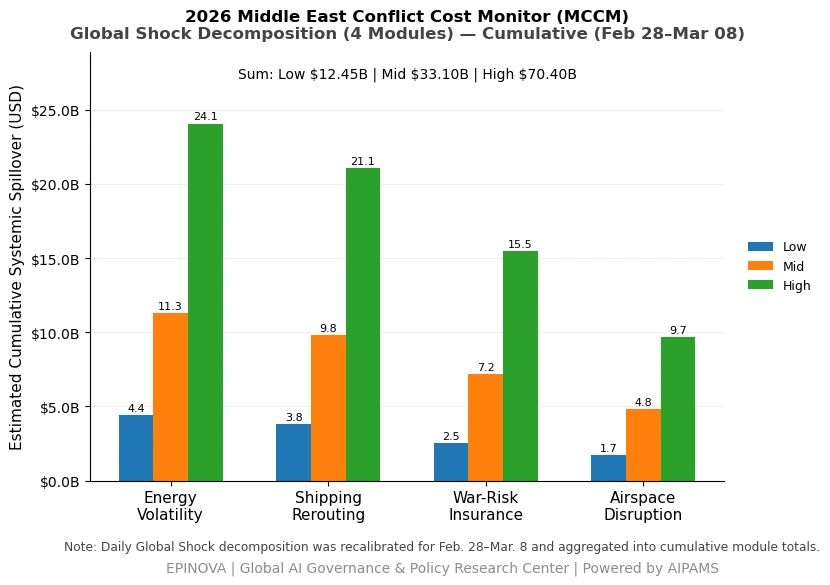

# 2026 U.S. & Allies–Iran Conflict Cost Monitor (MCCM): March 8

Original URL: https://epinova.org/articles/f/2026-us-allies%E2%80%93iran-conflict-cost-monitor-mccm-march-8

Publication date: 2026-03-08

Archive note: This is a locally preserved Markdown copy of an EPINOVA article originally generated through the GoDaddy blog system.

---

[All Posts](<https://epinova.org/articles?blog=y>)

### 2026 U.S. & Allies–Iran Conflict Cost Monitor (MCCM): March 8

March 8, 2026|Global AI Governance & Policy

**Powered by AIPAMS**

  

**Introduction**

The 2026 Middle East Conflict Cost Monitor (MCCM) provides an event-driven, scenario-based assessment of daily conflict-related expenditures and losses across major state actors involved in the crisis. Using a structured low–mid–high estimation framework, the series aggregates publicly available operational indicators, force posture changes, strike intensity proxies, reported material damage, and infrastructure disruptions to produce comparable daily cost ranges.

The framework distinguishes between (1) direct military expenditures and asset losses, (2) infrastructure and energy-sector disruption costs, and (3) systemic market spillovers (“Global Shock”), which are reported separately from war-specific accounts.

MCCM is designed as a rolling monitoring instrument rather than a definitive accounting ledger. All estimates are expressed in current U.S. dollars (USD) and reflect bounded scenario approximations intended for comparative analysis and policy discussion. High-range estimates may incorporate upper-bound scenario adjustments where reported high-value asset losses remain under verification. Estimates are updated as verification improves and may be revised retroactively. 

  

**Note:**  
Ranges reflect scenario-bounded estimates. Low = minimum confirmed observable losses. Mid = most probable range based on publicly available reporting and operational cost parameters. High = upper-bound scenario including reported but not independently verified high-value asset losses. Figures exclude Global Shock (systemic market spillovers). All values are incremental (24-hour estimate). 

  

**Note:**

Cumulative totals represent aggregated daily scenario ranges. High range includes scenario-based upper-bound adjustments (e.g., reported strategic asset losses). Figures exclude Global Shock. Values rounded; subject to revision as verification improves. 

  

**Note:**

Global Shock represents cumulative systemic spillovers during the reporting period and is decomposed into four modules: Energy Volatility, Shipping Rerouting, War-Risk Insurance Premiums, and Airspace Disruption. These modules capture major economic and logistical externalities associated with regional conflict escalation. Global Shock is reported separately and is not included in direct military cost estimates. 

  

**Selected References:**

Al Jazeera. (2026, March 8). _Iran launches new wave of missiles toward Israel as regional tensions escalate_.  
<https://www.aljazeera.com/news/2026/03/08/iran-launches-new-wave-of-missiles-toward-israel>

Associated Press. (2026, March 8). _Iran fires missiles at U.S. bases in Gulf as conflict enters second week_.  
<https://apnews.com/article/iran-missiles-us-bases-middle-east-conflict>

BBC News. (2026, March 8). _Middle East conflict: Iran launches further attacks as tensions widen_.  
<https://www.bbc.com/news/world-middle-east>

Bloomberg. (2026, March 8). _Oil volatility intensifies as U.S.–Iran conflict threatens Hormuz shipping_.  
<https://www.bloomberg.com/news/articles/2026-03-08/oil-volatility-middle-east-conflict>

Center for Strategic and International Studies. (2024). _Missile defense and regional security in the Middle East_.  
<https://www.csis.org/analysis/missile-defense-and-regional-security-middle-east>

Clarksons Research. (2025). _Shipping market outlook and war-risk insurance trends_.  
[https://www.clarksons.net](<https://www.clarksons.net/>)

International Energy Agency. (2024). _Oil market report_.  
<https://www.iea.org/reports/oil-market-report>

International Monetary Fund. (2024). _World economic outlook database_.  
<https://www.imf.org/en/Publications/WEO/weo-database>

International Maritime Organization. (2024). _Shipping disruption and maritime risk monitoring_.  
[https://www.imo.org](<https://www.imo.org/>)

Jane’s Defence Weekly. (2026, March 8). _Missile exchanges intensify in Gulf region as conflict escalates_.  
<https://www.janes.com/defence-news>

Lloyd’s List. (2026, March 8). _War-risk insurance premiums surge amid Middle East conflict_.  
[https://lloydslist.maritimeintelligence.informa.com](<https://lloydslist.maritimeintelligence.informa.com/>)

MarineTraffic. (2026). _Global tanker movement data_.  
[https://www.marinetraffic.com](<https://www.marinetraffic.com/>)

Reuters. (2026, March 8). _Iran launches missiles toward Israel and U.S. bases as war enters ninth day_.  
<https://www.reuters.com/world/middle-east>

Reuters. (2026, March 8). _Oil prices rise amid fears of Hormuz disruption_.  
<https://www.reuters.com/markets/commodities>

Strait Times. (2026, March 8). _Asian governments monitor Middle East war risks and shipping disruptions_.  
[https://www.straitstimes.com](<https://www.straitstimes.com/>)

United Nations Conference on Trade and Development. (2024). _Review of maritime transport_.  
<https://unctad.org/publication/review-maritime-transport>

United States Department of Defense. (2026, March 8). _Statement on regional security developments_.  
[https://www.defense.gov](<https://www.defense.gov/>)

White House. (2026, March 8). _Statement by the President on Middle East security developments_.  
<https://www.whitehouse.gov/briefing-room/statements-releases>

World Bank. (2024). _Global economic prospects_.  
<https://www.worldbank.org/en/publication/global-economic-prospects>

Share this post:
