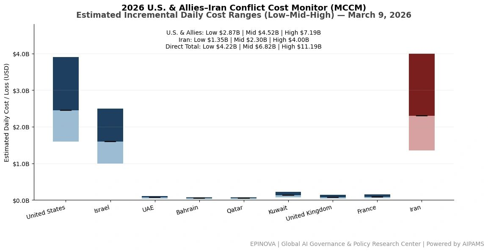
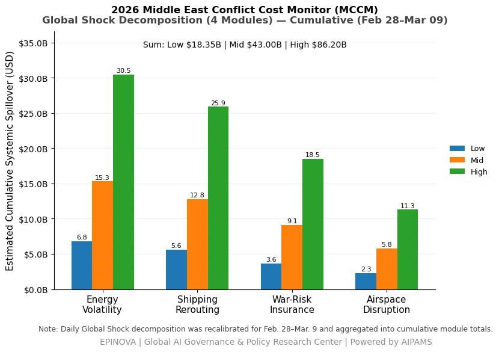

# 2026 U.S. & Allies–Iran Conflict Cost Monitor (MCCM): March 9

Original URL: https://epinova.org/articles/f/2026-us-allies%E2%80%93iran-conflict-cost-monitor-mccm-march-9

Publication date: 2026-03-09

Archive note: This is a locally preserved Markdown copy of an EPINOVA article originally generated through the GoDaddy blog system.

---

[All Posts](<https://epinova.org/articles?blog=y>)

### 2026 U.S. & Allies–Iran Conflict Cost Monitor (MCCM): March 9

March 9, 2026|Global AI Governance & Policy

**Powered by AIPAMS**

  

**Introduction**

The 2026 Middle East Conflict Cost Monitor (MCCM) provides an event-driven, scenario-based assessment of daily conflict-related expenditures and losses across major state actors involved in the crisis. Using a structured low–mid–high estimation framework, the series aggregates publicly available operational indicators, force posture changes, strike intensity proxies, reported material damage, and infrastructure disruptions to produce comparable daily cost ranges.

The framework distinguishes between (1) direct military expenditures and asset losses, (2) infrastructure and energy-sector disruption costs, and (3) systemic market spillovers (“Global Shock”), which are reported separately from war-specific accounts.

MCCM is designed as a rolling monitoring instrument rather than a definitive accounting ledger. All estimates are expressed in current U.S. dollars (USD) and reflect bounded scenario approximations intended for comparative analysis and policy discussion. High-range estimates may incorporate upper-bound scenario adjustments where reported high-value asset losses remain under verification. Estimates are updated as verification improves and may be revised retroactively. 

  

**Note:**  
Ranges reflect scenario-bounded estimates. Low = minimum confirmed observable losses. Mid = most probable range based on publicly available reporting and operational cost parameters. High = upper-bound scenario including reported but not independently verified high-value asset losses. Figures exclude Global Shock (systemic market spillovers). All values are incremental (24-hour estimate). 

  

**Note:**

Cumulative totals represent aggregated daily scenario ranges. High range includes scenario-based upper-bound adjustments (e.g., reported strategic asset losses). Figures exclude Global Shock. Values rounded; subject to revision as verification improves. 

  

**Note:**

Global Shock represents cumulative systemic spillovers during the reporting period and is decomposed into four modules: Energy Volatility, Shipping Rerouting, War-Risk Insurance Premiums, and Airspace Disruption. These modules capture major economic and logistical externalities associated with regional conflict escalation. Global Shock is reported separately and is not included in direct military cost estimates. 

  

**Selected References:**

Al Jazeera. (2026, March 1–9). _Israel–Iran conflict updates and live news coverage_.  
[https://www.aljazeera.com](<https://www.aljazeera.com/>)

Associated Press. (2026). _Israel–Iran war: missile strikes, regional escalation and military responses_.  
[https://apnews.com](<https://apnews.com/>)

BBC News. (2026). _Israel–Iran conflict: strikes across the Middle East_.  
<https://www.bbc.com/news>

Birol, F. (2026). _IEA emergency oil stock release discussions amid Middle East crisis_. International Energy Agency.  
[https://www.iea.org](<https://www.iea.org/>)

Bloomberg. (2026). _Oil prices surge as Israel–Iran war threatens Gulf energy flows_.  
[https://www.bloomberg.com](<https://www.bloomberg.com/>)

Center for Strategic and International Studies (CSIS). (2024). _Missile defense cost and interceptor economics_.  
[https://www.csis.org](<https://www.csis.org/>)

Defense News. (2026). _U.S. missile defense intercept costs and operational capacity_.  
[https://www.defensenews.com](<https://www.defensenews.com/>)

Financial Times. (2026, March 9). _G7 considers emergency oil reserve release amid Iran war_.  
[https://www.ft.com](<https://www.ft.com/>)

FlightGlobal. (2025). _Israeli Air Force strike capability and aircraft fleet composition_.  
[https://www.flightglobal.com](<https://www.flightglobal.com/>)

Global Times. (2026). _Middle East tensions escalate as Israel strikes Iran targets_.  
[https://www.globaltimes.cn](<https://www.globaltimes.cn/>)

International Energy Agency. (2023). _Oil market report and strategic petroleum reserves_.  
<https://www.iea.org/reports/oil-market-report>

Jane’s Defence Weekly. (2024). _Iran missile capabilities and regional strike ranges_.  
[https://www.janes.com](<https://www.janes.com/>)

Jane’s Intelligence Review. (2025). _Regional missile balance in the Middle East_.  
[https://www.janes.com](<https://www.janes.com/>)

Lloyd’s List Intelligence. (2026). _Shipping rerouting and tanker traffic through the Strait of Hormuz_.  
[https://lloydslist.maritimeintelligence.informa.com](<https://lloydslist.maritimeintelligence.informa.com/>)

MarineTraffic. (2026). _Tanker traffic analysis and AIS shipping movements_.  
[https://www.marinetraffic.com](<https://www.marinetraffic.com/>)

New York Times. (2026). _Israel strikes Iran as regional war intensifies_.  
[https://www.nytimes.com](<https://www.nytimes.com/>)

Reuters. (2026). _Israel–Iran war: missile exchanges, energy market impacts, and regional escalation_.  
[https://www.reuters.com](<https://www.reuters.com/>)

South China Morning Post. (2026). _Middle East conflict and implications for Asia security_.  
[https://www.scmp.com](<https://www.scmp.com/>)

Stockholm International Peace Research Institute (SIPRI). (2024). _Military expenditure database_.  
[https://www.sipri.org](<https://www.sipri.org/>)

The Guardian. (2026). _Israel launches air strikes across Iran amid widening war_.  
[https://www.theguardian.com](<https://www.theguardian.com/>)

The Washington Post. (2026). _U.S. and allies respond to escalating Iran conflict_.  
[https://www.washingtonpost.com](<https://www.washingtonpost.com/>)

U.S. Department of Defense. (2025). _Missile defense agency budget overview_.  
[https://www.defense.gov](<https://www.defense.gov/>)

U.S. Energy Information Administration. (2025). _Global oil supply and strategic reserves_.  
[https://www.eia.gov](<https://www.eia.gov/>)

U.S. Navy Institute (USNI News). (2026). _U.S. naval posture in the Middle East amid Iran conflict_.  
[https://news.usni.org](<https://news.usni.org/>)

Wall Street Journal. (2026). _Oil markets and shipping disruptions during the Iran conflict_.  
<https://www.wsj.com>

Yonhap News Agency. (2026, March 9). _South Korea and U.S. launch Freedom Shield military exercise_.  
[https://en.yna.co.kr](<https://en.yna.co.kr/>)

Israeli Channel 12 News. (2026). _Israel prepares for extended conflict with Iran_.  
<https://www.mako.co.il/news-channel12>

Iran Ministry of Foreign Affairs. (2026). _Official statements regarding missile incidents involving Turkey, Azerbaijan, and Cyprus_.  
[https://www.mfa.gov.ir](<https://www.mfa.gov.ir/>)

Share this post:
