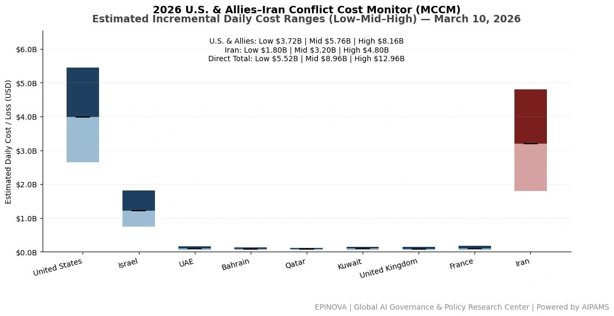
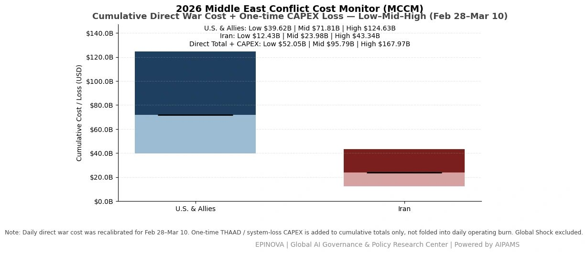
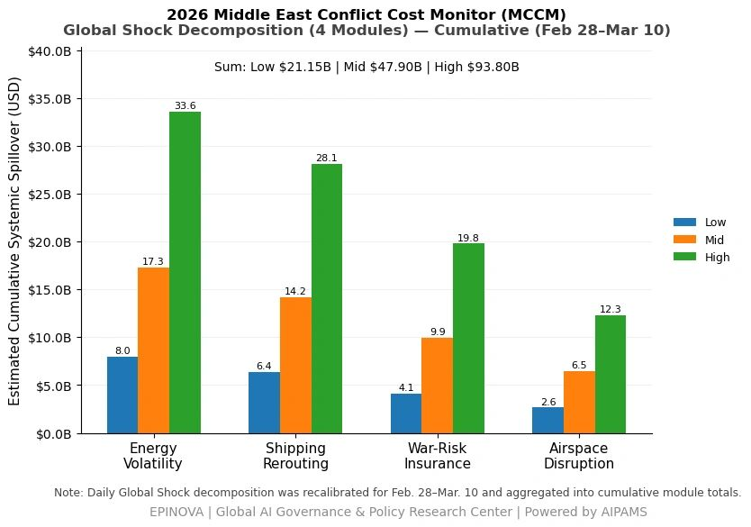

# 2026 U.S. & Allies–Iran Conflict Cost Monitor (MCCM): March 10

Original URL: https://epinova.org/articles/f/2026-us-allies%E2%80%93iran-conflict-cost-monitor-mccm-march-10

Publication date: 2026-03-10

Archive note: This is a locally preserved Markdown copy of an EPINOVA article originally generated through the GoDaddy blog system.

---

[All Posts](<https://epinova.org/articles?blog=y>)

### 2026 U.S. & Allies–Iran Conflict Cost Monitor (MCCM): March 10

March 10, 2026|Global AI Governance & Policy

**Powered by AIPAMS**

  

**Introduction**

The 2026 Middle East Conflict Cost Monitor (MCCM) provides an event-driven, scenario-based assessment of daily conflict-related expenditures and losses across major state actors involved in the crisis. Using a structured low–mid–high estimation framework, the series aggregates publicly available operational indicators, force posture changes, strike intensity proxies, reported material damage, and infrastructure disruptions to produce comparable daily cost ranges.

The framework distinguishes between (1) direct military expenditures and asset losses, (2) infrastructure and energy-sector disruption costs, and (3) systemic market spillovers (“Global Shock”), which are reported separately from war-specific accounts.

MCCM is designed as a rolling monitoring instrument rather than a definitive accounting ledger. All estimates are expressed in current U.S. dollars (USD) and reflect bounded scenario approximations intended for comparative analysis and policy discussion. High-range estimates may incorporate upper-bound scenario adjustments where reported high-value asset losses remain under verification. Estimates are updated as verification improves and may be revised retroactively. 

  

**Note:**  
Ranges reflect scenario-bounded estimates. Low = minimum confirmed observable losses. Mid = most probable range based on publicly available reporting and operational cost parameters. High = upper-bound scenario including reported but not independently verified high-value asset losses. Figures exclude Global Shock (systemic market spillovers). All values are incremental (24-hour estimate). 

  

**Note:**

Cumulative totals represent aggregated daily scenario ranges. High range includes scenario-based upper-bound adjustments (e.g., reported strategic asset losses). Figures exclude Global Shock. Values rounded; subject to revision as verification improves. 

  

**Note:**

Global Shock represents cumulative systemic spillovers during the reporting period and is decomposed into four modules: Energy Volatility, Shipping Rerouting, War-Risk Insurance Premiums, and Airspace Disruption. These modules capture major economic and logistical externalities associated with regional conflict escalation. Global Shock is reported separately and is not included in direct military cost estimates. 

  

**Selected References:**

Al Jazeera. (2026). _Iran launches missile attacks on U.S. and allied positions following strikes on Iranian territory._  
<https://www.aljazeera.com/news/>

Armbrust, M., Fox, A., Griffith, R., Joseph, A. D., Katz, R., Konwinski, A., Lee, G., Patterson, D., Rabkin, A., Stoica, I., & Zaharia, M. (2010). A view of cloud computing. _Communications of the ACM, 53_(4), 50–58.  
<https://doi.org/10.1145/1721654.1721672>

BBC News. (2026). _U.S. and Israel strike Iranian targets as regional tensions escalate._  
<https://www.bbc.com/news>

Bilmes, L. J., & Stiglitz, J. E. (2008). _The three trillion dollar war: The true cost of the Iraq conflict._ W. W. Norton & Company.  
<https://wwnorton.com/books/9780393334173>

Bloomberg. (2026). _Oil markets react to Middle East conflict and risks to Hormuz shipping._  
[https://www.bloomberg.com](<https://www.bloomberg.com/>)

Center for Strategic and International Studies. (2024). _Missile defense and regional security architecture in the Middle East._  
<https://www.csis.org/analysis>

Clark, B., Patt, D., & Walton, T. (2021). _Implementing decision-centric warfare._ Center for Strategic and Budgetary Assessments.  
<https://csbaonline.org/research/publications/implementing-decision-centric-warfare>

Farrell, H., & Newman, A. L. (2019). Weaponized interdependence: How global economic networks shape state coercion. _International Security, 44_(1), 42–79.  
<https://doi.org/10.1162/isec_a_00351>

Financial Times. (2026). _Shipping insurers raise war-risk premiums as Middle East conflict intensifies._  
[https://www.ft.com](<https://www.ft.com/>)

International Energy Agency. (2024). _Oil market report._  
<https://www.iea.org/reports/oil-market-report>

International Monetary Fund. (2023). _Global financial stability report._  
<https://www.imf.org/en/Publications/GFSR>

International Monetary Fund. (2024). _World economic outlook database._  
<https://www.imf.org/en/Publications/WEO>

International Transport Forum. (2023). _Global maritime transport outlook._  
<https://www.itf-oecd.org/global-maritime-transport-outlook>

Lloyd’s List. (2026). _War-risk insurance premiums surge amid Red Sea and Gulf security threats._  
[https://lloydslist.maritimeintelligence.informa.com](<https://lloydslist.maritimeintelligence.informa.com/>)

MarineTraffic. (2026). _Global tanker traffic patterns and disruptions in the Persian Gulf._  
[https://www.marinetraffic.com](<https://www.marinetraffic.com/>)

Nordhaus, W. (2002). _The economic consequences of a war with Iraq._ Yale University.  
<https://cowles.yale.edu/sites/default/files/files/pub/d13/d1387.pdf>

Reuters. (2026). _Iran launches missile attacks after U.S.–Israeli strikes on Iranian facilities._  
[https://www.reuters.com](<https://www.reuters.com/?utm_source=chatgpt.com>)

Reuters. (2026). _Global oil prices surge amid fears of supply disruptions in the Strait of Hormuz._  
<https://www.reuters.com/markets/commodities/>

Stockholm International Peace Research Institute. (2024). _SIPRI military expenditure database._  
<https://www.sipri.org/databases/milex>

U.S. Department of Defense. (2026). _Press briefing on U.S. operations in the Middle East._  
<https://www.defense.gov/News/Transcripts/>

U.S. Energy Information Administration. (2024). _The Strait of Hormuz is the world’s most important oil transit chokepoint._  
<https://www.eia.gov/international/analysis/regions-of-interest/Strait_of_Hormuz.php>

U.S. Energy Information Administration. (2025). _International petroleum supply statistics._  
<https://www.eia.gov/international/>

White House. (2026). _Statements and releases regarding U.S. military operations in the Middle East._  
<https://www.whitehouse.gov/briefing-room/>

World Bank. (2024). _Global economic prospects._  
<https://www.worldbank.org/en/publication/global-economic-prospects>

World Trade Organization. (2024). _Global trade outlook and statistics._  
<https://www.wto.org/english/res_e/statis_e/wto_trade_outlook_e.htm>

Share this post:
