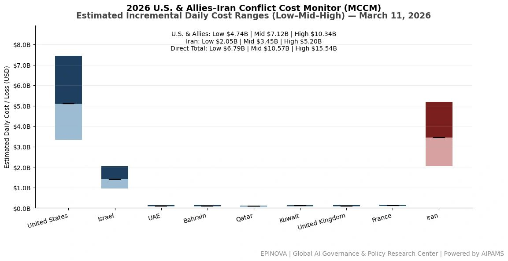
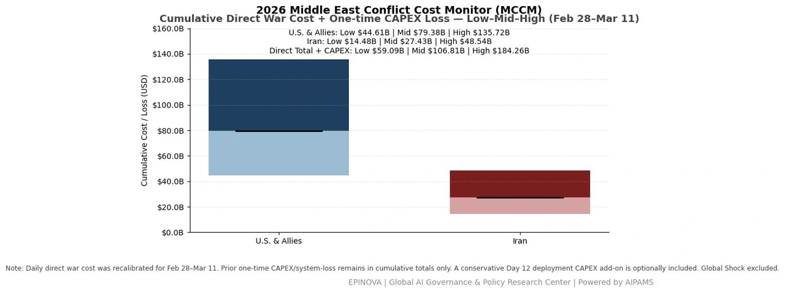
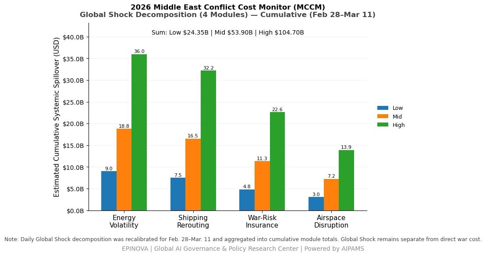

# 2026 U.S. & Allies–Iran Conflict Cost Monitor (MCCM): March 11

Original URL: https://epinova.org/articles/f/2026-us-allies%E2%80%93iran-conflict-cost-monitor-mccm-march-11

Publication date: 2026-03-11

Archive note: This is a locally preserved Markdown copy of an EPINOVA article originally generated through the GoDaddy blog system.

---

[All Posts](<https://epinova.org/articles?blog=y>)

### 2026 U.S. & Allies–Iran Conflict Cost Monitor (MCCM): March 11

March 11, 2026|Global AI Governance & Policy

**Powered by AIPAMS**

  

**Introduction**

The 2026 Middle East Conflict Cost Monitor (MCCM) provides an event-driven, scenario-based assessment of daily conflict-related expenditures and losses across major state actors involved in the crisis. Using a structured low–mid–high estimation framework, the series aggregates publicly available operational indicators, force posture changes, strike intensity proxies, reported material damage, and infrastructure disruptions to produce comparable daily cost ranges.

The framework distinguishes between (1) direct military expenditures and asset losses, (2) infrastructure and energy-sector disruption costs, and (3) systemic market spillovers (“Global Shock”), which are reported separately from war-specific accounts.

MCCM is designed as a rolling monitoring instrument rather than a definitive accounting ledger. All estimates are expressed in current U.S. dollars (USD) and reflect bounded scenario approximations intended for comparative analysis and policy discussion. High-range estimates may incorporate upper-bound scenario adjustments where reported high-value asset losses remain under verification. Estimates are updated as verification improves and may be revised retroactively. 

  

**Note:**  
Ranges reflect scenario-bounded estimates. Low = minimum confirmed observable losses. Mid = most probable range based on publicly available reporting and operational cost parameters. High = upper-bound scenario including reported but not independently verified high-value asset losses. Figures exclude Global Shock (systemic market spillovers). All values are incremental (24-hour estimate). 

  

**Note:**

Cumulative totals represent aggregated daily scenario ranges. High range includes scenario-based upper-bound adjustments (e.g., reported strategic asset losses). Figures exclude Global Shock. Values rounded; subject to revision as verification improves. 

  

**Note:**

Global Shock represents cumulative systemic spillovers during the reporting period and is decomposed into four modules: Energy Volatility, Shipping Rerouting, War-Risk Insurance Premiums, and Airspace Disruption. These modules capture major economic and logistical externalities associated with regional conflict escalation. Global Shock is reported separately and is not included in direct military cost estimates. 

  

**Selected References:**

Al Jazeera. (2026, March 10). _Iran war updates: Tehran chides “Operation Epic Mistake” devised by Israel_.  
<https://www.aljazeera.com/news/liveblog/2026/3/10/iran-war-live-trump-says-conflict-will-be-over-soon-40-killed-in-tehran>

Bloomberg News. (2026, March 10). _Israel plans $13 billion defense budget increase to fund war with Iran_. Bloomberg.  
<https://www.bloomberg.com/news/articles/2026-03-10/netanyahu-s-cabinet-to-expand-budget-by-13-billion-to-fund-war>

Reuters. (2026, February 13). _Trump says Iran regime change could be “best thing” as second carrier heads to Middle East_.  
<https://www.reuters.com/business/aerospace-defense/second-us-aircraft-carrier-head-middle-east-amid-iran-tensions-us-media-reports-2026-02-13/>

Reuters. (2026, March 6). _Maritime insurance premiums surge as Iran conflict widens_.  
<https://www.reuters.com/world/middle-east/maritime-insurance-premiums-surge-iran-conflict-widens-2026-03-06/>

Reuters. (2026, March 10). _Airlines raise fares as Middle East conflict lifts fuel costs and disrupts flights_.  
<https://www.reuters.com/world/middle-east/airlines-begin-hike-fares-due-higher-fuel-prices-shares-stabilise-2026-03-10/>

Reuters. (2026, March 10). _Oil dives, settles down 11% after Trump predicts Middle East de-escalation_.  
<https://www.reuters.com/business/energy/oil-falls-over-6-trump-predicts-middle-east-de-escalation-2026-03-10/>

Reuters. (2026, March 10). _South Korea says it can deter threats if U.S. weapons are redeployed to the Middle East_.  
<https://www.reuters.com/world/asia-pacific/south-korea-president-says-cant-stop-us-forces-redeploying-weapons-2026-03-10/>

Reuters. (2026, March 10). _Tuesday will be most intense day of strikes on Iran, Hegseth says_.  
<https://www.reuters.com/world/tuesday-will-be-most-intense-day-strikes-iran-hegseth-says-2026-03-10/>

Reuters. (2026, March 10). _What are the challenges in securing shipping through the Strait of Hormuz?_  
<https://www.reuters.com/business/energy/what-are-challenges-securing-shipping-through-strait-hormuz-2026-03-10/>

Share this post:
