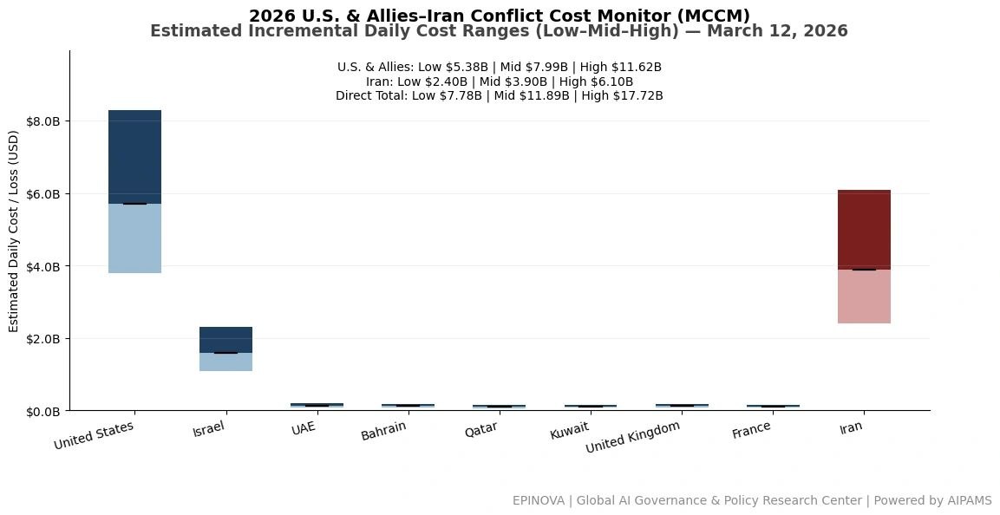
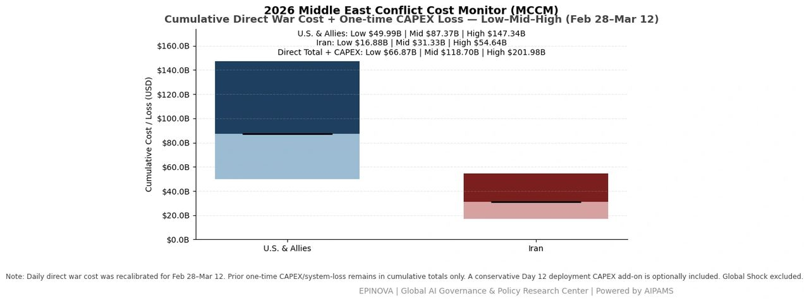
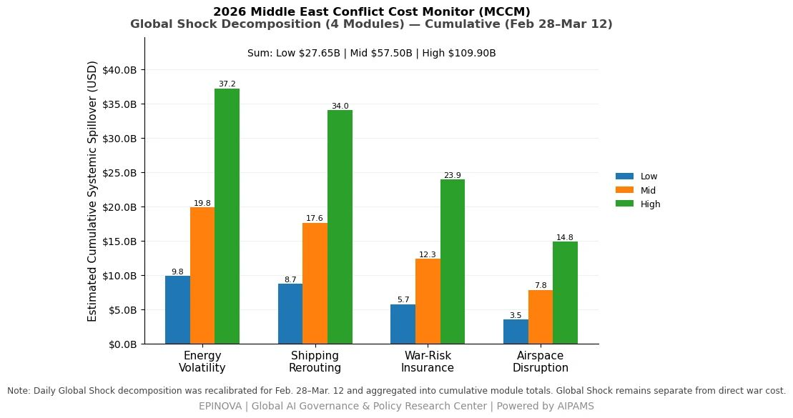

# 2026 U.S. & Allies–Iran Conflict Cost Monitor (MCCM): March 12

Original URL: https://epinova.org/articles/f/2026-us-allies%E2%80%93iran-conflict-cost-monitor-mccm-march-12

Publication date: 2026-03-12

Archive note: This is a locally preserved Markdown copy of an EPINOVA article originally generated through the GoDaddy blog system.

---

[All Posts](<https://epinova.org/articles?blog=y>)

### 2026 U.S. & Allies–Iran Conflict Cost Monitor (MCCM): March 12

March 12, 2026|Global AI Governance & Policy

**Powered by AIPAMS**

  

**Introduction**

The 2026 Middle East Conflict Cost Monitor (MCCM) provides an event-driven, scenario-based assessment of daily conflict-related expenditures and losses across major state actors involved in the crisis. Using a structured low–mid–high estimation framework, the series aggregates publicly available operational indicators, force posture changes, strike intensity proxies, reported material damage, and infrastructure disruptions to produce comparable daily cost ranges.

The framework distinguishes between (1) direct military expenditures and asset losses, (2) infrastructure and energy-sector disruption costs, and (3) systemic market spillovers (“Global Shock”), which are reported separately from war-specific accounts.

MCCM is designed as a rolling monitoring instrument rather than a definitive accounting ledger. All estimates are expressed in current U.S. dollars (USD) and reflect bounded scenario approximations intended for comparative analysis and policy discussion. High-range estimates may incorporate upper-bound scenario adjustments where reported high-value asset losses remain under verification. Estimates are updated as verification improves and may be revised retroactively. 

  

**Note:**  
Ranges reflect scenario-bounded estimates. Low = minimum confirmed observable losses. Mid = most probable range based on publicly available reporting and operational cost parameters. High = upper-bound scenario including reported but not independently verified high-value asset losses. Figures exclude Global Shock (systemic market spillovers). All values are incremental (24-hour estimate). 

  

**Note:**

Cumulative totals represent aggregated daily scenario ranges. High range includes scenario-based upper-bound adjustments (e.g., reported strategic asset losses). Figures exclude Global Shock. Values rounded; subject to revision as verification improves. 

  

**Note:**

Global Shock represents cumulative systemic spillovers during the reporting period and is decomposed into four modules: Energy Volatility, Shipping Rerouting, War-Risk Insurance Premiums, and Airspace Disruption. These modules capture major economic and logistical externalities associated with regional conflict escalation. Global Shock is reported separately and is not included in direct military cost estimates. 

  

**Selected References:**

Associated Press. (2026, March 11). _California governor says no imminent threat despite warning about possible Iran drone attack_. AP News.  
<https://apnews.com/article/82afa326f0b362e0ae96b97e1e6c3d7e>

Reuters. (2026, March 11). _FBI bulletin warned of possible Iran retaliation on California targets_. Reuters.  
[https://www.reuters.com/world/middle-east/trump-says-he-is-not-worried-about-iran-backed-attacks-us-soil-2026-03-11/](<https://www.reuters.com/world/middle-east/trump-says-he-is-not-worried-about-iran-backed-attacks-us-soil-2026-03-11/?utm_source=chatgpt.com>)

Reuters. (2026, March 11). _Historic oil reserve release is only a band-aid on a gaping supply shock_. Reuters.  
[https://www.reuters.com/markets/commodities/historic-oil-reserve-release-is-only-band-aid-gaping-supply-shock-2026-03-11/](<https://www.reuters.com/markets/commodities/historic-oil-reserve-release-is-only-band-aid-gaping-supply-shock-2026-03-11/?utm_source=chatgpt.com>)

Reuters. (2026, March 11). _IEA announces record oil stockpile release over Iran war supply disruptions_. Reuters.  
[https://www.reuters.com/business/energy/iea-proposes-largest-ever-oil-release-strategic-reserves-wsj-reports-2026-03-11/](<https://www.reuters.com/business/energy/iea-proposes-largest-ever-oil-release-strategic-reserves-wsj-reports-2026-03-11/?utm_source=chatgpt.com>)

Reuters. (2026, March 11). _Maersk redistributes vessel fuel to ensure supplies, as Iran war disrupts flows_. Reuters.  
[https://www.reuters.com/business/energy/maersk-redistributing-ship-fuel-ensure-supplies-iran-war-disrupts-supply-2026-03-11/](<https://www.reuters.com/business/energy/maersk-redistributing-ship-fuel-ensure-supplies-iran-war-disrupts-supply-2026-03-11/?utm_source=chatgpt.com>)

Reuters. (2026, March 11). _Sea drones target oil tankers in the Middle East as conflict risks widen_. Reuters.  
[https://www.reuters.com/world/middle-east/sea-drones-target-oil-tankers-middle-east-conflict-risks-widen-2026-03-11/](<https://www.reuters.com/world/middle-east/sea-drones-target-oil-tankers-middle-east-conflict-risks-widen-2026-03-11/?utm_source=chatgpt.com>)

Reuters. (2026, March 11). _Trump administration estimates Iran war cost at over $11 billion in six days, source says_. Reuters.  
[https://www.reuters.com/world/us/trump-administration-estimates-iran-war-cost-over-11-billion-six-days-source-2026-03-11/](<https://www.reuters.com/world/us/trump-administration-estimates-iran-war-cost-over-11-billion-six-days-source-2026-03-11/?utm_source=chatgpt.com>)

Reuters. (2026, March 11). _US intelligence says Iran government is not at risk of collapse, say sources_. Reuters.  
[https://www.reuters.com/business/media-telecom/us-intelligence-says-iran-government-is-not-risk-collapse-say-sources-2026-03-11/](<https://www.reuters.com/business/media-telecom/us-intelligence-says-iran-government-is-not-risk-collapse-say-sources-2026-03-11/?utm_source=chatgpt.com>)

Reuters. (2026, March 11). _US to release 172 million barrels of oil from strategic petroleum reserve_. Reuters.  
[https://www.reuters.com/business/energy/us-release-172-million-barrels-oil-strategic-petroleum-reserve-2026-03-11/](<https://www.reuters.com/business/energy/us-release-172-million-barrels-oil-strategic-petroleum-reserve-2026-03-11/?utm_source=chatgpt.com>)

Reuters. (2026, March 12). _Oil gains 9% as Iran says Strait of Hormuz closure to continue_. Reuters.  
[https://www.reuters.com/business/energy/oil-climbs-tankers-are-attacked-iraqi-waters-amid-middle-east-war-2026-03-12/](<https://www.reuters.com/business/energy/oil-climbs-tankers-are-attacked-iraqi-waters-amid-middle-east-war-2026-03-12/?utm_source=chatgpt.com>)

Reuters. (2026, March 12). _Iran vows to keep Strait of Hormuz closed in new leader's first statement_. Reuters.  
[https://www.reuters.com/world/middle-east/trump-iran-signal-no-quick-end-war-tankers-burn-iraqi-waters-2026-03-12/](<https://www.reuters.com/world/middle-east/trump-iran-signal-no-quick-end-war-tankers-burn-iraqi-waters-2026-03-12/?utm_source=chatgpt.com>)

Share this post:
