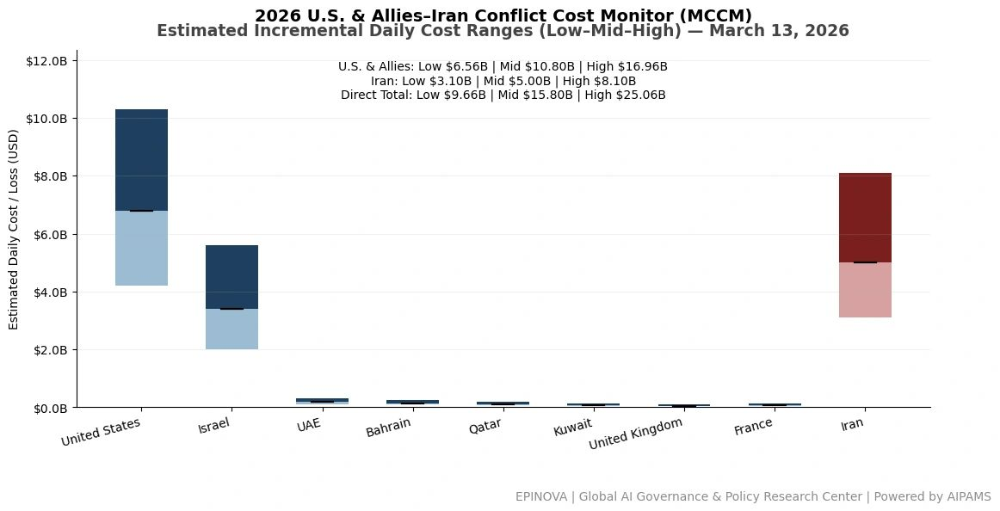
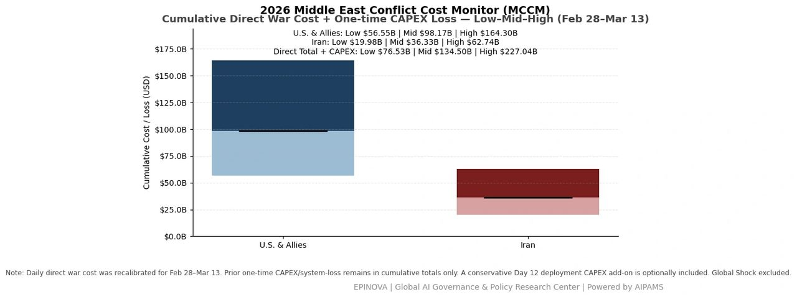
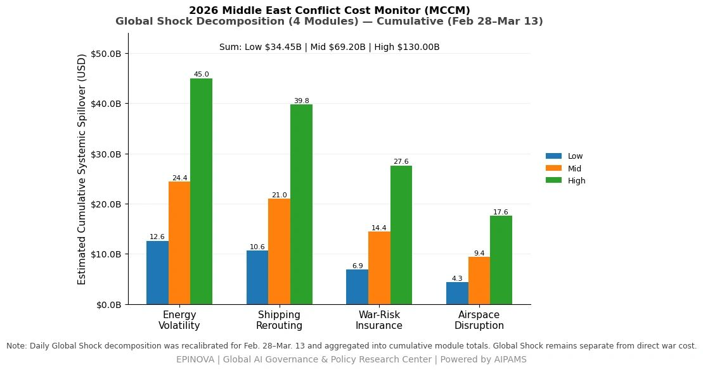

# 2026 U.S. & Allies–Iran Conflict Cost Monitor (MCCM): March 13

Original URL: https://epinova.org/articles/f/2026-us-allies%E2%80%93iran-conflict-cost-monitor-mccm-march-13

Publication date: 2026-03-13

Archive note: This is a locally preserved Markdown copy of an EPINOVA article originally generated through the GoDaddy blog system.

---

[All Posts](<https://epinova.org/articles?blog=y>)

### 2026 U.S. & Allies–Iran Conflict Cost Monitor (MCCM): March 13

March 13, 2026|Global AI Governance & Policy

**Powered by AIPAMS**

  

**Introduction**

The 2026 Middle East Conflict Cost Monitor (MCCM) provides an event-driven, scenario-based assessment of daily conflict-related expenditures and losses across major state actors involved in the crisis. Using a structured low–mid–high estimation framework, the series aggregates publicly available operational indicators, force posture changes, strike intensity proxies, reported material damage, and infrastructure disruptions to produce comparable daily cost ranges.

The framework distinguishes between (1) direct military expenditures and asset losses, (2) infrastructure and energy-sector disruption costs, and (3) systemic market spillovers (“Global Shock”), which are reported separately from war-specific accounts.

MCCM is designed as a rolling monitoring instrument rather than a definitive accounting ledger. All estimates are expressed in current U.S. dollars (USD) and reflect bounded scenario approximations intended for comparative analysis and policy discussion. High-range estimates may incorporate upper-bound scenario adjustments where reported high-value asset losses remain under verification. Estimates are updated as verification improves and may be revised retroactively. 

  

**Note:**  
Ranges reflect scenario-bounded estimates. Low = minimum confirmed observable losses. Mid = most probable range based on publicly available reporting and operational cost parameters. High = upper-bound scenario including reported but not independently verified high-value asset losses. Figures exclude Global Shock (systemic market spillovers). All values are incremental (24-hour estimate). 

  

**Note:**

Cumulative totals represent aggregated daily scenario ranges. High range includes scenario-based upper-bound adjustments (e.g., reported strategic asset losses). Figures exclude Global Shock. Values rounded; subject to revision as verification improves. 

  

**Note:**

Global Shock represents cumulative systemic spillovers during the reporting period and is decomposed into four modules: Energy Volatility, Shipping Rerouting, War-Risk Insurance Premiums, and Airspace Disruption. These modules capture major economic and logistical externalities associated with regional conflict escalation. Global Shock is reported separately and is not included in direct military cost estimates. 

  

**Selected References:**

Associated Press. (2026, March 13). _All 6 airmen on a US refueling plane that crashed in Iraq are dead, US military says_. AP News. [https://apnews.com/article/c337359a58be6280dc96fdbf1cb48a5b](<https://apnews.com/article/c337359a58be6280dc96fdbf1cb48a5b?utm_source=chatgpt.com>)

Axios. (2026, March 13). _Scoop: Trump claimed in G7 call that Iran is “about to surrender”_. [https://www.axios.com/2026/03/13/trump-iran-surrender-hormuz-oil](<https://www.axios.com/2026/03/13/trump-iran-surrender-hormuz-oil?utm_source=chatgpt.com>)

CBS News. (2026, March 13). _U.S. fired at Iranian vessel that approached aircraft carrier, officials say_. [https://www.cbsnews.com/news/us-fired-at-iranian-vessel-that-approached-aircraft-carrier-officials-say/](<https://www.cbsnews.com/news/us-fired-at-iranian-vessel-that-approached-aircraft-carrier-officials-say/?utm_source=chatgpt.com>)

Reuters. (2026, March 12). _US issues 30-day sanctions waiver for purchase of Russian oil at sea_. Reuters. [https://www.reuters.com/business/energy/us-issues-new-russia-related-general-license-oil-treasury-website-2026-03-12/](<https://www.reuters.com/business/energy/us-issues-new-russia-related-general-license-oil-treasury-website-2026-03-12/?utm_source=chatgpt.com>)

Reuters. (2026, March 12). _TotalEnergies output down 15% due to US-Iran war; confirms UAE outages_. Reuters. [https://www.reuters.com/business/energy/totalenergies-output-down-15-due-us-iran-war-confirms-uae-outages-2026-03-12/](<https://www.reuters.com/business/energy/totalenergies-output-down-15-due-us-iran-war-confirms-uae-outages-2026-03-12/?utm_source=chatgpt.com>)

Reuters. (2026, March 13). _Analysts reassess oil price estimates as Iran conflict disrupts markets_. Reuters. <https://www.reuters.com/business/energy/analysts-reassess-oil-price-estimates-iran-conflict-disrupts-markets-2026-03-13/>

Reuters. (2026, March 13). _Both sides dig in as Iran war approaches two-week mark_. Reuters. [https://www.reuters.com/world/middle-east/both-sides-dig-iran-war-approaches-two-week-mark-2026-03-13/](<https://www.reuters.com/world/middle-east/both-sides-dig-iran-war-approaches-two-week-mark-2026-03-13/?utm_source=chatgpt.com>)

Reuters. (2026, March 13). _France’s position in Middle East is defensive, Macron says, after attack on its soldiers_. Reuters. [https://www.reuters.com/world/europe/frances-position-middle-east-is-defensive-macron-says-after-attack-its-soldiers-2026-03-13/](<https://www.reuters.com/world/europe/frances-position-middle-east-is-defensive-macron-says-after-attack-its-soldiers-2026-03-13/?utm_source=chatgpt.com>)

Reuters. (2026, March 13). _Goldman hikes average Brent oil forecast to over $100 a barrel for March_. Reuters. [https://www.reuters.com/business/energy/goldman-hikes-average-brent-oil-forecast-over-100-barrel-march-2026-03-13/](<https://www.reuters.com/business/energy/goldman-hikes-average-brent-oil-forecast-over-100-barrel-march-2026-03-13/?utm_source=chatgpt.com>)

Reuters. (2026, March 13). _Iran-backed Iraqi group claims responsibility for downing US military aircraft_. Reuters. [https://www.reuters.com/world/middle-east/iran-backed-iraqi-group-claims-responsibility-downing-us-military-aircraft-2026-03-13/](<https://www.reuters.com/world/middle-east/iran-backed-iraqi-group-claims-responsibility-downing-us-military-aircraft-2026-03-13/?utm_source=chatgpt.com>)

Reuters. (2026, March 13). _Iran unleashes oil shock to blunt US firepower_. Reuters. [https://www.reuters.com/world/middle-east/iran-unleashes-oil-shock-blunt-us-firepower-2026-03-13/](<https://www.reuters.com/world/middle-east/iran-unleashes-oil-shock-blunt-us-firepower-2026-03-13/?utm_source=chatgpt.com>)

Reuters. (2026, March 13). _Israel targets Iranian checkpoints using tip-offs from informants, source says_. Reuters. <https://www.reuters.com/world/middle-east/israel-targets-iranian-checkpoints-using-tip-offs-informants-source-says-2026-03-13/>

Reuters. (2026, March 13). _JP Morgan sees crude supply cuts nearing 12 million bpd as tanker halt tightens markets_. Reuters. [https://www.reuters.com/business/energy/jp-morgan-sees-crude-supply-cuts-nearing-12-million-bpd-tanker-halt-tightens-2026-03-13/](<https://www.reuters.com/business/energy/jp-morgan-sees-crude-supply-cuts-nearing-12-million-bpd-tanker-halt-tightens-2026-03-13/?utm_source=chatgpt.com>)

Reuters. (2026, March 13). _Saudi Arabia cuts oil output 20% to 8 million bpd amid Iran war, sources say_. Reuters. [https://www.reuters.com/business/energy/saudi-arabia-cuts-oil-output-20-8-million-bpd-amid-iran-war-sources-say-2026-03-13/](<https://www.reuters.com/business/energy/saudi-arabia-cuts-oil-output-20-8-million-bpd-amid-iran-war-sources-say-2026-03-13/?utm_source=chatgpt.com>)

Reuters. (2026, March 13). _Six US service members killed in plane crash over Iraq_. Reuters. [https://www.reuters.com/world/four-us-service-members-killed-plane-crash-over-iraq-2026-03-13/](<https://www.reuters.com/world/four-us-service-members-killed-plane-crash-over-iraq-2026-03-13/?utm_source=chatgpt.com>)

Reuters. (2026, March 13). _Trump claimed in G7 call that Iran is “about to surrender,” Axios reports_. Reuters. [https://www.reuters.com/world/middle-east/trump-claimed-g7-call-that-iran-is-about-surrender-axios-reports-2026-03-13/](<https://www.reuters.com/world/middle-east/trump-claimed-g7-call-that-iran-is-about-surrender-axios-reports-2026-03-13/?utm_source=chatgpt.com>)

Reuters. (2026, March 13). _Turkey says NATO defences intercepted third missile from Iran, asks Tehran to clarify_. Reuters. [https://www.reuters.com/world/middle-east/turkey-says-nato-defences-intercepted-third-missile-iran-asks-tehran-clarify-2026-03-13/](<https://www.reuters.com/world/middle-east/turkey-says-nato-defences-intercepted-third-missile-iran-asks-tehran-clarify-2026-03-13/?utm_source=chatgpt.com>)

Share this post:
