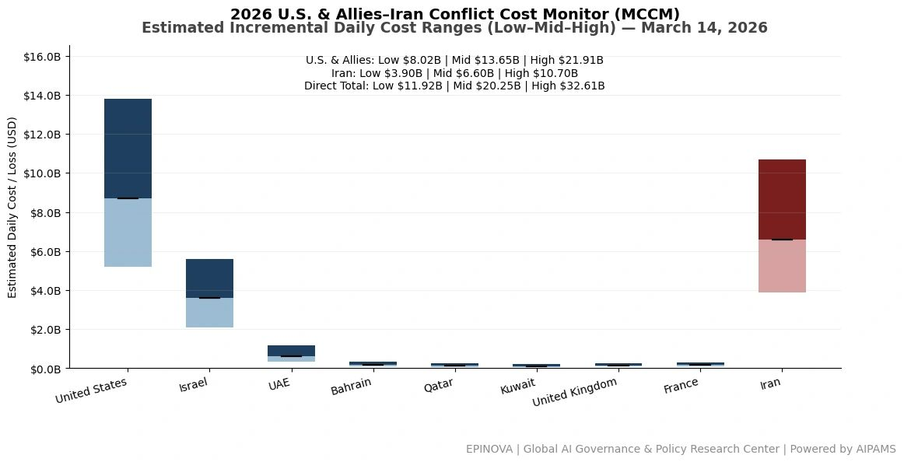
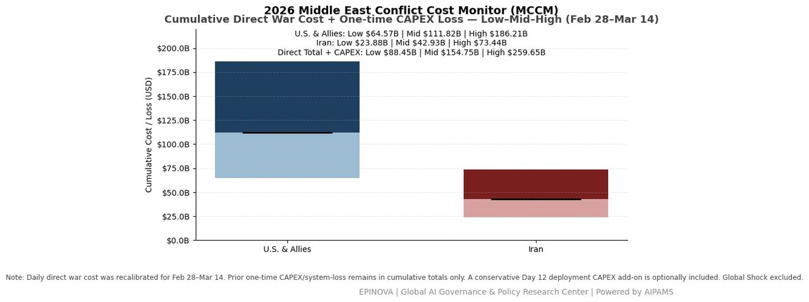
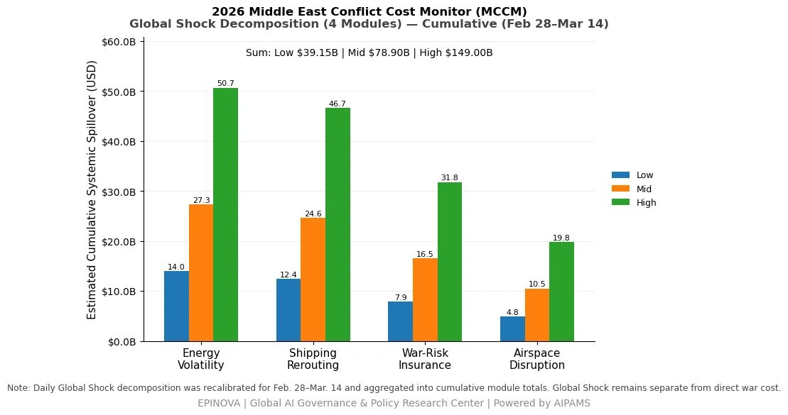

# 2026 U.S. & Allies–Iran Conflict Cost Monitor (MCCM): March 14

Original URL: https://epinova.org/articles/f/2026-us-allies%E2%80%93iran-conflict-cost-monitor-mccm-march-14

Publication date: 2026-03-14

Archive note: This is a locally preserved Markdown copy of an EPINOVA article originally generated through the GoDaddy blog system.

---

[All Posts](<https://epinova.org/articles?blog=y>)

### 2026 U.S. & Allies–Iran Conflict Cost Monitor (MCCM): March 14

March 14, 2026|Global AI Governance & Policy

**Powered by AIPAMS**

  

**Introduction**

The 2026 Middle East Conflict Cost Monitor (MCCM) provides an event-driven, scenario-based assessment of daily conflict-related expenditures and losses across major state actors involved in the crisis. Using a structured low–mid–high estimation framework, the series aggregates publicly available operational indicators, force posture changes, strike intensity proxies, reported material damage, and infrastructure disruptions to produce comparable daily cost ranges.

The framework distinguishes between (1) direct military expenditures and asset losses, (2) infrastructure and energy-sector disruption costs, and (3) systemic market spillovers (“Global Shock”), which are reported separately from war-specific accounts.

MCCM is designed as a rolling monitoring instrument rather than a definitive accounting ledger. All estimates are expressed in current U.S. dollars (USD) and reflect bounded scenario approximations intended for comparative analysis and policy discussion. High-range estimates may incorporate upper-bound scenario adjustments where reported high-value asset losses remain under verification. Estimates are updated as verification improves and may be revised retroactively. 

  

**Note:**  
Ranges reflect scenario-bounded estimates. Low = minimum confirmed observable losses. Mid = most probable range based on publicly available reporting and operational cost parameters. High = upper-bound scenario including reported but not independently verified high-value asset losses. Figures exclude Global Shock (systemic market spillovers). All values are incremental (24-hour estimate). 

  

**Note:**

Cumulative totals represent aggregated daily scenario ranges. High range includes scenario-based upper-bound adjustments (e.g., reported strategic asset losses). Figures exclude Global Shock. Values rounded; subject to revision as verification improves. 

  

**Note:**

Global Shock represents cumulative systemic spillovers during the reporting period and is decomposed into four modules: Energy Volatility, Shipping Rerouting, War-Risk Insurance Premiums, and Airspace Disruption. These modules capture major economic and logistical externalities associated with regional conflict escalation. Global Shock is reported separately and is not included in direct military cost estimates. 

  

**Selected References:**

Reuters. (2026, March 14). _Fire at UAE oil hub as Iran vows retaliation for US attack on Kharg Island_. [https://www.reuters.com/world/middle-east/trump-threatens-strike-irans-kharg-island-oil-network-if-shipping-lanes-remain-2026-03-14/](<https://www.reuters.com/world/middle-east/trump-threatens-strike-irans-kharg-island-oil-network-if-shipping-lanes-remain-2026-03-14/?utm_source=chatgpt.com>)

Reuters. (2026, March 14). _Trump says “many countries” will send warships to keep Strait of Hormuz open_. [https://www.reuters.com/world/asia-pacific/trump-says-many-countries-will-send-warships-keep-strait-hormuz-open-2026-03-14/](<https://www.reuters.com/world/asia-pacific/trump-says-many-countries-will-send-warships-keep-strait-hormuz-open-2026-03-14/?utm_source=chatgpt.com>)

Reuters. (2026, March 14). _Kharg Island, struck by US, is key hub for Iran oil exports_. [https://www.reuters.com/business/energy/kharg-island-struck-by-us-is-key-hub-iran-oil-exports-2026-03-14/](<https://www.reuters.com/business/energy/kharg-island-struck-by-us-is-key-hub-iran-oil-exports-2026-03-14/?utm_source=chatgpt.com>)

Reuters. (2026, March 14). _Why does the port of Fujairah matter to the oil market?_ [https://www.reuters.com/business/energy/why-does-port-fujairah-matter-oil-market-2026-03-14/](<https://www.reuters.com/business/energy/why-does-port-fujairah-matter-oil-market-2026-03-14/?utm_source=chatgpt.com>)

Reuters. (2026, March 14). _UAE’s Fujairah stops some oil loading operations after drone attack_. [https://www.reuters.com/world/middle-east/fire-occurred-uaes-fujairah-after-debris-fell-during-interception-drone-no-2026-03-14/](<https://www.reuters.com/world/middle-east/fire-occurred-uaes-fujairah-after-debris-fell-during-interception-drone-no-2026-03-14/?utm_source=chatgpt.com>)

Reuters. (2026, March 14). _India seeks passage for more vessels stranded around Strait of Hormuz after a few sail through_. [https://www.reuters.com/world/india/iran-has-allowed-some-indian-vessels-pass-strait-hormuz-envoy-says-2026-03-14/](<https://www.reuters.com/world/india/iran-has-allowed-some-indian-vessels-pass-strait-hormuz-envoy-says-2026-03-14/?utm_source=chatgpt.com>)

Reuters. (2026, March 14). _US embassy in Iraq’s Baghdad hit in missiles attack, security sources say_. [https://www.reuters.com/world/middle-east/us-embassy-iraqs-baghdad-hit-missiles-attack-security-sources-say-2026-03-14/](<https://www.reuters.com/world/middle-east/us-embassy-iraqs-baghdad-hit-missiles-attack-security-sources-say-2026-03-14/?utm_source=chatgpt.com>)

Reuters. (2026, March 14). _Missile strikes helipad in US embassy compound in Iraq, AP reports_. [https://www.reuters.com/world/middle-east/missile-strikes-helipad-us-embassy-compound-iraq-ap-reports-2026-03-14/](<https://www.reuters.com/world/middle-east/missile-strikes-helipad-us-embassy-compound-iraq-ap-reports-2026-03-14/?utm_source=chatgpt.com>)

Reuters. (2026, March 14). _US says oil from strategic reserve to start reaching market next week_. [https://www.reuters.com/business/energy/us-says-oil-strategic-reserve-start-reaching-market-next-week-2026-03-14/](<https://www.reuters.com/business/energy/us-says-oil-strategic-reserve-start-reaching-market-next-week-2026-03-14/?utm_source=chatgpt.com>)

Reuters. (2026, March 13). _IEA announces record oil stockpile release over Iran war supply disruptions_. [https://www.reuters.com/business/energy/iea-proposes-largest-ever-oil-release-strategic-reserves-wsj-reports-2026-03-11/](<https://www.reuters.com/business/energy/iea-proposes-largest-ever-oil-release-strategic-reserves-wsj-reports-2026-03-11/?utm_source=chatgpt.com>)

Reuters. (2026, March 14). _Europe repaid Tokyo a favour by supporting oil stock release, Japan minister says_. [https://www.reuters.com/business/energy/europe-repaid-tokyo-favour-by-supporting-oil-stock-release-japan-minister-says-2026-03-14/](<https://www.reuters.com/business/energy/europe-repaid-tokyo-favour-by-supporting-oil-stock-release-japan-minister-says-2026-03-14/?utm_source=chatgpt.com>)

Reuters. (2026, March 13). _Barclays raises 2026 Brent forecast to $85 a barrel on Strait of Hormuz disruption_. [https://www.reuters.com/business/energy/barclays-raises-2026-brent-forecast-85-barrel-strait-hormuz-disruption-2026-03-13/](<https://www.reuters.com/business/energy/barclays-raises-2026-brent-forecast-85-barrel-strait-hormuz-disruption-2026-03-13/?utm_source=chatgpt.com>)

Reuters. (2026, March 13). _Goldman hikes average Brent oil forecast to over $100 a barrel for March_. [https://www.reuters.com/business/energy/goldman-hikes-average-brent-oil-forecast-over-100-barrel-march-2026-03-13/](<https://www.reuters.com/business/energy/goldman-hikes-average-brent-oil-forecast-over-100-barrel-march-2026-03-13/?utm_source=chatgpt.com>)

Reuters. (2026, March 13). _JP Morgan sees crude supply cuts nearing 12 million bpd as tanker halt tightens markets_. [https://www.reuters.com/business/energy/jp-morgan-sees-crude-supply-cuts-nearing-12-million-bpd-tanker-halt-tightens-2026-03-13/](<https://www.reuters.com/business/energy/jp-morgan-sees-crude-supply-cuts-nearing-12-million-bpd-tanker-halt-tightens-2026-03-13/?utm_source=chatgpt.com>)

Reuters. (2026, March 12). _Citibank closes UAE branches temporarily as precautionary measure_. [https://www.reuters.com/world/middle-east/citibank-closes-uae-branches-temporarily-precautionary-measure-2026-03-12/](<https://www.reuters.com/world/middle-east/citibank-closes-uae-branches-temporarily-precautionary-measure-2026-03-12/?utm_source=chatgpt.com>)

Reuters. (2026, March 11). _Citi, StanChart evacuate Dubai offices, HSBC closes Qatar branches amid conflict_. [https://www.reuters.com/world/middle-east/standard-chartered-evacuates-staff-offices-dubai-today-sources-say-2026-03-11/](<https://www.reuters.com/world/middle-east/standard-chartered-evacuates-staff-offices-dubai-today-sources-say-2026-03-11/?utm_source=chatgpt.com>)

Reuters. (2026, March 12). _Iran war casts shadow over HSBC and StanChart Middle East ambitions_. [https://www.reuters.com/business/finance/iran-war-casts-shadow-over-hsbc-stanchart-middle-east-ambitions-2026-03-12/](<https://www.reuters.com/business/finance/iran-war-casts-shadow-over-hsbc-stanchart-middle-east-ambitions-2026-03-12/?utm_source=chatgpt.com>)

Reuters. (2026, March 14). _North Korea fires 10 ballistic missiles during US-South Korea military drills_. [https://www.reuters.com/world/asia-pacific/north-korea-fires-possible-missile-towards-sea-during-us-south-korea-drills-2026-03-14/](<https://www.reuters.com/world/asia-pacific/north-korea-fires-possible-missile-towards-sea-during-us-south-korea-drills-2026-03-14/?utm_source=chatgpt.com>)

Reuters. (2026, March 14). _Drones, burning ships: Indian sailors stranded off Iran just want to go home_. [https://www.reuters.com/world/asia-pacific/drones-burning-ships-indian-sailors-stranded-off-iran-just-want-go-home-2026-03-14/](<https://www.reuters.com/world/asia-pacific/drones-burning-ships-indian-sailors-stranded-off-iran-just-want-go-home-2026-03-14/?utm_source=chatgpt.com>)

Reuters. (2026, March 13). _Trump says US struck military targets on Iran’s Kharg Island oil hub_. [https://www.reuters.com/world/middle-east/both-sides-dig-iran-war-approaches-two-week-mark-2026-03-13/](<https://www.reuters.com/world/middle-east/both-sides-dig-iran-war-approaches-two-week-mark-2026-03-13/?utm_source=chatgpt.com>)

Share this post:
