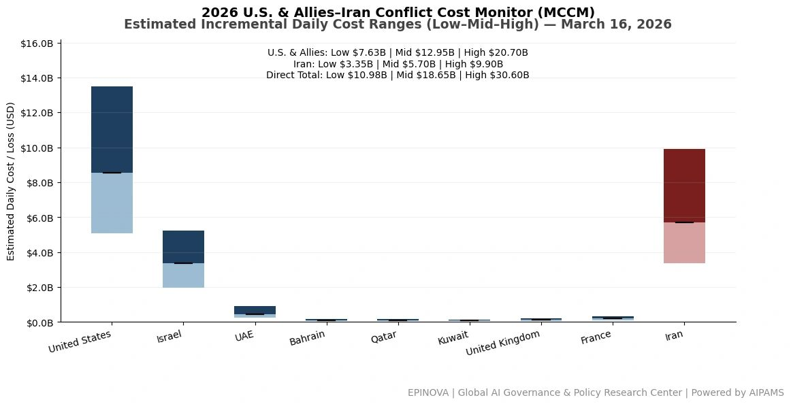
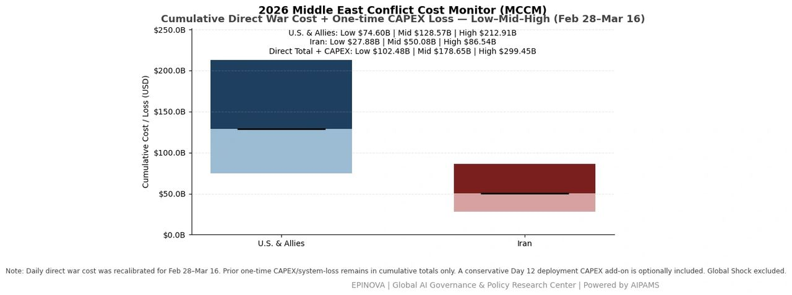
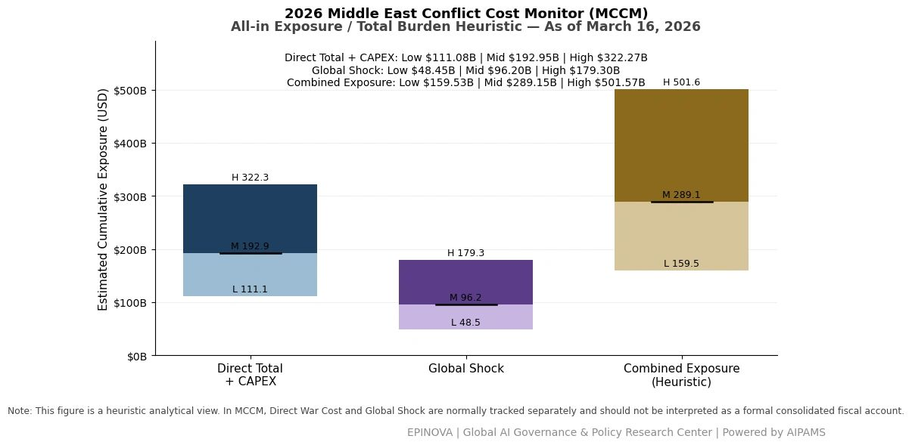

# 2026 U.S. & Allies–Iran Conflict Cost Monitor (MCCM): March 16

Original URL: https://epinova.org/articles/f/2026-us-allies%E2%80%93iran-conflict-cost-monitor-mccm-march-15-1

Publication date: 2026-03-16

Archive note: This is a locally preserved Markdown copy of an EPINOVA article originally generated through the GoDaddy blog system.

---

[All Posts](<https://epinova.org/articles?blog=y>)

### 2026 U.S. & Allies–Iran Conflict Cost Monitor (MCCM): March 16

March 16, 2026|Global AI Governance & Policy

**Powered by AIPAMS**

  

**1\. Introduction**

The **2026 Middle East Conflict Cost Monitor (MCCM)** provides an event-driven, scenario-based assessment of daily conflict-related expenditures and losses across major state actors involved in the crisis. Using a structured **low–mid–high estimation framework** , the series aggregates publicly available operational indicators, force posture changes, strike intensity proxies, reported material damage, and infrastructure disruptions to produce comparable daily cost ranges.

The MCCM framework distinguishes between three analytical components:  
(1) **Direct War Cost** , which includes military operational expenditures, asset losses, and selected capital losses (CAPEX);  
(2) **Infrastructure and energy-sector disruption costs** linked to conflict operations; and  
(3) **Systemic market spillovers (“Global Shock”)** , which capture broader economic and logistical externalities associated with regional escalation.

Direct war costs and systemic spillovers are **reported separately** to maintain analytical clarity between conflict-specific expenditures and wider economic effects.

MCCM is designed as a **rolling monitoring instrument rather than a definitive accounting ledger**. Estimates are produced using scenario-bounded ranges intended to support comparative analysis and policy discussion rather than precise fiscal accounting. All values are expressed in **current U.S. dollars (USD)** and may be **revised retroactively** as verification improves and additional information becomes available.

  

**2\. Methodological Notes**

**A. Scenario Ranges.**  
All estimates are presented as bounded ranges.

  * **Low:** Minimum confirmed observable losses.
  * **Mid:** Most probable estimate based on publicly available reporting and operational cost parameters.
  * **High:** Upper-bound scenario incorporating reported but not independently verified high-value asset losses.  

**B. Daily Estimates.**  
Reported figures represent **incremental 24-hour estimates** of conflict-related costs and losses.

**C. Cumulative Totals.**  
Cumulative values reflect the **aggregation of daily scenario ranges** over the reporting period. High-range values may include scenario-based adjustments for reported strategic asset losses pending independent verification.

**D. Global Shock.**  
Global Shock represents **systemic economic spillovers** generated by the conflict and is reported separately from direct military costs. It is decomposed into four modules:

  * Energy Volatility
  * Shipping Rerouting
  * War-Risk Insurance Premiums
  * Airspace Disruption

These modules capture major **economic and logistical externalities** associated with regional escalation.

**E. Combined Exposure (Heuristic).**  
In selected figures, Direct War Cost and Global Shock may be displayed together as a **Combined Exposure heuristic** to illustrate the approximate scale of total economic exposure associated with the conflict. This aggregation is **analytical only** and should not be interpreted as a formal consolidated fiscal account.

**F. Revision Policy.**  
All MCCM estimates are derived from **open-source reporting and model-based reconstruction** and remain subject to revision as verification improves.

  

**Selected References:**

Reuters. (2026, March 16). _Oil loading operations suspended at UAE’s Fujairah port after attack_.  
[https://www.reuters.com/business/energy/oil-loading-operations-suspended-uaes-fujairah-port-sources-say-2026-03-16/](<https://www.reuters.com/business/energy/oil-loading-operations-suspended-uaes-fujairah-port-sources-say-2026-03-16/?utm_source=chatgpt.com>)

Reuters. (2026, March 16). _UAE crude output falls by more than half as Hormuz closure forces shut-ins_.  
[https://www.reuters.com/business/energy/uae-crude-output-falls-by-more-than-half-hormuz-closure-forces-shut-ins-2026-03-16/](<https://www.reuters.com/business/energy/uae-crude-output-falls-by-more-than-half-hormuz-closure-forces-shut-ins-2026-03-16/?utm_source=chatgpt.com>)

Reuters. (2026, March 16). _Middle East oil exports drop at least 60% as Hormuz stays mostly closed_.  
[https://www.reuters.com/business/energy/middle-east-oil-exports-drop-least-60-hormuz-stays-mostly-closed-data-shows-2026-03-16/](<https://www.reuters.com/business/energy/middle-east-oil-exports-drop-least-60-hormuz-stays-mostly-closed-data-shows-2026-03-16/?utm_source=chatgpt.com>)

Reuters. (2026, March 16). _Fire breaks out near Dubai International Airport after drone attack_.  
[https://www.reuters.com/world/middle-east/fire-breaks-out-vicinity-dubai-international-airport-after-drone-attack-dubai-2026-03-16/](<https://www.reuters.com/world/middle-east/fire-breaks-out-vicinity-dubai-international-airport-after-drone-attack-dubai-2026-03-16/?utm_source=chatgpt.com>)

Reuters. (2026, March 16). _Britain working with allies on plan to reopen Strait of Hormuz, Starmer says_.  
[https://www.reuters.com/world/britain-working-with-allies-plan-reopen-strait-hormuz-starmer-says-2026-03-16/](<https://www.reuters.com/world/britain-working-with-allies-plan-reopen-strait-hormuz-starmer-says-2026-03-16/?utm_source=chatgpt.com>)

Reuters. (2026, March 16). _India seeks Hormuz safe passage; Iran asks return of seized tankers_.  
[https://www.reuters.com/world/india/india-seeks-hormuz-safe-passage-tehran-asks-return-seized-tankers-sources-say-2026-03-16/](<https://www.reuters.com/world/india/india-seeks-hormuz-safe-passage-tehran-asks-return-seized-tankers-sources-say-2026-03-16/?utm_source=chatgpt.com>)

Reuters. (2026, March 16). _Global markets steady as oil volatility eases but Middle East tensions persist_.  
[https://www.reuters.com/world/china/global-markets-global-markets-2026-03-16/](<https://www.reuters.com/world/china/global-markets-global-markets-2026-03-16/?utm_source=chatgpt.com>)

Reuters. (2026, March 16). _Israel launches limited ground operations against Hezbollah in south Lebanon_.  
[https://www.reuters.com/world/middle-east/israel-says-troops-launch-limited-operations-against-hezbollah-south-lebanon-2026-03-16/](<https://www.reuters.com/world/middle-east/israel-says-troops-launch-limited-operations-against-hezbollah-south-lebanon-2026-03-16/?utm_source=chatgpt.com>)

Reuters. (2026, March 16). _Trump warns NATO faces “very bad future” if allies fail to help in Hormuz crisis_.  
[https://www.reuters.com/world/china/trump-warns-nato-faces-very-bad-future-if-allies-fail-help-us-iran-ft-reports-2026-03-16/](<https://www.reuters.com/world/china/trump-warns-nato-faces-very-bad-future-if-allies-fail-help-us-iran-ft-reports-2026-03-16/?utm_source=chatgpt.com>)

Reuters. (2026, March 16). _U.S. considers coalition to secure Strait of Hormuz amid escalating conflict_.  
<https://www.reuters.com/world/middle-east/us-considers-coalition-secure-strait-hormuz-2026-03-16/>

Wall Street Journal. (2026, March 16). _Hack on U.S. medical company shows reach of Iran’s cyber capabilities_.  
[https://www.wsj.com/politics/national-security/hack-on-u-s-medical-company-shows-reach-of-irans-cyber-capabilities-85999878](<https://www.wsj.com/politics/national-security/hack-on-u-s-medical-company-shows-reach-of-irans-cyber-capabilities-85999878?utm_source=chatgpt.com>)

Guardian. (2026, March 16). _Ukraine war briefing: Zelenskyy says US still needs Ukrainian drone expertise_.  
[https://www.theguardian.com/world/2026/mar/16/ukraine-war-briefing-zelenskyy-wants-new-system-to-control-ukraine-drone-sales](<https://www.theguardian.com/world/2026/mar/16/ukraine-war-briefing-zelenskyy-wants-new-system-to-control-ukraine-drone-sales?utm_source=chatgpt.com>)

Associated Press. (2026, March 16). _European allies reluctant to join US-led naval mission in Hormuz_.  
[https://apnews.com/article/4d20e4ee0f47137d34ba0d67dd4dda6c](<https://apnews.com/article/4d20e4ee0f47137d34ba0d67dd4dda6c?utm_source=chatgpt.com>)

Axios. (2026, March 16). _Trump weighs seizing Iran’s Kharg Island oil hub_.  
<https://www.axios.com/2026/03/16/trump-kharg-island-oil-hormuz>

Share this post:
