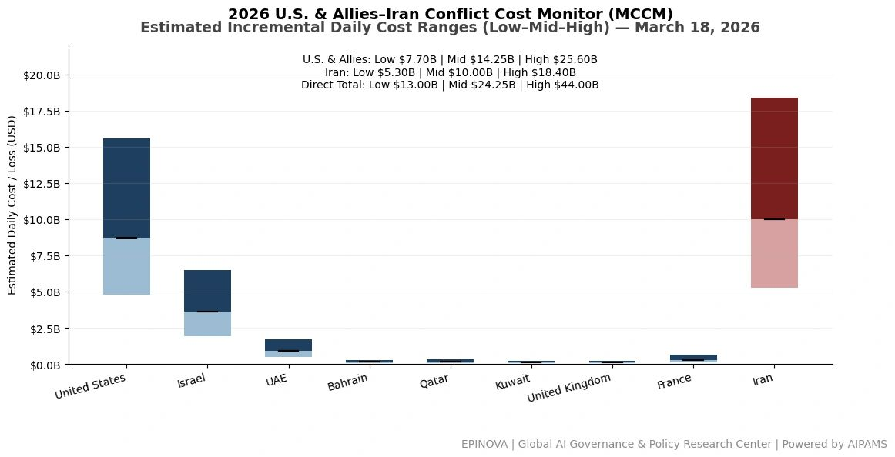
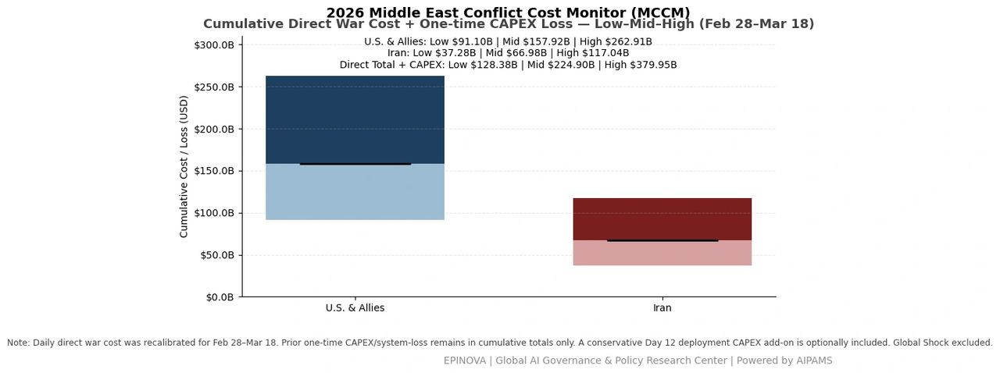
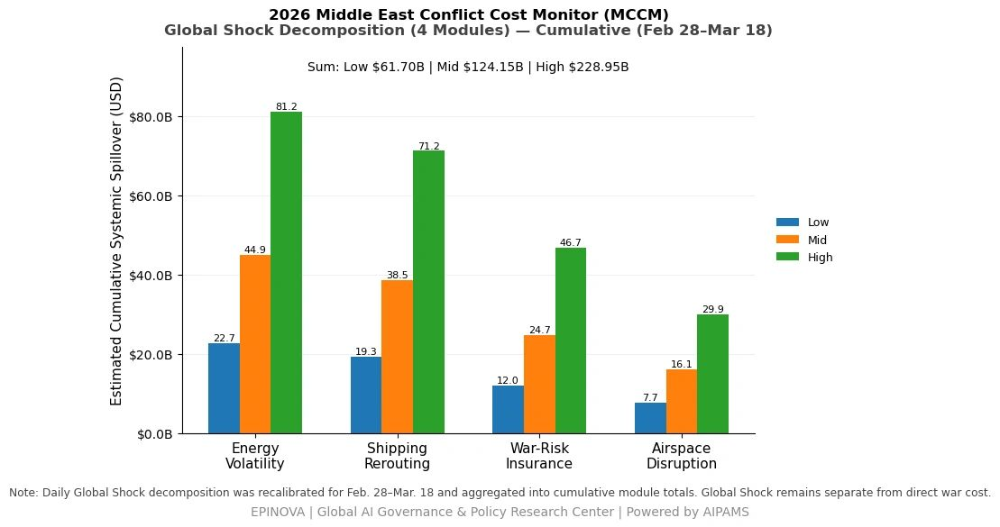
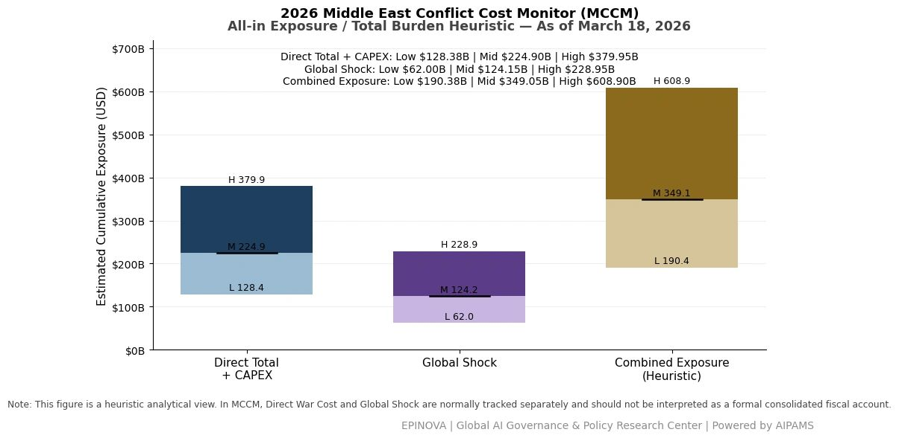

# 2026 U.S. & Allies–Iran Conflict Cost Monitor (MCCM): March 18

Original URL: https://epinova.org/articles/f/2026-us-allies%E2%80%93iran-conflict-cost-monitor-mccm-march-18

Publication date: 2026-03-18

Archive note: This is a locally preserved Markdown copy of an EPINOVA article originally generated through the GoDaddy blog system.

---

[All Posts](<https://epinova.org/articles?blog=y>)

### 2026 U.S. & Allies–Iran Conflict Cost Monitor (MCCM): March 18

March 18, 2026|Global AI Governance & Policy

**Powered by AIPAMS**

  

**1\. Introduction**

The **2026 Middle East Conflict Cost Monitor (MCCM)** provides an event-driven, scenario-based assessment of daily conflict-related expenditures and losses across major state actors involved in the crisis. Using a structured **low–mid–high estimation framework** , the series aggregates publicly available operational indicators, force posture changes, strike intensity proxies, reported material damage, and infrastructure disruptions to produce comparable daily cost ranges.

The MCCM framework distinguishes between three analytical components:  
(1) **Direct War Cost** , which includes military operational expenditures, asset losses, and selected capital losses (CAPEX);  
(2) **Infrastructure and energy-sector disruption costs** linked to conflict operations; and  
(3) **Systemic market spillovers (“Global Shock”)** , which capture broader economic and logistical externalities associated with regional escalation.

Direct war costs and systemic spillovers are **reported separately** to maintain analytical clarity between conflict-specific expenditures and wider economic effects.

MCCM is designed as a **rolling monitoring instrument rather than a definitive accounting ledger**. Estimates are produced using scenario-bounded ranges intended to support comparative analysis and policy discussion rather than precise fiscal accounting. All values are expressed in **current U.S. dollars (USD)** and may be **revised retroactively** as verification improves and additional information becomes available.

  

  

  

**2\. Methodological Notes**

**A. Scenario Ranges.**  
All estimates are presented as bounded ranges.

  * **Low:** Minimum confirmed observable losses.
  * **Mid:** Most probable estimate based on publicly available reporting and operational cost parameters.
  * **High:** Upper-bound scenario incorporating reported but not independently verified high-value asset losses.  

**B. Daily Estimates.**  
Reported figures represent **incremental 24-hour estimates** of conflict-related costs and losses.

**C. Cumulative Totals.**  
Cumulative values reflect the **aggregation of daily scenario ranges** over the reporting period. High-range values may include scenario-based adjustments for reported strategic asset losses pending independent verification.

**D. Global Shock.**  
Global Shock represents **systemic economic spillovers** generated by the conflict and is reported separately from direct military costs. It is decomposed into four modules:

  * Energy Volatility
  * Shipping Rerouting
  * War-Risk Insurance Premiums
  * Airspace Disruption

These modules capture major **economic and logistical externalities** associated with regional escalation.

**E. Combined Exposure (Heuristic).**  
In selected figures, Direct War Cost and Global Shock may be displayed together as a **Combined Exposure heuristic** to illustrate the approximate scale of total economic exposure associated with the conflict. This aggregation is **analytical only** and should not be interpreted as a formal consolidated fiscal account.

**F. Revision Policy.**  
All MCCM estimates are derived from **open-source reporting and model-based reconstruction** and remain subject to revision as verification improves.

  

**Selected References:**

Reuters. (2026, March 18).  
_Israel says it killed Hamas logistics commander in Gaza strike._  
<https://www.reuters.com/world/middle-east/israel-says-it-killed-hamas-logistics-commander-gaza-strike-2026-03-18/>

Reuters. (2026, March 18).  
_Iran vows retaliation after strikes on energy facilities._  
<https://www.reuters.com/world/middle-east/iran-vows-retaliation-after-strikes-energy-sites-2026-03-18/>

Reuters. (2026, March 18).  
_Projectile hits UAE base hosting foreign forces, no casualties reported._  
<https://www.reuters.com/world/middle-east/projectile-hits-uae-base-hosting-foreign-forces-2026-03-18/>

Associated Press. (2026, March 18).  
_Israeli airstrikes hit Hezbollah targets in Lebanon after cross-border attacks._  
<https://apnews.com/article/israel-lebanon-hezbollah-airstrikes-2026-03-18>

Associated Press. (2026, March 18).  
_Rising Israel-Iran tensions raise fears of wider regional war._  
<https://apnews.com/article/israel-iran-conflict-escalation-2026-03-18>

Al Jazeera. (2026, March 18).  
_Iran threatens Gulf oil infrastructure after Israeli strikes._  
<https://www.aljazeera.com/news/2026/3/18/iran-threatens-gulf-oil-sites-after-israel-strikes>

Al Jazeera. (2026, March 18).  
_Israel expands strikes on Hezbollah in Lebanon._  
<https://www.aljazeera.com/news/2026/3/18/israel-strikes-hezbollah-lebanon-escalation>

BBC News. (2026, March 18).  
_Israel and Iran tensions escalate after fresh strikes._  
<https://www.bbc.com/news/world-middle-east-68543210>

BBC News. (2026, March 18).  
_Australian base in UAE hit amid regional escalation._  
<https://www.bbc.com/news/world-australia-68544722>

CNN. (2026, March 18).  
_US moves to stabilize energy markets amid Middle East escalation._  
<https://www.cnn.com/2026/03/18/politics/us-energy-response-middle-east/index.html>

CNN. (2026, March 18).  
_Trump authorizes temporary Jones Act waiver to ease energy transport._  
<https://www.cnn.com/2026/03/18/politics/jones-act-waiver-energy/index.html>

The New York Times. (2026, March 18).  
_Israel-Iran conflict intensifies with strikes on infrastructure._  
<https://www.nytimes.com/2026/03/18/world/middleeast/israel-iran-strikes-energy.html>

The Washington Post. (2026, March 18).  
_Gulf tensions threaten global oil supply chains._  
<https://www.washingtonpost.com/world/2026/03/18/gulf-oil-supply-conflict/>

Financial Times. (2026, March 18).  
_Energy markets react to renewed Middle East hostilities._  
<https://www.ft.com/content/3c7b9a4e-8f0a-4c2b-9b7e-2b1d7e5f9abc>

Bloomberg. (2026, March 18).  
_Oil surges as Middle East conflict threatens supply routes._  
<https://www.bloomberg.com/news/articles/2026-03-18/oil-surges-middle-east-conflict-threatens-supply>

U.S. Department of Defense. (2026, March 18).  
_CENTCOM update on operations in Middle East._  
<https://www.defense.gov/News/Releases/Release/Article/3712456/centcom-update-march-18-2026/>

Israel Defense Forces. (2026, March 18).  
_IDF operational update: Gaza, Iran and regional threats._  
<https://www.idf.il/en/mini-sites/israel-at-war/march-18-2026-update/>

Islamic Republic News Agency (IRNA). (2026, March 18).  
_Iran warns of retaliation after attacks on energy facilities._  
<https://en.irna.ir/news/85234567/Iran-warns-retaliation-energy-facilities>

Ministry of National Defense of China. (2026, March 18).  
_PLA Southern Theater Command expels Philippine aircraft near Huangyan Dao._  
<http://www.mod.gov.cn/action/2026-03/18/content_4901234.htm>

South China Sea Strategic Situation Probing Initiative. (2026, March 18).  
_Report on Huangyan Island airspace incident._  
<http://www.scspi.org/en/nd.jsp?id=482 >

Share this post:
