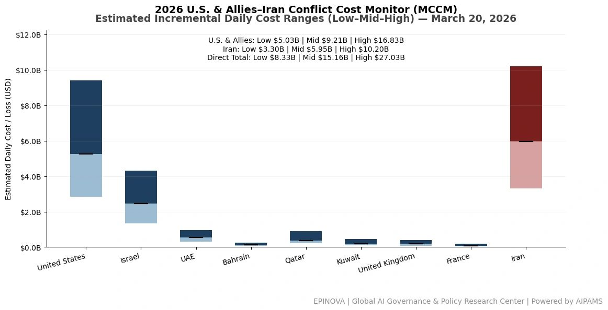
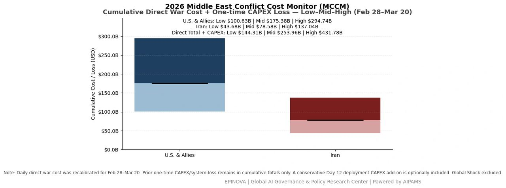
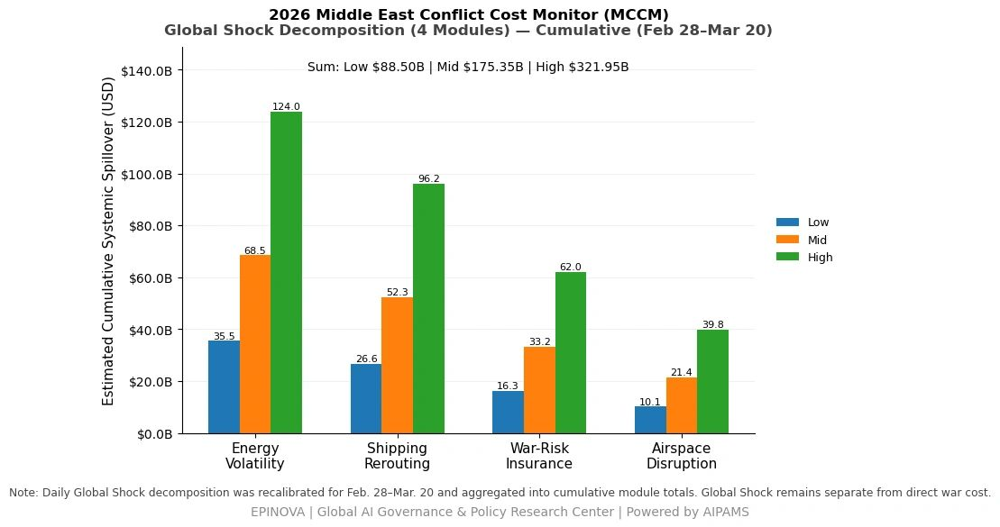
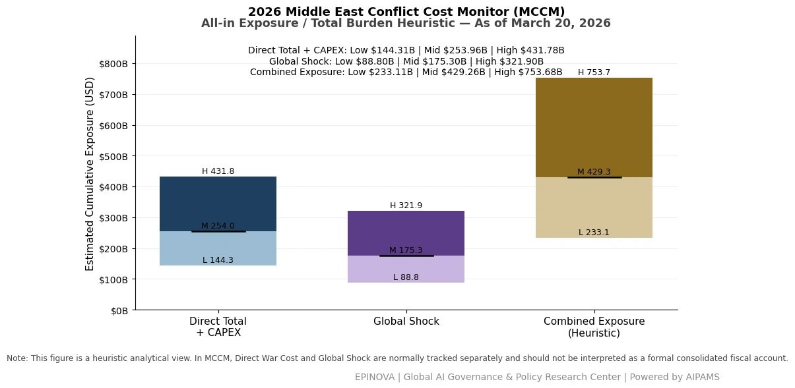

# 2026 U.S. & Allies–Iran Conflict Cost Monitor (MCCM): March 20

Original URL: https://epinova.org/articles/f/2026-us-allies%E2%80%93iran-conflict-cost-monitor-mccm-march-20

Publication date: 2026-03-20

Archive note: This is a locally preserved Markdown copy of an EPINOVA article originally generated through the GoDaddy blog system.

---

[All Posts](<https://epinova.org/articles?blog=y>)

### 2026 U.S. & Allies–Iran Conflict Cost Monitor (MCCM): March 20

March 20, 2026|Global AI Governance & Policy

**Powered by AIPAMS**

  

**1\. Introduction**

The **2026 Middle East Conflict Cost Monitor (MCCM)** provides an event-driven, scenario-based assessment of daily conflict-related expenditures and losses across major state actors involved in the crisis. Using a structured **low–mid–high estimation framework** , the series aggregates publicly available operational indicators, force posture changes, strike intensity proxies, reported material damage, and infrastructure disruptions to produce comparable daily cost ranges.

The MCCM framework distinguishes between three analytical components:  
(1) **Direct War Cost** , which includes military operational expenditures, asset losses, and selected capital losses (CAPEX);  
(2) **Infrastructure and energy-sector disruption costs** linked to conflict operations; and  
(3) **Systemic market spillovers (“Global Shock”)** , which capture broader economic and logistical externalities associated with regional escalation.

Direct war costs and systemic spillovers are **reported separately** to maintain analytical clarity between conflict-specific expenditures and wider economic effects.

MCCM is designed as a **rolling monitoring instrument rather than a definitive accounting ledger**. Estimates are produced using scenario-bounded ranges intended to support comparative analysis and policy discussion rather than precise fiscal accounting. All values are expressed in **current U.S. dollars (USD)** and may be **revised retroactively** as verification improves and additional information becomes available.

  

  

  

**2\. Methodological Notes**

**A. Scenario Ranges.**  
All estimates are presented as bounded ranges.

  * **Low:** Minimum confirmed observable losses.
  * **Mid:** Most probable estimate based on publicly available reporting and operational cost parameters.
  * **High:** Upper-bound scenario incorporating reported but not independently verified high-value asset losses.  

**B. Daily Estimates.**  
Reported figures represent **incremental 24-hour estimates** of conflict-related costs and losses.

**C. Cumulative Totals.**  
Cumulative values reflect the **aggregation of daily scenario ranges** over the reporting period. High-range values may include scenario-based adjustments for reported strategic asset losses pending independent verification.

**D. Global Shock.**  
Global Shock represents **systemic economic spillovers** generated by the conflict and is reported separately from direct military costs. It is decomposed into four modules:

  * Energy Volatility
  * Shipping Rerouting
  * War-Risk Insurance Premiums
  * Airspace Disruption

These modules capture major **economic and logistical externalities** associated with regional escalation.

**E. Combined Exposure (Heuristic).**  
In selected figures, Direct War Cost and Global Shock may be displayed together as a **Combined Exposure heuristic** to illustrate the approximate scale of total economic exposure associated with the conflict. This aggregation is **analytical only** and should not be interpreted as a formal consolidated fiscal account.

**F. Revision Policy.**  
All MCCM estimates are derived from **open-source reporting and model-based reconstruction** and remain subject to revision as verification improves.

  

**Selected References:**

Reuters. (2026, March 20). _Spokesperson for Iran’s Revolutionary Guards killed in strike, state TV says_. [https://www.reuters.com/world/middle-east/spokesperson-irans-revolutionary-guards-killed-strike-state-tv-says-2026-03-20/](<https://www.reuters.com/world/middle-east/spokesperson-irans-revolutionary-guards-killed-strike-state-tv-says-2026-03-20/?utm_source=chatgpt.com>)

Reuters. (2026, March 20). _U.S. to deploy thousands of additional troops to Middle East, officials say_. [https://www.reuters.com/world/us-deploy-thousands-additional-troops-middle-east-officials-say-2026-03-20/](<https://www.reuters.com/world/us-deploy-thousands-additional-troops-middle-east-officials-say-2026-03-20/?utm_source=chatgpt.com>)

Reuters. (2026, March 19). _Trump says U.S. needs more money as Pentagon seeks over $200 billion for Iran war_. [https://www.reuters.com/world/middle-east/us-objectives-iran-have-not-changed-hegseth-says-2026-03-19/](<https://www.reuters.com/world/middle-east/us-objectives-iran-have-not-changed-hegseth-says-2026-03-19/?utm_source=chatgpt.com>)

Reuters. (2026, March 19). _European countries, Japan ready to help stabilize Hormuz and energy markets_. [https://www.reuters.com/business/energy/european-countries-japan-ready-help-hormuz-stabilise-energy-markets-2026-03-19/](<https://www.reuters.com/business/energy/european-countries-japan-ready-help-hormuz-stabilise-energy-markets-2026-03-19/?utm_source=chatgpt.com>)

Reuters. (2026, March 19). _U.S. approves billions in arms sales to Middle East countries_. [https://www.reuters.com/business/aerospace-defense/us-approves-billions-arms-sales-middle-east-countries-2026-03-19/](<https://www.reuters.com/business/aerospace-defense/us-approves-billions-arms-sales-middle-east-countries-2026-03-19/?utm_source=chatgpt.com>)

Reuters. (2026, March 20). _UK approves U.S. use of British bases to strike Iran missile sites targeting ships_. [https://www.reuters.com/business/aerospace-defense/uk-approves-us-use-british-bases-strike-iran-missile-sites-targeting-ships-2026-03-20/](<https://www.reuters.com/business/aerospace-defense/uk-approves-us-use-british-bases-strike-iran-missile-sites-targeting-ships-2026-03-20/?utm_source=chatgpt.com>)

Reuters. (2026, March 20). _Iraq declares force majeure at foreign-operated oilfields over Hormuz disruption_. [https://www.reuters.com/business/energy/iraq-declares-force-majeure-foreign-operated-oilfields-over-hormuz-disruption-2026-03-20/](<https://www.reuters.com/business/energy/iraq-declares-force-majeure-foreign-operated-oilfields-over-hormuz-disruption-2026-03-20/?utm_source=chatgpt.com>)

Reuters. (2026, March 20). _Oil rises as allies consider boosting supply to ease Hormuz disruption_. [https://www.reuters.com/business/energy/oil-falls-us-allies-look-boost-supply-unchoke-strait-hormuz-2026-03-20/](<https://www.reuters.com/business/energy/oil-falls-us-allies-look-boost-supply-unchoke-strait-hormuz-2026-03-20/?utm_source=chatgpt.com>)

Reuters. (2026, March 20). _Qatar energy chief warns LNG disruption could last years after Iran strike_. [https://www.reuters.com/business/energy/qatars-energy-boss-says-he-had-warned-dangers-provoking-iran-2026-03-20/](<https://www.reuters.com/business/energy/qatars-energy-boss-says-he-had-warned-dangers-provoking-iran-2026-03-20/?utm_source=chatgpt.com>)

Reuters. (2026, March 20). _Trump considers seizing Iran’s Kharg Island to force reopening of Hormuz, Axios reports_. [https://www.reuters.com/world/trump-mulls-kharg-island-takeover-force-iran-open-hormuz-strait-axios-reports-2026-03-20/](<https://www.reuters.com/world/trump-mulls-kharg-island-takeover-force-iran-open-hormuz-strait-axios-reports-2026-03-20/?utm_source=chatgpt.com>)

Reuters. (2026, March 20). _Tesla in talks with Chinese firms to buy $2.9 billion in solar equipment_. [https://www.reuters.com/sustainability/climate-energy/tesla-talks-with-chinese-firms-buy-29-bln-worth-solar-equipment-sources-say-2026-03-20/](<https://www.reuters.com/sustainability/climate-energy/tesla-talks-with-chinese-firms-buy-29-bln-worth-solar-equipment-sources-say-2026-03-20/?utm_source=chatgpt.com>)

FlightGlobal. (2026, March 20). _A-10 returns to combat hunting Iranian vessels in Strait of Hormuz_. [https://www.flightglobal.com/fixed-wing/a-10-returns-to-combat-hunting-iranian-vessels-in-strait-of-hormuz/166724.article](<https://www.flightglobal.com/fixed-wing/a-10-returns-to-combat-hunting-iranian-vessels-in-strait-of-hormuz/166724.article?utm_source=chatgpt.com>)

The Wall Street Journal. (2026, March 20). _Saudi officials warn oil could hit $180 if Iran conflict persists_. <https://www.wsj.com/>

The Times of Israel. (2026, March 20). _Saudi Arabia said to predict oil prices could exceed $180 a barrel if disruptions continue_. [https://www.timesofisrael.com/liveblog_entry/saudi-arabia-said-to-predict-oil-prices-could-exceed-180-a-barrel-if-disruptions-continue-to-late-april/](<https://www.timesofisrael.com/liveblog_entry/saudi-arabia-said-to-predict-oil-prices-could-exceed-180-a-barrel-if-disruptions-continue-to-late-april/?utm_source=chatgpt.com>)

Xinhua News Agency. (2026, March 20). _Iran reports killing of IRGC spokesperson amid escalating tensions_. <http://www.news.cn/>

Xinhua News Agency. (2026, March 20). _Sri Lanka rejects U.S. and Iranian military access requests, citing neutrality policy_. <http://www.news.cn/>

Share this post:
