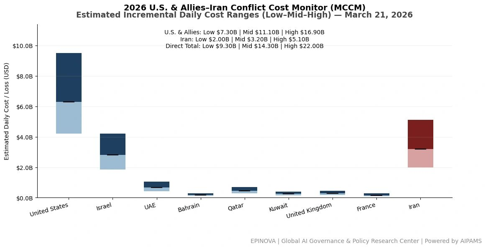
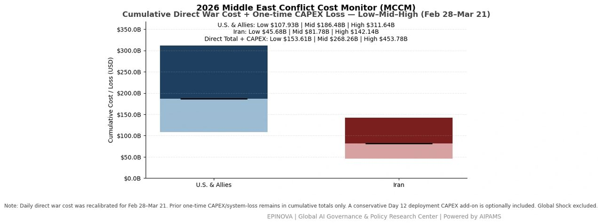
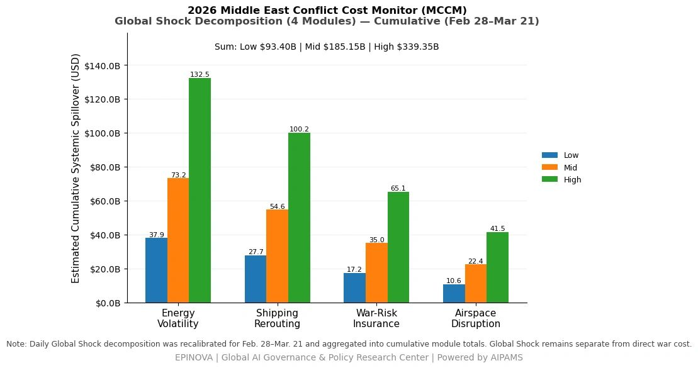
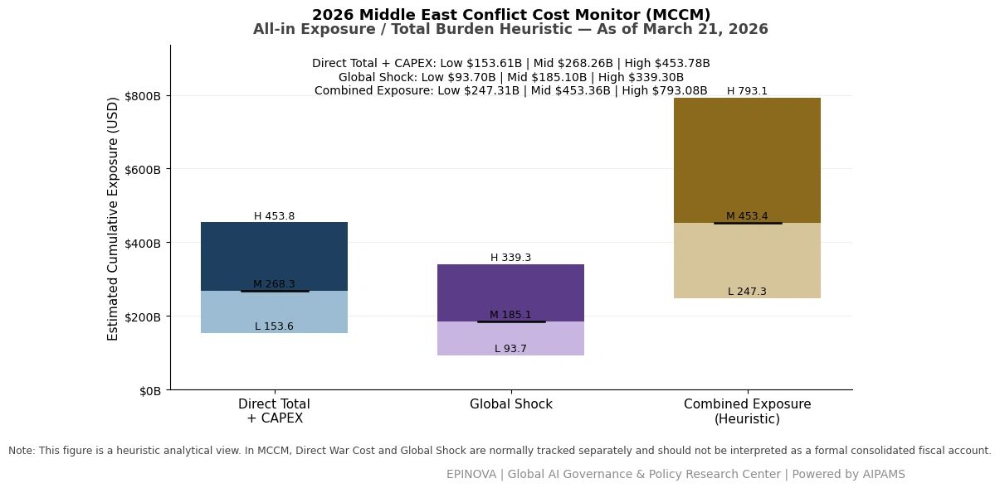

# 2026 U.S. & Allies–Iran Conflict Cost Monitor (MCCM): March 21

Original URL: https://epinova.org/articles/f/2026-us-allies%E2%80%93iran-conflict-cost-monitor-mccm-march-21

Publication date: 2026-03-21

Archive note: This is a locally preserved Markdown copy of an EPINOVA article originally generated through the GoDaddy blog system.

---

[All Posts](<https://epinova.org/articles?blog=y>)

### 2026 U.S. & Allies–Iran Conflict Cost Monitor (MCCM): March 21

March 21, 2026|Global AI Governance & Policy

**Powered by AIPAMS**

  

**1\. Introduction**

The **2026 Middle East Conflict Cost Monitor (MCCM)** provides an event-driven, scenario-based assessment of daily conflict-related expenditures and losses across major state actors involved in the crisis. Using a structured **low–mid–high estimation framework** , the series aggregates publicly available operational indicators, force posture changes, strike intensity proxies, reported material damage, and infrastructure disruptions to produce comparable daily cost ranges.

The MCCM framework distinguishes between three analytical components:  
(1) **Direct War Cost** , which includes military operational expenditures, asset losses, and selected capital losses (CAPEX);  
(2) **Infrastructure and energy-sector disruption costs** linked to conflict operations; and  
(3) **Systemic market spillovers (“Global Shock”)** , which capture broader economic and logistical externalities associated with regional escalation.

Direct war costs and systemic spillovers are **reported separately** to maintain analytical clarity between conflict-specific expenditures and wider economic effects.

MCCM is designed as a **rolling monitoring instrument rather than a definitive accounting ledger**. Estimates are produced using scenario-bounded ranges intended to support comparative analysis and policy discussion rather than precise fiscal accounting. All values are expressed in **current U.S. dollars (USD)** and may be **revised retroactively** as verification improves and additional information becomes available.

  

  

  

**2\. Methodological Notes**

**A. Scenario Ranges.**  
All estimates are presented as bounded ranges.

  * **Low:** Minimum confirmed observable losses.
  * **Mid:** Most probable estimate based on publicly available reporting and operational cost parameters.
  * **High:** Upper-bound scenario incorporating reported but not independently verified high-value asset losses.  

**B. Daily Estimates.**  
Reported figures represent **incremental 24-hour estimates** of conflict-related costs and losses.

**C. Cumulative Totals.**  
Cumulative values reflect the **aggregation of daily scenario ranges** over the reporting period. High-range values may include scenario-based adjustments for reported strategic asset losses pending independent verification.

**D. Global Shock.**  
Global Shock represents **systemic economic spillovers** generated by the conflict and is reported separately from direct military costs. It is decomposed into four modules:

  * Energy Volatility
  * Shipping Rerouting
  * War-Risk Insurance Premiums
  * Airspace Disruption

These modules capture major **economic and logistical externalities** associated with regional escalation.

**D. Combined Exposure (Heuristic).**  
In selected figures, Direct War Cost and Global Shock may be displayed together as a **Combined Exposure heuristic** to illustrate the approximate scale of total economic exposure associated with the conflict. This aggregation is **analytical only** and should not be interpreted as a formal consolidated fiscal account.

**E. Revision Policy.**  
All MCCM estimates are derived from **open-source reporting and model-based reconstruction** and remain subject to revision as verification improves.

  

**Selected References:**

Associated Press. (2026, March 21). _Iran launches missile attacks on U.S. bases across Middle East as conflict escalates_. <https://apnews.com/>

Al Jazeera. (2026, March 21). _Iran’s Operation True Promise expands with new missile and drone attacks on U.S. and Israeli targets_. <https://www.aljazeera.com/>

BBC News. (2026, March 21). _US weighs next steps as Iran conflict intensifies and regional tensions rise_. <https://www.bbc.com/news>

Reuters. (2026, March 21). _Iran warns UK over base access, launches new wave of strikes across region_. [https://www.reuters.com/world/middle-east/](<https://www.reuters.com/world/middle-east/?utm_source=chatgpt.com>)

Reuters. (2026, March 21). _Trump considers scaling back Iran strikes while Pentagon prepares ground options_. <https://www.reuters.com/world/us/>

Reuters. (2026, March 21). _Oil prices surge amid fears of Hormuz disruption and prolonged Middle East conflict_. <https://www.reuters.com/markets/commodities/>

CNN. (2026, March 21). _US public opinion divided as administration considers escalation in Iran conflict_. <https://www.cnn.com/>

Bloomberg. (2026, March 21). _US war costs rise sharply as missile defense and deployments intensify_. <https://www.bloomberg.com/>

Financial Times. (2026, March 21). _Iran issues high-denomination currency amid wartime inflation pressure_. <https://www.ft.com/>

The New York Times. (2026, March 21). _Pentagon weighs options for seizing Iranian nuclear material_. <https://www.nytimes.com/>

CBS News. (2026, March 21). _US explores contingency plans targeting Iran nuclear stockpiles_. <https://www.cbsnews.com/>

The Wall Street Journal. (2026, March 21). _Energy markets brace for prolonged Hormuz disruption risk_. <https://www.wsj.com/>

Euronews. (2026, March 21). _European nations coordinate response to shipping disruption in Gulf_. <https://www.euronews.com/>

Agence France-Presse. (2026, March 21). _Iran launches 70th and 71st wave of attacks in ongoing conflict_. <https://www.afp.com/>

Deutsche Welle. (2026, March 21). _Regional tensions escalate as Iran expands strike radius and tactics_. <https://www.dw.com/>

新华社. (2026年3月21日). _伊朗发动第70波打击并警告扩大行动范围_. <https://www.xinhuanet.com/>

新华社. (2026年3月21日). _以色列继续空袭伊朗目标 中东局势持续升级_. <https://www.xinhuanet.com/>

央视新闻. (2026年3月21日). _伊朗称对中东多处美军基地发动导弹袭击_. <https://news.cctv.com/>

央视新闻. (2026年3月21日). _伊朗警告将在霍尔木兹海峡采取重大行动_. <https://news.cctv.com/>

参考消息. (2026年3月21日). _美伊冲突进入第22天 多方表态升级_. <https://www.cankaoxiaoxi.com/>

环球时报. (2026年3月21日). _美军损失与战争成本持续上升 引发国内争议_. <https://www.globaltimes.cn/>

每日经济新闻. (2026年3月21日). _美以袭击伊核设施 伊朗警告扩大打击范围_. <https://www.nbd.com.cn/>

观察者网. (2026年3月20日). _伊朗发动第69波打击 针对以色列核心地带_. <https://www.guancha.cn/>

极目新闻. (2026年3月20日). _伊朗称将允许日本相关船只通行霍尔木兹海峡_. <https://www.ctdsb.net/>

看看新闻. (2026年3月20日). _伊朗发动第70波打击行动 使用多型导弹与无人机_. <https://www.kankanews.com/>

Share this post:
