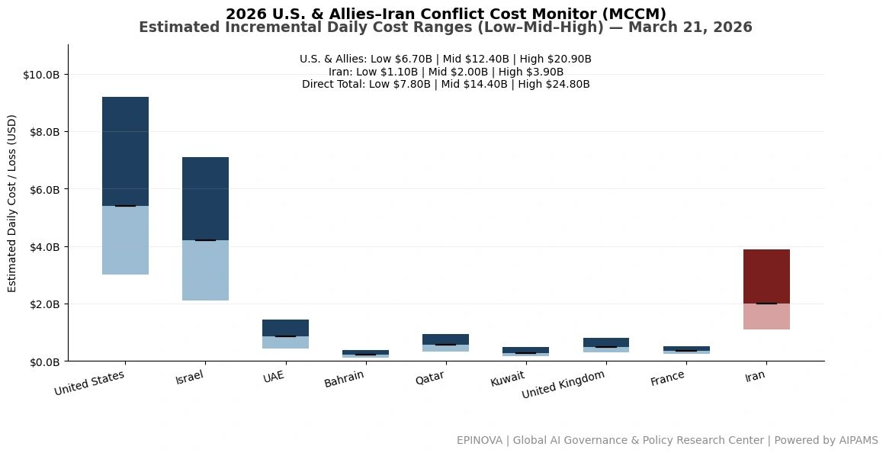
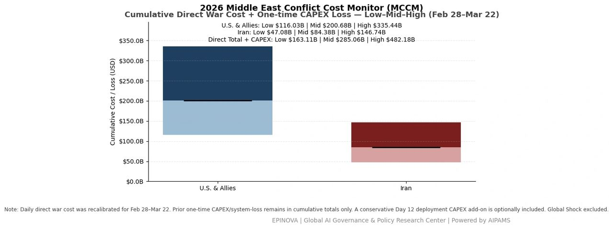
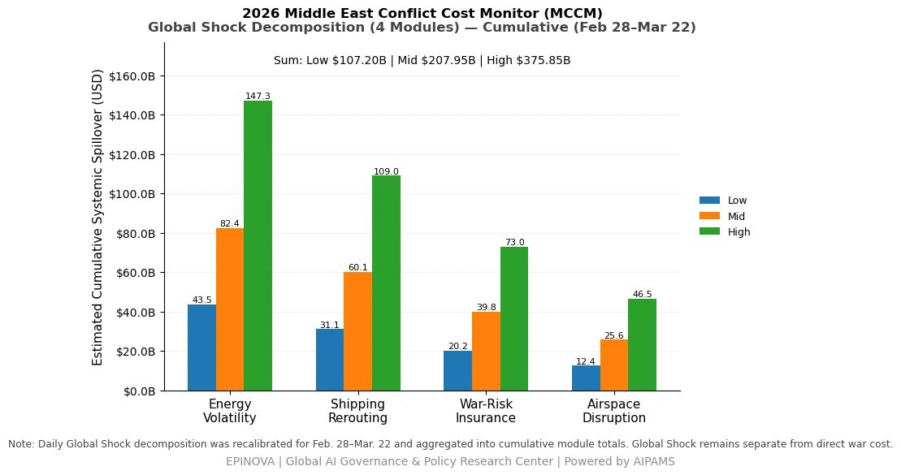
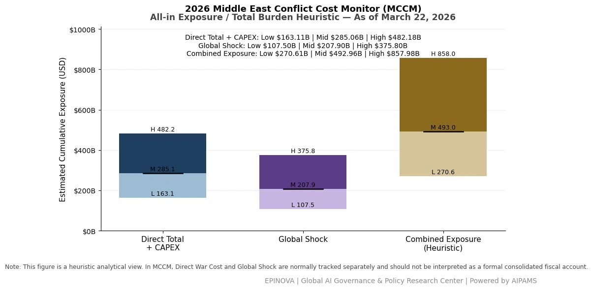

# 2026 U.S. & Allies–Iran Conflict Cost Monitor (MCCM): March 22

Original URL: https://epinova.org/articles/f/2026-us-allies%E2%80%93iran-conflict-cost-monitor-mccm-march-22

Publication date: 2026-03-22

Archive note: This is a locally preserved Markdown copy of an EPINOVA article originally generated through the GoDaddy blog system.

---

[All Posts](<https://epinova.org/articles?blog=y>)

### 2026 U.S. & Allies–Iran Conflict Cost Monitor (MCCM): March 22

March 22, 2026|Global AI Governance & Policy

**Powered by AIPAMS**

  

**1\. Introduction**

The **2026 Middle East Conflict Cost Monitor (MCCM)** provides an event-driven, scenario-based assessment of daily conflict-related expenditures and losses across major state actors involved in the crisis. Using a structured **low–mid–high estimation framework** , the series aggregates publicly available operational indicators, force posture changes, strike intensity proxies, reported material damage, and infrastructure disruptions to produce comparable daily cost ranges.

The MCCM framework distinguishes between three analytical components:  
(1) **Direct War Cost** , which includes military operational expenditures, asset losses, and selected capital losses (CAPEX);  
(2) **Infrastructure and energy-sector disruption costs** linked to conflict operations; and  
(3) **Systemic market spillovers (“Global Shock”)** , which capture broader economic and logistical externalities associated with regional escalation.

Direct war costs and systemic spillovers are **reported separately** to maintain analytical clarity between conflict-specific expenditures and wider economic effects.

MCCM is designed as a **rolling monitoring instrument rather than a definitive accounting ledger**. Estimates are produced using scenario-bounded ranges intended to support comparative analysis and policy discussion rather than precise fiscal accounting. All values are expressed in **current U.S. dollars (USD)** and may be **revised retroactively** as verification improves and additional information becomes available.

  

  

  

**2\. Methodological Notes**

**A. Scenario Ranges.**  
All estimates are presented as bounded ranges.

  * **Low:** Minimum confirmed observable losses.
  * **Mid:** Most probable estimate based on publicly available reporting and operational cost parameters.
  * **High:** Upper-bound scenario incorporating reported but not independently verified high-value asset losses.  

**B. Daily Estimates.**  
Reported figures represent **incremental 24-hour estimates** of conflict-related costs and losses.

**C. Cumulative Totals.**  
Cumulative values reflect the **aggregation of daily scenario ranges** over the reporting period. High-range values may include scenario-based adjustments for reported strategic asset losses pending independent verification.

**D. Global Shock.**  
Global Shock represents **systemic economic spillovers** generated by the conflict and is reported separately from direct military costs. It is decomposed into four modules:

  * Energy Volatility
  * Shipping Rerouting
  * War-Risk Insurance Premiums
  * Airspace Disruption

These modules capture major **economic and logistical externalities** associated with regional escalation.

**D. Combined Exposure (Heuristic).**  
In selected figures, Direct War Cost and Global Shock may be displayed together as a **Combined Exposure heuristic** to illustrate the approximate scale of total economic exposure associated with the conflict. This aggregation is **analytical only** and should not be interpreted as a formal consolidated fiscal account.

**E. Revision Policy.**  
All MCCM estimates are derived from **open-source reporting and model-based reconstruction** and remain subject to revision as verification improves.

  

**Selected References:**

Associated Press. (2026, March 21). Iran warns it will target energy and infrastructure if attacked. [https://apnews.com/article/16cc60862529b873666ce4c1f6529d78](<https://apnews.com/article/16cc60862529b873666ce4c1f6529d78?utm_source=chatgpt.com>)

Reuters. (2026, March 22). Trump threatens Iran with power plant strikes over Hormuz blockade. [https://www.reuters.com/world/middle-east/trump-threatens-iran-with-power-plant-strikes-over-hormuz-blockade-2026-03-22/](<https://www.reuters.com/world/middle-east/trump-threatens-iran-with-power-plant-strikes-over-hormuz-blockade-2026-03-22/?utm_source=chatgpt.com>)

Reuters. (2026, March 22). Iran says Hormuz open to all except enemy-linked ships amid U.S. threat. [https://www.reuters.com/world/middle-east/iran-says-hormuz-open-all-enemy-linked-ships-amid-us-threat-2026-03-22/](<https://www.reuters.com/world/middle-east/iran-says-hormuz-open-all-enemy-linked-ships-amid-us-threat-2026-03-22/?utm_source=chatgpt.com>)

Reuters. (2026, March 22). Scores hurt after Iranian missiles hit Israeli desert towns. [https://www.reuters.com/world/middle-east/scores-hurt-after-iranian-missiles-hit-israeli-desert-towns-2026-03-22/](<https://www.reuters.com/world/middle-east/scores-hurt-after-iranian-missiles-hit-israeli-desert-towns-2026-03-22/?utm_source=chatgpt.com>)

Reuters. (2026, March 21). Israel attacks Tehran, Beirut as conflict escalates; U.S. deploys forces. [https://www.reuters.com/world/middle-east/israel-attacks-tehran-beirut-us-sends-marines-middle-east-2026-03-21/](<https://www.reuters.com/world/middle-east/israel-attacks-tehran-beirut-us-sends-marines-middle-east-2026-03-21/?utm_source=chatgpt.com>)

Reuters. (2026, March 21). Saudi Arabia orders Iranian military attaché and embassy staff to leave. [https://www.reuters.com/world/middle-east/saudi-arabia-orders-iranian-military-attache-four-embassy-staff-leave-2026-03-21/](<https://www.reuters.com/world/middle-east/saudi-arabia-orders-iranian-military-attache-four-embassy-staff-leave-2026-03-21/?utm_source=chatgpt.com>)

Reuters. (2026, March 17). U.S. carrier Ford to dock temporarily after fire but remains operational. [https://www.reuters.com/world/us-carrier-ford-deployed-war-with-iran-go-port-temporarily-after-fire-2026-03-17/](<https://www.reuters.com/world/us-carrier-ford-deployed-war-with-iran-go-port-temporarily-after-fire-2026-03-17/?utm_source=chatgpt.com>)

The Guardian. (2026, March 21). Middle East crisis live: Iran war updates and regional escalation. [https://www.theguardian.com/world/live/2026/mar/21/middle-east-crisis-live-iran-war-trump-eases-oil-sanctions-israel-strikes](<https://www.theguardian.com/world/live/2026/mar/21/middle-east-crisis-live-iran-war-trump-eases-oil-sanctions-israel-strikes?utm_source=chatgpt.com>)

The Guardian. (2026, March 22). Middle East crisis live: Trump ultimatum, Iran response, Israel strikes. [https://www.theguardian.com/world/live/2026/mar/22/middle-east-crisis-live-iran-war-trump-ultimatum-major-attack-strait-of-hormuz-open-israel-hit-tehran-retaliation](<https://www.theguardian.com/world/live/2026/mar/22/middle-east-crisis-live-iran-war-trump-ultimatum-major-attack-strait-of-hormuz-open-israel-hit-tehran-retaliation?utm_source=chatgpt.com>)

The Wall Street Journal. (2026, March 21). U.S. Mideast commander says strikes hit over 8,000 Iranian targets. [https://www.wsj.com/livecoverage/iran-us-israel-war-updates-2026/card/u-s-mideast-commander-our-progress-is-obvious--SvckSKMHDxeTatrvW1LD](<https://www.wsj.com/livecoverage/iran-us-israel-war-updates-2026/card/u-s-mideast-commander-our-progress-is-obvious--SvckSKMHDxeTatrvW1LD?utm_source=chatgpt.com>)

The Times. (2026, March 21). Iran fires long-range missiles toward Diego Garcia base. [https://www.thetimes.com/world/middle-east/article/iran-uk-ballistic-missiles-war-diego-garcia-distance-europe-7rfbpp5gh](<https://www.thetimes.com/world/middle-east/article/iran-uk-ballistic-missiles-war-diego-garcia-distance-europe-7rfbpp5gh?utm_source=chatgpt.com>)

Anadolu Agency. (2026, March 22). UN nuclear watchdog says no damage detected at Israeli nuclear center after Iran strike. [https://www.aa.com.tr/en/world/un-nuclear-watchdog-says-no-damage-detected-at-israeli-nuclear-center-after-iran-strike/3874346](<https://www.aa.com.tr/en/world/un-nuclear-watchdog-says-no-damage-detected-at-israeli-nuclear-center-after-iran-strike/3874346?utm_source=chatgpt.com>)

gCaptain. (2026, March 21). UK nuclear-powered submarine positioned in Arabian Sea amid regional tensions. [https://gcaptain.com/uk-nuclear-powered-submarine-positioned-in-arabian-sea-amid-regional-tensions/](<https://gcaptain.com/uk-nuclear-powered-submarine-positioned-in-arabian-sea-amid-regional-tensions/?utm_source=chatgpt.com>)

Share this post:
