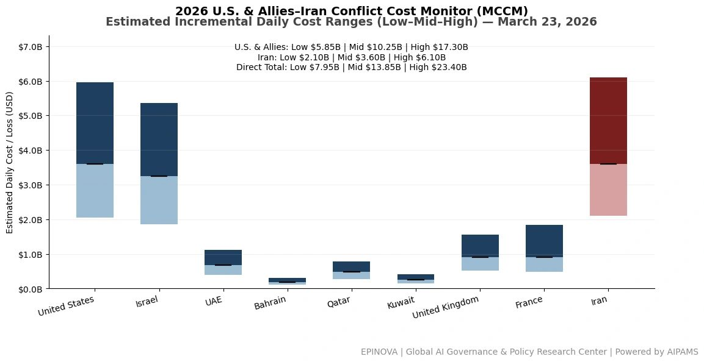
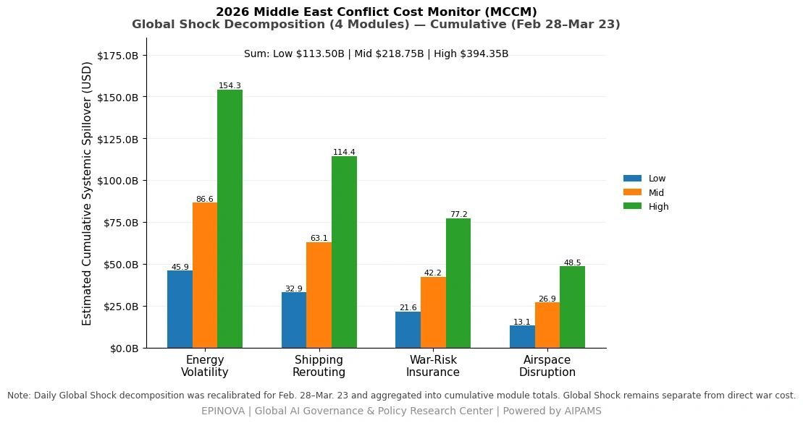
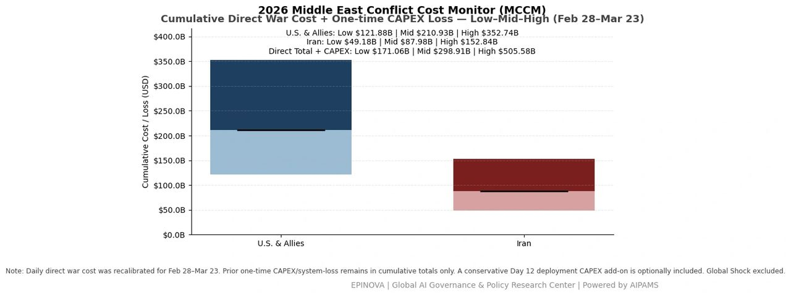
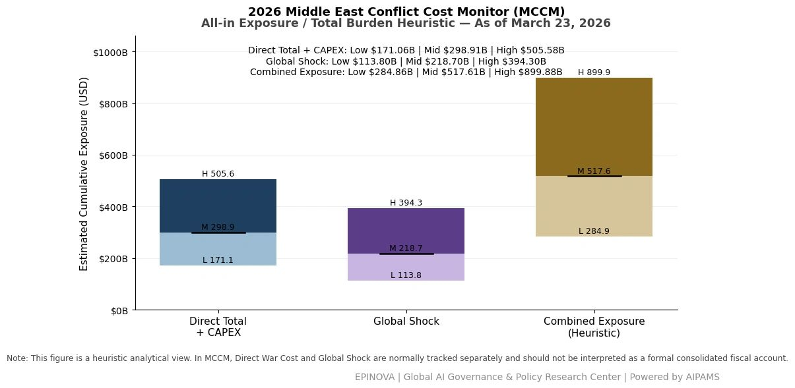

# 2026 U.S. & Allies–Iran Conflict Cost Monitor (MCCM): March 23

Original URL: https://epinova.org/articles/f/2026-us-allies%E2%80%93iran-conflict-cost-monitor-mccm-march-23

Publication date: 2026-03-23

Archive note: This is a locally preserved Markdown copy of an EPINOVA article originally generated through the GoDaddy blog system.

---

[All Posts](<https://epinova.org/articles?blog=y>)

### 2026 U.S. & Allies–Iran Conflict Cost Monitor (MCCM): March 23

March 23, 2026|Global AI Governance & Policy

**Powered by AIPAMS**

  

**1\. Introduction**

The **2026 Middle East Conflict Cost Monitor (MCCM)** provides an event-driven, scenario-based assessment of daily conflict-related expenditures and losses across major state actors involved in the crisis. Using a structured **low–mid–high estimation framework** , the series aggregates publicly available operational indicators, force posture changes, strike intensity proxies, reported material damage, and infrastructure disruptions to produce comparable daily cost ranges.

The MCCM framework distinguishes between three analytical components:  
(1) **Direct War Cost** , which includes military operational expenditures, asset losses, and selected capital losses (CAPEX);  
(2) **Infrastructure and energy-sector disruption costs** linked to conflict operations; and  
(3) **Systemic market spillovers (“Global Shock”)** , which capture broader economic and logistical externalities associated with regional escalation.

Direct war costs and systemic spillovers are **reported separately** to maintain analytical clarity between conflict-specific expenditures and wider economic effects.

MCCM is designed as a **rolling monitoring instrument rather than a definitive accounting ledger**. Estimates are produced using scenario-bounded ranges intended to support comparative analysis and policy discussion rather than precise fiscal accounting. All values are expressed in **current U.S. dollars (USD)** and may be **revised retroactively** as verification improves and additional information becomes available.

  

  

**2\. Methodological Notes**

**A. Scenario Ranges.**  
All estimates are presented as bounded ranges.

  * **Low:** Minimum confirmed observable losses.
  * **Mid:** Most probable estimate based on publicly available reporting and operational cost parameters.
  * **High:** Upper-bound scenario incorporating reported but not independently verified high-value asset losses.  

**B. Daily Estimates.**  
Reported figures represent **incremental 24-hour estimates** of conflict-related costs and losses.

**C. Cumulative Totals.**  
Cumulative values reflect the **aggregation of daily scenario ranges** over the reporting period. High-range values may include scenario-based adjustments for reported strategic asset losses pending independent verification.

**D. Global Shock.**  
Global Shock represents **systemic economic spillovers** generated by the conflict and is reported separately from direct military costs. It is decomposed into four modules:

  * Energy Volatility
  * Shipping Rerouting
  * War-Risk Insurance Premiums
  * Airspace Disruption

These modules capture major **economic and logistical externalities** associated with regional escalation.

**E. Combined Exposure (Heuristic).**  
In selected figures, Direct War Cost and Global Shock may be displayed together as a **Combined Exposure heuristic** to illustrate the approximate scale of total economic exposure associated with the conflict. This aggregation is **analytical only** and should not be interpreted as a formal consolidated fiscal account.

**F. Revision Policy.**  
All MCCM estimates are derived from **open-source reporting and model-based reconstruction** and remain subject to revision as verification improves.

  

**Selected References:**

Reuters. (2026, March 23). _Trump postpones military strikes on Iranian power plants_. [https://www.reuters.com/world/trump-postpones-military-strikes-iranian-power-plants-2026-03-23/](<https://www.reuters.com/world/trump-postpones-military-strikes-iranian-power-plants-2026-03-23/?utm_source=chatgpt.com>)

Reuters. (2026, March 23). _Iran threatens to retaliate against Gulf energy and water facilities after Trump ultimatum_. [https://www.reuters.com/world/middle-east/iran-threatens-retaliate-against-gulf-energy-water-after-trump-ultimatum-2026-03-23/](<https://www.reuters.com/world/middle-east/iran-threatens-retaliate-against-gulf-energy-water-after-trump-ultimatum-2026-03-23/?utm_source=chatgpt.com>)

Reuters. (2026, March 23). _Israeli military says it is conducting strikes in Tehran_. [https://www.reuters.com/world/middle-east/israeli-military-says-it-is-conducting-strikes-tehran-2026-03-23/](<https://www.reuters.com/world/middle-east/israeli-military-says-it-is-conducting-strikes-tehran-2026-03-23/?utm_source=chatgpt.com>)

Reuters. (2026, March 23). _Israel signals possible expansion of operations in southern Lebanon_. [https://www.reuters.com/world/middle-east/israeli-minister-calls-annexation-southern-lebanon-2026-03-23/](<https://www.reuters.com/world/middle-east/israeli-minister-calls-annexation-southern-lebanon-2026-03-23/?utm_source=chatgpt.com>)

Reuters. (2026, March 19). _Greek-operated air defence system shoots down Iranian missiles over Saudi Arabia_. [https://www.reuters.com/business/aerospace-defense/greek-operated-air-defence-system-shoots-down-iranian-missiles-over-saudi-2026-03-19/](<https://www.reuters.com/business/aerospace-defense/greek-operated-air-defence-system-shoots-down-iranian-missiles-over-saudi-2026-03-19/?utm_source=chatgpt.com>)

Reuters. (2026, March 16). _Trump weighs seizing Iran’s Kharg Island oil hub amid Gulf escalation_. [https://www.reuters.com/sitemap/2026-03/16/1/](<https://www.reuters.com/sitemap/2026-03/16/1/?utm_source=chatgpt.com>)

Reuters. (2026, March 14). _Trump says most planes targeted in attack on Saudi Arabia base had little damage_. [https://www.reuters.com/world/trump-says-most-planes-targeted-attack-saudi-arabia-base-had-little-damage-2026-03-14/](<https://www.reuters.com/world/trump-says-most-planes-targeted-attack-saudi-arabia-base-had-little-damage-2026-03-14/?utm_source=chatgpt.com>)

Axios. (2026, March 23). _Backchannel diplomacy intensifies as U.S. and Iran explore ceasefire options_. <https://www.axios.com/>

The Wall Street Journal. (2026, March 23). _U.S. and Iran explore indirect talks as conflict escalates_. <https://www.wsj.com/>

新华社. (2026年3月23日). _以色列军方称正在对德黑兰实施打击_. <https://www.xinhuanet.com/>

新华社. (2026年3月23日). _美国与伊朗接触传闻引发市场波动_. <https://www.xinhuanet.com/>

央视新闻. (2026年3月23日). _以方称美伊或在伊斯兰堡举行会谈_. <https://news.cctv.com/>

央视新闻. (2026年3月23日). _伊朗称在霍尔木兹海峡附近击落两架美军无人机_. <https://news.cctv.com/>

澎湃新闻. (2026年3月23日). _以色列官员称美伊或将在巴基斯坦举行会谈_. <https://www.thepaper.cn/>

红星新闻. (2026年3月23日). _伊朗称已准备“惊喜行动”_. <https://www.chengdu.cn/>

潇湘晨报. (2026年3月23日). _土耳其、埃及和巴基斯坦在美伊之间传递信息_. <https://www.xxcb.cn/>

环球时报. (2026年3月23日). _日本或在霍尔木兹海峡执行扫雷任务_. <https://www.huanqiu.com/>

新华社. (2026年3月23日). _俄罗斯波罗的海石油港口遭无人机袭击或影响全球能源供应_. <https://www.xinhuanet.com/>

Share this post:
