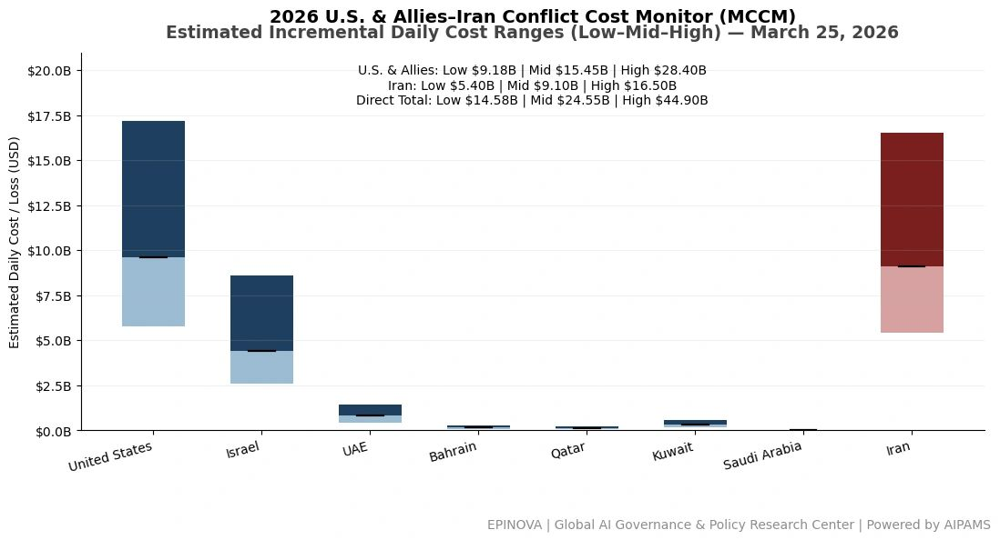
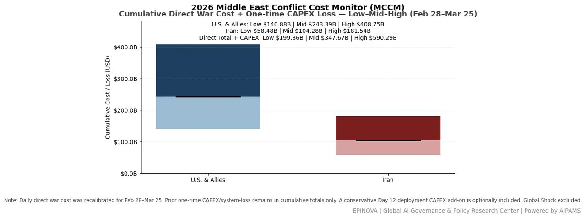
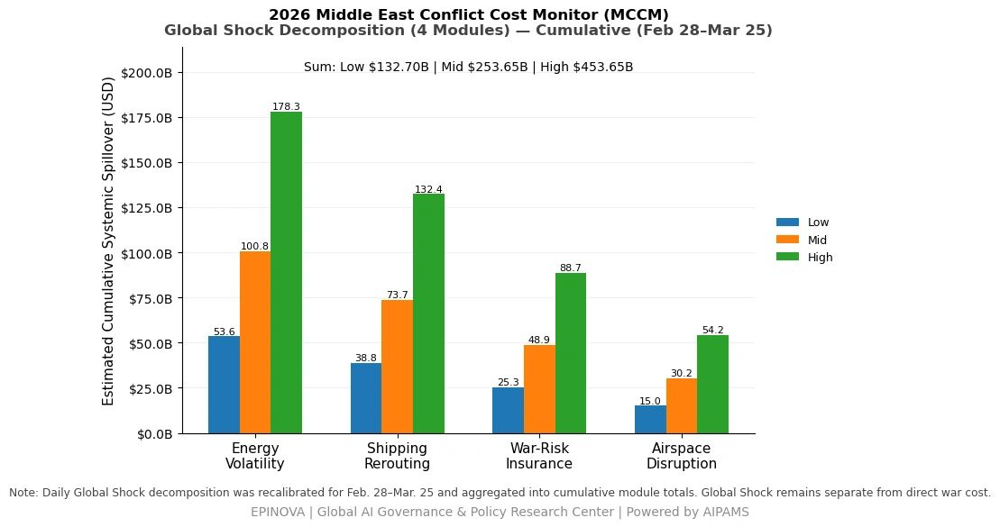
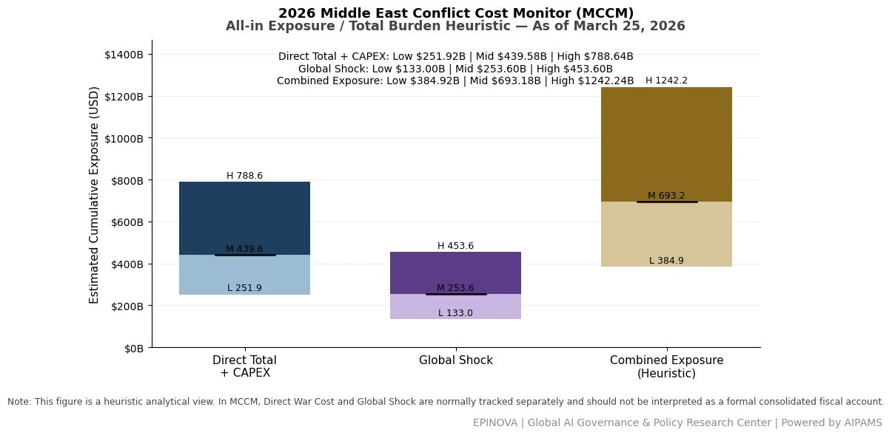

# 2026 U.S. & Allies–Iran Conflict Cost Monitor (MCCM): March 25

Original URL: https://epinova.org/articles/f/2026-us-allies%E2%80%93iran-conflict-cost-monitor-mccm-march-25

Publication date: 2026-03-25

Archive note: This is a locally preserved Markdown copy of an EPINOVA article originally generated through the GoDaddy blog system.

---

[All Posts](<https://epinova.org/articles?blog=y>)

### 2026 U.S. & Allies–Iran Conflict Cost Monitor (MCCM): March 25

March 25, 2026|Global AI Governance & Policy

**Powered by AIPAMS**

  

**1\. Introduction**

The **2026 Middle East Conflict Cost Monitor (MCCM)** provides an event-driven, scenario-based assessment of daily conflict-related expenditures and losses across major state actors involved in the crisis. Using a structured **low–mid–high estimation framework** , the series aggregates publicly available operational indicators, force posture changes, strike intensity proxies, reported material damage, and infrastructure disruptions to produce comparable daily cost ranges.

The MCCM framework distinguishes between three analytical components:  
(1) **Direct War Cost** , which includes military operational expenditures, asset losses, and selected capital losses (CAPEX);  
(2) **Infrastructure and energy-sector disruption costs** linked to conflict operations; and  
(3) **Systemic market spillovers (“Global Shock”)** , which capture broader economic and logistical externalities associated with regional escalation.

Direct war costs and systemic spillovers are **reported separately** to maintain analytical clarity between conflict-specific expenditures and wider economic effects.

MCCM is designed as a **rolling monitoring instrument rather than a definitive accounting ledger**. Estimates are produced using scenario-bounded ranges intended to support comparative analysis and policy discussion rather than precise fiscal accounting. All values are expressed in **current U.S. dollars (USD)** and may be **revised retroactively** as verification improves and additional information becomes available.

  

  

  

**2\. Methodological Notes**

**A. Scenario Ranges.**  
All estimates are presented as bounded ranges.

  * **Low:** Minimum confirmed observable losses.
  * **Mid:** Most probable estimate based on publicly available reporting and operational cost parameters.
  * **High:** Upper-bound scenario incorporating reported but not independently verified high-value asset losses.  

**B. Daily Estimates.**  
Reported figures represent **incremental 24-hour estimates** of conflict-related costs and losses.

**C. Cumulative Totals.**  
Cumulative values reflect the **aggregation of daily scenario ranges** over the reporting period. High-range values may include scenario-based adjustments for reported strategic asset losses pending independent verification.

**D. Global Shock.**  
Global Shock represents **systemic economic spillovers** generated by the conflict and is reported separately from direct military costs. It is decomposed into four modules:

  * Energy Volatility
  * Shipping Rerouting
  * War-Risk Insurance Premiums
  * Airspace Disruption

These modules capture major **economic and logistical externalities** associated with regional escalation.

**E. Combined Exposure (Heuristic).**  
In selected figures, Direct War Cost and Global Shock may be displayed together as a **Combined Exposure heuristic** to illustrate the approximate scale of total economic exposure associated with the conflict. This aggregation is **analytical only** and should not be interpreted as a formal consolidated fiscal account.

**F. Revision Policy.**  
All MCCM estimates are derived from **open-source reporting and model-based reconstruction** and remain subject to revision as verification improves.

  

**Selected References:**

Associated Press. (2026, March 24). _U.S. prepares additional troop deployments to Middle East amid escalating Iran conflict_. <https://apnews.com/>

International Atomic Energy Agency. (2026, March 24). _IAEA calls for restraint after reported strikes on Iranian nuclear facilities_. <https://www.iaea.org/news>

Reuters. (2026, March 25). _Iran rejects U.S.-backed ceasefire proposal delivered via Pakistan, officials say_. <https://www.reuters.com/world/middle-east/>

Reuters. (2026, March 25). _Iran outlines conditions for ending conflict, including compensation and Strait of Hormuz sovereignty_. <https://www.reuters.com/world/middle-east/>

Reuters. (2026, March 25). _Israeli military expands reserve mobilization amid ongoing Iran-linked escalation_. <https://www.reuters.com/world/middle-east/>

Reuters. (2026, March 25). _Russia criticizes Israeli strike on Iranian Caspian port, warns of regional spillover risks_. <https://www.reuters.com/world/europe/>

The New York Times. (2026, March 24). _U.S. considers deploying additional airborne forces as Middle East conflict intensifies_. <https://www.nytimes.com/>

The Wall Street Journal. (2026, March 25). _U.S. officials say Marine expeditionary unit deploying to Central Command region_. <https://www.wsj.com/>

U.S. Department of Defense. (2026, March 25). _Force posture updates in U.S. Central Command area of responsibility_. <https://www.defense.gov/>

U.S. Department of State. (2026, March 25). _Approval of foreign military sales to Japan and South Korea_. <https://www.state.gov/>

White House. (2026, March 24). _Remarks by President Trump on U.S. operations against Iran_. <https://www.whitehouse.gov/>

新华社. (2026年3月24日). 《国际原子能机构呼吁各方保持克制，避免伊朗核设施冲突升级》. <https://www.xinhuanet.com/>

新华社. (2026年3月25日). 《美方通过巴基斯坦向伊朗提出结束冲突方案》. <https://www.xinhuanet.com/>

新华社. (2026年3月25日). 《伊朗对美国停火提议作出回应并提出条件》. <https://www.xinhuanet.com/>

新华社. (2026年3月25日). 《以色列称拦截来自伊朗的导弹攻击》. <https://www.xinhuanet.com/>

新华社. (2026年3月25日). 《阿联酋公布防空拦截数据》. <https://www.xinhuanet.com/>

央视网. (2026年3月25日). 《伊朗启动新一轮导弹打击行动，持续回应冲突》. <https://news.cctv.com/>

Share this post:
