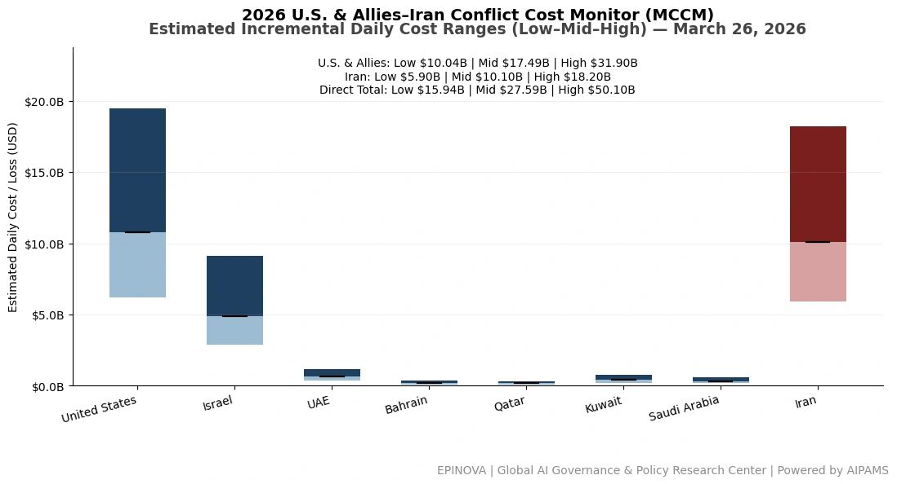
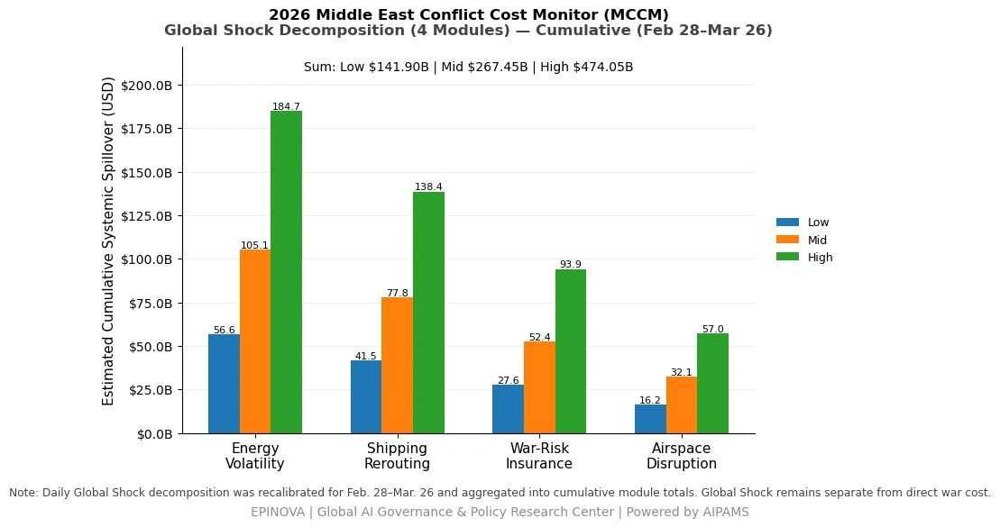
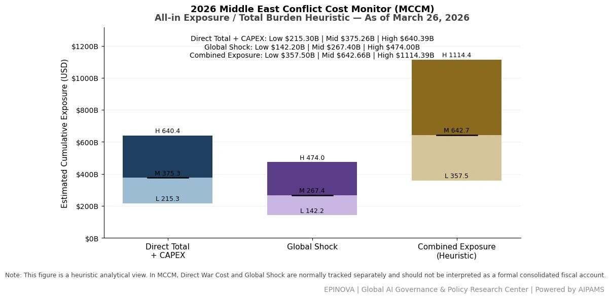

# 2026 U.S. & Allies–Iran Conflict Cost Monitor (MCCM): March 26

Original URL: https://epinova.org/articles/f/2026-us-allies%E2%80%93iran-conflict-cost-monitor-mccm-march-26

Publication date: 2026-03-26

Archive note: This is a locally preserved Markdown copy of an EPINOVA article originally generated through the GoDaddy blog system.

---

[All Posts](<https://epinova.org/articles?blog=y>)

### 2026 U.S. & Allies–Iran Conflict Cost Monitor (MCCM): March 26

March 26, 2026|Global AI Governance & Policy

**Powered by AIPAMS (Adaptive Integrated Policy & Analytics Modeling System) **

  

**1\. Introduction**

The **2026 Middle East Conflict Cost Monitor (MCCM)** provides an event-driven, scenario-based assessment of daily conflict-related expenditures and losses across major state actors involved in the crisis. Using a structured **low–mid–high estimation framework** , the series aggregates publicly available operational indicators, force posture changes, strike intensity proxies, reported material damage, and infrastructure disruptions to produce comparable daily cost ranges.

The MCCM framework distinguishes between three analytical components:  
(1) **Direct War Cost** , which includes military operational expenditures, asset losses, and selected capital losses (CAPEX);  
(2) **Infrastructure and energy-sector disruption costs** linked to conflict operations; and  
(3) **Systemic market spillovers (“Global Shock”)** , which capture broader economic and logistical externalities associated with regional escalation.

Direct war costs and systemic spillovers are **reported separately** to maintain analytical clarity between conflict-specific expenditures and wider economic effects.

MCCM is designed as a **rolling monitoring instrument rather than a definitive accounting ledger**. Estimates are produced using scenario-bounded ranges intended to support comparative analysis and policy discussion rather than precise fiscal accounting. All values are expressed in **current U.S. dollars (USD)** and may be **revised retroactively** as verification improves and additional information becomes available.

As the conflict evolves, MCCM increasingly captures not only direct cost accumulation but also dynamic interactions between military operations, strategic signaling, and systemic economic responses, reflecting a transition from a cost-tracking model to an integrated exposure assessment framework. 

  

  

  

**2\. Methodological Notes**

**A. Scenario Ranges.**  
All estimates are presented as bounded ranges.

  * **Low:** Minimum confirmed observable losses.
  * **Mid:** Most probable estimate based on publicly available reporting and operational cost parameters.
  * **High:** Upper-bound scenario incorporating reported but not independently verified high-value asset losses.  

**B. Daily Estimates.**  
Reported figures represent **incremental 24-hour estimates** of conflict-related costs and losses.

**C. Cumulative Totals.**  
Cumulative values reflect the **aggregation of daily scenario ranges** over the reporting period. High-range values may include scenario-based adjustments for reported strategic asset losses pending independent verification.

**D. Global Shock.**  
Global Shock represents systemic economic spillovers generated by the conflict, including both escalation-driven disruptions and temporary stabilization effects arising from partial de-escalation signals (e.g., controlled energy transit, diplomatic signaling). It is decomposed into four modules:

  * Energy Volatility
  * Shipping Rerouting
  * War-Risk Insurance Premiums
  * Airspace Disruption

These modules capture major **economic and logistical externalities** associated with regional escalation.

**D. Combined Exposure.**  
In selected figures, Direct War Cost and Global Shock may be displayed together as a **Combined Exposure heuristic** to illustrate the approximate scale of total economic exposure associated with the conflict. This aggregation is **analytical only** and should not be interpreted as a formal consolidated fiscal account. Under high-frequency strike conditions and partial system stabilization, Combined Exposure serves as a more informative indicator of systemic burden than isolated cost metrics. 

**E. Revision Policy.**  
All MCCM estimates are derived from **open-source reporting and model-based reconstruction** and remain subject to revision as verification improves.

**F. Structural Interpretation Note.**

At later stages of the conflict, cost accumulation alone may not fully capture strategic dynamics. MCCM therefore incorporates an exposure-oriented perspective, recognizing that relatively low-cost offensive actions can impose disproportionately high and persistent burdens on complex defense systems and global networks.

This asymmetry may lead to cumulative divergence in system sustainability, particularly under saturation conditions.

  

**Selected References:**

Al Jazeera. (2026, March 26). _Iran launches new wave of missile strikes targeting Israeli cities and military infrastructure_. <https://www.aljazeera.com/news/2026/03/26/iran-launches-new-wave-of-missile-strikes>

Associated Press. (2026, March 26). _Iran rejects US ceasefire proposal, sets conditions for negotiations_. <https://apnews.com/article/iran-us-ceasefire-conditions-2026>

Associated Press. (2026, March 25). _Israeli military expands strikes amid concerns over potential US diplomatic shift_. <https://apnews.com/article/israel-strikes-iran-us-policy-2026>

CNN. (2026, March 26). _Iran fortifies Kharg Island as tensions escalate with US forces_. <https://www.cnn.com/2026/03/26/middleeast/iran-kharg-island-defense>

CNN. (2026, March 25). _US Central Command reports extensive strikes on Iranian military infrastructure_. <https://www.cnn.com/2026/03/25/politics/us-centcom-iran-strikes>

Financial Times. (2026, March 26). _Global oil markets stabilize after limited tanker transit through Strait of Hormuz_. <https://www.ft.com/content/hormuz-oil-tanker-transit-2026>

Global Times. (2026, March 25). _Japan to deploy troops to Philippines for joint drills in historic move_. <https://www.globaltimes.cn/page/202603/1287654.shtml>

International Monetary Fund. (2024). _World Economic Outlook database_. <https://www.imf.org/en/Publications/WEO/weo-database/2024>

International Energy Agency. (2025). _Oil market report_. <https://www.iea.org/reports/oil-market-report>

Jane’s Defence Weekly. (2026, March 26). _Iranian missile systems employed in latest strike wave: Imad, Ghadr, Khorramshahr-4 analysis_. <https://www.janes.com/defence-news/iran-missile-strike-analysis-2026>

Lloyd’s List. (2026, March 26). _War risk premiums fluctuate amid partial reopening of Hormuz shipping lanes_. <https://lloydslist.maritimeintelligence.informa.com/war-risk-hormuz-2026>

Reuters. (2026, March 25). _Iran downs US F/A-18 jet, claims IRGC; US response pending_. <https://www.reuters.com/world/middle-east/iran-downs-us-f18-jet-2026>

Reuters. (2026, March 26). _Trump says Iran allowed oil tankers through Hormuz as “gesture”_. <https://www.reuters.com/world/trump-iran-hormuz-tankers-2026>

Reuters. (2026, March 26). _Hezbollah escalates attacks on Israeli military sites amid regional tensions_. <https://www.reuters.com/world/middle-east/hezbollah-israel-attacks-2026>

Reuters. (2026, March 26). _Israel intensifies strikes on Iranian military-industrial targets under 48-hour directive_. <https://www.reuters.com/world/middle-east/israel-strikes-iran-escalation-2026>

The New York Times. (2026, March 25). _Israel accelerates air campaign as concerns grow over US ceasefire push_. <https://www.nytimes.com/2026/03/25/world/middleeast/israel-iran-airstrikes.html>

United Nations Conference on Trade and Development. (2025). _Review of Maritime Transport 2025_. <https://unctad.org/publication/review-maritime-transport-2025>

United Nations. (2025). _World Economic Situation and Prospects 2025_. <https://www.un.org/development/desa/dpad/publication/wesp-2025/>

新华社. (2026年3月26日). _伊朗拒绝美国停战方案并提出五项条件_. [http://www.news.cn](<http://www.news.cn/>)

新华社. (2026年3月26日). _特朗普称伊朗允许油轮通过霍尔木兹海峡作为“礼物”_. [http://www.news.cn](<http://www.news.cn/>)

新华社. (2026年3月25日). _伊朗防空系统击落美军F-18战机_. [http://www.news.cn](<http://www.news.cn/>)

新华社. (2026年3月26日). _黎巴嫩真主党对以色列发动多轮袭击_. [http://www.news.cn](<http://www.news.cn/>)

央视网. (2026年3月25日). _以军称轰炸德黑兰巡航导弹生产基地_. [https://news.cctv.com](<https://news.cctv.com/>)

参考消息. (2026年3月25日). _伊拉克军事设施遭袭致人员伤亡_. [https://www.cankaoxiaoxi.com](<https://www.cankaoxiaoxi.com/>)

Share this post:
