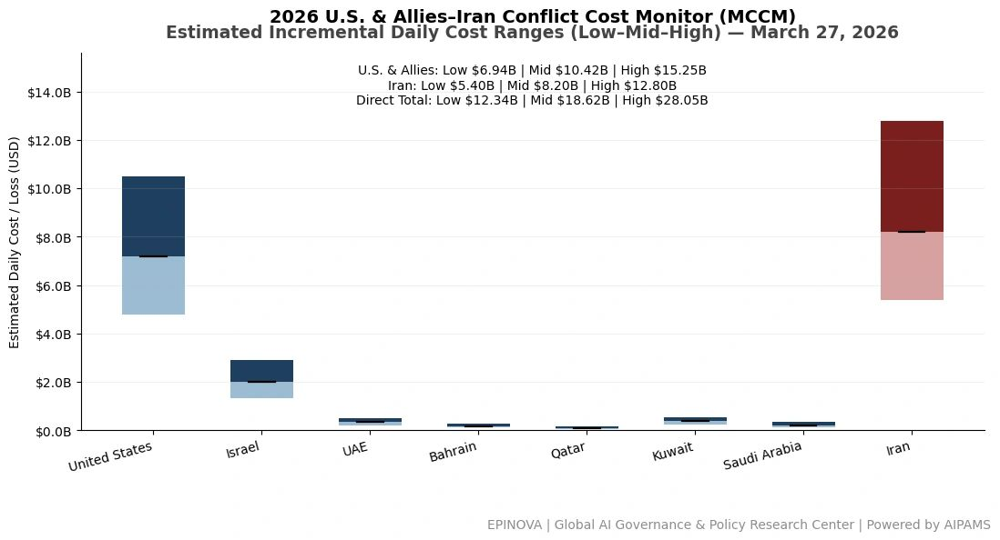
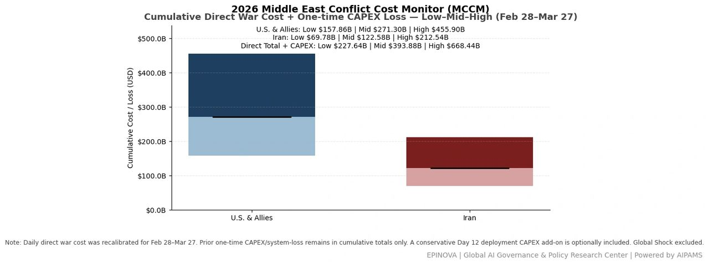
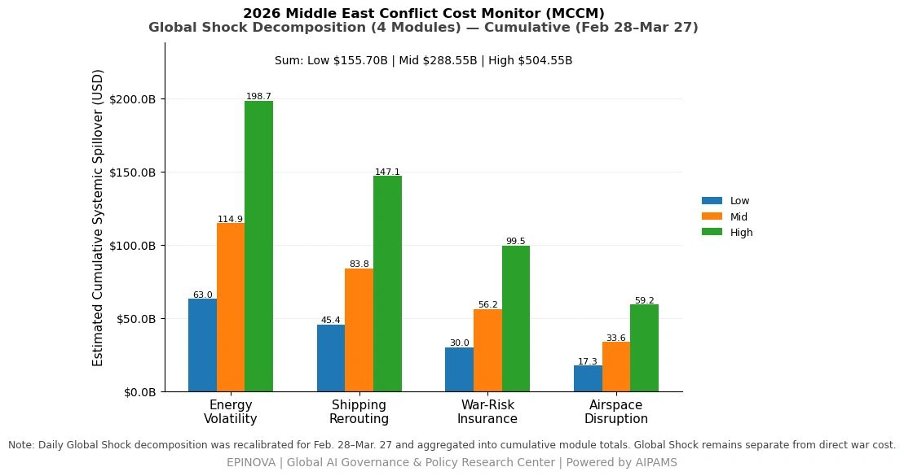
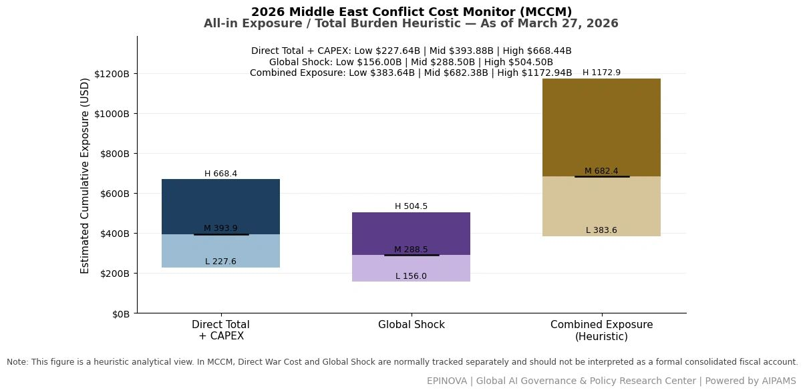

# 2026 U.S. & Allies–Iran Conflict Cost Monitor (MCCM): March 27

Original URL: https://epinova.org/articles/f/2026-us-allies%E2%80%93iran-conflict-cost-monitor-mccm-march-27

Publication date: 2026-03-27

Archive note: This is a locally preserved Markdown copy of an EPINOVA article originally generated through the GoDaddy blog system.

---

[All Posts](<https://epinova.org/articles?blog=y>)

### 2026 U.S. & Allies–Iran Conflict Cost Monitor (MCCM): March 27

March 27, 2026|Global AI Governance & Policy

**Powered by AIPAMS (Adaptive Integrated Policy & Analytics Modeling System) **

  

**1\. Introduction**

The **2026 Middle East Conflict Cost Monitor (MCCM)** provides an event-driven, scenario-based assessment of daily conflict-related expenditures and losses across major state actors involved in the crisis. Using a structured **low–mid–high estimation framework** , the series aggregates publicly available operational indicators, force posture changes, strike intensity proxies, reported material damage, and infrastructure disruptions to produce comparable daily cost ranges.

The MCCM framework distinguishes between three analytical components:  
(1) **Direct War Cost** , which includes military operational expenditures, asset losses, and selected capital losses (CAPEX);  
(2) **Infrastructure and energy-sector disruption costs** linked to conflict operations; and  
(3) **Systemic market spillovers (“Global Shock”)** , which capture broader economic and logistical externalities associated with regional escalation.

Direct war costs and systemic spillovers are **reported separately** to maintain analytical clarity between conflict-specific expenditures and wider economic effects.

MCCM is designed as a **rolling monitoring instrument rather than a definitive accounting ledger**. Estimates are produced using scenario-bounded ranges intended to support comparative analysis and policy discussion rather than precise fiscal accounting. All values are expressed in **current U.S. dollars (USD)** and may be **revised retroactively** as verification improves and additional information becomes available.

As the conflict evolves, MCCM increasingly captures not only direct cost accumulation but also dynamic interactions between military operations, strategic signaling, and systemic economic responses, reflecting a transition from a cost-tracking model to an integrated exposure assessment framework. 

  

  

  

**2\. Methodological Notes**

**A. Scenario Ranges.**  
All estimates are presented as bounded ranges.

  * **Low:** Minimum confirmed observable losses.
  * **Mid:** Most probable estimate based on publicly available reporting and operational cost parameters.
  * **High:** Upper-bound scenario incorporating reported but not independently verified high-value asset losses.  

**B. Daily Estimates.**  
Reported figures represent **incremental 24-hour estimates** of conflict-related costs and losses.

**C. Cumulative Totals.**  
Cumulative values reflect the **aggregation of daily scenario ranges** over the reporting period. High-range values may include scenario-based adjustments for reported strategic asset losses pending independent verification.

**D. Global Shock.**  
Global Shock represents systemic economic spillovers generated by the conflict, including both escalation-driven disruptions and temporary stabilization effects arising from partial de-escalation signals (e.g., controlled energy transit, diplomatic signaling). It is decomposed into four modules:

  * Energy Volatility
  * Shipping Rerouting
  * War-Risk Insurance Premiums
  * Airspace Disruption

These modules capture major **economic and logistical externalities** associated with regional escalation.

**E. Combined Exposure.**  
In selected figures, Direct War Cost and Global Shock may be displayed together as a **Combined Exposure heuristic** to illustrate the approximate scale of total economic exposure associated with the conflict. This aggregation is **analytical only** and should not be interpreted as a formal consolidated fiscal account. Under high-frequency strike conditions and partial system stabilization, Combined Exposure serves as a more informative indicator of systemic burden than isolated cost metrics. 

**F. Revision Policy.**  
All MCCM estimates are derived from **open-source reporting and model-based reconstruction** and remain subject to revision as verification improves.

**G. Structural Interpretation Note.**

At later stages of the conflict, cost accumulation alone may not fully capture strategic dynamics. MCCM therefore incorporates an exposure-oriented perspective, recognizing that relatively low-cost offensive actions can impose disproportionately high and persistent burdens on complex defense systems and global networks.

This asymmetry may lead to cumulative divergence in system sustainability, particularly under saturation conditions.

  

**Selected References:**

Associated Press. (2026, March 27). _The latest: Israel warns attacks on Iran will expand as Trump delays Strait of Hormuz deadline_. [https://apnews.com/article/d9a0bead802c195ff6aedf4cd3c3782d](<https://apnews.com/article/d9a0bead802c195ff6aedf4cd3c3782d?utm_source=chatgpt.com>)

Associated Press. (2026, March 27). _G7 meets on the Iran war as Rubio tries to sell U.S. strategy to skeptical allies insulted by Trump_. [https://apnews.com/article/63a8ee21dcca5ecce0c6b1cb900a8c16](<https://apnews.com/article/63a8ee21dcca5ecce0c6b1cb900a8c16?utm_source=chatgpt.com>)

Associated Press. (2026, March 27). _Iran starts to formalize its chokehold on the Strait of Hormuz with a “toll booth” regime_. [https://apnews.com/article/de5159966cde7de7b964b3c2c67eec07](<https://apnews.com/article/de5159966cde7de7b964b3c2c67eec07?utm_source=chatgpt.com>)

Associated Press. (2026, March 27). _Iran says nuclear facilities have been targeted after Israel said attacks “will escalate and expand”_. <https://apnews.com/article/195444c54cbb7545d0a77f8ffbc0e4c0 >

Reuters. (2026, March 26). _Europeans to press Rubio over Russian support for Iran at G7 meeting_. [https://www.reuters.com/world/middle-east/europeans-press-us-over-russian-support-iran-2026-03-26/](<https://www.reuters.com/world/middle-east/europeans-press-us-over-russian-support-iran-2026-03-26/?utm_source=chatgpt.com>)

Reuters. (2026, March 26). _Trump says he will pause attacks on Iran’s energy plants_. [https://www.reuters.com/business/energy/trump-says-he-will-pause-attacks-irans-energy-plants-talks-going-very-well-2026-03-26/](<https://www.reuters.com/business/energy/trump-says-he-will-pause-attacks-irans-energy-plants-talks-going-very-well-2026-03-26/?utm_source=chatgpt.com>)

Reuters. (2026, March 27). _Chinese ships halt attempt to exit Hormuz despite Iran safe passage assurances_. [https://www.reuters.com/world/china/chinese-ships-halt-attempt-exit-hormuz-despite-iran-safe-passage-assurances-2026-03-27/](<https://www.reuters.com/world/china/chinese-ships-halt-attempt-exit-hormuz-despite-iran-safe-passage-assurances-2026-03-27/?utm_source=chatgpt.com>)

Reuters. (2026, March 27). _UAE willing to join international force to reopen Strait of Hormuz, FT reports_. [https://www.reuters.com/world/middle-east/uae-willing-join-international-force-reopen-strait-hormuz-ft-reports-2026-03-27/](<https://www.reuters.com/world/middle-east/uae-willing-join-international-force-reopen-strait-hormuz-ft-reports-2026-03-27/?utm_source=chatgpt.com>)

Reuters. (2026, March 27). _UAE equities reverse early gains on Iran ceasefire uncertainty_. [https://www.reuters.com/world/middle-east/uae-shares-climb-trump-delays-strikes-iran-energy-sites-2026-03-27/](<https://www.reuters.com/world/middle-east/uae-shares-climb-trump-delays-strikes-iran-energy-sites-2026-03-27/?utm_source=chatgpt.com>)

Reuters. (2026, March 27). _U.S. uses hundreds of Tomahawk missiles on Iran, alarming some at Pentagon, WaPo reports_. [https://www.reuters.com/business/aerospace-defense/us-uses-hundreds-tomahawk-missiles-iran-alarming-some-pentagon-wapo-reports-2026-03-27/](<https://www.reuters.com/business/aerospace-defense/us-uses-hundreds-tomahawk-missiles-iran-alarming-some-pentagon-wapo-reports-2026-03-27/?utm_source=chatgpt.com>)

Reuters. (2026, March 27). _Ukraine and Saudi Arabia sign deal on defence cooperation, Zelenskiy says_. [https://www.reuters.com/business/aerospace-defense/ukraine-saudi-arabia-sign-deal-defence-cooperation-zelenskiy-says-2026-03-27/](<https://www.reuters.com/business/aerospace-defense/ukraine-saudi-arabia-sign-deal-defence-cooperation-zelenskiy-says-2026-03-27/?utm_source=chatgpt.com>)

Reuters. (2026, March 27). _Ukraine closes on Mideast deals to help counter Iranian drones_. [https://www.reuters.com/world/china/ukraine-closes-mideast-deals-help-counter-iranian-drones-2026-03-27/](<https://www.reuters.com/world/china/ukraine-closes-mideast-deals-help-counter-iranian-drones-2026-03-27/?utm_source=chatgpt.com>)

Reuters. (2026, March 27). _Rubio holds call with Iraqi Kurdish leader, State Department says_. [https://www.reuters.com/world/middle-east/rubio-holds-call-with-iraqi-kurdish-leader-state-department-says-2026-03-27/](<https://www.reuters.com/world/middle-east/rubio-holds-call-with-iraqi-kurdish-leader-state-department-says-2026-03-27/?utm_source=chatgpt.com>)

Reuters. (2026, March 26). _Trump signature to appear on U.S. currency, ending 165-year tradition_. [https://www.reuters.com/world/us/trumps-signature-appear-us-currency-treasury-says-ending-165-year-tradition-2026-03-26/](<https://www.reuters.com/world/us/trumps-signature-appear-us-currency-treasury-says-ending-165-year-tradition-2026-03-26/?utm_source=chatgpt.com>)

Axios. (2026, March 27). _Rubio tells allies Iran war will continue 2–4 more weeks_. [https://www.axios.com/2026/03/27/iran-war-timeline-rubio-2-4-weeks](<https://www.axios.com/2026/03/27/iran-war-timeline-rubio-2-4-weeks?utm_source=chatgpt.com>)

The Wall Street Journal. (2026, March 27). _Iran turns back two Chinese ships from Strait of Hormuz_. <https://www.wsj.com/livecoverage/iran-war-middle-east-news-updates/card/iran-turns-back-two-chinese-ships-from-strait-of-hormuz-PCmGlHNGYXL0BGi1Fo0H >

The Wall Street Journal. (2026, March 27). _U.S. and Israel have pounded—but not eliminated—Iran’s missile threat_. <https://www.wsj.com/world/middle-east/iran-missile-status-us-israel-war-6e9cbd25 >

The Guardian. (2026, March 27). _Middle East crisis live: Rubio claims Iran operation expected to conclude in “weeks not months”_. [https://www.theguardian.com/world/live/2026/mar/27/iran-war-live-updates-trump-negotiations-bombing-hormuz-energy-oil-prices-middle-east](<https://www.theguardian.com/world/live/2026/mar/27/iran-war-live-updates-trump-negotiations-bombing-hormuz-energy-oil-prices-middle-east?utm_source=chatgpt.com>)

The Guardian. (2026, March 26). _Blasts heard in southern Beirut – as it happened_. [https://www.theguardian.com/world/live/2026/mar/26/iran-war-live-updates-trump-deal-us-military-strikes-israel-lebanon-hezbollah](<https://www.theguardian.com/world/live/2026/mar/26/iran-war-live-updates-trump-deal-us-military-strikes-israel-lebanon-hezbollah?utm_source=chatgpt.com>)

Share this post:
