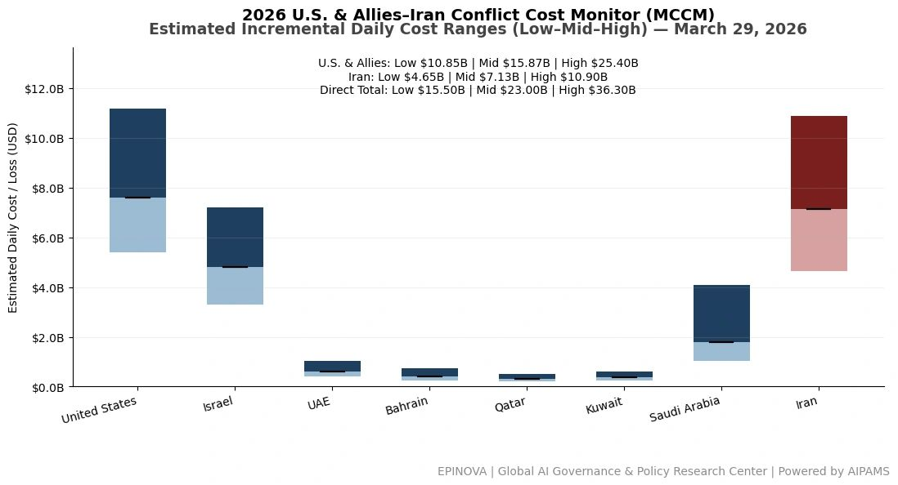
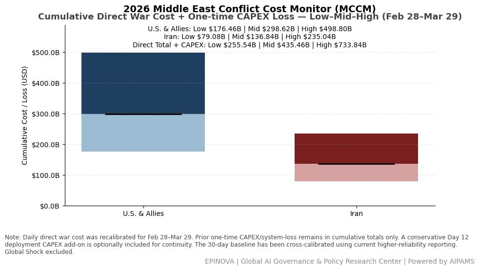
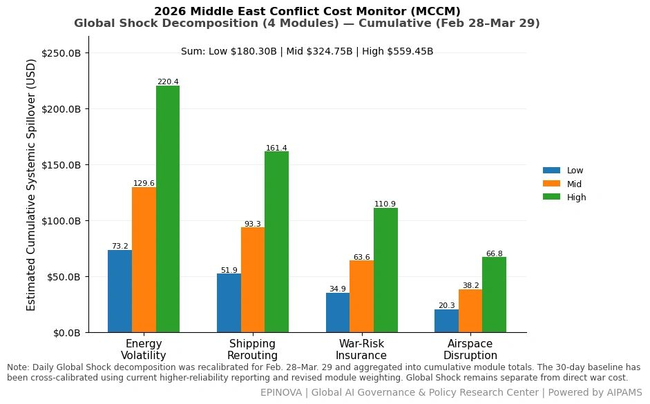
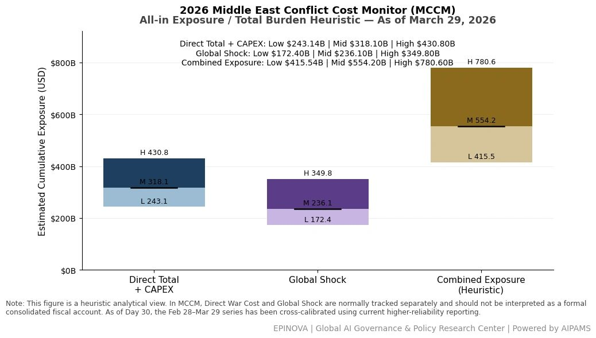

# 2026 U.S. & Allies–Iran Conflict Cost Monitor (MCCM): March 29

Original URL: https://epinova.org/articles/f/2026-us-allies%E2%80%93iran-conflict-cost-monitor-mccm-march-29

Publication date: 2026-03-29

Archive note: This is a locally preserved Markdown copy of an EPINOVA article originally generated through the GoDaddy blog system.

---

[All Posts](<https://epinova.org/articles?blog=y>)

### 2026 U.S. & Allies–Iran Conflict Cost Monitor (MCCM): March 29

March 29, 2026|Global AI Governance & Policy

**Powered by AIPAMS (Adaptive Integrated Policy & Analytics Modeling System) **

  

**1\. Introduction**

The **2026 Middle East Conflict Cost Monitor (MCCM)** provides an event-driven, scenario-based assessment of daily conflict-related expenditures and losses across major state actors involved in the crisis. Using a structured **low–mid–high estimation framework** , the series aggregates publicly available operational indicators, force posture changes, strike intensity proxies, reported material damage, and infrastructure disruptions to produce comparable daily cost ranges.

The MCCM framework distinguishes between three analytical components:  
(1) **Direct War Cost** , which includes military operational expenditures, asset losses, and selected capital losses (CAPEX);  
(2) **Infrastructure and energy-sector disruption costs** linked to conflict operations; and  
(3) **Systemic market spillovers (“Global Shock”)** , which capture broader economic and logistical externalities associated with regional escalation.

Direct war costs and systemic spillovers are **reported separately** to maintain analytical clarity between conflict-specific expenditures and wider economic effects.

MCCM is designed as a **rolling monitoring instrument rather than a definitive accounting ledger**. Estimates are produced using scenario-bounded ranges intended to support comparative analysis and policy discussion rather than precise fiscal accounting. All values are expressed in **current U.S. dollars (USD)** and may be **revised retroactively** as verification improves and additional information becomes available.

As the conflict evolves, MCCM increasingly captures not only direct cost accumulation but also dynamic interactions between military operations, strategic signaling, and systemic economic responses, reflecting a transition from a cost-tracking model to an integrated exposure assessment framework. 

  

  

  

**2\. Methodological Notes**

**A. Scenario Ranges.**  
All estimates are presented as bounded ranges.

  * **Low:** Minimum confirmed observable losses.
  * **Mid:** Most probable estimate based on publicly available reporting and operational cost parameters.
  * **High:** Upper-bound scenario incorporating reported but not independently verified high-value asset losses.  

**B. Daily Estimates.**  
Reported figures represent **incremental 24-hour estimates** of conflict-related costs and losses.

**C. Cumulative Totals.**  
Cumulative values reflect the **aggregation of daily scenario ranges** over the reporting period. High-range values may include scenario-based adjustments for reported strategic asset losses pending independent verification.

**D. Global Shock.**  
Global Shock represents systemic economic spillovers generated by the conflict, including both escalation-driven disruptions and temporary stabilization effects arising from partial de-escalation signals (e.g., controlled energy transit, diplomatic signaling). It is decomposed into four modules:

  * Energy Volatility
  * Shipping Rerouting
  * War-Risk Insurance Premiums
  * Airspace Disruption

These modules capture major **economic and logistical externalities** associated with regional escalation.

**E. Combined Exposure.**  
In selected figures, Direct War Cost and Global Shock may be displayed together as a **Combined Exposure heuristic** to illustrate the approximate scale of total economic exposure associated with the conflict. This aggregation is **analytical only** and should not be interpreted as a formal consolidated fiscal account. Under high-frequency strike conditions and partial system stabilization, Combined Exposure serves as a more informative indicator of systemic burden than isolated cost metrics. 

**F. Revision Policy.**  
All MCCM estimates are derived from **open-source reporting and model-based reconstruction** and remain subject to revision as verification improves.

**G. Structural Interpretation Note.**

At later stages of the conflict, cost accumulation alone may not fully capture strategic dynamics. MCCM therefore incorporates an exposure-oriented perspective, recognizing that relatively low-cost offensive actions can impose disproportionately high and persistent burdens on complex defense systems and global networks.

This asymmetry may lead to cumulative divergence in system sustainability, particularly under saturation conditions.

  

**Selected References:**

Associated Press. (2026, March 28). _“No Kings” protests held to rally against Trump administration, in photos_. [https://apnews.com/article/b4ce14b0ab16d148f4fdbe642c20fdb2](<https://apnews.com/article/b4ce14b0ab16d148f4fdbe642c20fdb2?utm_source=chatgpt.com>)

Associated Press. (2026, March 28). _“No Kings” rallies draw crowds across U.S., in Europe. Springsteen headlines Minnesota demonstration_. [https://apnews.com/article/2fab6b3a64e5275bcf111e8dd6d2e075](<https://apnews.com/article/2fab6b3a64e5275bcf111e8dd6d2e075?utm_source=chatgpt.com>)

Associated Press. (2026, March 29). _Iran warns the U.S. against a ground invasion as regional powers meet in Pakistan_. [https://apnews.com/article/f10f6b09b8643f683e31803897aa19f7](<https://apnews.com/article/f10f6b09b8643f683e31803897aa19f7?utm_source=chatgpt.com>)

Associated Press. (2026, March 25). _Iran rejects U.S. ceasefire plan, issues its own demands as strikes land across the Mideast_. [https://apnews.com/article/be07c54139bcc70672bb33f0773ede6a](<https://apnews.com/article/be07c54139bcc70672bb33f0773ede6a?utm_source=chatgpt.com>)

CNN. (2026, March 27). _Isa Soares Tonight_ [Transcript]. [https://transcripts.cnn.com/show/ist/date/2026-03-27/segment/01](<https://transcripts.cnn.com/show/ist/date/2026-03-27/segment/01?utm_source=chatgpt.com>)

CNN. (2026, March 27). _The Brief with Jim Sciutto_ [Transcript]. [https://transcripts.cnn.com/show/tbwjs/date/2026-03-27/segment/01](<https://transcripts.cnn.com/show/tbwjs/date/2026-03-27/segment/01?utm_source=chatgpt.com>)

Reuters. (2026, March 24). _Iran says “non-hostile” ships can transit Strait of Hormuz_. [https://www.reuters.com/world/middle-east/iran-says-non-hostile-ships-can-transit-strait-hormuz-ft-reports-2026-03-24/](<https://www.reuters.com/world/middle-east/iran-says-non-hostile-ships-can-transit-strait-hormuz-ft-reports-2026-03-24/?utm_source=chatgpt.com>)

Reuters. (2026, March 25). _Germany’s Merz says public finances cannot offset all price rises from Iran war_. [https://www.reuters.com/business/germanys-merz-says-public-finances-cannot-offset-all-price-rises-iran-war-2026-03-25/](<https://www.reuters.com/business/germanys-merz-says-public-finances-cannot-offset-all-price-rises-iran-war-2026-03-25/?utm_source=chatgpt.com>)

Reuters. (2026, March 26). _Rubio says Iran war to last “weeks not months,” no U.S. ground troops needed_. [https://www.reuters.com/world/asia-pacific/trump-pauses-attacks-irans-energy-plants-says-talks-are-going-well-2026-03-26/](<https://www.reuters.com/world/asia-pacific/trump-pauses-attacks-irans-energy-plants-says-talks-are-going-well-2026-03-26/?utm_source=chatgpt.com>)

Reuters. (2026, March 27). _German Chancellor Merz says he has doubts over Iran war aims_. [https://www.reuters.com/world/europe/german-chancellor-merz-says-he-has-doubts-over-iran-war-aims-2026-03-27/](<https://www.reuters.com/world/europe/german-chancellor-merz-says-he-has-doubts-over-iran-war-aims-2026-03-27/?utm_source=chatgpt.com>)

Reuters. (2026, March 27). _Twelve U.S. troops wounded in Iran strike on base in Saudi Arabia, U.S. official says_. [https://www.reuters.com/world/middle-east/twelve-us-troops-wounded-iran-strike-base-saudi-arabia-us-official-says-2026-03-27/](<https://www.reuters.com/world/middle-east/twelve-us-troops-wounded-iran-strike-base-saudi-arabia-us-official-says-2026-03-27/?utm_source=chatgpt.com>)

Reuters. (2026, March 27). _U.S. can only confirm about a third of Iran’s missile arsenal destroyed, sources say_. [https://www.reuters.com/world/middle-east/us-can-only-confirm-about-third-irans-missile-arsenal-destroyed-sources-say-2026-03-27/](<https://www.reuters.com/world/middle-east/us-can-only-confirm-about-third-irans-missile-arsenal-destroyed-sources-say-2026-03-27/?utm_source=chatgpt.com>)

Reuters. (2026, March 27). _Chinese ships halt attempt to exit Hormuz despite Iran safe passage assurances_. [https://www.reuters.com/world/china/chinese-ships-halt-attempt-exit-hormuz-despite-iran-safe-passage-assurances-2026-03-27/](<https://www.reuters.com/world/china/chinese-ships-halt-attempt-exit-hormuz-despite-iran-safe-passage-assurances-2026-03-27/?utm_source=chatgpt.com>)

Reuters. (2026, March 28). _Iran accuses U.S. of ground assault plans as Pakistan hosts regional talks_. [https://www.reuters.com/world/asia-pacific/yemens-houthis-enter-iran-war-with-attacks-israel-while-us-marines-arrive-region-2026-03-28/](<https://www.reuters.com/world/asia-pacific/yemens-houthis-enter-iran-war-with-attacks-israel-while-us-marines-arrive-region-2026-03-28/?utm_source=chatgpt.com>)

Reuters. (2026, March 28). _Bahrain’s Alba confirms Iranian attack on its facilities_. [https://www.reuters.com/world/middle-east/bahrains-alba-confirms-iranian-attack-its-facilities-2026-03-28/](<https://www.reuters.com/world/middle-east/bahrains-alba-confirms-iranian-attack-its-facilities-2026-03-28/?utm_source=chatgpt.com>)

Reuters. (2026, March 28). _Pictures: One month of war with Iran_. [https://www.reuters.com/pictures/pictures-one-month-war-with-iran-2026-03-28/LEST66CMKBJUPM4R6WTDMNLJU4](<https://www.reuters.com/pictures/pictures-one-month-war-with-iran-2026-03-28/LEST66CMKBJUPM4R6WTDMNLJU4?utm_source=chatgpt.com>)

Reuters. (2026, March 29). _Most Gulf markets ease despite fears of broader Iran conflict_. [https://www.reuters.com/world/middle-east/most-gulf-markets-ease-fears-broader-iran-conflict-2026-03-29/](<https://www.reuters.com/world/middle-east/most-gulf-markets-ease-fears-broader-iran-conflict-2026-03-29/?utm_source=chatgpt.com>)

Reuters. (2026, March 29). _Pakistan hosts regional powers for Iran talks, with focus on Hormuz proposals_. [https://www.reuters.com/world/asia-pacific/pakistan-hosts-regional-powers-iran-talks-with-focus-hormuz-proposals-2026-03-29/](<https://www.reuters.com/world/asia-pacific/pakistan-hosts-regional-powers-iran-talks-with-focus-hormuz-proposals-2026-03-29/?utm_source=chatgpt.com>)

Reuters. (2026, March 29). _Pentagon preparing for weeks of ground operations in Iran, Washington Post reports_. [https://www.reuters.com/world/middle-east/pentagon-preparing-weeks-ground-operations-iran-washington-post-reports-2026-03-29/](<https://www.reuters.com/world/middle-east/pentagon-preparing-weeks-ground-operations-iran-washington-post-reports-2026-03-29/?utm_source=chatgpt.com>)

The Washington Post. (2026, March 28). _Trump administration weighs a weeks-long ground operation inside Iran_. [https://www.washingtonpost.com/national-security/2026/03/28/trump-iran-ground-troops-marines/](<https://www.washingtonpost.com/national-security/2026/03/28/trump-iran-ground-troops-marines/?utm_source=chatgpt.com>)

The Wall Street Journal. (2026, March 29). _What is the E-3 Sentry, the U.S. aircraft struck by Iran?_ [https://www.wsj.com/livecoverage/iran-war-middle-east-news-updates/card/what-is-the-e-3-sentry-the-u-s-aircraft-struck-by-iran--8HdGiZxiNlXOA0qCyFvr](<https://www.wsj.com/livecoverage/iran-war-middle-east-news-updates/card/what-is-the-e-3-sentry-the-u-s-aircraft-struck-by-iran--8HdGiZxiNlXOA0qCyFvr?utm_source=chatgpt.com>)

Share this post:
