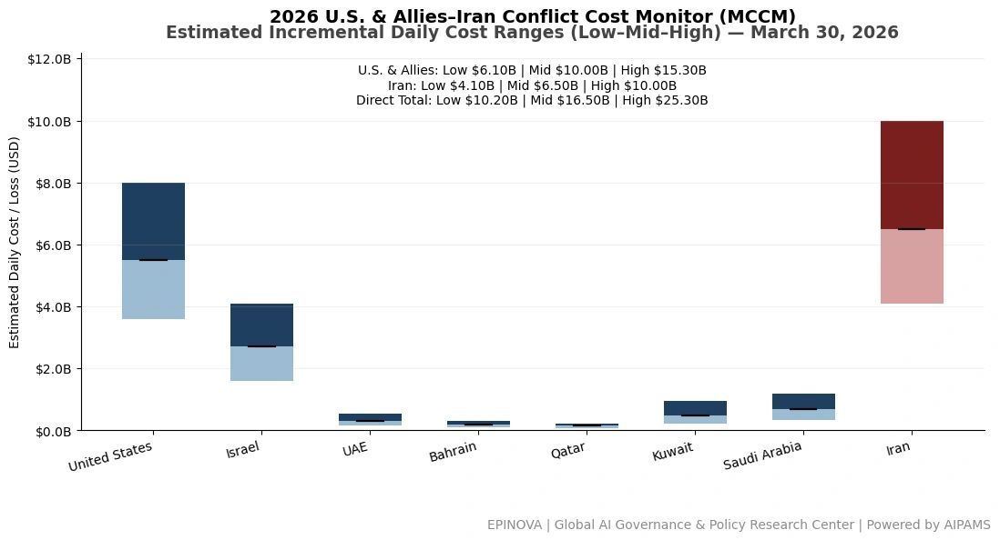
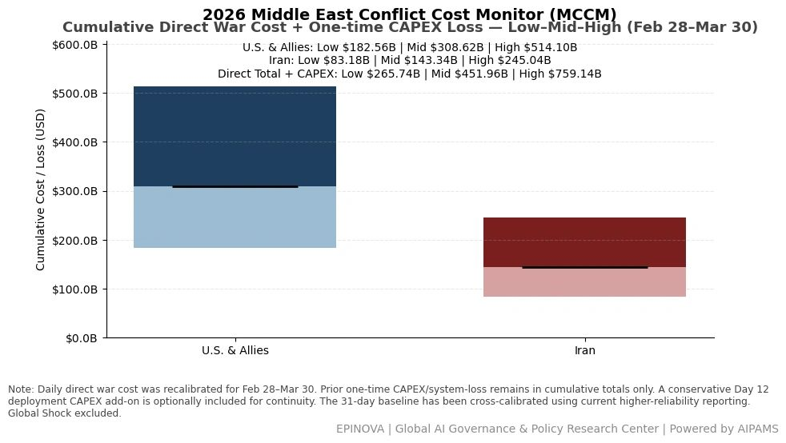
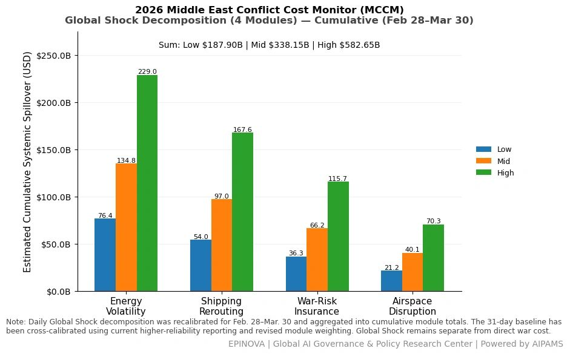
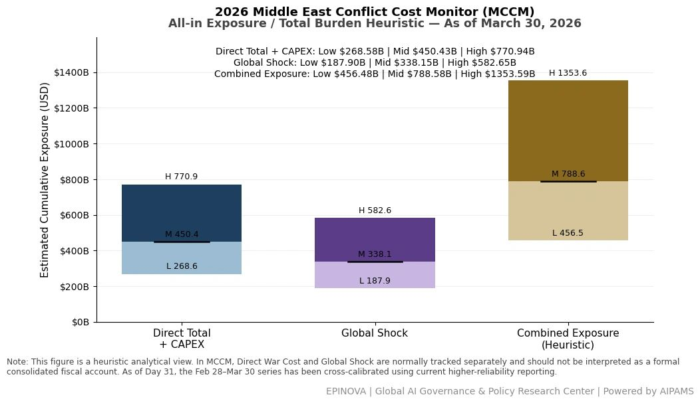

# 2026 U.S. & Allies–Iran Conflict Cost Monitor (MCCM): March 30

Original URL: https://epinova.org/articles/f/2026-us-allies%E2%80%93iran-conflict-cost-monitor-mccm-march-30

Publication date: 2026-03-30

Archive note: This is a locally preserved Markdown copy of an EPINOVA article originally generated through the GoDaddy blog system.

---

[All Posts](<https://epinova.org/articles?blog=y>)

### 2026 U.S. & Allies–Iran Conflict Cost Monitor (MCCM): March 30

March 30, 2026|Global AI Governance & Policy

**Powered by AIPAMS (Adaptive Integrated Policy & Analytics Modeling System) **

  

**1\. Introduction**

The **2026 Middle East Conflict Cost Monitor (MCCM)** provides an event-driven, scenario-based assessment of daily conflict-related expenditures and losses across major state actors involved in the crisis. Using a structured **low–mid–high estimation framework** , the series aggregates publicly available operational indicators, force posture changes, strike intensity proxies, reported material damage, and infrastructure disruptions to produce comparable daily cost ranges.

The MCCM framework distinguishes between three analytical components:  
(1) **Direct War Cost** , which includes military operational expenditures, asset losses, and selected capital losses (CAPEX);  
(2) **Infrastructure and energy-sector disruption costs** linked to conflict operations; and  
(3) **Systemic market spillovers (“Global Shock”)** , which capture broader economic and logistical externalities associated with regional escalation.

Direct war costs and systemic spillovers are **reported separately** to maintain analytical clarity between conflict-specific expenditures and wider economic effects.

MCCM is designed as a **rolling monitoring instrument rather than a definitive accounting ledger**. Estimates are produced using scenario-bounded ranges intended to support comparative analysis and policy discussion rather than precise fiscal accounting. All values are expressed in **current U.S. dollars (USD)** and may be **revised retroactively** as verification improves and additional information becomes available.

As the conflict evolves, MCCM increasingly captures not only direct cost accumulation but also dynamic interactions between military operations, strategic signaling, and systemic economic responses, reflecting a transition from a cost-tracking model to an integrated exposure assessment framework. 

  

  

**2\. Methodological Notes**

**A. Scenario Ranges.**  
All estimates are presented as bounded ranges.

  * **Low:** Minimum confirmed observable losses.
  * **Mid:** Most probable estimate based on publicly available reporting and operational cost parameters.
  * **High:** Upper-bound scenario incorporating reported but not independently verified high-value asset losses.  

**B. Daily Estimates.**  
Reported figures represent **incremental 24-hour estimates** of conflict-related costs and losses.

**C. Cumulative Totals.**  
Cumulative values reflect the **aggregation of daily scenario ranges** over the reporting period. High-range values may include scenario-based adjustments for reported strategic asset losses pending independent verification.

**D. Global Shock.**  
Global Shock represents systemic economic spillovers generated by the conflict, including both escalation-driven disruptions and temporary stabilization effects arising from partial de-escalation signals (e.g., controlled energy transit, diplomatic signaling). It is decomposed into four modules:

  * Energy Volatility
  * Shipping Rerouting
  * War-Risk Insurance Premiums
  * Airspace Disruption

These modules capture major **economic and logistical externalities** associated with regional escalation.

**E. Combined Exposure.**  
In selected figures, Direct War Cost and Global Shock may be displayed together as a **Combined Exposure heuristic** to illustrate the approximate scale of total economic exposure associated with the conflict. This aggregation is **analytical only** and should not be interpreted as a formal consolidated fiscal account. Under high-frequency strike conditions and partial system stabilization, Combined Exposure serves as a more informative indicator of systemic burden than isolated cost metrics. 

**F. Revision Policy.**  
All MCCM estimates are derived from **open-source reporting and model-based reconstruction** and remain subject to revision as verification improves.

**G. Structural Interpretation Note.**

At later stages of the conflict, cost accumulation alone may not fully capture strategic dynamics. MCCM therefore incorporates an exposure-oriented perspective, recognizing that relatively low-cost offensive actions can impose disproportionately high and persistent burdens on complex defense systems and global networks.

This asymmetry may lead to cumulative divergence in system sustainability, particularly under saturation conditions.

  

**Selected References:**

AP News. (2026, March 30). _Israeli parliament passes budget, allowing Netanyahu to avoid early elections_. [https://apnews.com/article/bc75b11a9d1d833733c6f9e56a15aeda](<https://apnews.com/article/bc75b11a9d1d833733c6f9e56a15aeda?utm_source=chatgpt.com>)

AP News. (2026, March 30). _The latest: Trump warns Iran energy sites face destruction without a quick deal_. [https://apnews.com/article/4820feefe878b183f12eaaabc376e6b0](<https://apnews.com/article/4820feefe878b183f12eaaabc376e6b0?utm_source=chatgpt.com>)

Associated Press. (2026, March 30). _Israeli parliament approves the death penalty for Palestinians convicted of murdering Israelis_. [https://apnews.com/article/c67c1c14f218a4d67ed3d5011cd5cf8d](<https://apnews.com/article/c67c1c14f218a4d67ed3d5011cd5cf8d?utm_source=chatgpt.com>)

International Atomic Energy Agency. (2025, June 20). _IAEA Director General Grossi’s statement to UNSC on situation in Iran_. [https://www.iaea.org/newscenter/statements/iaea-director-general-grossis-statement-to-unsc-on-situation-in-iran-20-june-2025](<https://www.iaea.org/newscenter/statements/iaea-director-general-grossis-statement-to-unsc-on-situation-in-iran-20-june-2025?utm_source=chatgpt.com>)

International Atomic Energy Agency. (2026, February 27). _NPT safeguards agreement with the Islamic Republic of Iran_ (GOV/2026/8). [https://www.iaea.org/sites/default/files/gov2026-8.pdf](<https://www.iaea.org/sites/default/files/gov2026-8.pdf?utm_source=chatgpt.com>)

Reuters. (2026, March 24). _Iran toughens negotiating stance amid mediation efforts, sources say_. [https://www.reuters.com/world/middle-east/iran-toughens-negotiating-stance-amid-mediation-efforts-sources-say-2026-03-24/](<https://www.reuters.com/world/middle-east/iran-toughens-negotiating-stance-amid-mediation-efforts-sources-say-2026-03-24/?utm_source=chatgpt.com>)

Reuters. (2026, March 25). _Iran says it is reviewing U.S. proposal to end war_. [https://www.reuters.com/world/asia-pacific/israel-strikes-tehran-trump-says-us-negotiating-end-war-2026-03-25/](<https://www.reuters.com/world/asia-pacific/israel-strikes-tehran-trump-says-us-negotiating-end-war-2026-03-25/?utm_source=chatgpt.com>)

Reuters. (2026, March 26). _Trump pauses attacks on Iran’s energy plants, says talks “going well”_. [https://www.reuters.com/world/asia-pacific/iran-says-it-is-reviewing-us-ceasefire-plan-no-talks-trump-says-tehran-leaders-2026-03-26/](<https://www.reuters.com/world/asia-pacific/iran-says-it-is-reviewing-us-ceasefire-plan-no-talks-trump-says-tehran-leaders-2026-03-26/?utm_source=chatgpt.com>)

Reuters. (2026, March 26). _U.S. proposal to end war is “one-sided”, door to diplomacy still open, Iranian official says_. [https://www.reuters.com/world/middle-east/us-proposal-end-war-is-one-sided-door-diplomacy-still-open-iranian-official-says-2026-03-26/](<https://www.reuters.com/world/middle-east/us-proposal-end-war-is-one-sided-door-diplomacy-still-open-iranian-official-says-2026-03-26/?utm_source=chatgpt.com>)

Reuters. (2026, March 29). _Israeli parliament approves 2026 state budget, spokesperson says_. [https://www.reuters.com/world/middle-east/israeli-parliament-approves-2026-state-budget-spokesperson-says-2026-03-29/](<https://www.reuters.com/world/middle-east/israeli-parliament-approves-2026-state-budget-spokesperson-says-2026-03-29/?utm_source=chatgpt.com>)

Reuters. (2026, March 30). _Brent crude hits $116 a barrel as Trump threatens to “blow up” Iran’s oil wells and export hub_. _The Guardian_. [https://www.theguardian.com/business/2026/mar/30/price-of-oil-trump-iran-stock-markets-middle-east](<https://www.theguardian.com/business/2026/mar/30/price-of-oil-trump-iran-stock-markets-middle-east?utm_source=chatgpt.com>)

Reuters. (2026, March 30). _Chinese container ships pass through Strait of Hormuz at second attempt, data shows_. [https://www.reuters.com/world/china/chinese-container-ships-pass-through-strait-hormuz-second-attempt-data-shows-2026-03-30/](<https://www.reuters.com/world/china/chinese-container-ships-pass-through-strait-hormuz-second-attempt-data-shows-2026-03-30/?utm_source=chatgpt.com>)

Reuters. (2026, March 30). _EU’s Costa discusses Iran situation with Pakistan’s prime minister_. <https://www.reuters.com/world/asia-pacific/eus-costa-discusses-iran-situation-with-pakistans-prime-minister-2026-03-30/>

Reuters. (2026, March 30). _Indian worker killed in Iranian attack on Kuwait power, desalination plant_. [https://www.reuters.com/world/india/indian-worker-killed-iranian-attack-kuwait-power-desalination-plant-2026-03-29/](<https://www.reuters.com/world/india/indian-worker-killed-iranian-attack-kuwait-power-desalination-plant-2026-03-29/?utm_source=chatgpt.com>)

Reuters. (2026, March 30). _Israel economy to grow 3.3% in 2026 if Iran war continues, finance ministry says_. [https://www.reuters.com/world/middle-east/israel-economy-grow-33-2026-if-iran-war-continues-finance-ministry-says-2026-03-30/](<https://www.reuters.com/world/middle-east/israel-economy-grow-33-2026-if-iran-war-continues-finance-ministry-says-2026-03-30/?utm_source=chatgpt.com>)

Reuters. (2026, March 30). _Pakistan, Afghanistan trade fire as Islamabad prepares to host U.S.-Iran talks_. <https://www.reuters.com/world/asia-pacific/pakistan-afghanistan-trade-fire-islamabad-prepares-host-us-iran-talks-2026-03-30/>

Reuters. (2026, March 30). _Thousands of U.S. Army paratroopers arrive in Middle East as buildup intensifies_. [https://www.reuters.com/world/middle-east/thousands-us-army-paratroopers-arrive-middle-east-buildup-intensifies-2026-03-30/](<https://www.reuters.com/world/middle-east/thousands-us-army-paratroopers-arrive-middle-east-buildup-intensifies-2026-03-30/?utm_source=chatgpt.com>)

Reuters. (2026, March 30). _Trump again warns Iran to open Strait of Hormuz_. [https://www.reuters.com/world/middle-east/trump-again-warns-iran-open-strait-hormuz-2026-03-30/](<https://www.reuters.com/world/middle-east/trump-again-warns-iran-open-strait-hormuz-2026-03-30/?utm_source=chatgpt.com>)

Reuters. (2026, March 30). _Trump issues new warning to Tehran, Iran calls U.S. peace proposals “unrealistic”_. [https://www.reuters.com/world/asia-pacific/trump-calls-irans-current-leaders-very-reasonable-pakistan-prepares-host-talks-2026-03-30/](<https://www.reuters.com/world/asia-pacific/trump-calls-irans-current-leaders-very-reasonable-pakistan-prepares-host-talks-2026-03-30/?utm_source=chatgpt.com>)

The Guardian. (2026, March 29). _Iran accuses U.S. of plotting ground assault while publicly seeking talks_. [https://www.theguardian.com/world/2026/mar/29/iran-accuses-us-plotting-ground-assault-publicly-seeking-talks](<https://www.theguardian.com/world/2026/mar/29/iran-accuses-us-plotting-ground-assault-publicly-seeking-talks?utm_source=chatgpt.com>)

The Guardian. (2026, March 30). _Trump threatens to “obliterate” Iran’s energy grid if ceasefire not reached shortly_. [https://www.theguardian.com/us-news/2026/mar/30/trump-threatens-to-obliterate-irans-energy-grid-if-ceasefire-not-reached-shortly](<https://www.theguardian.com/us-news/2026/mar/30/trump-threatens-to-obliterate-irans-energy-grid-if-ceasefire-not-reached-shortly?utm_source=chatgpt.com>)

The Times. (2026, March 30). _Iran war latest: Trump threatens obliteration of Kharg Island if no deal made_. [https://www.thetimes.com/world/middle-east/israel-iran/article/iran-war-trump-oil-latest-news-dgx330xvf](<https://www.thetimes.com/world/middle-east/israel-iran/article/iran-war-trump-oil-latest-news-dgx330xvf?utm_source=chatgpt.com>)

The Wall Street Journal. (2026, March 30). _Iranian-linked groups hacked into at least 50 security cameras in Israel_. [https://www.wsj.com/livecoverage/iran-war-news-updates/card/iranian-linked-groups-hacked-into-at-least-50-security-cameras-in-israel-dwrn3Wa3KcI3NfbGiHJl](<https://www.wsj.com/livecoverage/iran-war-news-updates/card/iranian-linked-groups-hacked-into-at-least-50-security-cameras-in-israel-dwrn3Wa3KcI3NfbGiHJl?utm_source=chatgpt.com>)

The Wall Street Journal. (2026, March 30). _Struck Khondab heavy-water plant no longer operational, U.N. agency says_. [https://www.wsj.com/livecoverage/iran-war-middle-east-news-updates/card/struck-khondab-heavy-water-plant-no-longer-operational-u-n-agency-HPSfsWdzKYus6HgIPNCD](<https://www.wsj.com/livecoverage/iran-war-middle-east-news-updates/card/struck-khondab-heavy-water-plant-no-longer-operational-u-n-agency-HPSfsWdzKYus6HgIPNCD?utm_source=chatgpt.com>)

The Washington Post. (2026, March 25). _U.S. plan to end war seeks removal of Iran’s enriched uranium, officials say_. [https://www.washingtonpost.com/world/2026/03/25/us-iran-war-trump-talks-pakistan/](<https://www.washingtonpost.com/world/2026/03/25/us-iran-war-trump-talks-pakistan/?utm_source=chatgpt.com>)

Share this post:
