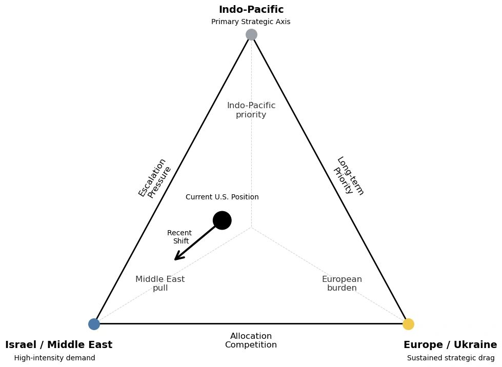

# The Strategic Misalignment of U.S. Power

Original URL: https://epinova.org/articles/f/the-strategic-misalignment-of-us-power

Publication date: 2026-03-31

Archive note: This is a locally preserved Markdown copy of an EPINOVA article originally generated through the GoDaddy blog system.

---

[All Posts](<https://epinova.org/articles?blog=y>)

### The Strategic Misalignment of U.S. Power

March 31, 2026|Global AI Governance & Policy

#### How Washington’s actions in the Middle East, Europe, and the Indo-Pacific are drifting from its strategic priorities

**Author:** Dr. Shaoyuan Wu

**ORCID:** [_https://orcid.org/0009-0008-0660-8232_](<https://orcid.org/0009-0008-0660-8232>)

**Affiliation:** Global AI Governance and Policy Research Center, EPINOVA LLC

**Date:** March 31, 2026 

  

For years, U.S. policymakers have warned of overstretch—too many commitments, too many crises, too few resources. But that diagnosis no longer captures the nature of America’s current external challenges.

The United States today is not constrained by a lack of power. It is constrained by a growing disconnect between what it prioritizes and how it acts.

Across three critical theaters—the Middle East, Europe, and the Indo-Pacific—American strategy is no longer defined by a coherent alignment between objectives and resources. Instead, it is increasingly shaped by a widening gap between declared priorities and actual execution.

This is not overstretch. It is **strategic misalignment**. 

  

#### 1\. The Middle East: Action Without a Defined End State

Nowhere is this misalignment more visible than in the Middle East.

As tensions between Israel and Iran escalate, the United States has surged military assets, reinforced regional defenses, and shifted strategic attention back into the region. Operationally, the response has been rapid and substantial. Strategically, it remains unclear.

Washington has yet to articulate a coherent end state. Is the objective to deter Iran? To support Israeli escalation? To prevent a regional war? Or to stabilize global energy markets?

Each of these goals implies a different strategy. Yet current policy attempts to pursue all of them simultaneously.

The result is a familiar but increasingly dangerous pattern: intensive operational engagement without strategic clarity.

More importantly, this engagement is not cost-neutral. High-end assets, particularly air and missile defense systems originally positioned to support long-term competition in the Indo-Pacific, are being redirected into a theater where the strategic objective remains undefined.

This is not merely a diversion of resources. It is **the reallocation of strategic capacity without a defined strategic purpose**.

  

#### 2\. The Indo-Pacific: Priority in Doctrine, Erosion in Practice

For over a decade, U.S. strategy has consistently identified the Indo-Pacific as the primary theater of long-term competition. But priorities are revealed not in doctrine, but in allocation.

As resources flow into the Middle East, the Indo-Pacific is not collapsing, but it is being quietly eroded at the margin.

The effects are gradual rather than dramatic. Deployment cycles tighten. Surge capacity diminishes. Operational flexibility narrows.

At the same time, regional allies are watching closely.

Energy market instability, driven in part by Middle Eastern tensions, feeds into economic uncertainty across the region. When combined with visible U.S. resource diversion, it creates a subtle but consequential perception risk: that the United States may struggle to sustain both crisis response and long-term deterrence simultaneously.

In strategic environments, perception is not secondary. It is decisive.

Even marginal reductions in perceived commitment can reshape alliance behavior, encourage hedging, and open space for competitors.

  

#### 3\. Europe: Sustained Commitment, Fragmenting Alignment

If the Middle East reflects strategic ambiguity and the Indo-Pacific reflects resource diversion, Europe reflects a third dynamic: alignment under strain.

Now in its fourth year, the Russia–Ukraine war has evolved from an acute crisis into a prolonged structural burden.

The United States continues to treat support for Ukraine as a central strategic commitment. But within Europe, consensus is increasingly uneven.

Energy pressures remain embedded. Economic fatigue is growing. Political cohesion across NATO is under stress.

This produces a widening gap in strategic posture.

Washington frames Ukraine as a defining geopolitical contest. Many European actors increasingly treat it as a long-term cost to be managed.

The longer this divergence persists, the more it erodes alignment within the alliance.

At the same time, emerging signals, from Arctic positioning to renewed interest in Greenland, underscore a broader reality: Europe is not simply a theater of commitment. It is also one of latent strategic competition and uncertainty.

The risk is not sudden NATO collapse. It is gradual desynchronization within NATO itself.

  

#### 4\. A Strategy Out of Sync

Taken together, these dynamics reveal a deeper structural problem.

The United States is not simply balancing multiple theaters. It is operating in a system where:

  * objectives are unclear in one theater, 
  * resources are being diverted from another, 
  * and alignment is weakening in a third. 

This is not overstretch. It is a breakdown in strategic synchronization.

Strategy, at its core, is the alignment of ends, ways, and means. Today, those elements are increasingly decoupled:

  * **Ends** emphasize long-term competition in the Indo-Pacific 
  * **Means** are consumed by short-term crises in the Middle East 
  * **Ways** , particularly alliance coordination, are fragmenting in Europe 

When these components fall out of alignment, power does not disappear. But it becomes harder to translate into effective outcomes.

  

#### 5\. The Consequences of Misalignment

The risks of strategic misalignment are not immediate. They are cumulative.

Over time, three dynamics emerge.

Deterrence gaps begin to appear—not because of weakness, but because of inconsistent allocation and signaling.

Allies start to hedge—not because they reject U.S. leadership, but because they question its long-term coherence.

Adversaries exploit timing asymmetries, probing precisely where U.S. attention is temporarily constrained.

None of these outcomes require a fundamental shift in the balance of power. They require only a persistent mismatch between strategic intent and operational reality.

  

#### 6\. Realignment, Not Retrenchment

If the problem is misalignment, the solution is not withdrawal. It is recalibration.

That requires defining clear and limited objectives in the Middle East, preserving baseline capacity in the Indo-Pacific, and ensuring that alliance expectations in Europe align with long-term sustainability.

More fundamentally, it requires recognizing that strategy is not about responding to every demand. It is about determining which demands can be met without undermining the system as a whole.

  

#### 7\. Power Isn’t the Problem

The United States still possesses unmatched global capabilities.

But power without alignment is not strategy.

And strategy without alignment does not fail all at once.  
It fails gradually through substitution, drift, and erosion.

That process is no longer theoretical. It is already underway.

Share this post:
