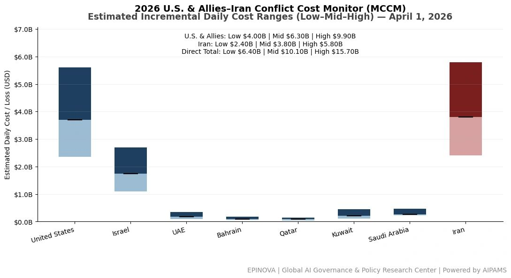
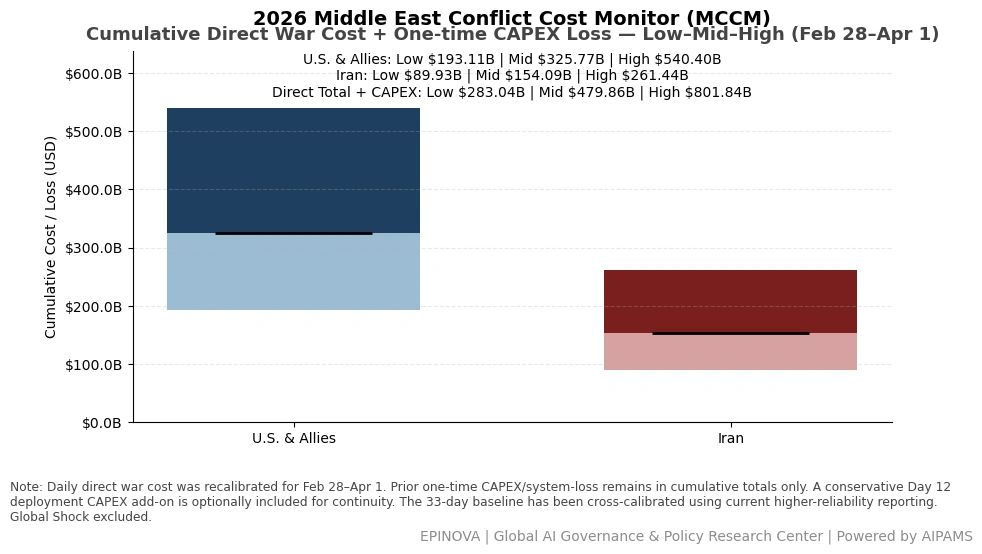
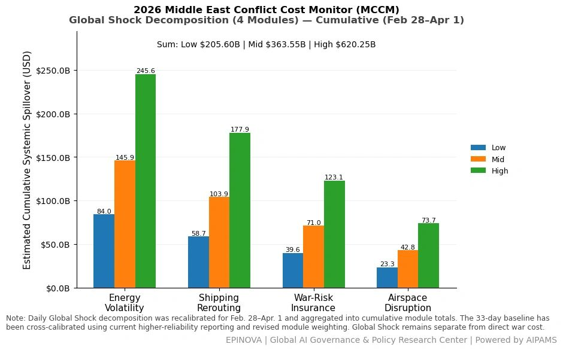
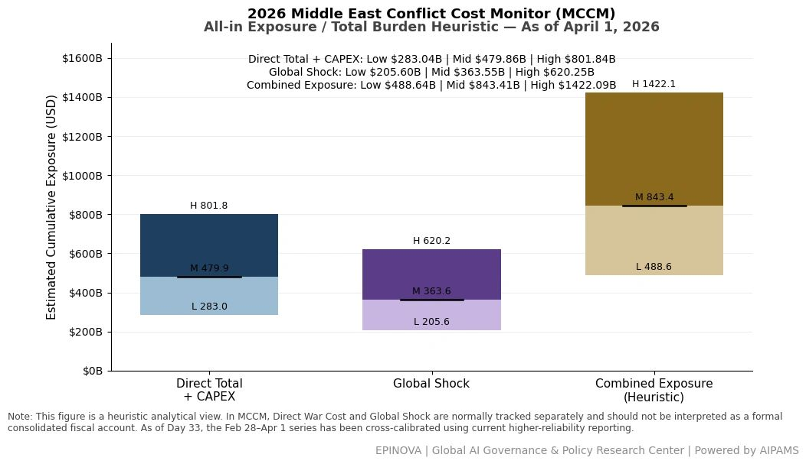

# 2026 U.S. & Allies–Iran Conflict Cost Monitor (MCCM): April 1

Original URL: https://epinova.org/articles/f/2026-us-allies%E2%80%93iran-conflict-cost-monitor-mccm-april-1

Publication date: 2026-04-01

Archive note: This is a locally preserved Markdown copy of an EPINOVA article originally generated through the GoDaddy blog system.

---

[All Posts](<https://epinova.org/articles?blog=y>)

### 2026 U.S. & Allies–Iran Conflict Cost Monitor (MCCM): April 1

April 1, 2026|Global AI Governance & Policy

**Powered by AIPAMS (Adaptive Integrated Policy & Analytics Modeling System) **

  

**1\. Introduction**

The **2026 Middle East Conflict Cost Monitor (MCCM)** provides an event-driven, scenario-based assessment of daily conflict-related expenditures and losses across major state actors involved in the crisis. Using a structured **low–mid–high estimation framework** , the series aggregates publicly available operational indicators, force posture changes, strike intensity proxies, reported material damage, and infrastructure disruptions to produce comparable daily cost ranges.

The MCCM framework distinguishes between three analytical components:  
(1) **Direct War Cost** , which includes military operational expenditures, asset losses, and selected capital losses (CAPEX);  
(2) **Infrastructure and energy-sector disruption costs** linked to conflict operations; and  
(3) **Systemic market spillovers (“Global Shock”)** , which capture broader economic and logistical externalities associated with regional escalation.

Direct war costs and systemic spillovers are **reported separately** to maintain analytical clarity between conflict-specific expenditures and wider economic effects.

MCCM is designed as a **rolling monitoring instrument rather than a definitive accounting ledger**. Estimates are produced using scenario-bounded ranges intended to support comparative analysis and policy discussion rather than precise fiscal accounting. All values are expressed in **current U.S. dollars (USD)** and may be **revised retroactively** as verification improves and additional information becomes available.

As the conflict evolves, MCCM increasingly captures not only direct cost accumulation but also dynamic interactions between military operations, strategic signaling, and systemic economic responses, reflecting a transition from a cost-tracking model to an integrated exposure assessment framework. 

  

  

  

**2\. Methodological Notes**

**A. Scenario Ranges.**  
All estimates are presented as bounded ranges.

  * **Low:** Minimum confirmed observable losses.
  * **Mid:** Most probable estimate based on publicly available reporting and operational cost parameters.
  * **High:** Upper-bound scenario incorporating reported but not independently verified high-value asset losses.  

**B. Daily Estimates.**  
Reported figures represent **incremental 24-hour estimates** of conflict-related costs and losses.

**C. Cumulative Totals.**  
Cumulative values reflect the **aggregation of daily scenario ranges** over the reporting period. High-range values may include scenario-based adjustments for reported strategic asset losses pending independent verification.

**D. Global Shock.**  
Global Shock represents systemic economic spillovers generated by the conflict, including both escalation-driven disruptions and temporary stabilization effects arising from partial de-escalation signals (e.g., controlled energy transit, diplomatic signaling). It is decomposed into four modules:

  * Energy Volatility
  * Shipping Rerouting
  * War-Risk Insurance Premiums
  * Airspace Disruption

These modules capture major **economic and logistical externalities** associated with regional escalation.

**E. Combined Exposure.**  
In selected figures, Direct War Cost and Global Shock may be displayed together as a **Combined Exposure heuristic** to illustrate the approximate scale of total economic exposure associated with the conflict. This aggregation is **analytical only** and should not be interpreted as a formal consolidated fiscal account. Under high-frequency strike conditions and partial system stabilization, Combined Exposure serves as a more informative indicator of systemic burden than isolated cost metrics. 

**F. Revision Policy.**  
All MCCM estimates are derived from **open-source reporting and model-based reconstruction** and remain subject to revision as verification improves.

**G. Structural Interpretation Note.**

At later stages of the conflict, cost accumulation alone may not fully capture strategic dynamics. MCCM therefore incorporates an exposure-oriented perspective, recognizing that relatively low-cost offensive actions can impose disproportionately high and persistent burdens on complex defense systems and global networks.

This asymmetry may lead to cumulative divergence in system sustainability, particularly under saturation conditions.

  

**Selected References:**

U.S. Department of Defense. (2026, March 31). _Statement on ongoing operations in the Middle East_. <https://www.defense.gov/News/Releases/>

U.S. Central Command. (2026). _Operational updates: U.S. military activity in CENTCOM AOR_. <https://www.centcom.mil/MEDIA/PRESS-RELEASES/>

The White House. (2026, March 31). _Remarks by President Trump on Iran operations_. <https://www.whitehouse.gov/briefing-room/>

Reuters. (2026, April 1). _Iran launches large-scale missile and drone attacks across Israel_. <https://www.reuters.com/world/middle-east/>

Reuters. (2026, March 31). _U.S. casualties rise amid escalating Iran conflict_. <https://www.reuters.com/world/>

Reuters. (2026, April 1). _Oil prices surge as Middle East conflict intensifies_. <https://www.reuters.com/markets/commodities/>

Reuters. (2026, April 1). _Shipping risks increase in Strait of Hormuz amid tensions_. <https://www.reuters.com/business/energy/>

Al Jazeera. (2026, April 1). _Iran strikes Israel in coordinated regional attack_. <https://www.aljazeera.com/news/>

Al Jazeera. (2026, March 31). _Hezbollah and Houthis escalate attacks in support of Iran_. <https://www.aljazeera.com/news/>

Associated Press. (2026, April 1). _US expands military options in Middle East as conflict widens_. <https://apnews.com/>

Associated Press. (2026, March 31). _US aircraft and drone losses mount in regional conflict_. <https://apnews.com/>

Bloomberg. (2026, April 1). _Germany moves to cap fuel price increases amid war-driven volatility_. <https://www.bloomberg.com/>

Bloomberg. (2026, March 31). _Energy markets react to escalating Middle East conflict_. <https://www.bloomberg.com/energy>

International Energy Agency. (2026). _Oil market report – March/April 2026_. <https://www.iea.org/reports/oil-market-report>

International Monetary Fund. (2026). _Global economic outlook update – conflict risk scenario_. <https://www.imf.org/en/Publications/WEO>

World Bank. (2026). _Commodity markets outlook: Energy shock scenarios_. <https://www.worldbank.org/en/research/commodity-markets>

NATO. (2026, April 1). _Alliance responses to Middle East crisis developments_. <https://www.nato.int/cps/en/natohq/news.htm>

The Wall Street Journal. (2026, March 31). _U.S. military assets suffer losses in Middle East operations_. <https://www.wsj.com/>

The Wall Street Journal. (2026, April 1). _U.S. deploys additional naval forces as tensions escalate_. <https://www.wsj.com/>

Financial Times. (2026, April 1). _Global markets react to widening Middle East war risks_. <https://www.ft.com/>

Financial Times. (2026, March 31). _Shipping and insurance costs surge amid Gulf tensions_. <https://www.ft.com/>

央视新闻. (2026年4月1日). _伊朗发动第89波打击行动，覆盖以色列全境_. <https://news.cctv.com/>

央视新闻. (2026年4月1日). _美国拟扩大格陵兰军事存在并推进基地谈判_. <https://news.cctv.com/>

央视新闻. (2026年4月1日). _德国实施油价管控措施应对中东冲突影响_. <https://news.cctv.com/>

央视新闻. (2026年3月31日). _美军伤亡情况披露及装备损失情况_. <https://news.cctv.com/>

参考消息. (2026年3月31日). _美军多型装备受损及战场态势分析_. <https://www.cankaoxiaoxi.com/>

大众日报. (2026年3月31日). _美军战损曝光：预警机、加油机与无人机损失情况_. <https://dzrb.dzng.com/>

极目新闻. (2026年3月31日). _内塔尼亚胡称以色列与美国展开“历史性合作”_. <https://www.ctdsb.net/>

扬子晚报. (2026年4月1日). _美国拟扩大格陵兰军事存在引发关注_. <https://www.yangtse.com/>

九派新闻. (2026年4月1日). _德国限制油价上涨频率应对能源冲击_. <https://www.jiupainews.com/>

Share this post:
