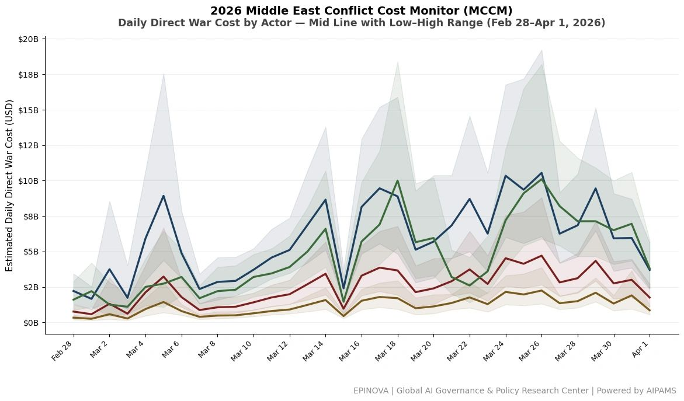
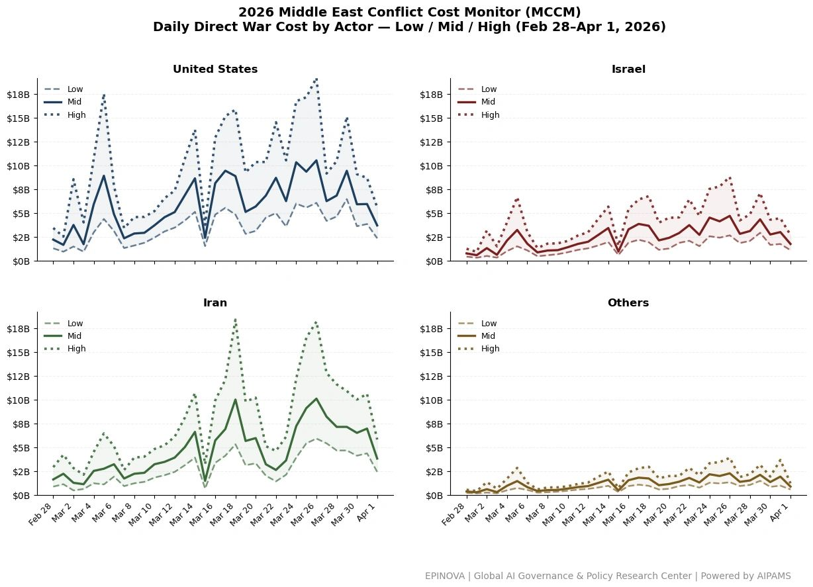

# MCCM Daily Direct War Cost by Actor: Feb 28 – Apr 1, 2026

Original URL: https://epinova.org/articles/f/mccm-daily-direct-war-cost-by-actor-feb-28-%E2%80%93-apr-1-2026

Publication date: 2026-04-01

Archive note: This is a locally preserved Markdown copy of an EPINOVA article originally generated through the GoDaddy blog system.

---

[All Posts](<https://epinova.org/articles?blog=y>)

### MCCM Daily Direct War Cost by Actor: Feb 28 – Apr 1, 2026

April 1, 2026|Global AI Governance & Policy

  

  

**Note:** United States / Israel / Others are split from the U.S. & Allies bloc using phase-based shares. Day 32–33 are anchored to updated countries-only MCCM estimates. Global Shock excluded.

Share this post:
