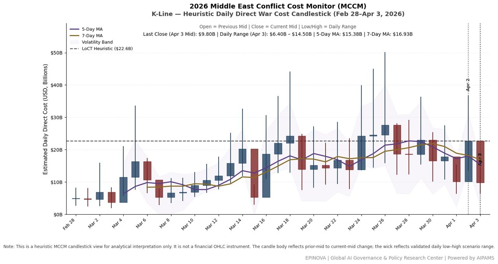
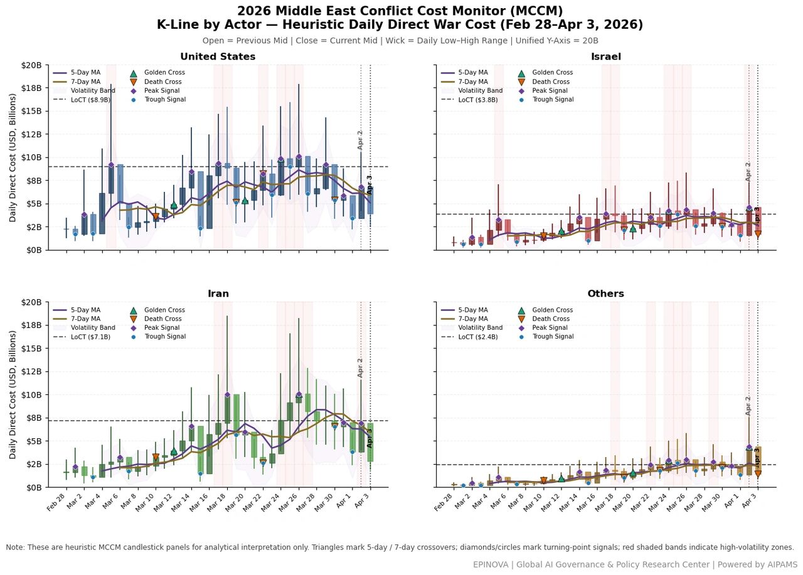

# MCCM Daily War Cost Dynamics (K-Line): Feb 28–Apr 3, 2026

Original URL: https://epinova.org/articles/f/mccm-daily-war-cost-dynamics-k-line-feb-28%E2%80%93apr-3-2026

Publication date: 2026-04-03

Archive note: This is a locally preserved Markdown copy of an EPINOVA article originally generated through the GoDaddy blog system.

---

[All Posts](<https://epinova.org/articles?blog=y>)

### MCCM Daily War Cost Dynamics (K-Line): Feb 28–Apr 3, 2026

April 3, 2026|Global AI Governance & Policy

**Powered by AIPAMS (Adaptive Integrated Policy & Analytics Modeling System) **

  

  

  

#### **Method Note**

This model extends the **Middle East Conflict Cost Monitor (MCCM)** by applying a **candlestick (K-line) framework** to represent daily war costs as a dynamic time series.

Each day is mapped as:

  * **Open** = previous day mid estimate 
  * **Close** = current day mid estimate 
  * **High / Low** = MCCM uncertainty range 

To capture structural dynamics, the model integrates:

  * **5-day / 7-day moving averages** → detect acceleration (golden cross) and deceleration (death cross) 
  * **Turning points (local peaks/troughs)** → identify short-term regime shifts 
  * **Volatility bands (high–low range)** → capture uncertainty and shock intensity 
  * **High-volatility zones** → highlight escalation clusters 
  * **LoCT (85th percentile)** → approximate loss-of-control threshold 

#### **Core Insight**

Conflict cost behaves as a **volatile, path-dependent system** , where escalation emerges through **momentum, clustering, and threshold effects** , rather than linear accumulation.

Share this post:
