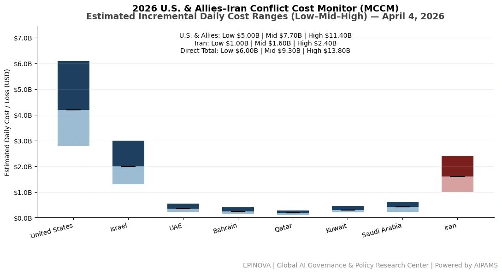
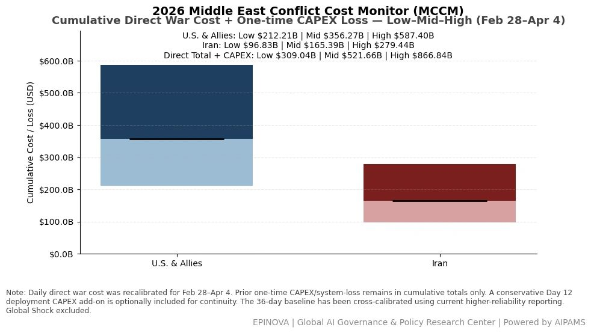
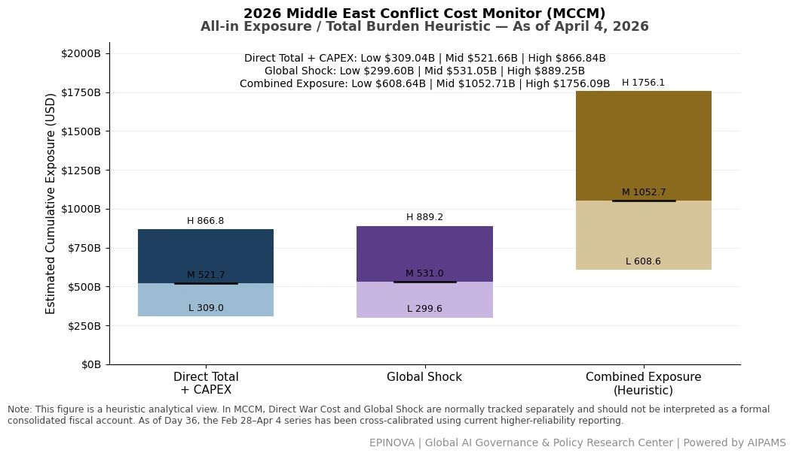

# 2026 U.S. & Allies–Iran Conflict Cost Monitor (MCCM): April 4

Original URL: https://epinova.org/articles/f/2026-us-allies%E2%80%93iran-conflict-cost-monitor-mccm-april-4

Publication date: 2026-04-04

Archive note: This is a locally preserved Markdown copy of an EPINOVA article originally generated through the GoDaddy blog system.

---

[All Posts](<https://epinova.org/articles?blog=y>)

### 2026 U.S. & Allies–Iran Conflict Cost Monitor (MCCM): April 4

April 4, 2026|Global AI Governance & Policy

**Powered by AIPAMS (Adaptive Integrated Policy & Analytics Modeling System) **

  

**1\. Introduction**

The **2026 Middle East Conflict Cost Monitor (MCCM)** provides an event-driven, scenario-based assessment of daily conflict-related expenditures and losses across major state actors involved in the crisis. Using a structured **low–mid–high estimation framework** , the series aggregates publicly available operational indicators, force posture changes, strike intensity proxies, reported material damage, and infrastructure disruptions to produce comparable daily cost ranges.

The MCCM framework distinguishes between three analytical components:  
(1) **Direct War Cost** , which includes military operational expenditures, asset losses, and selected capital losses (CAPEX);  
(2) **Infrastructure and energy-sector disruption costs** linked to conflict operations; and  
(3) **Systemic market spillovers (“Global Shock”)** , which capture broader economic and logistical externalities associated with regional escalation.

Direct war costs and systemic spillovers are **reported separately** to maintain analytical clarity between conflict-specific expenditures and wider economic effects.

MCCM is designed as a **rolling monitoring instrument rather than a definitive accounting ledger**. Estimates are produced using scenario-bounded ranges intended to support comparative analysis and policy discussion rather than precise fiscal accounting. All values are expressed in **current U.S. dollars (USD)** and may be **revised retroactively** as verification improves and additional information becomes available.

As the conflict evolves, MCCM increasingly captures not only direct cost accumulation but also dynamic interactions between military operations, strategic signaling, and systemic economic responses, reflecting a transition from a cost-tracking model to an integrated exposure assessment framework. 

  

  

**2\. Methodological Notes**

**A. Scenario Ranges.**  
All estimates are presented as bounded ranges.

  * **Low:** Minimum confirmed observable losses.
  * **Mid:** Most probable estimate based on publicly available reporting and operational cost parameters.
  * **High:** Upper-bound scenario incorporating reported but not independently verified high-value asset losses.  

**B. Daily Estimates.**  
Reported figures represent **incremental 24-hour estimates** of conflict-related costs and losses.

**C. Cumulative Totals.**  
Cumulative values reflect the **aggregation of daily scenario ranges** over the reporting period. High-range values may include scenario-based adjustments for reported strategic asset losses pending independent verification.

**D. Global Shock.**  
Global Shock represents systemic economic spillovers generated by the conflict, including both escalation-driven disruptions and temporary stabilization effects arising from partial de-escalation signals (e.g., controlled energy transit, diplomatic signaling). It is decomposed into four modules:

  * Energy Volatility
  * Shipping Rerouting
  * War-Risk Insurance Premiums
  * Airspace Disruption

These modules capture major **economic and logistical externalities** associated with regional escalation.

**E. Combined Exposure.**  
In selected figures, Direct War Cost and Global Shock may be displayed together as a **Combined Exposure heuristic** to illustrate the approximate scale of total economic exposure associated with the conflict. This aggregation is **analytical only** and should not be interpreted as a formal consolidated fiscal account. Under high-frequency strike conditions and partial system stabilization, Combined Exposure serves as a more informative indicator of systemic burden than isolated cost metrics. 

**F. Revision Policy.**  
All MCCM estimates are derived from **open-source reporting and model-based reconstruction** and remain subject to revision as verification improves.

**G. Structural Interpretation Note.**

At later stages of the conflict, cost accumulation alone may not fully capture strategic dynamics. MCCM therefore incorporates an exposure-oriented perspective, recognizing that relatively low-cost offensive actions can impose disproportionately high and persistent burdens on complex defense systems and global networks.

This asymmetry may lead to cumulative divergence in system sustainability, particularly under saturation conditions.

  

**Selected References:**

Amazon. (2025). _2024 Amazon sustainability report_. [https://sustainability.aboutamazon.com/2024-amazon-sustainability-report.pdf](<https://sustainability.aboutamazon.com/2024-amazon-sustainability-report.pdf?utm_source=chatgpt.com>)

Associated Press. (2026, April 3). _Trump budget seeks $1.5T in defense spending alongside cuts in domestic programs_. <https://apnews.com/article/f95715d838be17afd9799208cd3182e3>

Associated Press. (2026, April 4). _Iran calls on public to find “enemy pilot” as US continues frantic search_. [https://apnews.com/article/b1f73e5c2a88ddcf71d93f49f9494e1b](<https://apnews.com/article/b1f73e5c2a88ddcf71d93f49f9494e1b?utm_source=chatgpt.com>)

Associated Press. (2026, April 4). _The latest: US and Iran race to find missing crew member from downed military plane_. [https://apnews.com/article/4d6ae06a883920d15ecc800fd8eeb496](<https://apnews.com/article/4d6ae06a883920d15ecc800fd8eeb496?utm_source=chatgpt.com>)

Reuters. (2026, April 2). _Golden Dome, ships and missiles top Trump’s $1.5 trillion fiscal 2027 defense wish list_. <https://www.reuters.com/business/aerospace-defense/golden-dome-ships-missiles-top-trumps-15-trillion-fiscal-2027-defense-wish-list-2026-04-02/>

Reuters. (2026, April 3). _Iran allows essential goods vessels to its ports via Hormuz strait, Tasnim says_. <https://www.reuters.com/world/middle-east/iran-allows-essential-goods-vessels-to-its-ports-via-hormuz-strait-tasnim-says-2026-04-04/>

Reuters. (2026, April 3). _Israel strikes Beirut, US warns Iran may hit Lebanese universities_. [https://www.reuters.com/world/middle-east/israel-strikes-beirut-us-warns-iran-may-hit-lebanese-universities-2026-04-03/](<https://www.reuters.com/world/middle-east/israel-strikes-beirut-us-warns-iran-may-hit-lebanese-universities-2026-04-03/?utm_source=chatgpt.com>)

Reuters. (2026, April 3). _Tehran rejected 48-hour ceasefire proposal from US, Iranian media, citing source, says_. [https://www.reuters.com/world/middle-east/tehran-rejected-48-hour-ceasefire-proposal-us-iranian-media-citing-source-says-2026-04-03/](<https://www.reuters.com/world/middle-east/tehran-rejected-48-hour-ceasefire-proposal-us-iranian-media-citing-source-says-2026-04-03/?utm_source=chatgpt.com>)

Reuters. (2026, April 3). _Trump’s budget proposes 10% cut in discretionary spending with increased defense spending_. [https://www.reuters.com/world/us/trumps-budget-proposes-10-cut-discretionary-spending-increased-defense-spending-2026-04-03/](<https://www.reuters.com/world/us/trumps-budget-proposes-10-cut-discretionary-spending-increased-defense-spending-2026-04-03/?utm_source=chatgpt.com>)

Reuters. (2026, April 3). _US intelligence warns Iran unlikely to ease Hormuz Strait chokehold soon, sources say_. [https://www.reuters.com/world/middle-east/us-intelligence-warns-iran-unlikely-ease-hormuz-strait-chokehold-soon-sources-2026-04-03/](<https://www.reuters.com/world/middle-east/us-intelligence-warns-iran-unlikely-ease-hormuz-strait-chokehold-soon-sources-2026-04-03/?utm_source=chatgpt.com>)

Reuters. (2026, April 3). _US fighter jet shot down over Iran, search underway for crew, US official says_. [https://www.reuters.com/world/middle-east/us-fighter-jet-shot-down-over-iran-search-underway-crew-us-official-says-2026-04-03/](<https://www.reuters.com/world/middle-east/us-fighter-jet-shot-down-over-iran-search-underway-crew-us-official-says-2026-04-03/?utm_source=chatgpt.com>)

Reuters. (2026, April 4). _Iran says Iraq exempt from any Strait of Hormuz restrictions_. <https://www.reuters.com/world/middle-east/iran-says-iraq-exempt-any-strait-hormuz-restrictions-2026-04-04/>

Reuters. (2026, April 4). _Downed planes spell new peril for Trump as Tehran hunts missing US pilot_. [https://www.reuters.com/world/asia-pacific/downed-planes-spell-new-peril-trump-tehran-hunts-missing-us-pilot-2026-04-04/](<https://www.reuters.com/world/asia-pacific/downed-planes-spell-new-peril-trump-tehran-hunts-missing-us-pilot-2026-04-04/?utm_source=chatgpt.com>)

United Nations. (2026, April 2). _Secretary-General’s remarks at press encounter on the Middle East_. [https://www.un.org/sg/en/content/sg/press-events/2026-04-02/secretary-generals-remarks-press-encounter-the-middle-east](<https://www.un.org/sg/en/content/sg/press-events/2026-04-02/secretary-generals-remarks-press-encounter-the-middle-east?utm_source=chatgpt.com>)

United Nations. (2026, April 2). _Noon briefing of 2 April 2026_. <https://www.un.org/sg/en/content/highlight/2026-04-02.html>

The White House, Office of Management and Budget. (2026, April). _Fiscal year 2027 topline fact sheet_. [https://www.whitehouse.gov/wp-content/uploads/2026/04/fiscal-year-2027-topline-fact-sheet.pdf](<https://www.whitehouse.gov/wp-content/uploads/2026/04/fiscal-year-2027-topline-fact-sheet.pdf?utm_source=chatgpt.com>)

The White House, Office of Management and Budget. (n.d.). _President’s budget – OMB_. [https://www.whitehouse.gov/omb/information-resources/budget/](<https://www.whitehouse.gov/omb/information-resources/budget/?utm_source=chatgpt.com>)

Washington Post. (2026, April 4). _U.S. races to find missing airman as Iranian TV broadcasts reward for capture_. [https://www.washingtonpost.com/national-security/2026/04/04/us-f15-shot-down-iran-missing/](<https://www.washingtonpost.com/national-security/2026/04/04/us-f15-shot-down-iran-missing/?utm_source=chatgpt.com>)

Washington Post. (2026, April 3). _Trump requests record-breaking budget of $1.5 trillion for Pentagon_. <https://www.washingtonpost.com/politics/2026/04/03/trump-budget-pentagon-defense-spending/>

Wall Street Journal. (2026, April 4). _Trump’s mission impossible for allies: Reopening the Strait of Hormuz_. <https://www.wsj.com/world/middle-east/trumps-mission-impossible-for-allies-reopening-the-strait-of-hormuz-d6767476>

Share this post:
