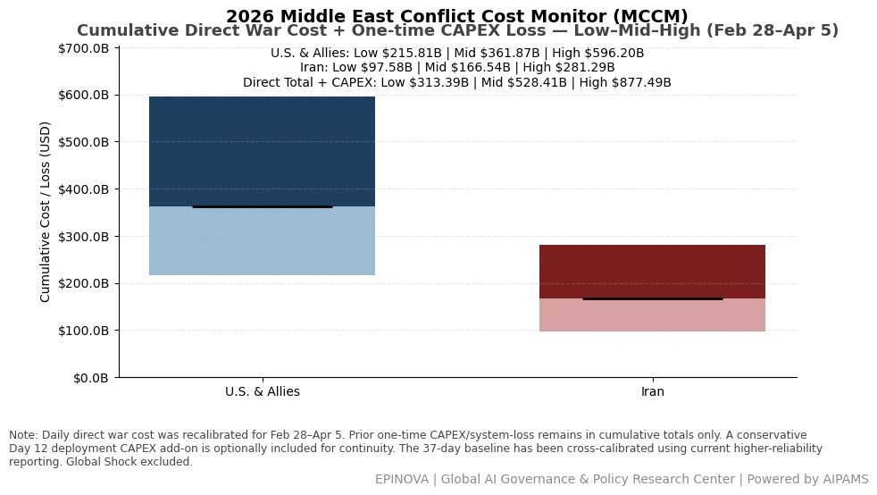
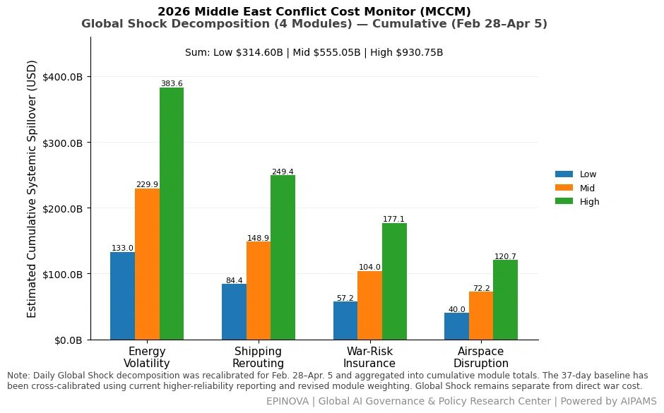
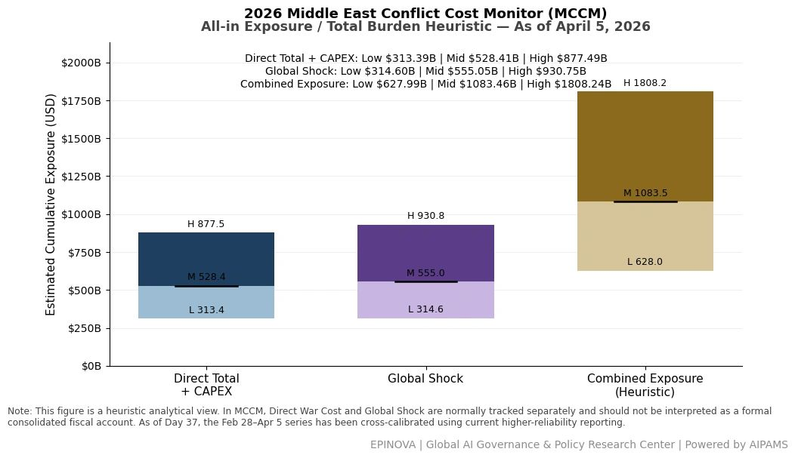

# 2026 U.S. & Allies–Iran Conflict Cost Monitor (MCCM): April 5

Original URL: https://epinova.org/articles/f/2026-us-allies%E2%80%93iran-conflict-cost-monitor-mccm-april-5

Publication date: 2026-04-05

Archive note: This is a locally preserved Markdown copy of an EPINOVA article originally generated through the GoDaddy blog system.

---

[All Posts](<https://epinova.org/articles?blog=y>)

### 2026 U.S. & Allies–Iran Conflict Cost Monitor (MCCM): April 5

April 5, 2026|Global AI Governance & Policy

**Powered by AIPAMS (Adaptive Integrated Policy & Analytics Modeling System) **

  

**1\. Introduction**

The **2026 Middle East Conflict Cost Monitor (MCCM)** provides an event-driven, scenario-based assessment of daily conflict-related expenditures and losses across major state actors involved in the crisis. Using a structured **low–mid–high estimation framework** , the series aggregates publicly available operational indicators, force posture changes, strike intensity proxies, reported material damage, and infrastructure disruptions to produce comparable daily cost ranges.

The MCCM framework distinguishes between three analytical components:  
(1) **Direct War Cost** , which includes military operational expenditures, asset losses, and selected capital losses (CAPEX);  
(2) **Infrastructure and energy-sector disruption costs** linked to conflict operations; and  
(3) **Systemic market spillovers (“Global Shock”)** , which capture broader economic and logistical externalities associated with regional escalation.

Direct war costs and systemic spillovers are **reported separately** to maintain analytical clarity between conflict-specific expenditures and wider economic effects.

MCCM is designed as a **rolling monitoring instrument rather than a definitive accounting ledger**. Estimates are produced using scenario-bounded ranges intended to support comparative analysis and policy discussion rather than precise fiscal accounting. All values are expressed in **current U.S. dollars (USD)** and may be **revised retroactively** as verification improves and additional information becomes available.

As the conflict evolves, MCCM increasingly captures not only direct cost accumulation but also dynamic interactions between military operations, strategic signaling, and systemic economic responses, reflecting a transition from a cost-tracking model to an integrated exposure assessment framework. 

  

  

  

**2\. Methodological Notes**

**A. Scenario Ranges.**  
All estimates are presented as bounded ranges.

  * **Low:** Minimum confirmed observable losses.
  * **Mid:** Most probable estimate based on publicly available reporting and operational cost parameters.
  * **High:** Upper-bound scenario incorporating reported but not independently verified high-value asset losses.  

**B. Daily Estimates.**  
Reported figures represent **incremental 24-hour estimates** of conflict-related costs and losses.

**C. Cumulative Totals.**  
Cumulative values reflect the **aggregation of daily scenario ranges** over the reporting period. High-range values may include scenario-based adjustments for reported strategic asset losses pending independent verification.

**D. Global Shock.**  
Global Shock represents systemic economic spillovers generated by the conflict, including both escalation-driven disruptions and temporary stabilization effects arising from partial de-escalation signals (e.g., controlled energy transit, diplomatic signaling). It is decomposed into four modules:

  * Energy Volatility
  * Shipping Rerouting
  * War-Risk Insurance Premiums
  * Airspace Disruption

These modules capture major **economic and logistical externalities** associated with regional escalation.

**E. Combined Exposure.**  
In selected figures, Direct War Cost and Global Shock may be displayed together as a **Combined Exposure heuristic** to illustrate the approximate scale of total economic exposure associated with the conflict. This aggregation is **analytical only** and should not be interpreted as a formal consolidated fiscal account. Under high-frequency strike conditions and partial system stabilization, Combined Exposure serves as a more informative indicator of systemic burden than isolated cost metrics. 

**F. Revision Policy.**  
All MCCM estimates are derived from **open-source reporting and model-based reconstruction** and remain subject to revision as verification improves.

**G. Structural Interpretation Note.**

At later stages of the conflict, cost accumulation alone may not fully capture strategic dynamics. MCCM therefore incorporates an exposure-oriented perspective, recognizing that relatively low-cost offensive actions can impose disproportionately high and persistent burdens on complex defense systems and global networks.

This asymmetry may lead to cumulative divergence in system sustainability, particularly under saturation conditions.

  

**Selected References:**

Associated Press. (2026, April 5). _A mountain hideout and aircraft under fire: US carries out daring rescue of service member in Iran_. AP News. [https://apnews.com/article/fde473d07fb59e871a71cd2ad2ffe4fe](<https://apnews.com/article/fde473d07fb59e871a71cd2ad2ffe4fe?utm_source=chatgpt.com>)

Reuters. (2026, April 4). _India says crude oil supplies secured, no payment issues with Iran imports_. Reuters. [https://www.reuters.com/business/energy/india-says-crude-oil-supplies-secured-no-payment-issues-iran-imports-2026-04-04/](<https://www.reuters.com/business/energy/india-says-crude-oil-supplies-secured-no-payment-issues-iran-imports-2026-04-04/?utm_source=chatgpt.com>)

Reuters. (2026, April 4). _Israel preparing attacks on Iranian energy sites, awaits U.S. green light, official says_. Reuters. [https://www.reuters.com/world/middle-east/israel-preparing-attacks-iranian-energy-sites-awaits-us-green-light-official-2026-04-04/](<https://www.reuters.com/world/middle-east/israel-preparing-attacks-iranian-energy-sites-awaits-us-green-light-official-2026-04-04/?utm_source=chatgpt.com>)

Reuters. (2026, April 4). _Trump says deal with Iran possible by Monday, Fox News reports_. Reuters. [https://www.reuters.com/world/middle-east/trump-says-deal-with-iran-possible-by-monday-fox-news-reports-2026-04-05/](<https://www.reuters.com/world/middle-east/trump-says-deal-with-iran-possible-by-monday-fox-news-reports-2026-04-05/?utm_source=chatgpt.com>)

Reuters. (2026, April 4). _U.S. rescues airman whose F-15 was downed in Iran, U.S. officials say_. Reuters. [https://www.reuters.com/world/middle-east/us-rescues-airman-whose-f-15-was-downed-iran-us-officials-say-2026-04-05/](<https://www.reuters.com/world/middle-east/us-rescues-airman-whose-f-15-was-downed-iran-us-officials-say-2026-04-05/?utm_source=chatgpt.com>)

Reuters. (2026, April 5). _Iran allows essential-goods vessels to its ports via Hormuz Strait, Tasnim says_. Reuters. [https://www.reuters.com/world/middle-east/iran-allows-essential-goods-vessels-its-ports-via-hormuz-strait-tasnim-says-2026-04-04/](<https://www.reuters.com/world/middle-east/iran-allows-essential-goods-vessels-its-ports-via-hormuz-strait-tasnim-says-2026-04-04/?utm_source=chatgpt.com>)

Reuters. (2026, April 5). _Iran says several “enemy aircraft” destroyed during U.S. pilot rescue mission_. Reuters. [https://www.reuters.com/world/middle-east/iran-says-several-enemy-flying-objects-destroyed-during-us-pilot-rescue-mission-2026-04-05/](<https://www.reuters.com/world/middle-east/iran-says-several-enemy-flying-objects-destroyed-during-us-pilot-rescue-mission-2026-04-05/?utm_source=chatgpt.com>)

Reuters. (2026, April 5). _Kuwait Petroleum Corp reports damage at units after Iran drone attack_. Reuters. [https://www.reuters.com/world/middle-east/kuwait-petroleum-corp-reports-damage-units-after-iran-drone-attack-2026-04-05/](<https://www.reuters.com/world/middle-east/kuwait-petroleum-corp-reports-damage-units-after-iran-drone-attack-2026-04-05/?utm_source=chatgpt.com>)

Reuters. (2026, April 5). _OPEC+ debates theoretical oil output hike amid Iran war paralysis, sources say_. Reuters. [https://www.reuters.com/business/energy/opec-debates-theoretical-oil-output-hike-amid-iran-war-paralysis-sources-say-2026-04-05/](<https://www.reuters.com/business/energy/opec-debates-theoretical-oil-output-hike-amid-iran-war-paralysis-sources-say-2026-04-05/?utm_source=chatgpt.com>)

The Guardian. (2026, April 4). _Middle East crisis live: Netanyahu confirms attack on petrochemical plant – as it happened_. The Guardian. [https://www.theguardian.com/world/live/2026/apr/04/middle-east-crisis-live-us-iran-war-missing-pilot-downed-jet-israel-bombards-beirut](<https://www.theguardian.com/world/live/2026/apr/04/middle-east-crisis-live-us-iran-war-missing-pilot-downed-jet-israel-bombards-beirut?utm_source=chatgpt.com>)

The Washington Post. (2026, April 4). _U.S. rescues missing airman from Iranian mountains after fighter jet was shot down_. The Washington Post. [https://www.washingtonpost.com/national-security/2026/04/04/us-pilot-rescue-iran-f15-crash/](<https://www.washingtonpost.com/national-security/2026/04/04/us-pilot-rescue-iran-f15-crash/?utm_source=chatgpt.com>)

Share this post:
