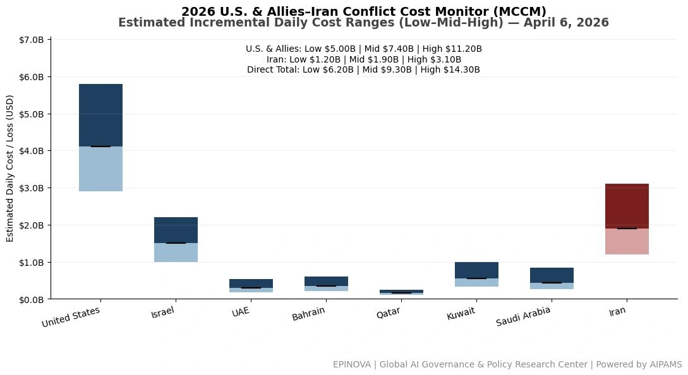
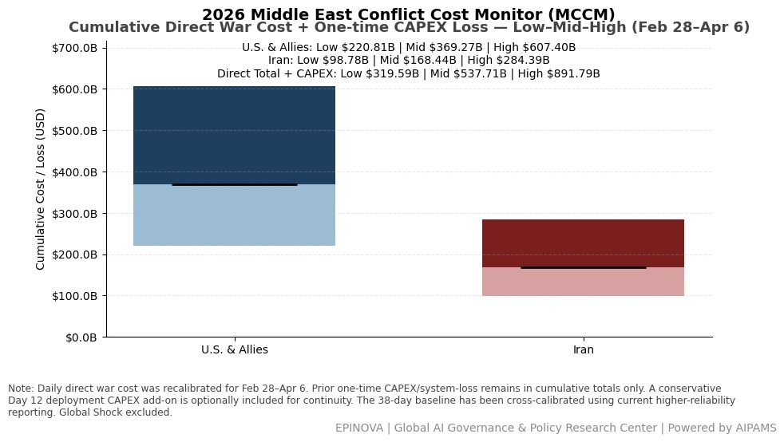
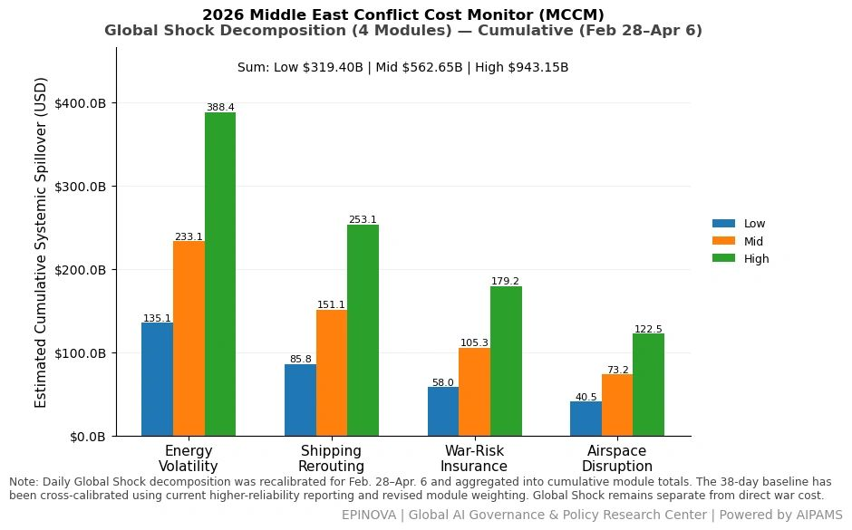

# 2026 U.S. & Allies–Iran Conflict Cost Monitor (MCCM): April 6

Original URL: https://epinova.org/articles/f/2026-us-allies%E2%80%93iran-conflict-cost-monitor-mccm-april-6

Publication date: 2026-04-06

Archive note: This is a locally preserved Markdown copy of an EPINOVA article originally generated through the GoDaddy blog system.

---

[All Posts](<https://epinova.org/articles?blog=y>)

### 2026 U.S. & Allies–Iran Conflict Cost Monitor (MCCM): April 6

April 6, 2026|Global AI Governance & Policy

**Powered by AIPAMS (Adaptive Integrated Policy & Analytics Modeling System) **

  

**1\. Introduction**

The **2026 Middle East Conflict Cost Monitor (MCCM)** provides an event-driven, scenario-based assessment of daily conflict-related expenditures and losses across major state actors involved in the crisis. Using a structured **low–mid–high estimation framework** , the series aggregates publicly available operational indicators, force posture changes, strike intensity proxies, reported material damage, and infrastructure disruptions to produce comparable daily cost ranges.

The MCCM framework distinguishes between three analytical components:  
(1) **Direct War Cost** , which includes military operational expenditures, asset losses, and selected capital losses (CAPEX);  
(2) **Infrastructure and energy-sector disruption costs** linked to conflict operations; and  
(3) **Systemic market spillovers (“Global Shock”)** , which capture broader economic and logistical externalities associated with regional escalation.

Direct war costs and systemic spillovers are **reported separately** to maintain analytical clarity between conflict-specific expenditures and wider economic effects.

MCCM is designed as a **rolling monitoring instrument rather than a definitive accounting ledger**. Estimates are produced using scenario-bounded ranges intended to support comparative analysis and policy discussion rather than precise fiscal accounting. All values are expressed in **current U.S. dollars (USD)** and may be **revised retroactively** as verification improves and additional information becomes available.

As the conflict evolves, MCCM increasingly captures not only direct cost accumulation but also dynamic interactions between military operations, strategic signaling, and systemic economic responses, reflecting a transition from a cost-tracking model to an integrated exposure assessment framework. 

  

  

**2\. Methodological Notes**

**A. Scenario Ranges.**  
All estimates are presented as bounded ranges.

  * **Low:** Minimum confirmed observable losses.
  * **Mid:** Most probable estimate based on publicly available reporting and operational cost parameters.
  * **High:** Upper-bound scenario incorporating reported but not independently verified high-value asset losses.  

**B. Daily Estimates.**  
Reported figures represent **incremental 24-hour estimates** of conflict-related costs and losses.

**C. Cumulative Totals.**  
Cumulative values reflect the **aggregation of daily scenario ranges** over the reporting period. High-range values may include scenario-based adjustments for reported strategic asset losses pending independent verification.

**D. Global Shock.**  
Global Shock represents systemic economic spillovers generated by the conflict, including both escalation-driven disruptions and temporary stabilization effects arising from partial de-escalation signals (e.g., controlled energy transit, diplomatic signaling). It is decomposed into four modules:

  * Energy Volatility
  * Shipping Rerouting
  * War-Risk Insurance Premiums
  * Airspace Disruption

These modules capture major **economic and logistical externalities** associated with regional escalation.

**E. Combined Exposure.**  
In selected figures, Direct War Cost and Global Shock may be displayed together as a **Combined Exposure heuristic** to illustrate the approximate scale of total economic exposure associated with the conflict. This aggregation is **analytical only** and should not be interpreted as a formal consolidated fiscal account. Under high-frequency strike conditions and partial system stabilization, Combined Exposure serves as a more informative indicator of systemic burden than isolated cost metrics. 

**F. Revision Policy.**  
All MCCM estimates are derived from **open-source reporting and model-based reconstruction** and remain subject to revision as verification improves.

**G. Structural Interpretation Note.**

At later stages of the conflict, cost accumulation alone may not fully capture strategic dynamics. MCCM therefore incorporates an exposure-oriented perspective, recognizing that relatively low-cost offensive actions can impose disproportionately high and persistent burdens on complex defense systems and global networks.

This asymmetry may lead to cumulative divergence in system sustainability, particularly under saturation conditions.

  

**Selected References:**

Associated Press. (2026, April 6). _Iran rejects latest ceasefire proposal as Trump's deadline approaches_. AP News. [https://apnews.com/article/87b62d531d3290fde5255077179bd3b5](<https://apnews.com/article/87b62d531d3290fde5255077179bd3b5?utm_source=chatgpt.com>)

Associated Press. (2026, April 6). _The latest: Iran rejects ceasefire proposal and insists on a permanent end to the war_. AP News. [https://apnews.com/article/93f8ec25d61b58882b25d34bda08d0f9](<https://apnews.com/article/93f8ec25d61b58882b25d34bda08d0f9?utm_source=chatgpt.com>)

International Atomic Energy Agency. (2026, April 6). _IAEA confirms impact of recent strikes near Iran's Bushehr nuclear power plant_. Reuters. [https://www.reuters.com/world/iaea-confirms-impact-recent-strikes-near-irans-bushehr-nuclear-power-plant-2026-04-06/](<https://www.reuters.com/world/iaea-confirms-impact-recent-strikes-near-irans-bushehr-nuclear-power-plant-2026-04-06/?utm_source=chatgpt.com>)

Reuters. (2026, April 5). _Oil dips in choppy trade; U.S., Iran receive ceasefire proposal framework_. [https://www.reuters.com/business/energy/oil-prices-open-higher-us-israeli-war-with-iran-continues-disrupt-supply-2026-04-05/](<https://www.reuters.com/business/energy/oil-prices-open-higher-us-israeli-war-with-iran-continues-disrupt-supply-2026-04-05/?utm_source=chatgpt.com>)

Reuters. (2026, April 6). _Iran, U.S. receive plan to end hostilities, immediate ceasefire, source says_. [https://www.reuters.com/world/china/iran-us-receive-plan-end-hostilities-immediate-ceasefire-source-says-2026-04-06/](<https://www.reuters.com/world/china/iran-us-receive-plan-end-hostilities-immediate-ceasefire-source-says-2026-04-06/?utm_source=chatgpt.com>)

Reuters. (2026, April 6). _U.S., Iran and mediators make push for 45-day ceasefire, Axios reports_. [https://www.reuters.com/world/middle-east/us-iran-mediators-make-push-45-day-ceasefire-axios-reports-2026-04-06/](<https://www.reuters.com/world/middle-east/us-iran-mediators-make-push-45-day-ceasefire-axios-reports-2026-04-06/?utm_source=chatgpt.com>)

Reuters. (2026, April 6). _South Korea's Lee says country must balance risk as Hormuz disruptions threaten oil supplies_. [https://www.reuters.com/business/energy/south-koreas-lee-says-country-must-balance-risk-hormuz-disruptions-threaten-oil-2026-04-06/](<https://www.reuters.com/business/energy/south-koreas-lee-says-country-must-balance-risk-hormuz-disruptions-threaten-oil-2026-04-06/?utm_source=chatgpt.com>)

Reuters. (2026, April 6). _U.S. crude premiums climb to record levels as Asia, Europe compete for supply_. [https://www.reuters.com/business/energy/us-crude-premiums-climb-record-levels-asia-europe-compete-supply-2026-04-06/](<https://www.reuters.com/business/energy/us-crude-premiums-climb-record-levels-asia-europe-compete-supply-2026-04-06/?utm_source=chatgpt.com>)

Reuters. (2026, April 6). _Hormuz closure divides the fortunes of Middle Eastern oil states_. [https://www.reuters.com/business/energy/hormuz-closure-divides-fortunes-middle-eastern-oil-states-2026-04-06/](<https://www.reuters.com/business/energy/hormuz-closure-divides-fortunes-middle-eastern-oil-states-2026-04-06/?utm_source=chatgpt.com>)

Reuters. (2026, April 6). _BOJ warns of economic hit from Middle East conflict_. [https://www.reuters.com/world/asia-pacific/boj-says-regional-economies-could-worsen-due-fallout-middle-east-conflict-2026-04-06/](<https://www.reuters.com/world/asia-pacific/boj-says-regional-economies-could-worsen-due-fallout-middle-east-conflict-2026-04-06/?utm_source=chatgpt.com>)

Reuters. (2026, April 6). _Iran accuses UN nuclear watchdog of inaction, warns of risk from attacks_. [https://www.reuters.com/world/iran-accuses-un-nuclear-watchdog-inaction-warns-risk-attacks-2026-04-06/](<https://www.reuters.com/world/iran-accuses-un-nuclear-watchdog-inaction-warns-risk-attacks-2026-04-06/?utm_source=chatgpt.com>)

Reuters. (2026, April 6). _Iraq urges customers to send oil loading plans after Hormuz exemption, document shows_. [https://www.reuters.com/business/energy/iraq-urges-customers-send-oil-loading-plans-after-hormuz-exemption-document-2026-04-06/](<https://www.reuters.com/business/energy/iraq-urges-customers-send-oil-loading-plans-after-hormuz-exemption-document-2026-04-06/?utm_source=chatgpt.com>)

Reuters. (2026, April 6). _Trump says Tuesday deadline to make deal with Iran is final_. [https://www.reuters.com/world/middle-east/trump-says-tuesday-deadline-make-deal-with-iran-is-final-2026-04-06/](<https://www.reuters.com/world/middle-east/trump-says-tuesday-deadline-make-deal-with-iran-is-final-2026-04-06/?utm_source=chatgpt.com>)

Reuters. (2026, April 6). _Trump vows 'hell' if Strait stays shut, says deal is possible_. [https://www.reuters.com/business/aerospace-defense/trump-vows-hell-iran-if-strait-stays-shut-says-deal-is-possible-2026-04-06/](<https://www.reuters.com/business/aerospace-defense/trump-vows-hell-iran-if-strait-stays-shut-says-deal-is-possible-2026-04-06/?utm_source=chatgpt.com>)

Reuters. (2026, April 3). _Trump threatens strike on Iran's bridges, electric power plants_. [https://www.reuters.com/world/middle-east/trump-threatens-strike-irans-bridges-electric-power-plants-2026-04-03/](<https://www.reuters.com/world/middle-east/trump-threatens-strike-irans-bridges-electric-power-plants-2026-04-03/?utm_source=chatgpt.com>)

Reuters. (2026, April 5). _How perilous U.S. rescue mission in Iran nearly went off course_. [https://www.reuters.com/business/aerospace-defense/how-perilous-us-rescue-mission-iran-nearly-went-off-course-2026-04-05/](<https://www.reuters.com/business/aerospace-defense/how-perilous-us-rescue-mission-iran-nearly-went-off-course-2026-04-05/?utm_source=chatgpt.com>)

Reuters. (2026, April 5). _U.S. rescues airman whose F-15 was downed in Iran, U.S. officials say_. [https://www.reuters.com/world/middle-east/us-rescues-airman-whose-f-15-was-downed-iran-us-officials-say-2026-04-05/](<https://www.reuters.com/world/middle-east/us-rescues-airman-whose-f-15-was-downed-iran-us-officials-say-2026-04-05/?utm_source=chatgpt.com>)

Reuters. (2026, April 6). _Most Gulf stocks subdued amid escalating conflict_. [https://www.reuters.com/world/middle-east/most-gulf-stocks-subdued-amid-escalating-conflict-2026-04-05/](<https://www.reuters.com/world/middle-east/most-gulf-stocks-subdued-amid-escalating-conflict-2026-04-05/?utm_source=chatgpt.com>)

Reuters. (2026, April 6). _UAE says use of Hormuz must be guaranteed in any U.S.-Iran deal_. [https://www.reuters.com/world/europe/uae-says-use-hormuz-must-be-guaranteed-any-us-iran-deal-2026-04-06/](<https://www.reuters.com/world/europe/uae-says-use-hormuz-must-be-guaranteed-any-us-iran-deal-2026-04-06/?utm_source=chatgpt.com>)

The Wall Street Journal. (2026, April 6). _Israel mounts wave of strikes on Iran_. [https://www.wsj.com/livecoverage/iran-war-latest-news-updates-2026/card/israel-mounts-wave-of-strikes-on-iran-1BlSi1V8sNdQpQICX2xd](<https://www.wsj.com/livecoverage/iran-war-latest-news-updates-2026/card/israel-mounts-wave-of-strikes-on-iran-1BlSi1V8sNdQpQICX2xd?utm_source=chatgpt.com>)

Share this post:
