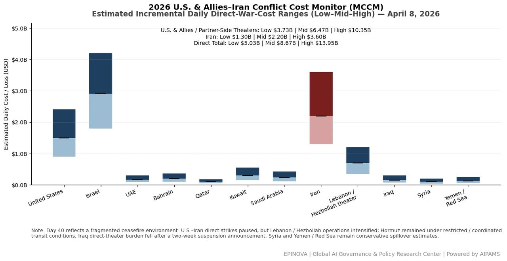
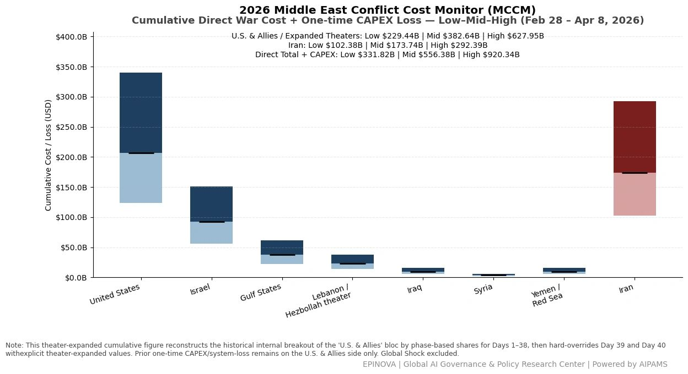
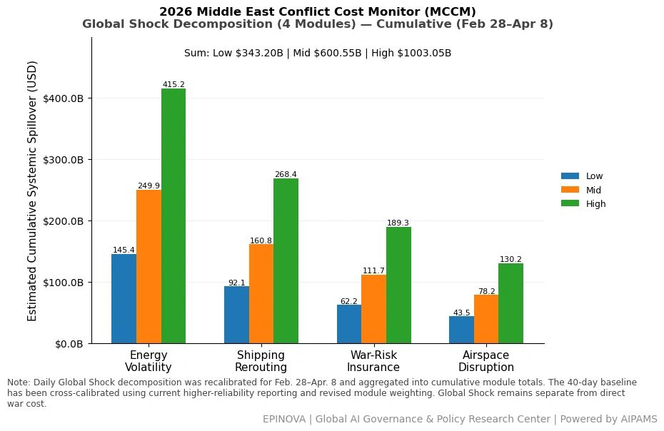
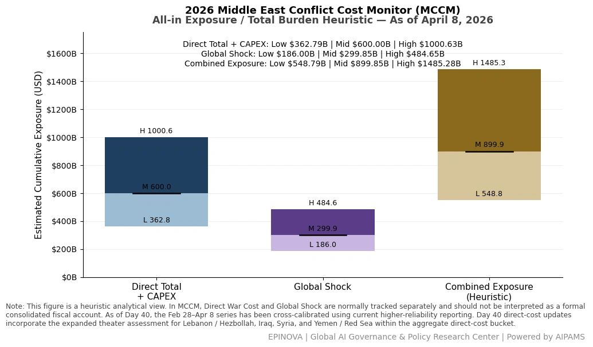

# 2026 U.S. & Allies–Iran Conflict Cost Monitor (MCCM): April 8

Original URL: https://epinova.org/articles/f/2026-us-allies%E2%80%93iran-conflict-cost-monitor-mccm-april-8

Publication date: 2026-04-08

Archive note: This is a locally preserved Markdown copy of an EPINOVA article originally generated through the GoDaddy blog system.

---

[All Posts](<https://epinova.org/articles?blog=y>)

### 2026 U.S. & Allies–Iran Conflict Cost Monitor (MCCM): April 8

April 8, 2026|Global AI Governance & Policy

**Powered by AIPAMS (Adaptive Integrated Policy & Analytics Modeling System) **

  

**1\. Introduction**

The **2026 Middle East Conflict Cost Monitor (MCCM)** provides an event-driven, scenario-based assessment of daily conflict-related expenditures and losses across major state actors involved in the crisis. Using a structured **low–mid–high estimation framework** , the series aggregates publicly available operational indicators, force posture changes, strike intensity proxies, reported material damage, and infrastructure disruptions to produce comparable daily cost ranges.

The MCCM framework distinguishes between three analytical components:  
(1) **Direct War Cost** , which includes military operational expenditures, asset losses, and selected capital losses (CAPEX);  
(2) **Infrastructure and energy-sector disruption costs** linked to conflict operations; and  
(3) **Systemic market spillovers (“Global Shock”)** , which capture broader economic and logistical externalities associated with regional escalation.

Direct war costs and systemic spillovers are **reported separately** to maintain analytical clarity between conflict-specific expenditures and wider economic effects.

MCCM is designed as a **rolling monitoring instrument rather than a definitive accounting ledger**. Estimates are produced using scenario-bounded ranges intended to support comparative analysis and policy discussion rather than precise fiscal accounting. All values are expressed in **current U.S. dollars (USD)** and may be **revised retroactively** as verification improves and additional information becomes available.

As the conflict evolves, MCCM increasingly captures not only direct cost accumulation but also the dynamic interaction between military operations, strategic signaling, and systemic economic responses. In this sense, the framework has gradually developed from a cost-tracking model into a broader **integrated exposure assessment system**.

  

  

  

**2\. Methodological Notes**

**A. Scenario Ranges**

All estimates are presented as bounded ranges:

  * **Low** : Minimum confirmed observable losses. 
  * **Mid** : Most probable estimate based on publicly available reporting and operational cost parameters. 
  * **High** : Upper-bound scenario incorporating reported but not independently verified high-value asset losses. 

**B. Daily Estimates**

Reported figures represent **incremental 24-hour estimates** of conflict-related costs and losses.

**C. Cumulative Totals**

Cumulative values reflect the aggregation of daily scenario ranges over the reporting period. High-range values may include scenario-based adjustments for reported strategic asset losses pending independent verification.

**D. Global Shock**

**Global Shock** represents systemic economic spillovers generated by the conflict, including both escalation-driven disruptions and temporary stabilization effects arising from partial de-escalation signals, such as controlled energy transit or diplomatic signaling.

It is decomposed into four modules:

  * **Energy Volatility**
  * **Shipping Rerouting**
  * **War-Risk Insurance Premiums**
  * **Airspace Disruption**

These modules capture the principal economic and logistical externalities associated with regional escalation.

**E. Combined Exposure**

In selected figures, **Direct War Cost** and **Global Shock** may be displayed together as a **Combined Exposure** heuristic in order to illustrate the approximate scale of total economic exposure associated with the conflict.

This aggregation is analytical only and should not be interpreted as a formal consolidated fiscal account. Under conditions of high-frequency strikes and partial system stabilization, Combined Exposure may serve as a more informative indicator of systemic burden than isolated cost metrics alone.

**F. Revision Policy**

All MCCM estimates are derived from open-source reporting and model-based reconstruction and remain subject to revision as verification improves.

**G. Structural Interpretation Note**

At later stages of the conflict, cost accumulation alone may not fully capture strategic dynamics. MCCM therefore incorporates an **exposure-oriented perspective** , recognizing that relatively low-cost offensive actions may impose disproportionately high and persistent burdens on complex defense systems, infrastructure networks, and global market linkages.

This asymmetry can generate cumulative divergence in system sustainability, particularly under saturation conditions.

  

**Selected References:**

Al Jazeera. (2026, April 8). _UAE and Kuwait report missile and drone attacks amid regional escalation_.  
<https://www.aljazeera.com/news/2026/4/8/uae-kuwait-missile-drone-attacks-middle-east-escalation>

Associated Press. (2026, April 8). _Israel launches largest airstrike on Hezbollah targets in Lebanon since conflict began_.  
<https://apnews.com/article/israel-lebanon-hezbollah-airstrikes-april-2026>

BBC News. (2026, April 8). _US pauses strikes on Iran for two weeks amid Hormuz Strait negotiations_.  
<https://www.bbc.com/news/world-middle-east-6892026>

Bloomberg. (2026, April 8). _Oil markets swing amid ceasefire signals and Strait of Hormuz uncertainty_.  
<https://www.bloomberg.com/news/articles/2026-04-08/oil-markets-swing-on-hormuz-ceasefire-signals>

CCTV News. (2026, April 8). _UAE and Kuwait targeted by missiles and drones following explosions in Iran energy facilities_.  
<https://news.cctv.com/2026/04/08/ARTIuae-kuwait-missile-drone-attack.shtml>

CCTV International. (2026, April 8). _Israel conducts large-scale airstrikes on Hezbollah positions in Lebanon_.  
<https://news.cctv.com/2026/04/08/ARTIhezzbollah-strikes-israel-lebanon.shtml>

China Ministry of Foreign Affairs. (2026, April 8). _Regular press conference: Response on Iran Hormuz transit fee reports_.  
<https://www.fmprc.gov.cn/mfa_eng/xwfw_665399/s2510_665401/202604/t20260408.shtml>

Financial Times. (2026, April 8). _Shipping disruption and insurance costs rise as Gulf tensions escalate_.  
<https://www.ft.com/content/gulf-shipping-insurance-costs-april-2026>

Lloyd’s List. (2026, April 8). _War-risk insurance premiums surge for Gulf transit routes_.  
<https://lloydslist.com/LL1149876/war-risk-premiums-gulf-april-2026>

Reuters. (2026, April 8). _Iran and US to begin talks in Islamabad after Trump announces pause in strikes_.  
<https://www.reuters.com/world/middle-east/iran-us-talks-islamabad-trump-pause-strikes-2026-04-08/>

Reuters. (2026, April 8). _Airspace disruptions spread across Middle East amid escalating conflict_.  
<https://www.reuters.com/world/middle-east/middle-east-airspace-disruptions-conflict-2026-04-08/>

Xinhua News Agency. (2026, April 8). _China urges stability in Strait of Hormuz amid rising tensions_.  
<http://www.xinhuanet.com/english/2026-04/08/c_139862345.htm>

Share this post:
