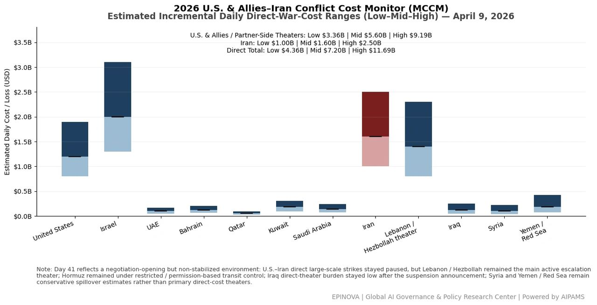
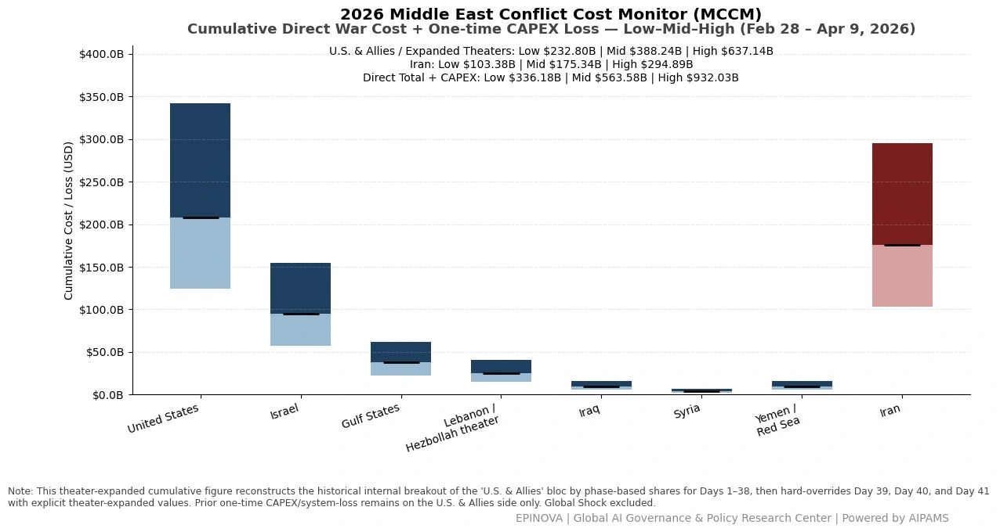
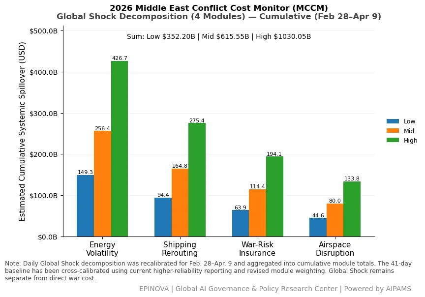
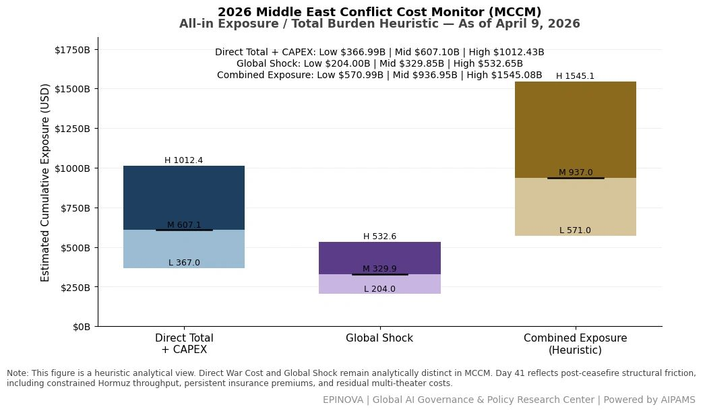

# 2026 U.S. & Allies–Iran Conflict Cost Monitor (MCCM): April 9

Original URL: https://epinova.org/articles/f/2026-us-allies%E2%80%93iran-conflict-cost-monitor-mccm-april-9

Publication date: 2026-04-09

Archive note: This is a locally preserved Markdown copy of an EPINOVA article originally generated through the GoDaddy blog system.

---

[All Posts](<https://epinova.org/articles?blog=y>)

### 2026 U.S. & Allies–Iran Conflict Cost Monitor (MCCM): April 9

April 9, 2026|Global AI Governance & Policy

**Powered by AIPAMS (Adaptive Integrated Policy & Analytics Modeling System) **

  

**1\. Introduction**

The **2026 Middle East Conflict Cost Monitor (MCCM)** provides an event-driven, scenario-based assessment of daily conflict-related expenditures and losses across major state actors involved in the crisis. Using a structured **low–mid–high estimation framework** , the series aggregates publicly available operational indicators, force posture changes, strike intensity proxies, reported material damage, and infrastructure disruptions to produce comparable daily cost ranges.

The MCCM framework distinguishes between three analytical components:  
(1) **Direct War Cost** , which includes military operational expenditures, asset losses, and selected capital losses (CAPEX);  
(2) **Infrastructure and energy-sector disruption costs** linked to conflict operations; and  
(3) **Systemic market spillovers (“Global Shock”)** , which capture broader economic and logistical externalities associated with regional escalation.

Direct war costs and systemic spillovers are **reported separately** to maintain analytical clarity between conflict-specific expenditures and wider economic effects.

MCCM is designed as a **rolling monitoring instrument rather than a definitive accounting ledger**. Estimates are produced using scenario-bounded ranges intended to support comparative analysis and policy discussion rather than precise fiscal accounting. All values are expressed in **current U.S. dollars (USD)** and may be **revised retroactively** as verification improves and additional information becomes available.

As the conflict evolves, MCCM increasingly captures not only direct cost accumulation but also the dynamic interaction between military operations, strategic signaling, and systemic economic responses. In this sense, the framework has gradually developed from a cost-tracking model into a broader **integrated exposure assessment system**.

  

  

  

**2\. Methodological Notes**

**A. Scenario Ranges**

All estimates are presented as bounded ranges:

  * **Low** : Minimum confirmed observable losses. 
  * **Mid** : Most probable estimate based on publicly available reporting and operational cost parameters. 
  * **High** : Upper-bound scenario incorporating reported but not independently verified high-value asset losses. 

**B. Daily Estimates**

Reported figures represent **incremental 24-hour estimates** of conflict-related costs and losses.

**C. Cumulative Totals**

Cumulative values reflect the aggregation of daily scenario ranges over the reporting period. High-range values may include scenario-based adjustments for reported strategic asset losses pending independent verification.

**D. Global Shock**

**Global Shock** represents systemic economic spillovers generated by the conflict, including both escalation-driven disruptions and temporary stabilization effects arising from partial de-escalation signals, such as controlled energy transit or diplomatic signaling.

It is decomposed into four modules:

  * **Energy Volatility**
  * **Shipping Rerouting**
  * **War-Risk Insurance Premiums**
  * **Airspace Disruption**

These modules capture the principal economic and logistical externalities associated with regional escalation.

**E. Combined Exposure**

In selected figures, **Direct War Cost** and **Global Shock** may be displayed together as a **Combined Exposure** heuristic in order to illustrate the approximate scale of total economic exposure associated with the conflict.

This aggregation is analytical only and should not be interpreted as a formal consolidated fiscal account. Under conditions of high-frequency strikes and partial system stabilization, Combined Exposure may serve as a more informative indicator of systemic burden than isolated cost metrics alone.

**F. Revision Policy**

All MCCM estimates are derived from open-source reporting and model-based reconstruction and remain subject to revision as verification improves.

**G. Structural Interpretation Note**

At later stages of the conflict, cost accumulation alone may not fully capture strategic dynamics. MCCM therefore incorporates an **exposure-oriented perspective** , recognizing that relatively low-cost offensive actions may impose disproportionately high and persistent burdens on complex defense systems, infrastructure networks, and global market linkages.

This asymmetry can generate cumulative divergence in system sustainability, particularly under saturation conditions.

  

**Selected References:**

Reuters. (2026, April 8). _Trump dispatching Iran negotiating team to Pakistan, White House says_. [https://www.reuters.com/world/asia-pacific/trump-dispatching-iran-negotiating-team-pakistan-white-house-says-2026-04-08/](<https://www.reuters.com/world/asia-pacific/trump-dispatching-iran-negotiating-team-pakistan-white-house-says-2026-04-08/?utm_source=chatgpt.com>)

Reuters. (2026, April 8). _UN condemns Israeli strikes on Lebanon, calls casualty reports “appalling”_. [https://www.reuters.com/world/middle-east/un-condemns-israeli-strikes-lebanon-calls-casualty-reports-appalling-2026-04-08/](<https://www.reuters.com/world/middle-east/un-condemns-israeli-strikes-lebanon-calls-casualty-reports-appalling-2026-04-08/?utm_source=chatgpt.com>)

Reuters. (2026, April 8). _Iraq’s Islamic Resistance says it is suspending operations for two weeks_. [https://www.reuters.com/world/middle-east/iraqs-islamic-resistance-says-it-is-suspending-operations-two-weeks-2026-04-08/](<https://www.reuters.com/world/middle-east/iraqs-islamic-resistance-says-it-is-suspending-operations-two-weeks-2026-04-08/?utm_source=chatgpt.com>)

Reuters. (2026, April 9). _Hormuz at near standstill as Iran warns ships to keep to its waters_. [https://www.reuters.com/world/middle-east/shipping-traffic-through-hormuz-virtual-standstill-despite-ceasefire-data-shows-2026-04-09/](<https://www.reuters.com/world/middle-east/shipping-traffic-through-hormuz-virtual-standstill-despite-ceasefire-data-shows-2026-04-09/?utm_source=chatgpt.com>)

Reuters. (2026, April 9). _Barclays: Delay in Hormuz flow recovery poses upside risks to $85/b Brent forecast_. [https://www.reuters.com/business/energy/barclays-delay-hormuz-flow-recovery-poses-upside-risks-85b-brent-forecast-2026-04-09/](<https://www.reuters.com/business/energy/barclays-delay-hormuz-flow-recovery-poses-upside-risks-85b-brent-forecast-2026-04-09/?utm_source=chatgpt.com>)

Reuters. (2026, April 9). _Iran to let no more than 15 vessels a day to pass Strait of Hormuz, TASS cites a senior Iranian source_. [https://www.reuters.com/world/middle-east/iran-let-no-more-than-15-vessels-day-pass-strait-hormuz-tass-cites-senior-2026-04-09/](<https://www.reuters.com/world/middle-east/iran-let-no-more-than-15-vessels-day-pass-strait-hormuz-tass-cites-senior-2026-04-09/?utm_source=chatgpt.com>)

Associated Press. (2026, April 9). _The Latest: Netanyahu approves talks with Lebanon after Israeli strikes imperil Iran ceasefire_. [https://apnews.com/article/e8af575b1ab8e82b46fb6ea4be1e185c](<https://apnews.com/article/e8af575b1ab8e82b46fb6ea4be1e185c?utm_source=chatgpt.com>)

The Guardian. (2026, April 8). _At least 254 killed after Israel hits Lebanon with massive wave of airstrikes_. [https://www.theguardian.com/world/2026/apr/08/israel-operations-in-lebanon-to-continue-despite-trump-ceasefire-iran-pakistan-hezbollah](<https://www.theguardian.com/world/2026/apr/08/israel-operations-in-lebanon-to-continue-despite-trump-ceasefire-iran-pakistan-hezbollah?utm_source=chatgpt.com>)

The Guardian. (2026, April 8). _How Pakistan secured “biggest diplomatic win in years” with Iran ceasefire_. [https://www.theguardian.com/world/2026/apr/08/pakistan-us-israel-iran-ceasefire](<https://www.theguardian.com/world/2026/apr/08/pakistan-us-israel-iran-ceasefire?utm_source=chatgpt.com>)

Business Insider. (2026, April 9). _Hormuz shipping is barely moving, despite the US-Iran ceasefire_. <https://www.businessinsider.com/us-iran-ceasefire-strait-of-hormuz-oil-shipping-traffic-transit-2026-4>

Share this post:
