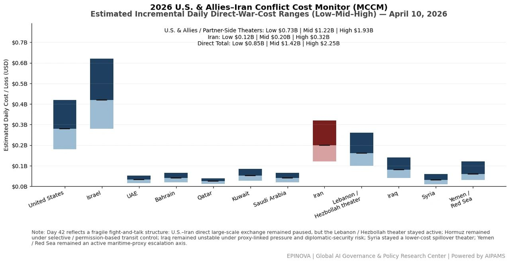
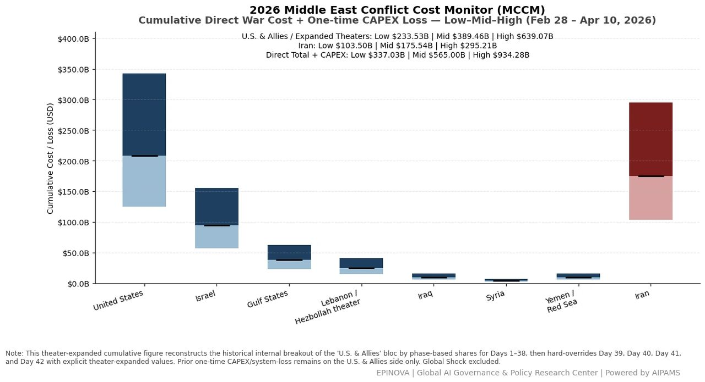
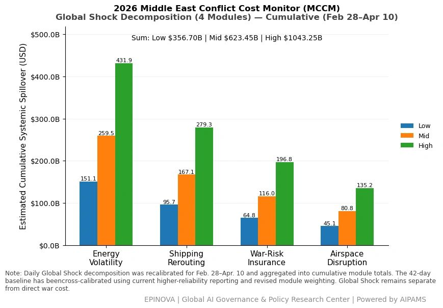
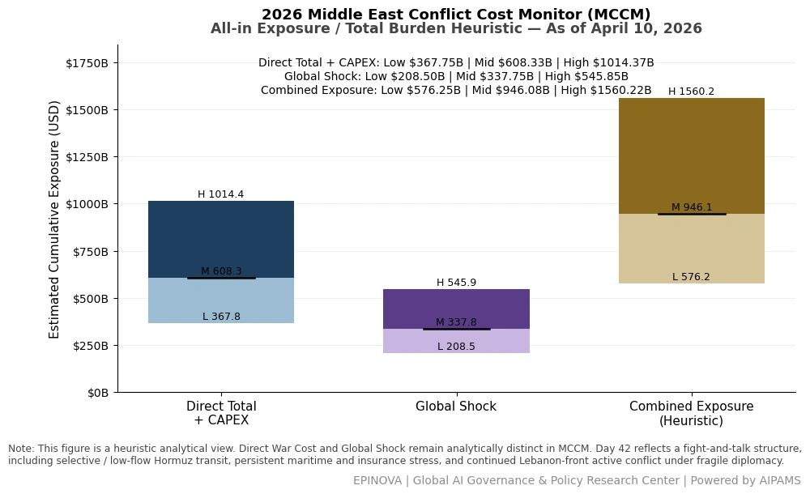

# 2026 U.S. & Allies–Iran Conflict Cost Monitor (MCCM): April 10

Original URL: https://epinova.org/articles/f/2026-us-allies%E2%80%93iran-conflict-cost-monitor-mccm-april-10

Publication date: 2026-04-10

Archive note: This is a locally preserved Markdown copy of an EPINOVA article originally generated through the GoDaddy blog system.

---

[All Posts](<https://epinova.org/articles?blog=y>)

### 2026 U.S. & Allies–Iran Conflict Cost Monitor (MCCM): April 10

April 10, 2026|Global AI Governance & Policy

**Powered by AIPAMS (Adaptive Integrated Policy & Analytics Modeling System) **

  

**1\. Introduction**

The **2026 Middle East Conflict Cost Monitor (MCCM)** provides an event-driven, scenario-based assessment of daily conflict-related expenditures and losses across major state actors involved in the crisis. Using a structured **low–mid–high estimation framework** , the series aggregates publicly available operational indicators, force posture changes, strike intensity proxies, reported material damage, and infrastructure disruptions to produce comparable daily cost ranges.

The MCCM framework distinguishes between three analytical components:  
(1) **Direct War Cost** , which includes military operational expenditures, asset losses, and selected capital losses (CAPEX);  
(2) **Infrastructure and energy-sector disruption costs** linked to conflict operations; and  
(3) **Systemic market spillovers (“Global Shock”)** , which capture broader economic and logistical externalities associated with regional escalation.

Direct war costs and systemic spillovers are **reported separately** to maintain analytical clarity between conflict-specific expenditures and wider economic effects.

MCCM is designed as a **rolling monitoring instrument rather than a definitive accounting ledger**. Estimates are produced using scenario-bounded ranges intended to support comparative analysis and policy discussion rather than precise fiscal accounting. All values are expressed in **current U.S. dollars (USD)** and may be **revised retroactively** as verification improves and additional information becomes available.

As the conflict evolves, MCCM increasingly captures not only direct cost accumulation but also the dynamic interaction between military operations, strategic signaling, and systemic economic responses. In this sense, the framework has gradually developed from a cost-tracking model into a broader **integrated exposure assessment system**.

  

  

  

**2\. Methodological Notes**

**A. Scenario Ranges**

All estimates are presented as bounded ranges:

  * **Low** : Minimum confirmed observable losses. 
  * **Mid** : Most probable estimate based on publicly available reporting and operational cost parameters. 
  * **High** : Upper-bound scenario incorporating reported but not independently verified high-value asset losses. 

**B. Daily Estimates**

Reported figures represent **incremental 24-hour estimates** of conflict-related costs and losses.

**C. Cumulative Totals**

Cumulative values reflect the aggregation of daily scenario ranges over the reporting period. High-range values may include scenario-based adjustments for reported strategic asset losses pending independent verification.

**D. Global Shock**

**Global Shock** represents systemic economic spillovers generated by the conflict, including both escalation-driven disruptions and temporary stabilization effects arising from partial de-escalation signals, such as controlled energy transit or diplomatic signaling.

It is decomposed into four modules:

  * **Energy Volatility**
  * **Shipping Rerouting**
  * **War-Risk Insurance Premiums**
  * **Airspace Disruption**

These modules capture the principal economic and logistical externalities associated with regional escalation.

**E. Combined Exposure**

In selected figures, **Direct War Cost** and **Global Shock** may be displayed together as a **Combined Exposure** heuristic in order to illustrate the approximate scale of total economic exposure associated with the conflict.

This aggregation is analytical only and should not be interpreted as a formal consolidated fiscal account. Under conditions of high-frequency strikes and partial system stabilization, Combined Exposure may serve as a more informative indicator of systemic burden than isolated cost metrics alone.

**F. Revision Policy**

All MCCM estimates are derived from open-source reporting and model-based reconstruction and remain subject to revision as verification improves.

**G. Structural Interpretation Note**

At later stages of the conflict, cost accumulation alone may not fully capture strategic dynamics. MCCM therefore incorporates an **exposure-oriented perspective** , recognizing that relatively low-cost offensive actions may impose disproportionately high and persistent burdens on complex defense systems, infrastructure networks, and global market linkages.

This asymmetry can generate cumulative divergence in system sustainability, particularly under saturation conditions.

  

**Selected References:**

Reuters. (2026, April 7). _Iran sets preconditions for talks on lasting peace with U.S., senior official tells Reuters_. [https://www.reuters.com/world/middle-east/iran-sets-preconditions-talks-lasting-peace-with-us-senior-official-tells-2026-04-07/](<https://www.reuters.com/world/middle-east/iran-sets-preconditions-talks-lasting-peace-with-us-senior-official-tells-2026-04-07/?utm_source=chatgpt.com>)

Reuters. (2026, April 8). _Iran says peace talks would be 'unreasonable' following Israeli strikes_. <https://www.reuters.com/world/asia-pacific/trump-agrees-two-week-ceasefire-iran-says-safe-passage-through-hormuz-possible-2026-04-08/>

Reuters. (2026, April 9). _Pakistan's high-stakes Iran peace bid is fraught with risk_. [https://www.reuters.com/world/asia-pacific/pakistans-high-stakes-iran-peace-bid-is-fraught-with-risk-2026-04-09/](<https://www.reuters.com/world/asia-pacific/pakistans-high-stakes-iran-peace-bid-is-fraught-with-risk-2026-04-09/?utm_source=chatgpt.com>)

Reuters. (2026, April 9). _Hormuz at near standstill as Iran warns ships to keep to its waters_. [https://www.reuters.com/world/middle-east/shipping-traffic-through-hormuz-virtual-standstill-despite-ceasefire-data-shows-2026-04-09/](<https://www.reuters.com/world/middle-east/shipping-traffic-through-hormuz-virtual-standstill-despite-ceasefire-data-shows-2026-04-09/?utm_source=chatgpt.com>)

Reuters. (2026, April 9). _Starmer, Trump discussed opening Strait of Hormuz, Downing Street says_. [https://www.reuters.com/world/europe/starmer-trump-discussed-opening-strait-hormuz-downing-street-says-2026-04-09/](<https://www.reuters.com/world/europe/starmer-trump-discussed-opening-strait-hormuz-downing-street-says-2026-04-09/?utm_source=chatgpt.com>)

Reuters. (2026, April 9). _Netanyahu: Israel wants to start peace talks with Lebanon 'as soon as possible'_. [https://www.reuters.com/world/middle-east/netanyahu-israel-wants-start-peace-talks-with-lebanon-as-soon-possible-2026-04-09/](<https://www.reuters.com/world/middle-east/netanyahu-israel-wants-start-peace-talks-with-lebanon-as-soon-possible-2026-04-09/?utm_source=chatgpt.com>)

Reuters. (2026, April 9). _Iran's president says Israeli strikes on Lebanon render negotiations meaningless_. [https://www.reuters.com/world/middle-east/irans-president-says-israeli-strikes-lebanon-render-negotiations-meaningless-2026-04-09/](<https://www.reuters.com/world/middle-east/irans-president-says-israeli-strikes-lebanon-render-negotiations-meaningless-2026-04-09/?utm_source=chatgpt.com>)

Reuters. (2026, April 9). _Israeli military says it has killed Hezbollah chief Naim Qassem_. <https://www.reuters.com/world/middle-east/israeli-military-says-it-has-killed-hezbollah-chief-naim-qassem-2026-04-09/>

Reuters. (2026, April 9). _U.S. summons Iraqi ambassador over drone strike on diplomatic facility in Baghdad_. [https://www.reuters.com/world/us-summons-iraqi-ambassador-over-drone-strike-diplomatic-facility-baghdad-2026-04-09/](<https://www.reuters.com/world/us-summons-iraqi-ambassador-over-drone-strike-diplomatic-facility-baghdad-2026-04-09/?utm_source=chatgpt.com>)

Reuters. (2026, April 10). _Israeli military says Hezbollah launched missile at Israel, triggering sirens_. <https://www.reuters.com/world/asia-pacific/israeli-military-says-hezbollah-launched-missile-israel-triggering-sirens-2026-04-09/>

Reuters. (2026, April 7). _U.N. envoy plans to visit Iran as part of peace effort_. [https://www.reuters.com/world/asia-pacific/un-envoy-plans-visit-iran-part-peace-effort-2026-04-07/](<https://www.reuters.com/world/asia-pacific/un-envoy-plans-visit-iran-part-peace-effort-2026-04-07/?utm_source=chatgpt.com>)

Associated Press. (2026, April 9). _Netanyahu authorizes direct talks with Lebanon in potential boost to ceasefire efforts_. [https://apnews.com/article/7760f88f183ed2a13a721057e31f3ce7](<https://apnews.com/article/7760f88f183ed2a13a721057e31f3ce7?utm_source=chatgpt.com>)

Associated Press. (2026, April 9). _Lebanon digs for survivors after Israeli attack kills over 300, as surprise word of talks emerges_. <https://apnews.com/article/46a82d3758b7d0df9ac6df7bd18f936a>

Business Insider. (2026, April 9). _Hormuz shipping is barely moving, despite the US-Iran ceasefire_. [https://www.businessinsider.com/us-iran-ceasefire-strait-of-hormuz-oil-shipping-traffic-transit-2026-4](<https://www.businessinsider.com/us-iran-ceasefire-strait-of-hormuz-oil-shipping-traffic-transit-2026-4?utm_source=chatgpt.com>)

The Wall Street Journal. (2026, April 10). _Iran’s delegation lands in Islamabad for cease-fire talks_. [https://www.wsj.com/livecoverage/iran-war-2026-trump-deadline-latest-news/card/iran-s-delegation-lands-in-islamabad-for-cease-fire-talks-5TqhEJr3r1BNt6SZIQML](<https://www.wsj.com/livecoverage/iran-war-2026-trump-deadline-latest-news/card/iran-s-delegation-lands-in-islamabad-for-cease-fire-talks-5TqhEJr3r1BNt6SZIQML?utm_source=chatgpt.com>)

The Wall Street Journal. (2026, April 9). _Trump weighs punishing certain NATO countries over lack of Iran war support_. [https://www.wsj.com/world/europe/trump-weighs-punishing-certain-nato-countries-over-lack-of-iran-war-support-a2361995](<https://www.wsj.com/world/europe/trump-weighs-punishing-certain-nato-countries-over-lack-of-iran-war-support-a2361995?utm_source=chatgpt.com>)

Reuters Connect. (2026, April 10). _Pakistan prepares to host the U.S. and Iran for peace talks, in Islamabad_. [https://www.reutersconnect.com/item/pakistan-prepares-to-host-the-us-and-iran-for-peace-talks-in-islamabad/dGFnOnJldXRlcnMuY29tLDIwMjY6bmV3c21sX1JDMjFNS0ExMEVPWA](<https://www.reutersconnect.com/item/pakistan-prepares-to-host-the-us-and-iran-for-peace-talks-in-islamabad/dGFnOnJldXRlcnMuY29tLDIwMjY6bmV3c21sX1JDMjFNS0ExMEVPWA?utm_source=chatgpt.com>)

Share this post:
