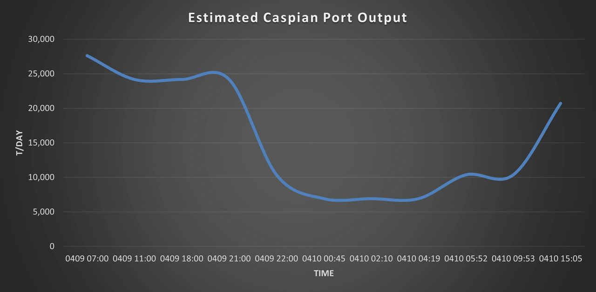
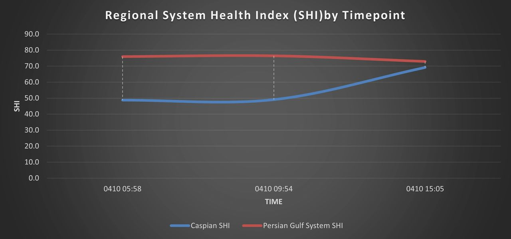

# SHI and Caspian Port Dynamics in Iran: April 9–10, 2026

Original URL: https://epinova.org/articles/f/shi-and-caspian-port-dynamics-in-iran-april-9%E2%80%9310-2026

Publication date: 2026-04-10

Archive note: This is a locally preserved Markdown copy of an EPINOVA article originally generated through the GoDaddy blog system.

---

[All Posts](<https://epinova.org/articles?blog=y>)

### SHI and Caspian Port Dynamics in Iran: April 9–10, 2026

April 10, 2026|Global AI Governance & Policy

**Powered by AIPAMS (Adaptive Integrated Policy & Analytics Modeling System) **

  

  

**Method Note: SHI and Caspian Throughput**

Ports are grouped into two systems: **Caspian (north)** and **Persian Gulf (south)**.  
System performance is measured using a **System Health Index (SHI)** :

SHI=100×(0.45F+0.35Q+0.20B)SHI = 100 \times (0.45F + 0.35Q + 0.20B)SHI=100×(0.45F+0.35Q+0.20B) 

  * FFF: Flow absorption (departures vs inflow) 
  * QQQ: Queue efficiency (anchorage share) 
  * BBB: Flow balance (departures vs arrivals) 

SHI > 70 indicates efficient flow; < 50 indicates congestion.

Caspian throughput is estimated as:

Throughput≈Departures×2,000–4,000×(0.5–0.8)Throughput \approx Departures \times 2{,}000\text{–}4{,}000 \times (0.5\text{–}0.8)Throughput≈Departures×2,000–4,000×(0.5–0.8) 

Baseline capacity is ~**10,000–15,000 t/day** , consistent with PB–27.

This framework converts vessel activity into real-time indicators of **congestion, release, and system stability**.

Share this post:
