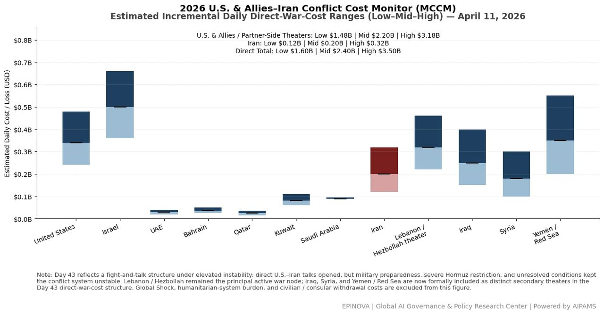
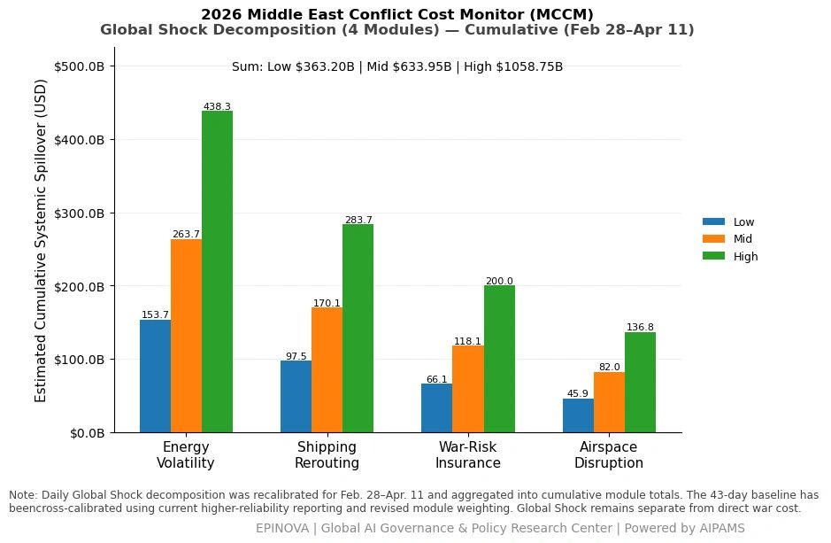
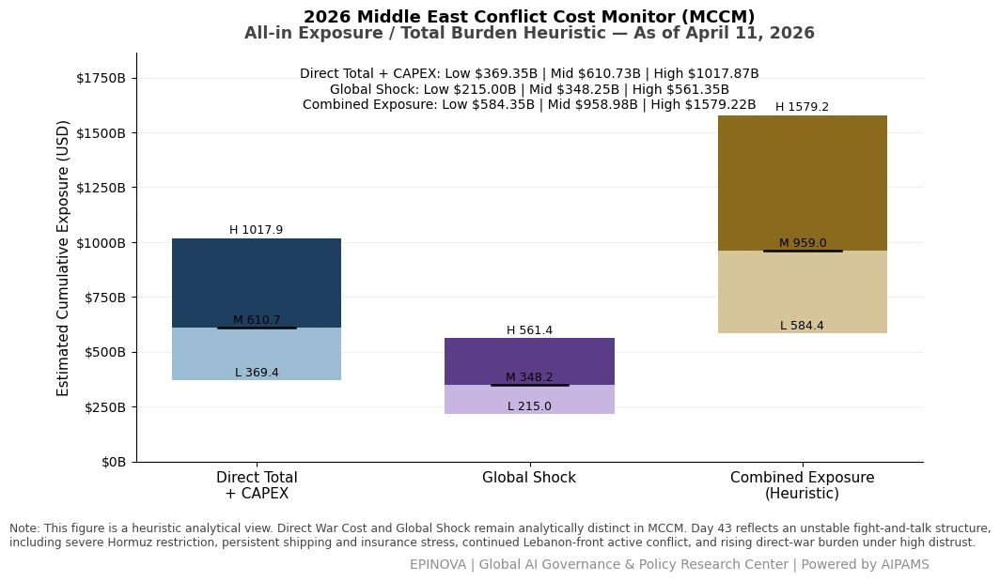

# 2026 U.S. & Allies–Iran Conflict Cost Monitor (MCCM): April 11

Original URL: https://epinova.org/articles/f/2026-us-allies%E2%80%93iran-conflict-cost-monitor-mccm-april-11

Publication date: 2026-04-11

Archive note: This is a locally preserved Markdown copy of an EPINOVA article originally generated through the GoDaddy blog system.

---

[All Posts](<https://epinova.org/articles?blog=y>)

### 2026 U.S. & Allies–Iran Conflict Cost Monitor (MCCM): April 11

April 11, 2026|Global AI Governance & Policy

**Powered by AIPAMS (Adaptive Integrated Policy & Analytics Modeling System) **

  

**1\. Introduction**

The **2026 Middle East Conflict Cost Monitor (MCCM)** provides an event-driven, scenario-based assessment of daily conflict-related expenditures and losses across major state actors involved in the crisis. Using a structured **low–mid–high estimation framework** , the series aggregates publicly available operational indicators, force posture changes, strike intensity proxies, reported material damage, and infrastructure disruptions to produce comparable daily cost ranges.

The MCCM framework distinguishes between three analytical components:  
(1) **Direct War Cost** , which includes military operational expenditures, asset losses, and selected capital losses (CAPEX);  
(2) **Infrastructure and energy-sector disruption costs** linked to conflict operations; and  
(3) **Systemic market spillovers (“Global Shock”)** , which capture broader economic and logistical externalities associated with regional escalation.

Direct war costs and systemic spillovers are **reported separately** to maintain analytical clarity between conflict-specific expenditures and wider economic effects.

MCCM is designed as a **rolling monitoring instrument rather than a definitive accounting ledger**. Estimates are produced using scenario-bounded ranges intended to support comparative analysis and policy discussion rather than precise fiscal accounting. All values are expressed in **current U.S. dollars (USD)** and may be **revised retroactively** as verification improves and additional information becomes available.

As the conflict evolves, MCCM increasingly captures not only direct cost accumulation but also the dynamic interaction between military operations, strategic signaling, and systemic economic responses. In this sense, the framework has gradually developed from a cost-tracking model into a broader **integrated exposure assessment system**.

  

  

**2\. Methodological Notes**

**A. Scenario Ranges**

All estimates are presented as bounded ranges:

  * **Low** : Minimum confirmed observable losses. 
  * **Mid** : Most probable estimate based on publicly available reporting and operational cost parameters. 
  * **High** : Upper-bound scenario incorporating reported but not independently verified high-value asset losses. 

**B. Daily Estimates**

Reported figures represent **incremental 24-hour estimates** of conflict-related costs and losses.

**C. Cumulative Totals**

Cumulative values reflect the aggregation of daily scenario ranges over the reporting period. High-range values may include scenario-based adjustments for reported strategic asset losses pending independent verification.

**D. Global Shock**

**Global Shock** represents systemic economic spillovers generated by the conflict, including both escalation-driven disruptions and temporary stabilization effects arising from partial de-escalation signals, such as controlled energy transit or diplomatic signaling.

It is decomposed into four modules:

  * **Energy Volatility**
  * **Shipping Rerouting**
  * **War-Risk Insurance Premiums**
  * **Airspace Disruption**

These modules capture the principal economic and logistical externalities associated with regional escalation.

**E. Combined Exposure**

In selected figures, **Direct War Cost** and **Global Shock** may be displayed together as a **Combined Exposure** heuristic in order to illustrate the approximate scale of total economic exposure associated with the conflict.

This aggregation is analytical only and should not be interpreted as a formal consolidated fiscal account. Under conditions of high-frequency strikes and partial system stabilization, Combined Exposure may serve as a more informative indicator of systemic burden than isolated cost metrics alone.

**F. Revision Policy**

All MCCM estimates are derived from open-source reporting and model-based reconstruction and remain subject to revision as verification improves.

**G. Structural Interpretation Note**

At later stages of the conflict, cost accumulation alone may not fully capture strategic dynamics. MCCM therefore incorporates an **exposure-oriented perspective** , recognizing that relatively low-cost offensive actions may impose disproportionately high and persistent burdens on complex defense systems, infrastructure networks, and global market linkages.

This asymmetry can generate cumulative divergence in system sustainability, particularly under saturation conditions.

  

**Selected References:**

Associated Press. (2026, April 10). _Lebanese bury 13 officers killed by Israel as conflict intensifies_. [https://apnews.com/article/394f8bdaee36bab82ab3ebc713221302](<https://apnews.com/article/394f8bdaee36bab82ab3ebc713221302?utm_source=chatgpt.com>)

Associated Press. (2026, April 10). _Stocks drift lower and oil prices ease ahead of U.S.-Iran talks_. [https://apnews.com/article/7ef6ebab1aaa731d2da6406b3cbde6dd](<https://apnews.com/article/7ef6ebab1aaa731d2da6406b3cbde6dd?utm_source=chatgpt.com>)

Associated Press. (2026, April 11). _The latest: U.S. and Iranian officials meet face-to-face in Islamabad ceasefire talks_. [https://apnews.com/article/00bf6d9a8f19565dbcd437bc6bf09ea0](<https://apnews.com/article/00bf6d9a8f19565dbcd437bc6bf09ea0?utm_source=chatgpt.com>)

Associated Press. (2026, April 11). _U.S. and Iran hold historic talks in Pakistan on war’s fragile ceasefire_. [https://apnews.com/article/2be904aee3f804892336730279e054b9](<https://apnews.com/article/2be904aee3f804892336730279e054b9?utm_source=chatgpt.com>)

Reuters. (2026, April 8). _Iraq’s Islamic Resistance suspends operations for two weeks_. [https://www.reuters.com/world/middle-east/iraqs-islamic-resistance-says-it-is-suspending-operations-two-weeks-2026-04-08/](<https://www.reuters.com/world/middle-east/iraqs-islamic-resistance-says-it-is-suspending-operations-two-weeks-2026-04-08/?utm_source=chatgpt.com>)

Reuters. (2026, April 10). _Global markets mixed and oil dips ahead of U.S.-Iran negotiations_. [https://www.reuters.com/world/china/global-markets-wrapup-1pix-2026-04-10/](<https://www.reuters.com/world/china/global-markets-wrapup-1pix-2026-04-10/?utm_source=chatgpt.com>)

Reuters. (2026, April 10). _Lebanon says Israeli strikes killed security personnel in Nabatieh_. [https://www.reuters.com/world/middle-east/lebanon-says-israeli-attack-killed-13-state-security-personnel-nabatieh-2026-04-10/](<https://www.reuters.com/world/middle-east/lebanon-says-israeli-attack-killed-13-state-security-personnel-nabatieh-2026-04-10/?utm_source=chatgpt.com>)

Reuters. (2026, April 10). _Oil posts steepest weekly drop since 2022 amid ceasefire expectations_. [https://www.reuters.com/business/energy/oil-prices-rise-after-strikes-saudi-oil-facilities-2026-04-10/](<https://www.reuters.com/business/energy/oil-prices-rise-after-strikes-saudi-oil-facilities-2026-04-10/?utm_source=chatgpt.com>)

Reuters. (2026, April 11). _U.S. military setting conditions to clear mines from Strait of Hormuz_. [https://www.reuters.com/world/asia-pacific/trump-says-us-forces-are-clearing-strait-hormuz-2026-04-11/](<https://www.reuters.com/world/asia-pacific/trump-says-us-forces-are-clearing-strait-hormuz-2026-04-11/?utm_source=chatgpt.com>)

Reuters. (2026, April 11). _U.S.-Iran negotiations begin amid doubts over Lebanon and sanctions_. [https://www.reuters.com/world/asia-pacific/us-iran-set-peace-talks-doubts-emerge-over-lebanon-sanctions-2026-04-11/](<https://www.reuters.com/world/asia-pacific/us-iran-set-peace-talks-doubts-emerge-over-lebanon-sanctions-2026-04-11/?utm_source=chatgpt.com>)

World Health Organization. (2026, April 9). _Casualty and displacement update on Iran and Lebanon conflict_. <https://www.who.int/>

央视新闻. (2026, April 10). _伊朗塞姆南省警方逮捕7名与敌对网络相关人员_. <https://news.cctv.com/>

央视新闻. (2026, April 10). _西班牙首相谴责以色列打击黎巴嫩违反国际法_. <https://news.cctv.com/>

央视新闻. (2026, April 11). _卡塔尔公布美军乌代德空军基地遭袭画面，雷达系统受损_. <https://news.cctv.com/>

新华社. (2026, April 11). _伊朗教育部：美以袭击已致344名师生死亡_. <https://www.xinhuanet.com/>

新华社. (2026, April 11). _美国和以色列对伊朗军事打击造成约2400人死亡、320万人流离失所_. <https://www.xinhuanet.com/>

Share this post:
