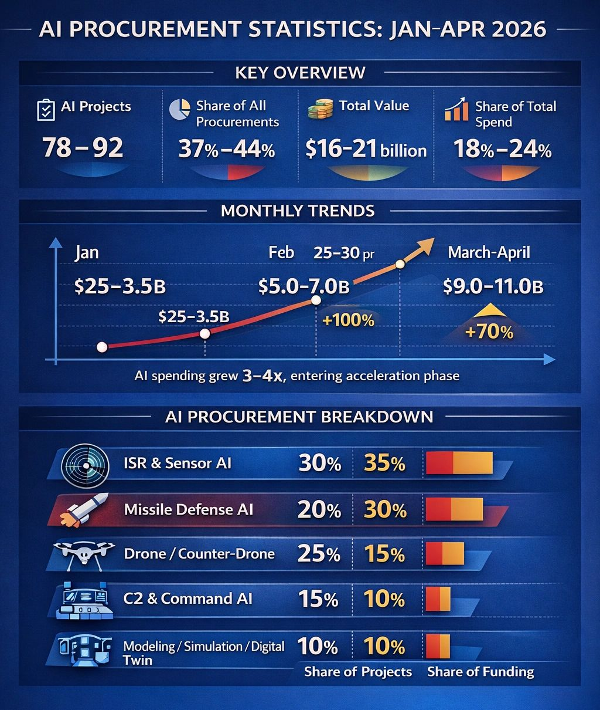

# The Quiet Surge: How AI Procurement Is Reshaping the Logic of War

Original URL: https://epinova.org/articles/f/the-quiet-surge-how-ai-procurement-is-reshaping-the-logic-of-war

Publication date: 2026-04-11

Archive note: This is a locally preserved Markdown copy of an EPINOVA article originally generated through the GoDaddy blog system.

---

[All Posts](<https://epinova.org/articles?blog=y>)

### The Quiet Surge: How AI Procurement Is Reshaping the Logic of War

April 11, 2026|Global AI Governance & Policy

**Author:** Dr. Shaoyuan Wu

**ORCID:** [_https://orcid.org/0009-0008-0660-8232_](<https://orcid.org/0009-0008-0660-8232>)

**Affiliation:** Global AI Governance and Policy Research Center, EPINOVA LLC

**Date:** April 11, 2026 

  

  

#### A Rapid but Understated Transformation

Over the past three months, U.S. defense procurement patterns have undergone a subtle but consequential shift. While public attention remains focused on missiles, air defense systems, and battlefield attrition, a parallel buildup has accelerated beneath the surface: artificial intelligence.

Between January and early April 2026, AI-related defense contracts—identified through functional integration in autonomy, sensor fusion, and decision-support systems—have expanded both in scale and strategic significance. Although these programs do not yet dominate headline spending, their growth trajectory is unmistakable.

AI-related procurement reached an estimated **$16–21 billion** , accounting for roughly **18–24 percent of total contract value** , across approximately **78 to 92 projects**. More striking than the absolute numbers is the pace: within three months, AI procurement has grown by **three to four times** , outpacing nearly every other category in relative terms.

This is not merely an increase in spending. It reflects a deeper transformation in how modern warfare is organized and sustained.

  

#### From Tools to Systems

The most important change is qualitative rather than quantitative.

In early 2026, AI procurement still largely consisted of discrete tools: analytics platforms, image recognition systems, and limited automation modules. By March and April, however, AI had moved decisively into embedded roles within operational systems.

Today’s procurement patterns indicate that AI is no longer being acquired as standalone software. Instead, it is being integrated directly into:

  * Missile defense architectures 
  * Autonomous and counter-drone systems 
  * Command-and-control (C2) networks 
  * ISR (intelligence, surveillance, reconnaissance) pipelines 

This shift marks a transition from **AI as an auxiliary capability** to **AI as a structural component of military systems**.

In practical terms, this means that modern weapons systems increasingly depend on AI not just to enhance performance, but to function at all.

#### **Where the Money Is Going**

The distribution of AI procurement reveals another critical insight: the largest investments are not in drones or autonomous platforms, but in **missile defense and high-end decision systems**.

  * **ISR and sensor-based AI** account for roughly 30 percent of projects and 35 percent of funding 
  * **Missile defense AI** represents around 20 percent of projects but up to 30 percent of total spending 
  * **Drone and counter-drone AI** comprise about 25 percent of projects but a smaller share of funding 
  * **C2 systems and modeling/simulation** fill out the remainder 

This pattern reflects a fundamental reality of contemporary warfare: the bottleneck is no longer firepower alone, but decision-making under extreme complexity.

Missile defense systems, in particular, require rapid threat discrimination, trajectory prediction, and allocation of limited interceptors. These tasks cannot be performed effectively without algorithmic support.

As a result, AI investment is increasingly concentrated where **decision latency and system overload risks are highest**.

#### **From Efficiency to Stability**

Perhaps the most important shift is conceptual.

Historically, military AI was framed as a tool for improving efficiency—faster analysis, better targeting, reduced manpower. The current procurement cycle suggests a different function altogether.

AI is now being deployed primarily to prevent systemic breakdown.

Modern battlefields characterized by high-density missile exchanges, drone swarms, and multi-domain operations generate volumes of data and decision requirements that exceed human processing capacity. Without AI, these systems risk saturation, delay, and ultimately failure.

In this sense, AI is not enhancing warfighting capability in the traditional sense. It is stabilizing systems under stress.

A simplified relationship illustrates this dynamic:

> _**For every $10 billion in missile procurement, approximately $2–3 billion in AI systems is required to sustain operational effectiveness**_. 

This is not optional spending. It is structural.

  

#### AI as the Hidden Cost of Modern War

These trends suggest that AI is becoming a form of implicit military expenditure—not always visible in headline budgets, but indispensable to system performance.

Missiles, interceptors, and platforms remain the most visible elements of defense spending. But without AI-enabled coordination, prioritization, and response, their effectiveness degrades rapidly.

In this sense, AI functions as a systemic enabler rather than a standalone capability.

Its role is analogous to infrastructure: rarely the focus of attention, but essential for everything else to operate.

  

#### **Controlling the Tempo of Conflict**

The strategic implications extend beyond procurement.

AI is emerging as a **controller of operational tempo**. It shapes:

  * The speed of decision-making 
  * The allocation of defensive resources 
  * The ability to respond to simultaneous threats 
  * The resilience of command structures under pressure 

In high-intensity environments, these factors determine whether a system remains coherent or collapses into disorder.

From a systems perspective, AI investments can be understood as mechanisms that delay the onset of **loss-of-control dynamics** —the point at which complexity overwhelms coordination.

They do not eliminate risk. But they shift the threshold at which systems begin to fail.

  

#### Rising Complexity and New Vulnerabilities

The rapid growth of AI procurement also signals something else: **the increasing complexity of warfare itself**.

AI becomes necessary only when environments exceed human cognitive limits, when engagements involve:

  * Multiple simultaneous targets 
  * Cross-domain interactions (air, sea, cyber, space) 
  * High-speed, high-volume attack cycles 

In other words, rising AI investment is not just a technological trend. It is a diagnostic indicator of escalating systemic complexity.

At the same time, this shift introduces new vulnerabilities.

If AI systems become integral to operational stability, then:

  * Algorithmic errors can produce strategic miscalculations 
  * System failures can trigger cascading breakdowns 
  * Adversarial interference can disrupt entire decision chains 

The more militaries depend on AI, the more they expose themselves to systemic fragility at the algorithmic level.

  

#### **A Different Kind of Arms Race**

From an external perspective, these trends are unlikely to be interpreted as a simple expansion of U.S. capabilities.

Instead, they point to a deeper transformation: the **algorithmization of warfare**.

Competition, therefore, shifts away from traditional metrics such as platform counts or missile inventories. The critical variables become:

  * System stability under stress 
  * Algorithmic reliability and robustness 
  * Resilience against overload and disruption 

In this emerging landscape, the decisive factor is not how many weapons a state possesses, but whether its systems can **continue to function under extreme conditions**.

  

#### **Conclusion: The Infrastructure of War**

The recent surge in AI procurement does not signal the arrival of a new weapon. It signals the emergence of a new foundation.

AI is becoming the infrastructure that allows modern warfare systems to operate in environments defined by speed, scale, and complexity.

It is not the most expensive component of military spending. But it may be the most indispensable.

And as its role expands, the logic of war itself is beginning to change from one centered on firepower to one defined by system coherence under pressure.

Share this post:
