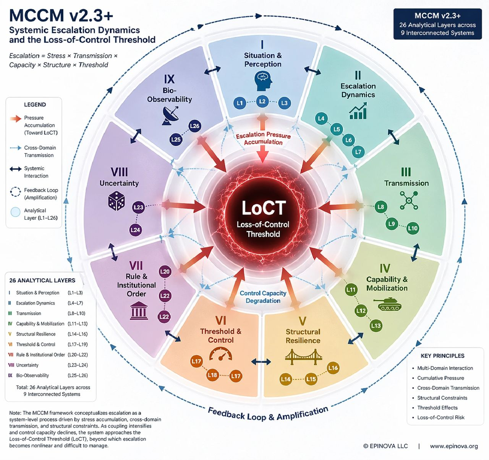

# MCCM v2.3+: Escalation and the Loss-of-Control Threshold

Original URL: https://epinova.org/articles/f/mccm-v23-escalation-and-the-loss-of-control-threshold

Publication date: 2026-04-21

Archive note: This is a locally preserved Markdown copy of an EPINOVA article originally generated through the GoDaddy blog system.

---

[All Posts](<https://epinova.org/articles?blog=y>)

### MCCM v2.3+: Escalation and the Loss-of-Control Threshold

April 21, 2026|AI & Emerging Tech

**Powered by AIPAMS (Adaptive Integrated Policy & Analytics Modeling System) **

  

**Link:** [MCCM v2.3](<https://epinova.org/mccm-v2-3>)

  

#### **1\. Introduction**

Modern conflict is no longer defined by decisive battlefield victory, but by the ability to sustain control under cumulative systemic pressure.

Across recent conflicts, escalation has not followed a linear trajectory toward either resolution or collapse. Instead, it has evolved into a persistent, multi-domain process in which military operations, logistical systems, information dynamics, and political constraints interact in complex and often unpredictable ways. Under these conditions, traditional models of escalation, particularly those based on discrete decision points or stepwise progression, have become increasingly inadequate.

The **Multi-layer Cross-domain Conflict Model (MCCM v2.3+)** provides an alternative analytical framework. It conceptualizes conflict not as a sequence of events, but as a structured system of interacting pressures, in which escalation emerges from cumulative stress, cross-domain transmission, and structural constraints. At the center of this framework lies a critical concept: the **Loss-of-Control Threshold (LoCT)** , defined as the point at which an actor loses the capacity to regulate escalation dynamics.

  

#### **2\. From Escalation Ladders to System Dynamics**

Classical escalation theory, from Kahn’s ladder to later deterrence frameworks, assumes that conflict progresses through identifiable stages driven by deliberate choices. This approach presumes a degree of linearity, actor control, and separability between domains that is increasingly inconsistent with empirical observation.

Contemporary conflicts unfold within densely interconnected systems. Military actions are embedded within broader infrastructures that include energy networks, maritime logistics, digital communications, alliance architectures, and global information environments. Disruptions within any one of these domains rarely remain localized. Instead, they propagate across systems, producing cascading effects that reshape the overall trajectory of conflict. In this context, escalation becomes less a function of discrete decisions and more an emergent property of system interaction.

This shift reflects a broader transformation in the nature of warfare. As argued in prior work on systemic warfare, military effectiveness is increasingly determined not by the application of force alone, but by the resilience and stability of interconnected operational systems under sustained pressure. The analytical challenge is therefore no longer to map a sequence of moves, but to understand how pressure accumulates and circulates within a coupled system.

####   

**3\. MCCM as a Systemic Framework**

MCCM v2.3+ addresses this challenge by reconceptualizing escalation as a multi-dimensional process governed by interacting variables rather than isolated actions. 

At its core, MCCM defines escalation as:

**Escalation = Stress × Transmission × Capacity × Structure × Threshold**

This formulation captures five interacting dimensions:

  * **Stress** : cumulative pressure across domains 
  * **Transmission** : cross-domain propagation mechanisms 
  * **Capacity** : ability to absorb and respond to pressure 
  * **Structure** : system configuration and interdependence 
  * **Threshold** : limits of control under pressure

Rather than privileging any single dimension, MCCM emphasizes their interaction. Escalation is not driven by one variable alone, but by the dynamic interplay between these elements within a complex system.

#### **4\. System Architecture and Analytical Layers**

To operationalize this perspective, MCCM v2.3+ organizes conflict into twenty-six analytical layers distributed across nine interconnected systems:

  * **Situation & Perception **
  * **Escalation Dynamics**
  * **Transmission**
  * **Capability & Mobilization **
  * **Structural Resilience**
  * **Threshold & Control **
  * **Rule & Institutional Order **
  * **Uncertainty**
  * **Bio-Observability**

Each system captures a distinct aspect of conflict dynamics, while the layers within them provide more granular indicators of system behavior. What distinguishes this structure is not merely its level of detail, but the way it models interdependence. The layers are not treated as isolated variables; they form a network in which interactions between elements generate emergent outcomes.

This architecture reflects the empirical observation that modern conflict operates as a coupled system. Local disruptions—whether kinetic, infrastructural, or informational—can propagate across domains, interact with existing pressures, and produce effects that exceed their initial scale. The analytical value of MCCM lies in its ability to capture these interaction effects within a unified framework.

#### **5\. The Loss-of-Control Threshold**

At the core of MCCM lies the concept of the Loss-of-Control Threshold. LoCT represents a system-level tipping point at which cumulative pressures exceed an actor’s capacity to regulate escalation. It is not defined by a specific event, such as a battlefield defeat or a major strike, but by the interaction of multiple pressures that collectively erode control.

This distinction is critical. Traditional models often equate escalation with intensity, assuming that higher levels of violence correspond to greater strategic risk. MCCM suggests instead that risk is determined by controllability. A system may sustain high levels of conflict while remaining below the threshold of uncontrollability, or it may cross that threshold under comparatively lower levels of observable intensity if systemic pressures align in destabilizing ways.

As developed in prior analysis, contemporary conflict is best understood as a form of threshold competition, in which actors seek not necessarily to defeat one another, but to delay their own loss of control while accelerating that of their adversaries. The strategic question is therefore not who wins on the battlefield, but who maintains control longer under conditions of cumulative pressure.

#### **6\. Mechanisms of Systemic Escalation**

Within the MCCM framework, escalation emerges through a sequence of interacting processes rather than a predefined path. Pressure first accumulates across domains, often gradually and unevenly. Military operations generate immediate stress, while economic disruption, political constraint, and informational dynamics contribute additional layers of pressure that may unfold over longer time horizons.

As pressure accumulates, transmission mechanisms become increasingly important. Disruptions in one domain propagate into others, transforming localized events into system-wide effects. Maritime instability may affect energy markets, infrastructure strikes may degrade logistics networks, and battlefield developments may trigger rapid amplification within information systems. These transmission processes increase system coupling, making it more difficult to isolate or contain escalation.

Over time, feedback dynamics emerge. Information systems amplify events, shaping perception, legitimacy, and political response. These responses feed back into operational decision-making, altering the conditions under which subsequent actions are taken. The result is a recursive process in which escalation becomes self-reinforcing.

Taken together, these mechanisms produce a form of escalation that is nonlinear, path-dependent, and increasingly difficult to control as system coupling intensifies.

  

#### **7\. Implications for Understanding Conflict**

The MCCM framework implies a fundamental shift in how conflict outcomes should be interpreted. Victory and defeat, in the traditional sense, become less central than the ability to sustain control. Military capability remains important, but it does not guarantee strategic success if it is not matched by the capacity to manage systemic pressure over time.

This perspective also highlights the limitations of focusing on individual domains in isolation. Escalation cannot be fully understood through military analysis alone, nor through economic or informational analysis in isolation. It emerges from the interaction of these domains within a coupled system.

Finally, MCCM suggests that escalation is not solely the product of intentional decisions. While actors continue to make strategic choices, the outcomes of those choices are increasingly shaped by system-level dynamics that operate beyond any single actor’s control.

#### **Conclusion**

MCCM v2.3+ reframes escalation as a systemic process driven by the interaction of multiple forms of pressure across interconnected domains. By integrating stress accumulation, cross-domain transmission, and threshold dynamics into a unified framework, it provides a structured approach to understanding how modern conflicts evolve under conditions of increasing complexity.

The central implication is clear. In contemporary conflict, success is defined less by the ability to defeat an opponent than by the ability to maintain control under escalating systemic pressure.

The actor that loses control first is the one that loses.

Share this post:
