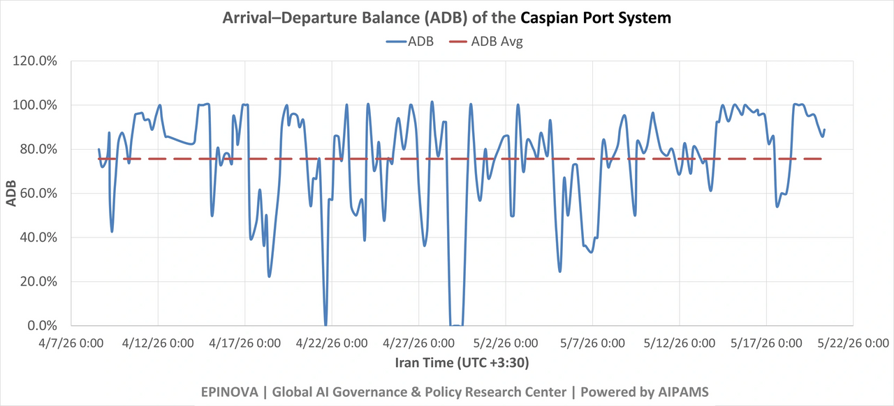
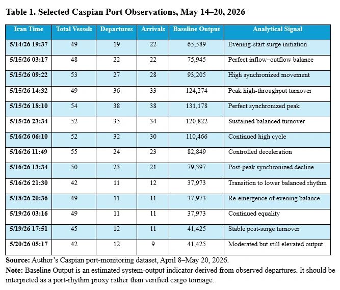

# Caspian Fast-Cycle Turnover: A May 15 Port-Rhythm Signal

Original URL: https://epinova.org/articles/f/caspian-fast-cycle-turnover-a-may-15-port-rhythm-signal

Publication date: 2026-05-20

Archive note: This is a locally preserved Markdown copy of an EPINOVA article originally generated through the GoDaddy blog system.

---

[All Posts](<https://epinova.org/articles?blog=y>)

### Caspian Fast-Cycle Turnover: A May 15 Port-Rhythm Signal

May 20, 2026|Global AI Governance & Policy

**Author:** Dr. Shaoyuan Wu

**ORCID:** [_https://orcid.org/0009-0008-0660-8232_](<https://orcid.org/0009-0008-0660-8232>)

**Affiliation:** Global AI Governance and Policy Research Center, EPINOVA LLC

**Date:** May 20, 2026 

  

#### **Key Finding**

The Caspian port system appears to have entered a synchronized fast-cycle turnover pattern after May 15, 2026. The key signal is not simply higher output, but the near-equality of departures and arrivals during the May 15–16 high-value phase. This suggests that the system was not only moving more vessels, but moving them through a more balanced and compressed operating rhythm.

The strongest data points are concentrated on May 15. At 03:17, departures and arrivals were both 22. At 09:22, they were 27 and 28. At 14:32, they were 36 and 33. At 18:10, they were both 38. At 23:34, they were 35 and 34. This is not the typical signature of one-way port clearance or isolated inbound replenishment. It is closer to synchronized turnover.

This article interprets that pattern as an early signal of a shift from **window-based surge movement** to **synchronized fast-cycle turnover** in the Caspian logistics system.

  

#### **Introduction**

The Caspian Sea has become one of the most important observable indicators of Iran’s northern logistics resilience under Hormuz pressure. It does not need to replace Persian Gulf maritime capacity to matter. Its strategic function is more limited but still important: preserving minimum viable flow, slowing depletion, sustaining selected industrial inputs, and keeping critical replenishment channels open.

For that reason, the most important question is not whether a single high-output spike occurred. The more important question is whether the system can repeat movement, synchronize inflow and outflow, reduce vessel dwell time, and sustain throughput without creating obvious accumulation at port nodes.

The May 15–20 data suggest that the Caspian system may be developing precisely this type of operational rhythm.

  

#### **1\. What the Data Show**

The May 15–16 period shows a sharp increase in Caspian port activity. However, the most important feature is not the height of the spike. It is the alignment between departures and arrivals.

The data show three features. First, the surge begins in the evening of May 14 and intensifies through May 15. Second, departures and arrivals remain unusually close throughout the high-value phase. Third, after the peak, the system does not immediately return to a one-sided clearance pattern. It moves into a lower but still relatively balanced rhythm.

  

#### **2\. How This Differs from the Late-April Pattern**

The late-April Caspian pattern looked like a shock-response sequence. It involved flow inversion, short-window movement, a surge, and then contraction. Departures and arrivals did not simply rise together. Instead, the system appeared to clear capacity, open a short window, process traffic quickly, and then contract.

The May 15 pattern is different.

It shows simultaneous movement rather than one-sided release. Departures and arrivals rose together, peaked together, and declined together. This suggests a more coordinated operating rhythm. In practical terms, the port system appears less like an emergency valve and more like a synchronized shuttle mechanism.

The distinction matters because a surge can be temporary, but synchronization is a sign of operational discipline. If repeated, it may indicate that the Caspian corridor is adapting from episodic post-shock movement toward a more regular fast-cycle turnover system.

  

#### **3\. Possible Mechanism: Fast-Cycle Caspian Turnover**

The observed pattern can be described as **Fast-Cycle Caspian Turnover**.

This refers to a logistics rhythm in which vessels reduce port dwell time, enter and exit in balanced cycles, and sustain throughput through repeated short movements rather than large visible accumulation.

The mechanism likely has four components:

  * **Compressed dwell time.** Vessels do not appear to be accumulating at port nodes for long periods during the May 15–16 phase. Instead, inflow and outflow remain closely matched.
  * **Balanced berth and anchorage management.** The near-equality of arrivals and departures suggests that the system may be managing berth availability and anchorage pressure more actively.
  * **Rolling replenishment.** Rather than one large isolated movement, the pattern is consistent with rolling vessel cycles. This is especially relevant if tankers are completing loading or replenishment within roughly two to three days.
  * **Reduced exposure.** Shorter dwell time can reduce exposure to monitoring, sanctions tracing, insurance risk, or kinetic risk around sensitive port nodes.

This interpretation does not require claiming that the Caspian route has become a high-volume substitute for Hormuz. The point is narrower: the route may be improving its tempo under constraint.

  

#### **4\. The Evening-Start Pattern**

A second notable feature is timing. Several high-value points appear to begin in the evening or extend through the night. The May 10 high-output sequence begins at 21:56. The May 14–15 synchronized surge begins at 19:37 and continues into the following day.

This may reflect several overlapping factors.

One possibility is port scheduling. Major clearance and loading windows may be concentrated in evening or night periods. Another possibility is exposure management. Evening and nighttime operations may reduce daylight visibility and complicate external observation. A third possibility is labor and safety management under warmer conditions. Heat may encourage evening work, but heat alone does not explain why arrivals and departures rise together.

A fourth possibility is data timing. Platform refresh cycles, AIS-status updates, or port-status classification delays may partly cluster high-value readings around certain hours. This is why the evening-start pattern should be treated as a monitoring signal, not as conclusive proof of intent.

The more defensible interpretation is that the Caspian system shows **evening-window fast-cycle replenishment** : repeated high-value activity that begins near evening and continues through compressed turnover cycles.

  

#### **5\. A Monitoring Indicator: Arrival–Departure Balance**

he May 15 pattern suggests a useful monitoring metric: **Arrival–Departure Balance** , or ADB.

**Arrival–Departure Balance** measures the degree of synchronization between port arrivals and port departures within a defined observation window. It captures whether a port system is processing inbound and outbound vessel movement in a balanced cycle, rather than operating through one-sided clearance, inbound accumulation, or disruption-driven imbalance. A higher ADB value indicates stronger inflow–outflow synchronization and may signal fast-cycle turnover. A lower ADB value indicates weaker synchronization and may reflect congestion, clearance pressure, replenishment buildup, port stress, or asymmetric movement.

ADB is not a cargo-volume indicator. It does not measure tonnage, cargo type, ownership, or final destination. It is a port-rhythm indicator designed to identify whether vessel movement is balanced and operationally coordinated.

  

**ADB = 1 - |D - A| / (D + A)**  
  
where:

  * (D) = departures;
  * (A) = arrivals.

The index ranges from 0 to 1. A value close to 1 indicates highly synchronized inflow and outflow. A lower value indicates imbalance, which may suggest one-way clearance, congestion, replenishment buildup, port stress, or disruption.

For example:

  * 5/15/26 03:17: (D = 22, A = 22), so (ADB = 1.00).
  * 5/15/26 18:10: (D = 38, A = 38), so (ADB = 1.00).
  * 5/15/26 23:34: (D = 35, A = 34), so (ADB ≈ 0.99).
  * 5/15/26 14:32: (D = 36, A = 33), so (ADB ≈ 0.96).

The value of this metric is methodological. It shifts monitoring from simple vessel counts toward system rhythm. In constrained maritime logistics, rhythm may be as important as volume.

  

#### **6\. Strategic Interpretation**

The May 15–20 pattern does not prove that Russia and Iran have established a new stable military supply mechanism. Nor does it prove cargo type, final destination, or political coordination. Those claims would require cargo manifests, ownership tracing, port records, satellite confirmation, or other independent evidence.

The data support a narrower and more defensible conclusion: the Caspian port system showed a synchronized fast-cycle turnover signal after May 15.

This has three strategic implications.

First, the Caspian route may be becoming more operationally mature under pressure. The system is not simply surviving disruption; it may be learning to operate with shorter dwell time and better inflow–outflow balance.

Second, static vessel counts may underestimate logistics intensity. If the same vessels cycle more quickly, throughput can rise even without a proportional increase in visible ship numbers.

Third, the timing may have signaling relevance. The pattern emerges after Russia’s Victory Day period and before President Trump’s China visit. This does not establish causality. But it does create a plausible context in which Russia and Iran may have incentives to demonstrate northern corridor resilience without openly escalating.

The safest strategic formulation is therefore: the Caspian corridor appears to be functioning as an adaptive northern sustainment buffer, not as a replacement for Hormuz.

  

#### **7\. What to Watch Next**

Future monitoring should focus on five indicators.

**First, whether synchronized turnover repeats.** A one-time high-ADB episode is interesting, but repetition would indicate a more durable operating rhythm.

**Second, whether evening-start peaks recur.** Repeated evening or nighttime high-value phases would strengthen the case for disciplined operating windows.

**Third, whether tanker cycle time remains compressed.** If tankers continue completing cycles within two to three days, this may indicate higher logistics tempo than vessel counts alone suggest.

**Fourth, whether post-surge output stays above historical baseline.** This would distinguish adaptive stabilization from temporary clearance.

**Fifth, whether Russian-linked cargo vessels maintain elevated presence while tanker activity remains more selective.** This would support a cargo-led resilience pattern rather than full commercial normalization.

  

#### **Limitations**

This article is based on port-monitoring indicators, not verified cargo records. The data show total vessels, departures, arrivals, and estimated output, but they do not identify cargo type, ship ownership structures, military relevance, final destination, or financial arrangements.

The evening-start pattern may be affected by data-refresh timing, AIS reporting behavior, port-status classification, or sampling intervals. It should therefore be treated as an operational signal requiring further validation.

The interpretation of fast-cycle turnover is probabilistic. It is consistent with the observed pattern, especially the near-equality of arrivals and departures, but it should not be overstated as proof of strategic coordination.

  

#### **Conclusion**

The May 15–16 Caspian data do not show merely a throughput spike. They show synchronized turnover: arrivals and departures rose together, peaked together, and declined together. That pattern suggests a shift from late-April window-based surge movement toward a more disciplined fast-cycle operating rhythm.

This finding should be treated as a monitoring signal rather than a strategic conclusion on its own. It does not prove cargo content, military supply, or political coordination. But it does provide a useful indicator for tracking how the Caspian corridor adapts under pressure.

The broader implication is that the Caspian route remains bounded, exposed, and insufficient to replace Hormuz. Yet it may be becoming more efficient as a northern sustainment buffer. Its value lies not in scale alone, but in rhythm, synchronization, and persistence.

Share this post:
