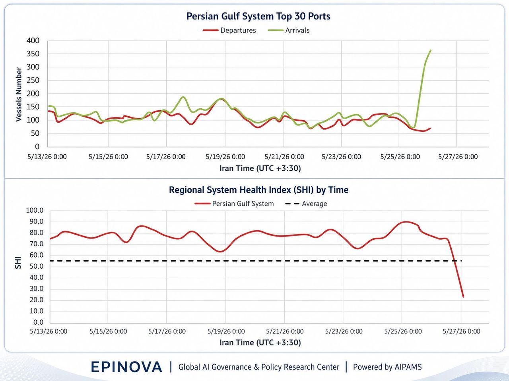

# The Ceasefire at Sea Is Fraying

Original URL: https://epinova.org/articles/f/the-ceasefire-at-sea-is-fraying

Publication date: 2026-05-26

Archive note: This is a locally preserved Markdown copy of an EPINOVA article originally generated through the GoDaddy blog system.

---

[All Posts](<https://epinova.org/articles?blog=y>)

### The Ceasefire at Sea Is Fraying

May 26, 2026|Global AI Governance & Policy

**The May 26 U.S.–Iran Clash and the Hidden Stress in the Persian Gulf Port System**

  

  

  

  

  

**Author:** Dr. Shaoyuan Wu

**ORCID:** [_https://orcid.org/0009-0008-0660-8232_](<https://orcid.org/0009-0008-0660-8232>)

**Affiliation:** Global AI Governance and Policy Research Center, EPINOVA LLC

**Date:** May 26, 2026 

  

The May 26 exchange between the United States and Iran near the Persian Gulf did not simply add another episode to a long cycle of accusation and retaliation. Its significance lies elsewhere: it revealed how quickly a ceasefire can lose operational credibility at sea even before it formally collapses.

Washington described its strikes on Iranian missile sites and vessels allegedly involved in mine-laying as defensive measures. Tehran accused the United States of violating the ceasefire and warned that it would respond. Independent reporting from Reuters and The Guardian presented the incident as part of a still-fragile conflict environment in which negotiations, military action, and maritime risk were unfolding at the same time.

For shipping and port operators, however, the central question was not which official explanation would prevail. It was whether the Persian Gulf still behaved like a stable operating environment. Data from the Adaptive Integrated Policy & Analytics Modeling System, or AIPAMS, suggest that it did not.

Across the Persian Gulf System’s top 30 ports, arrivals surged sharply while departures weakened. At the same time, the Regional System Health Index, or SHI, fell from a resilient range to a severe stress level. The pattern points not to the disappearance of maritime movement, but to something more consequential: the loss of balanced circulation.

This is how maritime instability often begins. Ships still move. Ports still function. Chokepoints remain technically open. But the system stops behaving predictably.

  

#### **A Fragile Pause, Not a Stable Peace**

The May 26 clash occurred against the background of a ceasefire that was never a settled peace arrangement. It was closer to a temporary operating pause: politically useful, diplomatically necessary, but militarily fragile. Such arrangements can reduce the tempo of conflict, but they do not automatically restore confidence among commercial actors.

That distinction matters. Modern maritime systems depend not only on legal access or formal de-escalation, but also on expectations. Shipowners, insurers, port authorities, charterers, and cargo managers must believe that movement will remain predictable. Once they begin to doubt that assumption, their behavior changes before governments formally acknowledge that a ceasefire is failing.

The Persian Gulf port data appear to capture precisely that kind of shift. Before the latest incident, the system had shown resilience. From May 13 to May 25, SHI generally remained well above the reference average, suggesting that the region’s major ports were still absorbing pressure without losing overall function. But around May 26–27, SHI dropped sharply to roughly 23. Such a fall is difficult to interpret as ordinary fluctuation. It suggests that the system moved from stress management into acute imbalance.

The accompanying port-flow data explain why. Departures fell to roughly 60–70 vessels, while arrivals rose to more than 300, peaking near 360. In a healthy system, arrivals and departures may fluctuate, but they usually remain linked. Ships enter, clear procedures, load or unload, and depart. What appeared in the latest data was not a synchronized port cycle. It was an inbound surge without a comparable outbound release.

That is a warning sign.

  

#### **When More Arrivals Mean More Stress**

A surge in arrivals during a security crisis can be misleading. It may look like activity, but it does not necessarily indicate confidence, recovery, or growth. In a contested maritime environment, rising arrivals can reflect precaution rather than normalization.

Vessels may move toward ports or anchorages before a further escalation. Operators may try to enter a controlled zone before conditions worsen. Ships delayed by earlier uncertainty may arrive in a compressed window. Others may appear in the data because they have approached the port system or entered anchorage, even if cargo handling and clearance remain delayed.

In such conditions, arrivals are not always a sign of throughput. They can be a sign of accumulation.

The decisive question is whether the system can process those arrivals into departures. On May 26, the answer appears to have been no. The port network absorbed vessels faster than it released them. That imbalance is what likely drove the SHI collapse. The problem was not simply that ships stopped moving. It was that movement lost its rhythm.

This distinction is central to understanding maritime crises. A port system can look busy and unhealthy at the same time. Congestion, anchorage pressure, delayed clearance, and risk clustering may all raise visible activity while degrading system performance.

  

#### **Hormuz Is Open, But Less Reliable**

The May 26 episode reinforces a broader analytical point: the Strait of Hormuz should not be treated as either open or closed. That binary framework misses the more important condition now emerging in the Persian Gulf—a degraded but operating chokepoint.

A degraded chokepoint still permits movement. It may even show temporary surges. But the conditions of passage become less predictable. Insurance costs rise. Clearance slows. Waiting time increases. Ships move in narrower windows. Commercial decisions become entangled with military risk, political signaling, and legal uncertainty.

This is the difference between access and reliability. Hormuz may remain accessible in a physical sense while becoming unreliable in an operational sense. For global trade, that distinction matters almost as much as closure. Energy markets, shipping schedules, war-risk premiums, and port operations all respond not only to whether vessels can pass, but to whether they can pass, dock, clear, load, unload, and depart on predictable terms.

The latest AIPAMS data suggest that predictability weakened sharply after the May 26 clash.

  

#### **The Erosion of Maritime Restraint**

The most useful way to understand the incident is as a case of ceasefire erosion at sea. This does not mean that the ceasefire has formally collapsed. It means that its practical stabilizing effect is being worn down by repeated military actions, contested interpretations of self-defense, drone incidents, mine-laying allegations, and commercial shipping insecurity.

Such erosion is dangerous because it rarely happens all at once. A ceasefire can persist as diplomatic language while losing credibility as an operating constraint. Each side may claim compliance while interpreting its own military actions as defensive and the other side’s as escalatory. Over time, the maritime environment becomes more uncertain even if neither side formally renounces restraint.

For ports, the consequences are immediate. Vessels still move, but they move differently. Arrivals may bunch together. Departures may slow. Anchoring patterns may become more irregular. Port operators may delay release decisions. Insurers may reprice risk. Commercial actors may wait for temporary windows rather than rely on ordinary schedules.

The May 26 data show this logic in operational form: movement continued, but balanced movement deteriorated.

  

#### **A Port System as an Early-Warning Indicator**

The Persian Gulf port network should therefore be treated as an early-warning system. Diplomatic statements reveal intent and framing. Military reports reveal tactical action. But port rhythms reveal whether the maritime economy still believes the system is workable.

Three indicators deserve particular attention.

The first is the arrival–departure gap. A widening gap suggests that the system is accumulating pressure rather than processing flow. The second is SHI movement. A rapid fall below the reference average indicates that stress has become systemic rather than local. The third is recovery speed. If departures rebound quickly and SHI returns toward its prior range, the shock may remain temporary. If the imbalance persists, the system may be entering a more durable degraded state.

The May 26 event produced a sharp negative signal on all three dimensions. Arrivals surged. Departures weakened. SHI collapsed.

That does not prove that the Persian Gulf port system is entering long-term failure. But it does show that the latest military exchange produced a measurable operational shock.

  

#### **The Strategic Meaning**

The broader implication is that the Persian Gulf crisis is no longer only about naval confrontation or diplomatic negotiations. It is increasingly about the reliability of a maritime system that underpins energy flows, commercial routing, insurance markets, and regional economic stability.

This is where the May 26 clash becomes strategically important. Even limited military actions can have outsized effects if they undermine confidence in predictable passage. A missile-site strike, a drone shootdown claim, or a mine-laying allegation may be tactically narrow. But in a chokepoint environment, such incidents can alter the behavior of hundreds of vessels and the calculations of insurers, port managers, and energy traders.

The port data suggest that this is already happening. The system did not shut down. Instead, it became less orderly. That is the more realistic form of maritime disruption in the Persian Gulf: not a clean closure, but a gradual loss of predictability.

  

#### **Conclusion**

The May 26 U.S.–Iran clash should be understood less as a single violation dispute than as evidence of a weakening maritime ceasefire. The formal diplomatic framework may still exist, but its ability to stabilize behavior at sea is diminishing.

AIPAMS data show that the Persian Gulf port system reacted sharply. Arrivals surged, departures declined, and SHI dropped to a severe stress level. The result was not a simple reduction in activity, but a breakdown in circulation balance.

That distinction matters. The Persian Gulf remains open in a narrow physical sense. But openness is not the same as reliability. The strategic question is no longer only whether ships can pass through Hormuz. It is whether they can move through the wider port system under conditions of predictable risk.

On May 26, that predictability weakened. And in the Persian Gulf, the erosion of predictability may be the first sign that a ceasefire is failing where it matters most: not at the negotiating table, but at sea.

Share this post:
